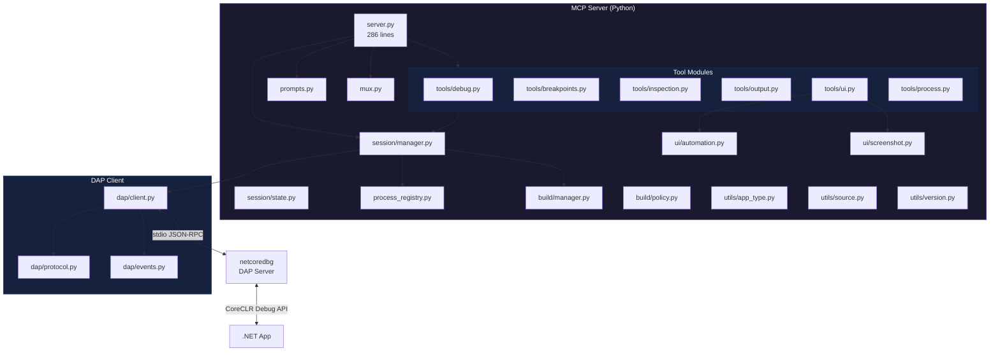

🌐 [English](README.md) | [Русский](README.ru.md)

# netcoredbg-mcp

[](https://pypi.org/project/netcoredbg-mcp/)
[](LICENSE)
[](#requirements)
[](https://modelcontextprotocol.io/)
[](#limitations)

Your AI agent can write .NET code, run tests, even deploy — but when something goes wrong, it's blind. No call stacks. No variable inspection. Can't set breakpoints. Just "it crashed, check the logs."

**netcoredbg-mcp** turns any AI agent into a capable .NET debugger. Set breakpoints, step through code, inspect variables, take screenshots of WPF windows, evaluate expressions — all through the Model Context Protocol. Zero IDE required.

> *"Like giving your AI agent a VS Code debugger it can actually use."*

**66 tools · 7 prompts · 4 resources · 546 tests**

## Quick Links

- **Get Started:** [Install](#installation) · [Configure](#configuration) · [First Debug Session](#first-debug-session)
- **Reference:** [Tools](#available-tools) · [Resources](#mcp-resources) · [Prompts](#mcp-prompts) · [Architecture](#architecture)
- **Guides:** [GUI App Debugging](#gui-app-debugging) · [Visual Inspection](#visual-inspection) · [Troubleshooting](#troubleshooting)

---

## What's New in v0.6.0

> Released 2026-04-07. [Full changelog →](CHANGELOG.md)

- **MCP Progress Notifications** — build output streaming, 9-phase start_debug progress, execution heartbeat every 5s
- **Git Worktree Support** — paths in worktrees auto-detected and accepted (#31)
- **Tracepoint Fix** — auto-resume now works (excluded tracepoint-owned breakpoints from user bp check)
- **mcp-mux Isolation** — each CC session gets its own daemon with correct project scope
- **10 Configurable Env Vars** — all hardcoded limits now tunable via environment
- **100 Smoke Tests** — DataGrid select, tracepoint auto-resume, heartbeat, path validation
- **Screenshot 1568px** — default max width increased to Claude vision maximum

---

## Highlights

| Feature | Description |
|---------|-------------|
| **66 MCP Tools** | Debug control, breakpoints, inspection, tracepoints, snapshots, output, UI automation, process management |
| **Long-Poll Execution** | `continue` and `step_*` tools block until stopped — no polling loops |
| **State Machine Responses** | Every response includes `state`, `next_actions`, `message` — the agent always knows what to do next |
| **Agent Intelligence** | ElementResolver ranked search, ExtractText 5-strategy fallback, CLR type name detection |
| **Client-side Tracepoints** | Pause → evaluate → resume without netcoredbg support — rate limited, asyncio-safe |
| **State Snapshots + Diff** | Capture variable state at any stop, compare snapshots across sessions (FIFO, max 20) |
| **GUI App Detection** | Auto-detects WPF/WinForms/Avalonia from `runtimeconfig.json` and adjusts workflow hints |
| **Screenshots + Set-of-Mark** | See the app UI, get numbered element overlays, click by annotation ID |
| **stepInTargets** | Choose which function to step into on multi-call lines |
| **Variable Paging** | `filter`, `start`, `count` parameters for navigating large collections |
| **Pre-build** | Build before debug with `pre_build: true` — hidden warnings surfaced via `get_build_diagnostics` |
| **Smart Resolution** | Auto-resolves `.exe` to `.dll` for .NET 6+ to avoid deps.json conflicts |
| **Version Check** | Detects `dbgshim.dll` mismatches automatically on session start |
| **Process Reaper** | PID file tracking with `cleanup_processes` — never lose orphan debugger processes |
| **[mcp-mux](https://github.com/thebtf/mcp-mux) Aware** | Session ownership guards for multi-agent safety — first agent claims the debug session, others get a clear error |
| **ToolAnnotations** | `readOnlyHint`, `destructiveHint`, `idempotentHint` on every tool for smart agent routing |

---

## Quick Start (30 seconds)

```bash
# 1. Install
pip install netcoredbg-mcp

# 2. Register with Claude Code
claude mcp add --scope user netcoredbg -- netcoredbg-mcp --project-from-cwd

# 3. Debug
# "Set a breakpoint on line 42 of Program.cs and run my app"
```

---

## Critical Notes

> [!WARNING]
> **dbgshim.dll Version Compatibility**
>
> The `dbgshim.dll` in your netcoredbg folder **MUST match the major version** of the .NET runtime you're debugging.
> This is an undocumented Microsoft requirement. Mismatch causes:
> - `E_NOINTERFACE (0x80004002)` errors
> - Empty call stacks
> - Failed variable inspection

| Target Runtime | Required dbgshim.dll Source |
|----------------|----------------------------|
| .NET 6.x | `C:\Program Files\dotnet\shared\Microsoft.NETCore.App\6.0.x\dbgshim.dll` |
| .NET 7.x | `C:\Program Files\dotnet\shared\Microsoft.NETCore.App\7.0.x\dbgshim.dll` |
| .NET 8.x | `C:\Program Files\dotnet\shared\Microsoft.NETCore.App\8.0.x\dbgshim.dll` |
| .NET 9.x | `C:\Program Files\dotnet\shared\Microsoft.NETCore.App\9.0.x\dbgshim.dll` |

```powershell
# Example: Setup for .NET 8 debugging
copy "C:\Program Files\dotnet\shared\Microsoft.NETCore.App\8.0.x\dbgshim.dll" "D:\Bin\netcoredbg\"
```

> [!TIP]
> This MCP server automatically detects mismatches and warns you during `start_debug`.

> [!IMPORTANT]
> **Prefer `start_debug` over `attach_debug`**
>
> `attach_debug` has significant upstream limitations in netcoredbg — stack traces and variable inspection may be incomplete or empty.

---

## Installation

### Requirements

- Python 3.10+
- [netcoredbg](https://github.com/Samsung/netcoredbg/releases)
- .NET SDK (for the apps you're debugging)
- [Pillow](https://pypi.org/project/Pillow/) (installed automatically — required for screenshot annotation)

### Quick Start (Recommended)

```bash
# Install and auto-configure everything
pip install netcoredbg-mcp
netcoredbg-mcp --setup
```

The `--setup` wizard automatically:
- Downloads netcoredbg from Samsung GitHub
- Scans installed .NET runtimes for dbgshim versions (eliminates version mismatch errors)
- Builds the FlaUI bridge for UI automation (Windows)
- Outputs a ready-to-use MCP configuration snippet

Everything is stored in `~/.netcoredbg-mcp/` — no manual path configuration needed.

### Manual Install

```bash
# Install from PyPI
pip install netcoredbg-mcp

# Or with uv
uv pip install netcoredbg-mcp
```

<details>
<summary><strong>Install from Source (Development)</strong></summary>

```bash
git clone https://github.com/thebtf/netcoredbg-mcp.git
cd netcoredbg-mcp
uv sync
```

</details>

<details>
<summary><strong>Manual netcoredbg Install (optional — --setup does this automatically)</strong></summary>

Download from [Samsung/netcoredbg releases](https://github.com/Samsung/netcoredbg/releases) and set `NETCOREDBG_PATH`:

```powershell
$env:NETCOREDBG_PATH = "D:\Bin\netcoredbg\netcoredbg.exe"
```

</details>

---

## Upgrading

```bash
pip install --upgrade netcoredbg-mcp
```

### From v0.1.x to v0.2.0

**Breaking changes:**
- Tool response format changed: `{"success": true, "data": ...}` → `{"state": "...", "next_actions": [...], "data": ...}`. Update any hardcoded response parsing.
- `resources.py` removed (resources now inline in `server.py`).

**New dependencies:**
- `Pillow>=10.0` (for screenshot annotation) — installed automatically via pip.

**New features to explore:**
- `ui_take_screenshot()`, `ui_take_annotated_screenshot()` — visual UI access
- `cleanup_processes()` — replaces manual `taskkill`
- `restart_debug()` — rebuild + relaunch in one call
- `investigate("NullReferenceException")` — parameterized debugging prompts

---

## Configuration

### Environment Variable (Optional)

> **Note:** After `netcoredbg-mcp --setup`, `NETCOREDBG_PATH` is no longer required.
> The server auto-detects netcoredbg from `~/.netcoredbg-mcp/netcoredbg/`.

Override only if using a custom netcoredbg installation:

```powershell
$env:NETCOREDBG_PATH = "D:\Bin\netcoredbg\netcoredbg.exe"
```

### Base Server Configuration

All clients use this same server definition:

```jsonc
{
  "netcoredbg": {
    "command": "netcoredbg-mcp",
    "args": ["--project-from-cwd"],
    "env": {
      "NETCOREDBG_PATH": "D:\\Bin\\netcoredbg\\netcoredbg.exe"
    }
  }
}
```

<details>
<summary><strong>Running from Source (Development)</strong></summary>

If running from cloned repository instead of PyPI:

```jsonc
{
  "netcoredbg": {
    "command": "uv",
    "args": ["run", "--project", "D:\\Dev\\netcoredbg-mcp", "netcoredbg-mcp", "--project-from-cwd"],
    "env": {
      "NETCOREDBG_PATH": "D:\\Bin\\netcoredbg\\netcoredbg.exe"
    }
  }
}
```

> [!IMPORTANT]
> Use `uv run --project` NOT `uv --directory`. The `--directory` flag changes CWD, breaking `--project-from-cwd`.

</details>

---

## Client Setup

### CLI Agents

<details open>
<summary><b>Claude Code</b></summary>

```powershell
claude mcp add --scope user netcoredbg -- netcoredbg-mcp --project-from-cwd
```

**Verify:** `claude mcp list`

</details>

<details>
<summary><b>Codex CLI (OpenAI)</b></summary>

**Config:** `%USERPROFILE%\.codex\config.toml`

```toml
[mcp_servers.netcoredbg]
command = "netcoredbg-mcp"
args = ["--project-from-cwd"]

[mcp_servers.netcoredbg.env]
NETCOREDBG_PATH = "D:\\Bin\\netcoredbg\\netcoredbg.exe"
```

**Or via CLI:** `codex mcp add netcoredbg -- netcoredbg-mcp --project-from-cwd`

</details>

<details>
<summary><b>Gemini CLI (Google)</b></summary>

**Config:** `%USERPROFILE%\.gemini\settings.json`

```jsonc
{
  "mcpServers": {
    "netcoredbg": {
      "command": "netcoredbg-mcp",
      "args": ["--project-from-cwd"],
      "env": {
        "NETCOREDBG_PATH": "D:\\Bin\\netcoredbg\\netcoredbg.exe"
      }
    }
  }
}
```

</details>

<details>
<summary><b>Cline</b></summary>

**Config:** Open Cline → MCP Servers icon → Configure → "Configure MCP Servers"

```jsonc
{
  "mcpServers": {
    "netcoredbg": {
      "command": "netcoredbg-mcp",
      "args": ["--project-from-cwd"],
      "env": {
        "NETCOREDBG_PATH": "D:\\Bin\\netcoredbg\\netcoredbg.exe"
      }
    }
  }
}
```

</details>

<details>
<summary><b>Roo Code</b></summary>

**Config:** `%USERPROFILE%\.roo\mcp.json` or `.roo\mcp.json` in project

```jsonc
{
  "mcpServers": {
    "netcoredbg": {
      "command": "netcoredbg-mcp",
      "args": ["--project-from-cwd"],
      "env": {
        "NETCOREDBG_PATH": "D:\\Bin\\netcoredbg\\netcoredbg.exe"
      }
    }
  }
}
```

</details>

### Desktop Apps

<details>
<summary><b>Claude Desktop</b></summary>

**Config:** `%APPDATA%\Claude\claude_desktop_config.json`

```jsonc
{
  "mcpServers": {
    "netcoredbg": {
      "command": "netcoredbg-mcp",
      "args": ["--project-from-cwd"],
      "env": {
        "NETCOREDBG_PATH": "D:\\Bin\\netcoredbg\\netcoredbg.exe"
      }
    }
  }
}
```

</details>

### IDE Extensions

<details>
<summary><b>Cursor</b></summary>

**Config:** `%USERPROFILE%\.cursor\mcp.json`

```jsonc
{
  "mcpServers": {
    "netcoredbg": {
      "command": "netcoredbg-mcp",
      "args": ["--project-from-cwd"],
      "env": {
        "NETCOREDBG_PATH": "D:\\Bin\\netcoredbg\\netcoredbg.exe"
      }
    }
  }
}
```

</details>

<details>
<summary><b>Windsurf</b></summary>

**Config:** `%USERPROFILE%\.codeium\windsurf\mcp_config.json`

```jsonc
{
  "mcpServers": {
    "netcoredbg": {
      "command": "netcoredbg-mcp",
      "args": ["--project-from-cwd"],
      "env": {
        "NETCOREDBG_PATH": "D:\\Bin\\netcoredbg\\netcoredbg.exe"
      }
    }
  }
}
```

</details>

<details>
<summary><b>VS Code + Continue</b></summary>

**Config:** `%USERPROFILE%\.continue\config.json`

```jsonc
{
  "experimental": {
    "modelContextProtocolServers": [
      {
        "transport": {
          "type": "stdio",
          "command": "uv",
          "args": ["run", "--project", "D:\\Dev\\netcoredbg-mcp", "netcoredbg-mcp", "--project-from-cwd"],
          "env": {
            "NETCOREDBG_PATH": "D:\\Bin\\netcoredbg\\netcoredbg.exe"
          }
        }
      }
    ]
  }
}
```

</details>

### Project-Scoped Config

<details>
<summary><b>.mcp.json (in project root)</b></summary>

Add to your .NET project root for automatic loading:

```jsonc
{
  "mcpServers": {
    "netcoredbg": {
      "command": "uv",
      "args": ["run", "--project", "D:\\Dev\\netcoredbg-mcp", "netcoredbg-mcp"],
      "env": {
        "NETCOREDBG_PATH": "D:\\Bin\\netcoredbg\\netcoredbg.exe",
        "NETCOREDBG_PROJECT_ROOT": "${workspaceFolder}"
      }
    }
  }
}
```

> [!NOTE]
> With project-scoped config, use `NETCOREDBG_PROJECT_ROOT` instead of `--project-from-cwd`.

</details>

---

## First Debug Session

### The Long-Poll Pattern

Execution tools (`continue_execution`, `step_over`, `step_into`, `step_out`) **block until the program stops**. No polling. One call = one answer.

```
Agent: continue_execution()
       ↓ blocks...
       ↓ program runs...
       ↓ breakpoint hit!
       ← returns: { state: "stopped", reason: "breakpoint", location: {...}, source_context: "..." }
```

### Typical Workflow

```
1. start_debug       → Launch with pre_build (builds + starts debugger)
2. add_breakpoint    → Set breakpoints in source files
3. continue          → Blocks until breakpoint hit (returns location + source context)
4. get_call_stack    → Full stack trace (source context included in top frame)
5. get_variables     → Examine locals, arguments, captures
6. step_over         → Blocks until next line (returns new location + source)
7. get_output_tail   → Check program output (user cannot see it)
8. stop_debug        → End session
```

### Example: start_debug with Pre-build

```python
start_debug(
    program="/path/to/MyApp.exe",      # Auto-resolves to .dll for .NET 6+
    pre_build=True,                     # Build before launching (default)
    build_project="/path/to/MyApp.csproj",
    build_configuration="Debug",
    stop_at_entry=False
)
# Response: { state: "running", app_type: "gui", message: "GUI application detected..." }
```

### Smart .exe to .dll Resolution

For .NET 6+ applications (WPF, WinForms, Console), the SDK creates:
- `App.exe` — Native host launcher
- `App.dll` — Actual managed code

Debugging `.exe` causes a "deps.json conflict" error. This MCP server **automatically resolves `.exe` to `.dll`** when a matching `.dll` and `.runtimeconfig.json` exist.

---

## GUI App Debugging

GUI apps (WPF, WinForms, Avalonia) freeze when the debugger pauses — the UI thread stops, windows stop painting, buttons stop responding.

### The Golden Rule

**Never set breakpoints before the window is visible.**

### Correct Workflow

```
1. start_debug(program="App.dll", build_project="App.csproj")
   → Response includes app_type="gui"

2. ui_get_window_tree()
   → Confirm the window loaded

3. ui_take_annotated_screenshot()
   → See the UI with numbered interactive elements

4. add_breakpoint(file="MainViewModel.cs", line=42)
   → NOW set breakpoints (window is visible)

5. ui_click(automation_id="btnSave")
   → Trigger the code path via UI interaction

6. continue_execution()
   → Blocks until breakpoint hit — inspect state

7. get_call_stack() → get_variables(ref=...)
   → Read locals at breakpoint

8. continue_execution()
   → RESUME — the app is frozen while you inspect

9. stop_debug()
```

### Exception: Startup Debugging

If the bug IS in startup code, use `stop_at_entry`:

```
start_debug(program="App.dll", ..., stop_at_entry=True)
# App pauses at Main() — before any UI
step_over()  # step through init one line at a time
```

---

## Visual Inspection

### Screenshots

```
ui_take_screenshot()
```

Returns base64 PNG of the app window — see exactly what the user sees. Use for verifying layout, checking rendering issues, finding elements not in the automation tree.

### Set-of-Mark Annotation

```
ui_take_annotated_screenshot(max_depth=3, interactive_only=True)
```

Returns a screenshot with **numbered red boxes** around interactive elements plus a JSON element index:

```json
{
  "image": "base64_png...",
  "elements": [
    {"id": 1, "name": "Save", "type": "Button", "automationId": "btnSave"},
    {"id": 2, "name": "", "type": "TextBox", "automationId": "txtName"}
  ]
}
```

Then click by number:

```
ui_click_annotated(element_id=1)   # clicks "Save" button
```

Use when elements lack an AutomationId, when you need spatial context, or when multiple similar elements exist.

### Multi-Row Selection

For selecting multiple rows in a DataGrid, use UIA patterns instead of coordinate clicking:

```
ui_select_items(automation_id="dataGrid", indices=[4,5,6,7,8], mode="replace")
```

Works for off-screen rows without scrolling.

---

## Available Tools

### Debug Control (11 tools)

| Tool | Description |
|------|-------------|
| `start_debug` | Launch program under debugger with optional pre-build. Auto-detects GUI apps. |
| `attach_debug` | Attach to running process. Limited functionality (upstream limitation). |
| `stop_debug` | Stop the debug session and release resources. |
| `restart_debug` | Restart session with same config. Optional rebuild. |
| `continue_execution` | Resume execution. **Blocks** until stopped event. |
| `pause_execution` | Pause a running program. Returns immediately. |
| `step_over` | Step to next line. **Blocks** until step completes. Returns source context. |
| `step_into` | Step into function call. **Blocks** until step completes. |
| `step_out` | Step out of current function. **Blocks** until step completes. |
| `get_step_in_targets` | List callable functions on the current line — pick which one to step into. |
| `get_debug_state` | Get current session state, threads, position. Read-only. |

<details>
<summary><b>start_debug Parameters</b></summary>

| Parameter | Type | Description |
|-----------|------|-------------|
| `program` | string | Path to .exe or .dll (auto-resolved) |
| `cwd` | string? | Working directory |
| `args` | list? | Command line arguments |
| `env` | dict? | Environment variables |
| `stop_at_entry` | bool | Stop at program entry point |
| `pre_build` | bool | Build before launching (default: true) |
| `build_project` | string? | Path to .csproj (required if pre_build) |
| `build_configuration` | string | "Debug" or "Release" |

</details>

### Breakpoints (6 tools)

| Tool | Description |
|------|-------------|
| `add_breakpoint` | Set breakpoint at file:line with optional condition and hit count. |
| `remove_breakpoint` | Remove a breakpoint by file and line. |
| `list_breakpoints` | List all active breakpoints (optionally filtered by file). |
| `clear_breakpoints` | Clear all breakpoints or all in a specific file. Destructive. |
| `add_function_breakpoint` | Break on function entry by name. Useful when line number unknown. |
| `configure_exceptions` | Set exception breakpoints: `["all"]`, `["user-unhandled"]`, or `[]`. |

### Inspection (11 tools)

| Tool | Description |
|------|-------------|
| `get_threads` | List all threads with IDs and names. |
| `get_call_stack` | Stack trace for a thread. Includes source context for top frame. |
| `get_scopes` | Get variable scopes for a stack frame (returns references). |
| `get_variables` | Read variable values from a scope reference. Supports `filter`, `start`, `count` paging. |
| `evaluate_expression` | Evaluate a C# expression in the current debug context. |
| `quick_evaluate` | Fast expression evaluation — single value, no side-effect warnings. |
| `set_variable` | Modify a variable's value during debugging (test hypotheses live). |
| `get_exception_info` | Get exception type, message, and inner exception when stopped on throw. |
| `get_exception_context` | Full exception context including inner exceptions and stack frames. |
| `analyze_collection` | Count, null check, find duplicates, and compute stats on a collection variable. |
| `summarize_object` | Recursive summary of an object's fields and nested objects with cycle detection. |

### Output (4 tools)

| Tool | Description |
|------|-------------|
| `get_output` | Full stdout/stderr from the debugged process. Optional clear. |
| `get_output_tail` | Last N lines of output. Lightweight recent-output check. |
| `search_output` | Regex search through output with context lines. |
| `get_build_diagnostics` | Full build warnings (hidden by default in start_debug). |

### Tracepoints (4 tools)

| Tool | Description |
|------|-------------|
| `add_tracepoint` | Add a client-side tracepoint: pause, evaluate expression, log, resume — without netcoredbg support. |
| `remove_tracepoint` | Remove a tracepoint by file and line. |
| `get_trace_log` | Retrieve the tracepoint evaluation log. |
| `clear_trace_log` | Clear the tracepoint log. |

### Snapshots (3 tools)

| Tool | Description |
|------|-------------|
| `create_snapshot` | Capture all local variables at the current stop into a named snapshot (FIFO, max 20). |
| `diff_snapshots` | Compare two snapshots and show added, removed, and changed variables. |
| `list_snapshots` | List all stored snapshots with metadata. |

### UI Automation (17 tools)

| Tool | Description |
|------|-------------|
| `ui_get_window_tree` | Visual tree of the app window (AutomationId, type, name, enabled). Supports `root_id` and `xpath`. |
| `ui_find_element` | Find element by AutomationId, name, or control type. Supports `root_id` and `xpath`. |
| `ui_set_focus` | Set keyboard focus to an element. |
| `ui_send_keys` | Send keyboard input to a specific element (pywinauto syntax). |
| `ui_send_keys_focused` | Send keys to currently focused element (no re-search). |
| `ui_click` | Click an element by AutomationId, name, or type. Supports `root_id` and `xpath`. |
| `ui_right_click` | Right-click to open context menus. |
| `ui_double_click` | Double-click an element. |
| `ui_invoke` | Invoke the default action of an element (e.g. press a button via UIA InvokePattern). |
| `ui_toggle` | Toggle a checkbox, radio button, or toggle switch via UIA TogglePattern. |
| `ui_file_dialog` | Interact with standard open/save file dialogs — type path and confirm. |
| `ui_select_items` | Multi-select items by index in DataGrid/ListView (UIA pattern). |
| `ui_scroll` | Scroll a control (up/down/left/right). |
| `ui_drag` | Drag from one element to another. |
| `ui_take_screenshot` | Screenshot of the app window as base64 PNG. |
| `ui_take_annotated_screenshot` | Screenshot with numbered element overlays (Set-of-Mark). |
| `ui_click_annotated` | Click an element by its annotation ID from the last annotated screenshot. |

### Process Management (1 tool)

| Tool | Description |
|------|-------------|
| `cleanup_processes` | View or terminate tracked debug processes. Safe alternative to taskkill. |

---

## MCP Resources

| Resource URI | Description |
|--------------|-------------|
| `debug://state` | Current session state (JSON): status, stop reason, threads, process info |
| `debug://breakpoints` | All active breakpoints (JSON): file paths, lines, conditions, verified status |
| `debug://output` | Debug console output (plain text): stdout/stderr from debugged process |
| `debug://threads` | Current threads (JSON): thread IDs and names for the debugged process |

Resources emit `notifications/resources/updated` when their content changes, enabling real-time subscriptions.

---

## MCP Prompts

Prompts are built-in debugging guides the agent can invoke for structured workflows.

| Prompt | Description |
|--------|-------------|
| `debug` | Complete debugging guide: state machine, tool usage, anti-patterns, valid actions by state |
| `debug-gui` | WPF/Avalonia/WinForms workflow: breakpoint timing, UI interaction while debugging |
| `debug-exception` | Step-by-step exception investigation protocol with common .NET exception table |
| `debug-visual` | Screenshot and Set-of-Mark annotation workflow for visual UI inspection |
| `debug-mistakes` | 9 concrete anti-patterns with WRONG/CORRECT examples |
| `investigate(symptom)` | Targeted investigation plan for a specific exception type or symptom. Includes playbooks for NullReference, InvalidOperation, TaskCanceled, ObjectDisposed, deadlocks, crashes, and performance issues. |
| `debug-scenario(problem)` | Step-by-step debugging plan for a specific problem description. Generates exact tool calls to execute. |

---

## Multi-Agent Safety (mcp-mux)

When served through [mcp-mux](https://github.com/thebtf/mcp-mux) (transparent MCP multiplexer), netcoredbg-mcp operates in **session-aware mode**:

- Server declares `x-mux: {sharing: "session-aware"}` capability
- Each request carries `_meta.muxSessionId` identifying the calling agent
- First agent to call a mutating tool (start_debug, step, etc.) **claims ownership**
- Other agents get: *"Debug session is owned by another agent (session sess_XXX)"*
- Read-only tools (get_variables, screenshots) work for **all agents**
- Ownership **auto-releases** after 60 seconds of inactivity

This enables safe parallel work — one agent debugs while others observe.

---

## Architecture



### How It Works

1. **MCP Layer** — `server.py` registers 66 tools, 4 resources, and 7 prompts via FastMCP
2. **Tool Modules** — 6 focused modules (debug, breakpoints, inspection, output, UI, process) keep the server thin
3. **Session Manager** — Manages debug session lifecycle, state machine, path validation, event handling
4. **DAP Client** — Communicates with netcoredbg via Debug Adapter Protocol (JSON-RPC over stdio)
5. **Build Manager** — Builds projects before debugging, filters warnings, stores diagnostics
6. **Process Registry** — PID file tracking for all spawned processes; cleanup on startup and via tool
7. **UI Automation** — pywinauto-based Windows UI Automation for WPF/WinForms/Avalonia interaction
8. **Screenshot Engine** — Window capture + Pillow-based Set-of-Mark annotation
9. **Mux Integration** — Session ownership guards for safe multi-agent operation via mcp-mux
10. **Version Checker** — Validates dbgshim.dll compatibility with target runtime

---

## Command Line Options

| Option | Description |
|--------|-------------|
| `--project PATH` | Explicit project root path |
| `--project-from-cwd` | Auto-detect project from CWD |

## Environment Variables

| Variable | Description |
|----------|-------------|
| `NETCOREDBG_PATH` | **Required.** Path to netcoredbg executable |
| `NETCOREDBG_PROJECT_ROOT` | Project root path (alternative to `--project`) |
| `NETCOREDBG_ALLOWED_PATHS` | Additional allowed path prefixes (comma-separated) for worktree support |
| `NETCOREDBG_SCREENSHOT_MAX_WIDTH` | Max screenshot width in pixels (default: 1568) |
| `NETCOREDBG_SCREENSHOT_QUALITY` | Screenshot WebP/JPEG quality 1-100 (default: 80) |
| `NETCOREDBG_MAX_TRACE_ENTRIES` | Max tracepoint log entries (default: 1000) |
| `NETCOREDBG_EVALUATE_TIMEOUT` | Expression evaluation timeout in seconds (default: 0.5) |
| `NETCOREDBG_RATE_LIMIT_INTERVAL` | Tracepoint rate limit interval (default: 0.1 = max 10/sec) |
| `NETCOREDBG_MAX_SNAPSHOTS` | Max state snapshots per session (default: 20) |
| `NETCOREDBG_MAX_VARS_PER_SNAPSHOT` | Max variables per snapshot (default: 200) |
| `NETCOREDBG_MAX_OUTPUT_BYTES` | Max output buffer size in bytes (default: 10MB) |
| `NETCOREDBG_MAX_OUTPUT_ENTRY` | Max single output entry size (default: 100KB) |
| `NETCOREDBG_SESSION_TIMEOUT` | Session ownership timeout in seconds (default: 60) |
| `NETCOREDBG_STACKTRACE_DELAY_MS` | Diagnostic delay (ms) before stackTrace requests — helps diagnose timing issues |
| `FLAUI_BRIDGE_PATH` | Path to FlaUIBridge.exe (auto-detected if not set) |
| `LOG_LEVEL` | Logging level: DEBUG, INFO, WARNING, ERROR |
| `LOG_FILE` | Path to log file for diagnostics |

---

## Troubleshooting

<details>
<summary><b>Empty call stack / E_NOINTERFACE (0x80004002)</b></summary>

**Symptom:** `get_call_stack` returns empty array or error containing `0x80004002`.

**Cause:** `dbgshim.dll` version mismatch between netcoredbg and target runtime.

**Solution:**
1. Check the warning from `start_debug` — it shows exact versions
2. Copy the correct `dbgshim.dll`:

```powershell
# Find your .NET runtime versions
dir "C:\Program Files\dotnet\shared\Microsoft.NETCore.App\"

# Copy matching version (e.g., for .NET 8 app)
copy "C:\Program Files\dotnet\shared\Microsoft.NETCore.App\8.0.x\dbgshim.dll" "D:\Bin\netcoredbg\"
```

</details>

<details>
<summary><b>deps.json conflict error</b></summary>

**Symptom:** Launch fails with "assembly has already been found but with a different file extension".

**Cause:** Debugging `.exe` instead of `.dll` for a .NET 6+ app.

**Solution:** Should be auto-resolved. If not, explicitly pass the `.dll` path:
```
program: "App.dll"  # instead of "App.exe"
```

</details>

<details>
<summary><b>Program not found with pre_build</b></summary>

**Symptom:** `start_debug` with `pre_build: true` fails saying program doesn't exist.

**Cause:** Old version that validated path before building.

**Solution:** Update to latest version. Path validation is now deferred until after build.

</details>

<details>
<summary><b>Breakpoints not hitting</b></summary>

**Symptom:** Breakpoints are set but never triggered.

**Possible causes:**
1. Wrong configuration (Release instead of Debug)
2. Source mismatch (binary doesn't match source)
3. JIT optimization affecting line mappings

**Solution:** Use `pre_build: true` to ensure fresh Debug build.

</details>

<details>
<summary><b>Attach mode: empty stack traces</b></summary>

**Symptom:** After attaching to running process, `get_call_stack` returns empty.

**Cause:** netcoredbg doesn't support `justMyCode` in attach mode (upstream limitation).

**Solution:** Use `start_debug` instead. If you must attach, expect limited functionality.

</details>

<details>
<summary><b>GUI app window never appears</b></summary>

**Symptom:** After `start_debug`, the app window doesn't show up.

**Cause:** A breakpoint was set before launch and hit during window initialization, freezing the UI thread.

**Solution:** Remove all breakpoints before `start_debug`. Set them after `ui_get_window_tree()` confirms the window is visible.

</details>

<details>
<summary><b>Orphaned debugger processes</b></summary>

**Symptom:** Multiple netcoredbg or dotnet processes accumulating after debug sessions.

**Cause:** Debug sessions terminated without proper cleanup.

**Solution:**
```
cleanup_processes(force=True)   # kills only processes tracked by this server
```

The server also cleans up stale PID files on startup.

</details>

<details>
<summary><b>Build warnings causing runtime failures</b></summary>

**Symptom:** Build succeeds but app crashes or behaves unexpectedly.

**Cause:** Build warnings (hidden by default) often predict runtime issues:
- CS8602 nullable dereference → NullReferenceException
- NU1701 compatibility → assembly load failures
- CS4014 unawaited async → swallowed exceptions

**Solution:**
```
get_build_diagnostics()   # reveals all warnings hidden during start_debug
```

</details>

---

## Limitations

- **Single session** — One debug session at a time (by design for state machine clarity)
- **Attach mode** — Limited functionality due to netcoredbg upstream limitation
- **dbgshim version** — Must manually match version to target runtime
- **Windows focus** — Primary development/testing on Windows (Linux/macOS: UI automation unavailable, core debugging may work)
- **mcp-mux multi-agent** — Session ownership prevents conflicting mutations; only the session that started debugging can modify state. Other sessions get read-only access.

---

## License

MIT
