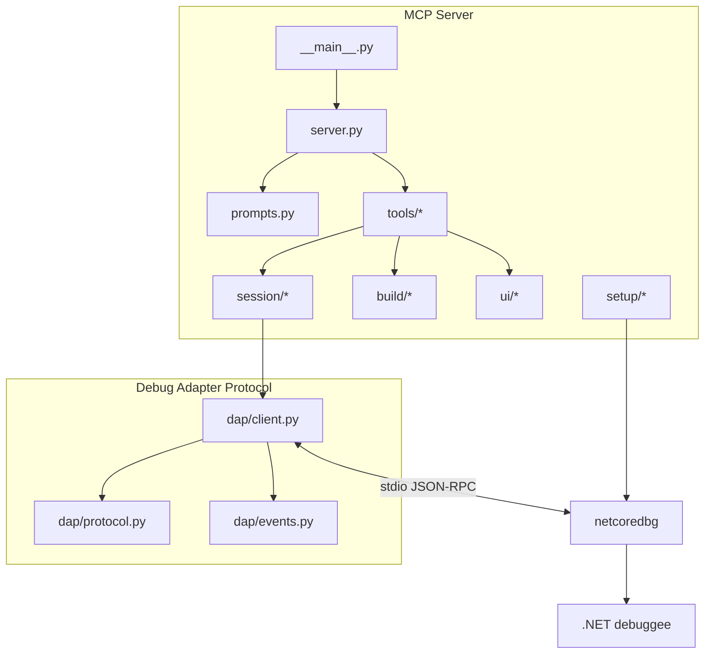

[English](README.md) | [Русский](README.ru.md)

# netcoredbg-mcp

[](https://pypi.org/project/netcoredbg-mcp/)
[](LICENSE)
[](#requirements)
[](https://modelcontextprotocol.io/)
[](#limitations)

`netcoredbg-mcp` gives AI coding agents a real debugger for .NET applications.
Through the Model Context Protocol, an agent can launch or attach to a process,
set breakpoints, step through code, inspect variables, evaluate expressions, read
debug output, and operate Windows UI Automation surfaces such as WPF, WinForms,
and Avalonia windows without opening an IDE.

**131 MCP tools · 8 prompts · 4 resources · 1822 collected tests · release v0.20.5**

## Quick Links

- **Start:** [Quick Start](#quick-start) · [Installation](#installation) · [Client Setup](#client-setup)
- **Use:** [First Debug Session](#first-debug-session) · [GUI App Debugging](#gui-app-debugging) · [Visual Inspection](#visual-inspection)
- **Reference:** [Available Tools](#available-tools) · [Resources](#mcp-resources) · [Prompts](#mcp-prompts) · [Architecture](#architecture-overview)
- **Project:** [Contributing](CONTRIBUTING.md) · [Changelog](CHANGELOG.md) · [License](LICENSE)

## What's New in v0.20.5

- **Package documentation refresh** — the PyPI README, Russian README, release
  notes, production playbook, and NovaScript example now match the shipped
  `v0.20.4` no-operator input-monitor behavior.
- **Operator-contamination wording** — no-operator guidance now distinguishes
  adapter-level `DIRTY` evidence from the returned
  `run_confidence.classification == "DIRTY_UNPROVEN"` result.
- **Consumer-facing examples** — the NovaScript action-oracle app-diagnostics
  example and docs regression oracle now point at the current package release.

## Highlights

| Capability | What agents can do |
|---|---|
| Debug control | Launch, attach, restart, continue, pause, terminate, and step through .NET code |
| Breakpoints | File, function, conditional, hit-count, exception, and tracepoint workflows |
| Inspection | Threads, stack frames, scopes, variables, modules, expressions, source, disassembly, memory |
| GUI automation | Window trees, element search, clicks, keystrokes, screenshots, annotations, clipboard, window management, UI evidence |
| Build integration | Pre-launch `dotnet build`, progress notifications, build diagnostics, cleanup of locked debug processes |
| Runtime smoke | Hygiene preflight, instrumentation groups, output checkpoints, freshness checks, bounded scenario runner |
| Multi-agent safety | Session ownership through `mcp-mux`, read-only observers, inactivity release |

## Quick Start

```powershell
# 1. Install the MCP server
pipx install netcoredbg-mcp

# 2. Run first-time setup
netcoredbg-mcp --setup

# 3. Register it in Claude Code
claude mcp add netcoredbg -- netcoredbg-mcp --project-from-cwd
```

Then ask your agent:

```text
Set a breakpoint in Program.cs, run the app, and inspect local variables when it stops.
```

## Critical Notes

> [!IMPORTANT]
> For .NET Core debugging, the `dbgshim.dll` next to `netcoredbg.exe` must match
> the target runtime major version. The setup wizard scans installed runtimes and
> prepares compatible dbgshim copies.

> [!IMPORTANT]
> `start_debug` is a long-poll tool. If the debuggee is a GUI app, it may return
> only after the app stops at a breakpoint, exits, or times out. Use screenshots
> and UI tools while the app is running; use variable inspection only when stopped.

> [!CAUTION]
> Do not commit `.mcp.json`, `.netcoredbg-mcp.launch.json`, credentials, server
> inventory, or local downstream project paths. Launch profiles support
> `inherit` so secrets can stay in the MCP server process environment.

## Installation

### Requirements

- Windows for GUI automation and FlaUI/pywinauto workflows.
- Python 3.10 or newer.
- .NET SDK/runtime for the target application.
- `netcoredbg`; use `netcoredbg-mcp --setup` unless you need a custom install.
- An MCP client such as Claude Code, Cursor, Cline, Roo Code, Windsurf, Continue,
  or Claude Desktop.

### Recommended Install

```powershell
pipx install netcoredbg-mcp
netcoredbg-mcp --setup
netcoredbg-mcp --version
```

The setup wizard downloads or discovers `netcoredbg`, scans dbgshim versions,
builds the FlaUI bridge when needed, and prints a ready-to-use MCP configuration
snippet.

### Manual Install

```powershell
pip install netcoredbg-mcp
$env:NETCOREDBG_PATH = "C:\Tools\netcoredbg\netcoredbg.exe"
netcoredbg-mcp --project-from-cwd
```

Use a manual install when you pin a locally managed `netcoredbg` build or when a
corporate environment blocks automatic downloads.

### Upgrading

```powershell
pipx upgrade netcoredbg-mcp
netcoredbg-mcp --setup
```

Run setup after an upgrade when the target .NET runtime changed, when you need a
new FlaUI bridge build, or when MCP client snippets should be regenerated.

## Configuration

### Project Launch Profiles

`start_debug` can read `.netcoredbg-mcp.launch.json` from the resolved project
root and apply profile environment variables to the debuggee process. The build
process environment is not changed.

```json
{
  "defaultProfile": "default",
  "profiles": {
    "default": {
      "env": {
        "DOTNET_ENVIRONMENT": "Development",
        "APP_MODE": "Debug"
      },
      "inherit": ["PATH"]
    }
  }
}
```

Precedence is deterministic:

1. `inherit` copies only explicitly named variables from the MCP server process.
2. Profile `env` values override inherited values.
3. Direct `start_debug(env={...})` values override the profile.

`env` values set to `null` are passed through to DAP as explicit nulls to
request variable removal or unset semantics where the adapter supports it. Tool
responses include only variable names, counts, profile name, source path, and
redacted metadata; they never echo environment values.

The repository `.gitignore` excludes `.netcoredbg-mcp.launch.json` by default.
Commit a profile only when it contains non-secret, shareable values.

### Base Server Configuration

Use `--project-from-cwd` for CLI-based agents that start the server from the
workspace. Use `--project` when the MCP client starts from a stable global
location and you want to constrain all debug paths explicitly.

```jsonc
{
  "mcpServers": {
    "netcoredbg": {
      "command": "netcoredbg-mcp",
      "args": ["--project-from-cwd"]
    }
  }
}
```

If setup did not install a managed `netcoredbg`, add `NETCOREDBG_PATH`:

```jsonc
{
  "mcpServers": {
    "netcoredbg": {
      "command": "netcoredbg-mcp",
      "args": ["--project-from-cwd"],
      "env": {
        "NETCOREDBG_PATH": "C:\\Tools\\netcoredbg\\netcoredbg.exe"
      }
    }
  }
}
```

### Project-Scoped Config

Use a project-local MCP config when a client supports it. Keep machine-specific
secrets and binary paths outside git.

```jsonc
{
  "mcpServers": {
    "netcoredbg": {
      "command": "netcoredbg-mcp",
      "args": ["--project", "C:\\Work\\MyDotNetApp"]
    }
  }
}
```

## Client Setup

### Claude Code

```powershell
claude mcp add netcoredbg -- netcoredbg-mcp --project-from-cwd
```

### Cursor, Cline, Roo Code, Windsurf, Continue, Claude Desktop

Add the same server shape to the client-specific MCP configuration file:

```jsonc
{
  "mcpServers": {
    "netcoredbg": {
      "command": "netcoredbg-mcp",
      "args": ["--project-from-cwd"]
    }
  }
}
```

Common configuration locations:

| Client | Typical config path |
|---|---|
| Cursor | `%USERPROFILE%\.cursor\mcp.json` |
| Cline | VS Code extension MCP settings |
| Roo Code | `%USERPROFILE%\.roo\mcp.json` or project `.roo\mcp.json` |
| Windsurf | `%USERPROFILE%\.codeium\windsurf\mcp_config.json` |
| Continue | `%USERPROFILE%\.continue\config.json` |
| Claude Desktop | `%APPDATA%\Claude\claude_desktop_config.json` |

## First Debug Session

### The Long-Poll Pattern

Execution tools wait for a meaningful debugger event. `start_debug`,
`continue_execution`, `step_over`, `step_into`, and `step_out` return when the
debuggee stops, exits, terminates, or times out.

### Typical Workflow

```text
1. Add a breakpoint in the code path you want to inspect.
2. Start debugging with pre_build=true.
3. Wait for state=stopped.
4. Read call stack, scopes, and variables.
5. Evaluate focused expressions or step to the next line.
6. Continue or terminate the session.
```

### Pre-Build Launch Example

```json
{
  "program": "bin/Debug/net8.0/MyApp.dll",
  "build_project": "MyApp.csproj",
  "pre_build": true,
  "stop_at_entry": false
}
```

For .NET 6+ applications, passing a built `.exe` is accepted when a matching
`.dll` and `.runtimeconfig.json` exist. The server resolves the DLL target to
avoid `deps.json` conflicts.

## GUI App Debugging

### The Rule

Do not use debugger inspection tools while a GUI app is running normally. First
stop at a breakpoint or pause the process; otherwise stack, scopes, and variables
are unavailable by design.

### GUI Workflow

```text
1. Launch the app.
2. Use ui_take_screenshot or ui_get_window_tree to observe the running UI.
3. Use UI tools to click, type, select, or wait for state changes.
4. Set a breakpoint before the code path you need to inspect.
5. Trigger the UI action.
6. When state=stopped, inspect variables and call stack.
```

### Stealth Mode

Use stealth mode when the user should keep focus in another application while
the agent launches and inspects the debuggee in the background.

```text
start_debug(
    program="bin/Debug/net8.0/App.dll",
    build_project="App.csproj",
    stealth_mode=True,
)
ui_get_window_tree()
ui_click(automation_id="btnSave")
```

In stealth mode, UIA tree reads and automation-id clicks avoid activating the
debuggee window. `ui_send_keys` and blank-screenshot fallbacks may use
flash-focus: the bridge briefly brings the debuggee forward, performs the
operation, and restores the previous foreground window. Call
`ui_bring_to_front()` when the debuggee should explicitly leave stealth mode.

### Visual Inspection

Screenshots return MCP image content, so vision-capable agents can inspect
layout and state. Annotated screenshots add Set-of-Mark labels for elements that
can be clicked with `ui_click_annotated`.

```text
ui_take_screenshot()
ui_take_annotated_screenshot()
ui_click_annotated(element_id=3)
```

### Runtime Smoke Evidence

For repeatable agent-side verification, use the runtime smoke tools together:
`debug_hygiene_preflight` clears stale debugger state, `output_checkpoint` and
`output_assert_since` prove output changed after a known point,
`verify_debug_freshness` checks that the live process still matches the expected
workspace and artifacts, and `run_runtime_smoke` executes a bounded one-shot
scenario plan with cleanup. Longer agent-driven runs can use the durable
lifecycle surface: `runtime_smoke_start` returns a `run_id`,
`runtime_smoke_tail_events` reads bounded cursor events,
`runtime_smoke_get_result` returns the final scenario envelope, and
`runtime_smoke_stop` idempotently stops an active run with cleanup evidence.

No-operator runtime-smoke plans can request confidence evidence when the agent
needs to prove that a scenario was not contaminated by operator input. Combine
`input_policy.no_global_input` with `run_confidence.no_operator`:

```json
{
  "schema": "netcoredbg.runtime_smoke.v2",
  "input_policy": {"no_global_input": true},
  "run_confidence": {"no_operator": true}
}
```

On supported Windows desktop sessions, the default `runtime.input_monitor.check`
adapter samples `windows.GetLastInputInfo` before and during action windows.
`CLEAN_PROVEN` means the bounded scenario can be interpreted as a product
verdict. If the adapter reports `DIRTY`, the returned no-operator envelope uses
`run_confidence.classification == "DIRTY_UNPROVEN"` and blocks the product
verdict so the caller can restart the scenario instead of recording an
accidental product `FAIL`. This is contamination detection for the current
desktop session, not full OS keyboard, pointer, foreground-window, or focus
isolation.

If a plan intentionally permits runner-controlled global input
(`input_policy.no_global_input=false`), the covered `ui.drag` provenance path
uses signed runner injection plus OS event attribution. Those actions emit
`runner_injected` metadata, and `runtime.input_monitor.check` records every
observed event in the action window as `runner_injected`, `foreign_injected`,
or `physical`. The run stays `CLEAN_PROVEN` only when every observed event is
runner-signed; any physical or foreign-injected event becomes
`DIRTY_UNPROVEN` and blocks the product verdict. Missing monitor evidence still
fails closed.

The manual smoke fixtures now cover the baseline console/WinForms app,
`tests/fixtures/WpfSmokeApp`, and `tests/fixtures/AvaloniaSmokeApp`. Build all
three fixture projects before claiming full GUI smoke coverage; missing fixture
binaries intentionally skip their corresponding manual scenarios.

For WPF product-smoke workflows, start from
[`docs/examples/runtime-smoke-wpf-workflow-plan.json`](docs/examples/runtime-smoke-wpf-workflow-plan.json).
It shows the accepted `netcoredbg.runtime_smoke.v1` schema, `steps` operations
for DataGrid snapshots/assertions, scoped ListBox item actions, output
checkpoints, focus assertions, and `cleanup.restore_files` with graceful debug
stop. The example launches the WPF fixture DLL through `dotnet`, so freshness
expects `expected_process_name: "dotnet"` and `expected_modules:
["WpfSmokeApp.dll"]`. The matching manual scenario is
`WPF One-Call Runtime Smoke Workflow`.

The WPF workflow now connects UI automation eagerly after launch, chooses a
stable usable top-level window, merges structured `GridPattern` cell evidence
with descendant text fallback, and restores fixture files even when Windows
briefly holds attributes or locks. Avalonia remains a first-class compatibility
target: its manual fixture is expected to produce bounded `UNSUPPORTED` or
`BLOCKED` evidence for UIA gaps instead of being omitted from release checks.

For WPF DataGrid drag/drop and edge-scroll release proof, start from
[`docs/examples/runtime-smoke-v2-drag-drop-grid.json`](docs/examples/runtime-smoke-v2-drag-drop-grid.json).
The v2 example shows `ui.drag`, before/after `ui.grid.viewport` probes,
selected payload identity checks, negative no-op expectations, and fail-closed
`BLOCKED` behavior when real pointer route or viewport evidence is unavailable.
WinForms `dragList` primitive smoke is not a substitute for WPF DataGrid CR-001
acceptance.

Diagnostic schemas use `netcoredbg.runtime_smoke.diagnostics.v1`. Start from
the examples under `docs/examples/runtime-smoke-oracle-pack.json`,
`docs/examples/runtime-smoke-app-diagnostics.json`,
`docs/examples/runtime-smoke-semantic-probe.json`, and
`docs/examples/runtime-smoke-tracepoint-guardrail.json` when adding oracle
packs, app diagnostics, semantic probes, or instrumentation guardrails.
NovaScript consumers validating the current action-oracle app-diagnostics path
can adapt
[`docs/examples/runtime-smoke-novascript-action-oracle-app-diagnostics.json`](docs/examples/runtime-smoke-novascript-action-oracle-app-diagnostics.json)
to generate a bounded `app_diagnostics` probe from the
`novascript-action-oracle` template while using launch-scoped diagnostic
evidence acquisition.
Diagnostic payloads use only `PASS`, `BLOCKED`, and `FAIL`; evidence is bounded
by `max_text_length`, `max_list_items`, and `max_json_bytes`; `raw_tree`,
`window_tree`, `ui_tree`, `screenshot_base64`, `access_token`, `api_key`,
`password`, and `secret` must be omitted before evidence is returned;
`backend_result`, `exception`, `raw_output`, and `stack` must be summarized.
App diagnostics can declare freshness expectations such as
`expected_process_name`, `expected_modules`, workspace artifacts, and
`loaded_sources`; returned freshness evidence preserves module `symbolStatus`
so live-target PDB/process proof can fail a stale `PASS` diagnostic artifact.
Tracepoint guardrails must name `allowed_when`, `blocked_when`, `unsafe_when`,
and cleanup ownership with `debug.tracepoint.remove`.

## Edit-and-Continue

`apply_code_change` applies supported source edits to a stopped .NET debug
session without restarting the process. It is intended for method-body changes
found during a live investigation; it is not a replacement for rebuilding when
the shape of the program changes.

### EnC Setup

Build an EnC-capable `netcoredbg` with the bundled setup flow:

```powershell
netcoredbg-mcp setup --enc
```

The command runs `scripts/build-netcoredbg-enc.ps1`, installs the maintained
`thebtf/netcoredbg` fork build with `ncdbhook.dll`, and places it in the
managed `~/.netcoredbg-mcp/netcoredbg` path that accepts the custom DAP
`applyDeltas` request. On Windows x64, setup downloads the published
`3.1.3-1062-enc.2` EnC build by default; pass `-BuildFromSource` to the script
for a local source build. If `ncdbhook.dll` is missing, `apply_code_change`
returns an actionable error instead of crashing.

### Runtime Code Change Workflow

```text
find_code_symbol(name="OrderService")
get_source_context(file="Services/OrderService.cs", line=42, radius=8)
apply_code_change(
    file="Services/OrderService.cs",
    edits=[{"start_line": 42, "end_line": 44, "new_text": "return fixedValue;"}],
)
continue_execution()
```

The debug session must be in STOPPED state. Successful changes update the source
file and apply IL/metadata/PDB deltas through `netcoredbg`; the session remains
STOPPED until you continue or step.

Rude edits such as adding fields, changing method signatures, or changing
generics are rejected before runtime application. Use
`restart_debug(rebuild=True)` for those changes.

## Available Tools

| Category | Count | Tools |
|---|---:|---|
| Debug control | 12 | `start_debug`, `attach_debug`, `stop_debug`, `restart_debug`, `continue_execution`, `pause_execution`, `step_over`, `get_step_in_targets`, `step_into`, `step_out`, `get_debug_state`, `terminate_debug` |
| Breakpoints and exceptions | 6 | `add_breakpoint`, `remove_breakpoint`, `list_breakpoints`, `clear_breakpoints`, `add_function_breakpoint`, `configure_exceptions` |
| Inspection and DAP coverage | 15 | `get_threads`, `get_call_stack`, `get_scopes`, `get_variables`, `evaluate_expression`, `set_variable`, `get_exception_info`, `get_modules`, `get_progress`, `get_loaded_sources`, `disassemble`, `get_locations`, `quick_evaluate`, `get_exception_context`, `get_stop_context` |
| Tracepoints | 4 | `add_tracepoint`, `remove_tracepoint`, `get_trace_log`, `clear_trace_log` |
| Snapshots and object analysis | 5 | `create_snapshot`, `diff_snapshots`, `list_snapshots`, `analyze_collection`, `summarize_object` |
| Memory | 2 | `read_memory`, `write_memory` |
| Output and build diagnostics | 4 | `get_output`, `search_output`, `get_output_tail`, `get_build_diagnostics` |
| Runtime smoke orchestration | 21 | `debug_hygiene_preflight`, instrumentation groups, output checkpoints/assertions, freshness checks, one-shot plan execution, lifecycle start/tail/wait/result/stop, plan/probe validation, probe execution, evidence bundles, event cursors/deltas, and cleanup contracts |
| UI automation | 54 | Window tree, element search, focus, keyboard, mouse, screenshots, annotations, selection, clipboard, window management, expand/collapse, value setting, virtualization, grid evidence, UI snapshots, UI events, and semantic monitors |
| Code search | 4 | `find_code_symbol`, `find_code_references`, `get_source_context`, `search_source` |
| Edit-and-Continue | 1 | `apply_code_change` |
| Process management | 1 | `cleanup_processes` |

## MCP Resources

| URI | Contents |
|---|---|
| `debug://state` | Current debug session state |
| `debug://breakpoints` | Active breakpoints and verification state |
| `debug://output` | Buffered debuggee and build output |
| `debug://threads` | Current thread list |

## MCP Prompts

| Prompt | Use it for |
|---|---|
| `debug` | General debugging workflow guidance |
| `debug-gui` | WPF, WinForms, Avalonia, and UI Automation debugging |
| `debug-exception` | Exception-first investigation |
| `debug-visual` | Screenshot and Set-of-Mark workflows |
| `debug-mistakes` | Common agent debugging mistakes and recovery |
| `investigate` | Parameterized symptom investigation |
| `debug-scenario` | Scenario-specific debugging plans |
| `dap-escape-hatch` | Advanced DAP commands without first-class MCP wrappers |

## Multi-Agent Safety

When served through `mcp-mux`, mutating debug tools are session-owned. One agent
can control a live debug session while other agents keep read-only observability
through state, output, screenshot, and inspection tools. Ownership auto-releases
after the configured inactivity timeout.

## Architecture Overview



### How It Works

1. `__main__.py` parses CLI flags, configures project-root policy, and starts the
   FastMCP stdio server.
2. `server.py` registers tools, prompts, resources, progress notifications, and
   session ownership checks.
3. Tool modules keep debugger control, breakpoints, inspection, memory, output,
   process cleanup, and UI automation separate.
4. `SessionManager` owns debugger state, path validation, event handling,
   snapshots, tracepoints, output buffers, and process cleanup.
5. `DAPClient` speaks JSON-RPC over stdio to `netcoredbg`.
6. UI automation uses a FlaUI bridge on Windows, with pywinauto fallback where
   supported.

## Command Line Options

```text
netcoredbg-mcp --help
netcoredbg-mcp --version
netcoredbg-mcp --setup
netcoredbg-mcp setup --enc
netcoredbg-mcp --project C:\Work\MyApp
netcoredbg-mcp --project-from-cwd
```

| Option | Purpose |
|---|---|
| `--version` | Print the package version |
| `--setup` | Run first-time setup and exit |
| `--project PATH` | Constrain debug operations to a specific project root |
| `setup --enc` | Build and install an EnC-capable `netcoredbg` with `ncdbhook.dll` |
| `--project-from-cwd` | Detect the project root from the process working directory and MCP roots |

`--project` and `--project-from-cwd` are mutually exclusive.

## Environment Variables

| Variable | Default | Purpose |
|---|---|---|
| `NETCOREDBG_PATH` | auto-discovered after setup | Explicit path to `netcoredbg` |
| `NETCOREDBG_PROJECT_ROOT` | unset | Project root fallback |
| `MCP_PROJECT_ROOT` | unset | Generic MCP project root fallback |
| `NETCOREDBG_ALLOWED_PATHS` | empty | Additional comma-separated allowed path prefixes |
| `NETCOREDBG_SCREENSHOT_MAX_WIDTH` | `1568` | Max inline screenshot width |
| `NETCOREDBG_SCREENSHOT_QUALITY` | `80` | Screenshot compression quality |
| `NETCOREDBG_MAX_TRACE_ENTRIES` | `1000` | Tracepoint log capacity |
| `NETCOREDBG_EVALUATE_TIMEOUT` | `0.5` | Tracepoint expression timeout in seconds |
| `NETCOREDBG_RATE_LIMIT_INTERVAL` | `0.1` | Tracepoint hit rate-limit interval |
| `NETCOREDBG_MAX_SNAPSHOTS` | `20` | Snapshot capacity |
| `NETCOREDBG_MAX_VARS_PER_SNAPSHOT` | `200` | Variables captured per snapshot |
| `NETCOREDBG_MAX_OUTPUT_BYTES` | `10000000` | Total output buffer cap |
| `NETCOREDBG_MAX_OUTPUT_ENTRY` | `100000` | Single output entry cap |
| `NETCOREDBG_SESSION_TIMEOUT` | `60.0` | Multi-agent ownership inactivity timeout |
| `NETCOREDBG_STACKTRACE_DELAY_MS` | `0` | Diagnostic delay before stackTrace requests |
| `FLAUI_BRIDGE_PATH` | auto-discovered | Explicit FlaUI bridge executable path |
| `LOG_LEVEL` | `INFO` | Python logging level |
| `LOG_FILE` | unset | Optional diagnostic log file |

## Troubleshooting

### `netcoredbg` is not found

**Symptom:** startup or `start_debug` reports that `netcoredbg` cannot be found.

**Cause:** setup has not installed a managed debugger and `NETCOREDBG_PATH` is
not set.

**Fix:** run `netcoredbg-mcp --setup`, or set `NETCOREDBG_PATH` to the explicit
`netcoredbg.exe` path.

**Verify:** `netcoredbg-mcp --version` succeeds and your MCP client can list the
server tools.

### Breakpoints do not bind

**Symptom:** a breakpoint stays unverified or the process never stops where
expected.

**Cause:** stale build output, wrong target DLL, optimized Release binaries, or a
line without executable IL.

**Fix:** run with `pre_build=True`, debug the `Debug` configuration, confirm the
source file matches the built assembly, and inspect `list_breakpoints()` for
DAP-adjusted lines.

**Verify:** the breakpoint response reports `verified=true` or includes the DAP
line adjustment.

### GUI appears frozen

**Symptom:** a WPF, WinForms, or Avalonia window stops repainting after a debug command.

**Cause:** the debugger stopped the UI thread at a breakpoint or pause.

**Fix:** inspect variables while stopped, then call `continue_execution()` before
expecting the GUI to respond to clicks or keystrokes.

**Verify:** `get_debug_state()` reports `running` and screenshots update again.

### Path is rejected in a worktree

**Symptom:** launch or build fails with a path validation error.

**Cause:** the project root was resolved to a different checkout, or the worktree
path is outside the allowed root set.

**Fix:** use `--project-from-cwd` from the active worktree, or add the worktree
prefix to `NETCOREDBG_ALLOWED_PATHS`.

**Verify:** `start_debug` accepts build and program paths under the worktree.

## Limitations

- GUI automation is Windows-focused.
- `netcoredbg` and DAP capabilities vary by runtime and target application.
- Memory reads and writes require debug adapter support and valid memory
  references.
- Native debugging, browser automation, and non-.NET runtimes are out of scope.

## Contributing

See [CONTRIBUTING.md](CONTRIBUTING.md) for setup, tests, PR expectations, and
sensitive-data rules.

## License

MIT. See [LICENSE](LICENSE).
