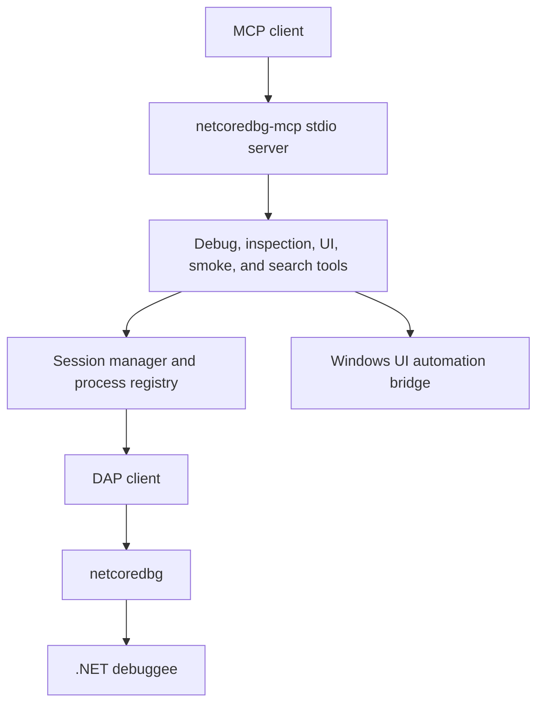

[English](README.md) | [Русский](README.ru.md)

# netcoredbg-mcp

[](https://pypi.org/project/netcoredbg-mcp/)
[](LICENSE)
[](#requirements)
[](https://modelcontextprotocol.io/)
[](#limitations)

Debug .NET applications from an MCP-capable coding agent without leaving the
agent workflow. `netcoredbg-mcp` combines `netcoredbg`, the Debug Adapter
Protocol, and Windows UI Automation so an agent can observe a running app,
stop it deliberately, and inspect the state that explains the behavior.

**Python 3.10+ · Windows GUI automation · 135 tools · 8 prompts · 4 resources · v0.23.7**

## What it enables

| Need | Use the MCP server to |
|---|---|
| Understand a failure | Launch or attach to a .NET process, set breakpoints, inspect threads, stacks, scopes, variables, modules, output, and exceptions. |
| Drive a desktop app | Find UI elements, read window trees, click, type, select, use the clipboard, and gather bounded WPF, WinForms, or Avalonia evidence. |
| Keep evidence honest | Capture a preview for navigation or opt in to a lossless screenshot artifact with integrity metadata. |
| Verify a repair | Run a bounded runtime-smoke plan with cleanup, output checkpoints, freshness checks, and recorded evidence. |
| Search a project | Find C# symbols and references, read source context, or run a bounded `search_source` query. |

The published Python package is the consumer entry point. The experimental .NET
host and Native Scene Probe are source-only and do not add tools to this wheel.

## Quick start

Install the package, let the setup wizard provision or discover the debugger,
then register the public CLI with your MCP client. The command below is for
Claude Code:

```powershell
pipx install netcoredbg-mcp
netcoredbg-mcp --setup
claude mcp add --scope user netcoredbg -- netcoredbg-mcp --project-from-cwd
```

Restart the MCP client after changing its configuration. From a .NET workspace,
ask the agent:

```text
Set a breakpoint in Program.cs, run the application, and show the local values when it stops.
```

`--project-from-cwd` searches upward from the server's startup directory for a
solution or .NET project. Use `--project` instead when the server must be pinned
to one explicit project root.

## Requirements

- Python 3.10 or later.
- `pipx` (recommended) or `pip` to install the package.
- A .NET SDK/runtime suitable for the application being debugged.
- `netcoredbg`. The setup wizard can download or discover it and scans compatible
  `dbgshim.dll` files.
- An MCP client, such as Claude Code, Cursor, Cline, Roo Code, Windsurf,
  Continue, or Claude Desktop.
- Windows for the GUI automation paths. Debugger functionality remains subject
  to the target runtime and `netcoredbg` capabilities.

## Install and configure

### Recommended installation

`pipx` keeps the command-line server isolated from project environments:

```powershell
pipx install netcoredbg-mcp
netcoredbg-mcp --setup
netcoredbg-mcp --version
```

The setup flow checks for a .NET SDK, provisions or finds `netcoredbg`, scans
`dbgshim` candidates, builds the FlaUI bridge on Windows when required, and
prints a client configuration snippet.

### Package-managed installation

Use `pip` when your environment owns Python packages directly:

```powershell
pip install --upgrade netcoredbg-mcp
$env:NETCOREDBG_PATH = "C:\Tools\netcoredbg\netcoredbg.exe"
netcoredbg-mcp --project-from-cwd
```

Run `netcoredbg-mcp --setup` after an upgrade if the target runtime changed or
you need a new managed debugger or FlaUI bridge.

### Client configuration

A generic MCP configuration uses the installed command:

```json
{
  "mcpServers": {
    "netcoredbg": {
      "command": "netcoredbg-mcp",
      "args": ["--project-from-cwd"]
    }
  }
}
```

If the debugger is managed outside the setup flow, set its path in the client
process environment rather than committing it to a repository:

```json
{
  "mcpServers": {
    "netcoredbg": {
      "command": "netcoredbg-mcp",
      "args": ["--project-from-cwd"],
      "env": {
        "NETCOREDBG_PATH": "C:\\Tools\\netcoredbg\\netcoredbg.exe"
      }
    }
  }
}
```

Keep `.mcp.json`, `.netcoredbg-mcp.launch.json`, credentials, and local project
paths out of source control.

### Run from a source checkout

The installed CLI is the consumer route. Use a source checkout only while
developing the server itself:

```powershell
uv sync --locked --project C:\Work\netcoredbg-mcp
cd C:\Work\MyDotNetApp
uv run --no-sync --project C:\Work\netcoredbg-mcp netcoredbg-mcp --project-from-cwd
```

`--no-sync` prevents a supervised server restart from changing the shared
virtual environment. Synchronize explicitly after changing dependencies or the
lockfile.

## First debugging session

`start_debug` launches the debug session and normally returns with it running.
`continue_execution`, `step_over`, `step_into`, and `step_out` are long-poll
operations: they return when the debuggee stops, exits, terminates, or reaches
their timeout.

For console programs, use this sequence:

1. Add a breakpoint in the code path of interest.
2. Call `start_debug` with the program and, when appropriate, `pre_build=true`.
3. Wait for `state=stopped`.
4. Read `get_call_stack`, `get_scopes`, and `get_variables`.
5. Evaluate or step only while stopped.
6. Continue or terminate the session.

For WPF, Avalonia, and WinForms targets, use the Desktop UI sequence below instead.
It starts the application without breakpoints, waits for the window to load, and
only then adds a breakpoint; a pre-launch breakpoint can make the window appear hung.

A representative launch request is:

```json
{
  "program": "bin/Debug/net8.0/MyApp.dll",
  "build_project": "MyApp.csproj",
  "pre_build": true,
  "stop_at_entry": false
}
```

For .NET 6+ targets, a built `.exe` is accepted when its matching `.dll` and
`.runtimeconfig.json` are present. Use
`inspect_debug_launch_compatibility(program)` before launch when you need to
inspect the selected runtime and shim without starting the process.

## Desktop UI and visual evidence

While a GUI debuggee is `RUNNING`, use UI tools to observe and operate it. Once
the UI thread is stopped at a breakpoint or pause, stack and variable inspection
become available but the window will not respond normally until you continue.

```text
start_debug(...)
ui_get_window_tree() # Wait for the application window to load.
add_breakpoint(file="MainWindow.xaml.cs", line=42)
ui_find_element(automation_id="saveButton")
ui_click(automation_id="saveButton")
# Trigger the breakpoint, then inspect state after it reports STOPPED.
```

### Screenshot modes

`ui_take_screenshot()` returns a WebP navigation preview with
`evidence_grade=preview_only`. It is useful for locating the next UI action,
not for asserting lossless visual evidence.

For an artifact that preserves the original raster and integrity metadata, opt
in explicitly:

```text
ui_take_screenshot(evidence=true)
```

This mode returns `evidence_grade=lossless_raster`, persists a session-scoped
PNG artifact, and includes SHA-256 and geometry provenance. Any raw-derived
crop requires `evidence=true`; preview-only captures do not provide it.

Use `ui_take_annotated_screenshot()` to receive Set-of-Mark labels, then invoke
`ui_click_annotated(element_id=...)`. Use `ui_bring_to_front()` only when the
debuggee should intentionally leave stealth mode.

## Tool map

The published MCP catalog has 135 tools.

| Category | Count | Examples |
|---|---:|---|
| Debug control | 14 | `start_debug`, `attach_debug`, `continue_execution`, `pause_execution`, `terminate_debug` |
| Breakpoints and exceptions | 7 | file/function breakpoints and exception configuration |
| Inspection and DAP coverage | 15 | stacks, scopes, variables, modules, disassembly, source locations |
| Tracepoints | 6 | add, read, clear, and cursor trace evidence |
| Snapshots and object analysis | 5 | create, compare, list, and summarize captured state |
| Memory and output | 6 | memory, debugger output, and build diagnostics |
| Runtime smoke | 21 | hygiene, validation, execution, lifecycle, and cleanup evidence |
| UI automation | 55 | windows, elements, focus, input, screenshots, grids, and monitors |
| Code search | 4 | symbols, references, context, and regex search |
| Edit-and-Continue | 1 | `apply_code_change` |
| Process management | 1 | `cleanup_processes` |

The server also exposes four resources: `debug://state`, `debug://breakpoints`,
`debug://output`, and `debug://threads`.

Eight prompts provide guided workflows: `debug`, `debug-gui`,
`debug-exception`, `debug-visual`, `debug-mistakes`, `investigate`,
`debug-scenario`, and `dap-escape-hatch`.

### Code search boundary

`find_code_symbol`, `find_code_references`, and `get_source_context` execute
in the MCP server process. `search_source` alone runs in a bounded dedicated
Python subprocess, with a default five-second timeout and a maximum of 1,000
results. It searches supported project files while honoring `.gitignore`.

## Runtime-smoke verification

Use runtime-smoke tools when you need a bounded, replayable verification rather
than an ad hoc debugging conversation. Start with
`debug_hygiene_preflight`, create an output checkpoint, run a validated plan,
and close the run with its cleanup contract. `verify_debug_freshness` can prove
that the live process still matches the expected workspace and artifacts.

For long-lived orchestration, use the lifecycle family:
`runtime_smoke_start`, `runtime_smoke_tail_events`,
`runtime_smoke_get_result`, and `runtime_smoke_stop`. See the
[production testing playbook](docs/PRODUCTION-TESTING-PLAYBOOK.md) for the
consumer-mode release gate and the examples in [`docs/examples/`](docs/examples/)
for WPF workflow, WPF DataGrid drag/drop, and diagnostic-plan shapes.

### Input provenance

Runtime-smoke plans can distinguish the runner's own input from operator or
foreign input. With `input_policy.no_global_input=true`, the monitor reports a
`CLEAN_PROVEN` result only when the action window is free of operator input;
missing or conflicting evidence yields `DIRTY_UNPROVEN` and blocks a product
verdict.

When a plan permits runner-controlled global input, such as `ui.drag`, every
covered input event must carry `runner_injected` provenance. A
`foreign_injected` or `physical` event yields `DIRTY_UNPROVEN`; the caller must
not treat that run as a product verdict.

## Command-line reference

| Command or option | Purpose |
|---|---|
| `netcoredbg-mcp --version` | Print the installed package version. |
| `netcoredbg-mcp --setup` | Provision or discover debugger prerequisites, then print a client configuration snippet. |
| `netcoredbg-mcp setup --enc` | Install the default prebuilt Edit-and-Continue debugger with `ncdbhook.dll` on Windows x64; a source build is opt-in. |
| `netcoredbg-mcp --project C:\Work\MyApp` | Pin all debug operations to one project root. |
| `netcoredbg-mcp --project-from-cwd` | Resolve the project from the startup directory and compatible local MCP roots. |

`--project` and `--project-from-cwd` are mutually exclusive. `--enc` must be
used with `setup` or `--setup`.

## Configuration reference

| Variable | Purpose |
|---|---|
| `NETCOREDBG_PATH` | Explicit path to `netcoredbg`. |
| `NETCOREDBG_PROJECT_ROOT` / `MCP_PROJECT_ROOT` | Authoritative project-root fallback. |
| `NETCOREDBG_ALLOWED_PATHS` | Additional comma-separated path prefixes the server may access. |
| `FLAUI_BRIDGE_PATH` | Explicit FlaUI bridge executable path. |
| `NETCOREDBG_SCREENSHOT_MAX_WIDTH` / `NETCOREDBG_SCREENSHOT_QUALITY` | Inline preview dimensions and WebP quality. |
| `NETCOREDBG_SESSION_TIMEOUT` | Multi-agent ownership inactivity timeout. |
| `LOG_LEVEL` / `LOG_FILE` | Server diagnostic logging controls. |

An explicit `--project` or project-root environment variable takes precedence
over MCP client roots. Network/UNC client roots are rejected.

## Architecture


```mermaid
graph TB
    Client[MCP client] --> Server[netcoredbg-mcp stdio server]
    Server --> Tools[Debug, inspection, UI, smoke, and search tools]
    Tools --> Session[Session manager and process registry]
    Session --> DAP[DAP client]
    DAP --> Debugger[netcoredbg]
    Debugger --> App[.NET debuggee]
    Tools --> UI[Windows UI automation bridge]
```

The public console script starts a FastMCP stdio server. Its tool modules share
one session manager, which owns debugger state, validated project scope,
process cleanup, output, snapshots, and trace evidence. The DAP client talks to
`netcoredbg`; Windows UI operations use the FlaUI bridge when available, with a
pywinauto fallback for supported operations.

## Troubleshooting

### `netcoredbg` is not found

**Symptom:** startup or `start_debug` reports that the debugger cannot be found.

**Cause:** setup did not install a managed debugger and `NETCOREDBG_PATH` is not
set.

**Fix:** run `netcoredbg-mcp --setup`, or set `NETCOREDBG_PATH` to the full
`netcoredbg.exe` path in the MCP client environment.

**Verify:** run `netcoredbg-mcp --setup` again and confirm its output reports a
found or provisioned debugger. Then confirm that the MCP client can list the
server tools.

### A breakpoint remains unverified

**Symptom:** the process does not stop at the requested source line.

**Cause:** common causes include stale build output, a wrong target DLL,
optimized Release binaries, or a line without executable IL.

**Fix:** use `pre_build=true`, debug a Debug build, verify that source and
assembly match, and inspect `list_breakpoints()` for DAP-adjusted locations.

**Verify:** the response reports `verified=true` or gives the adjusted line.

### A GUI appears frozen

**Symptom:** a WPF, WinForms, or Avalonia window stops repainting after a debug
command.

**Cause:** its UI thread is stopped at a breakpoint or pause.

**Fix:** inspect state while stopped, then call `continue_execution()` before
expecting the window to accept UI input.

**Verify:** `get_debug_state()` reports `running` and fresh screenshots update.

### A worktree path is rejected

**Symptom:** launch or build reports a path-validation error.

**Cause:** the server resolved a different project root, or the worktree lies
outside the allowed path set.

**Fix:** start the server from that worktree with `--project-from-cwd`, or add
its prefix to `NETCOREDBG_ALLOWED_PATHS`.

**Verify:** `start_debug` accepts the build and program paths under the
worktree.

## Limitations

- GUI automation is Windows-focused.
- `netcoredbg` and DAP behavior depends on the target runtime and debugger
  support.
- Memory tools require valid adapter-supported memory references.
- Native debugging, browser automation, and non-.NET runtimes are out of scope.

## Contributing

See [CONTRIBUTING.md](CONTRIBUTING.md) for development setup, test expectations,
sensitive-data rules, and pull-request requirements.

## License

MIT. See [LICENSE](LICENSE).
