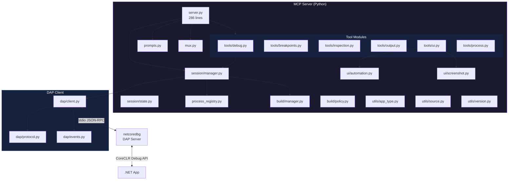

# netcoredbg-mcp

🌐 [English](README.md) | **Русский**

[](https://pypi.org/project/netcoredbg-mcp/)
[](LICENSE)
[](#requirements)
[](https://modelcontextprotocol.io/)
[](#limitations)

AI-агенты отлаживают .NET-приложения вслепую. Ни стека вызовов, ни просмотра переменных, ни точек останова (breakpoints) — только «упало». **netcoredbg-mcp** даёт агенту полный контроль над отладчиком через Model Context Protocol: установка точек останова, пошаговое выполнение, просмотр переменных, снимки экрана GUI-приложений и вычисление выражений — без IDE.

**66 инструментов. 4 ресурса. 7 промптов. 498 тестов. Один MCP-сервер.**

## Быстрые ссылки

- **Начало работы:** [Установка](#installation) · [Настройка](#configuration) · [Первая сессия отладки](#first-debug-session)
- **Справочник:** [Инструменты](#available-tools) · [Ресурсы](#mcp-resources) · [Промпты](#mcp-prompts) · [Архитектура](#architecture)
- **Руководства:** [Отладка GUI-приложений](#gui-app-debugging) · [Визуальная инспекция](#visual-inspection) · [Решение проблем](#troubleshooting)

---

## Основные возможности

| Возможность | Описание |
|-------------|----------|
| **66 MCP-инструментов** | Управление отладкой, точки останова, трейспоинты, снэпшоты, инспекция, вывод, UI-автоматизация, управление процессами |
| **Long-Poll выполнение** | `continue` и `step_*` блокируются до остановки — никаких циклов опроса |
| **Ответы конечного автомата** | Каждый ответ содержит `state`, `next_actions`, `message` — агент всегда знает, что делать дальше |
| **Agent Intelligence** | ElementResolver с ранжированным поиском, ExtractText с 5 стратегиями, определение CLR-типов |
| **Клиентские трейспоинты** | Пауза → вычисление → возобновление без поддержки netcoredbg — с rate limiting и asyncio |
| **Снэпшоты состояния + Diff** | Захват переменных в точке останова, сравнение снэпшотов (FIFO, макс. 20) |
| **Детектирование GUI** | Автоматическое определение WPF/WinForms/Avalonia из `runtimeconfig.json` с корректировкой подсказок рабочего процесса |
| **Скриншоты + Set-of-Mark** | Просмотр UI приложения, нумерованные оверлеи элементов, клик по ID аннотации |
| **stepInTargets** | Выбор конкретной функции для захода на многовызовных строках |
| **Пагинация переменных** | Параметры `filter`, `start`, `count` для навигации по большим коллекциям |
| **Предварительная сборка** | Сборка перед отладкой с `pre_build: true` — скрытые предупреждения доступны через `get_build_diagnostics` |
| **Умное разрешение путей** | Автоматическое преобразование `.exe` в `.dll` для .NET 6+, чтобы избежать конфликтов deps.json |
| **Проверка версий** | Автоматическое обнаружение несовпадений `dbgshim.dll` при запуске сессии |
| **Сборщик процессов** | Отслеживание PID-файлов с `cleanup_processes` — никаких потерянных процессов отладчика |
| **Поддержка mcp-mux** | Защита владения сессией для безопасной работы нескольких агентов через `x-mux` |
| **ToolAnnotations** | `readOnlyHint`, `destructiveHint`, `idempotentHint` для каждого инструмента — интеллектуальная маршрутизация агентов |

---

## Быстрый старт (30 секунд)

```bash
# 1. Установка
pip install netcoredbg-mcp

# 2. Регистрация в Claude Code
claude mcp add --scope user netcoredbg -- netcoredbg-mcp --project-from-cwd

# 3. Отладка
# "Поставь точку останова на строке 42 в Program.cs и запусти моё приложение"
```

---

## Важные замечания

> [!WARNING]
> **Совместимость версий dbgshim.dll**
>
> `dbgshim.dll` в папке netcoredbg **ДОЛЖНА совпадать по мажорной версии** со средой выполнения .NET, которую вы отлаживаете.
> Это недокументированное требование Microsoft. Несовпадение приводит к:
> - Ошибкам `E_NOINTERFACE (0x80004002)`
> - Пустым стекам вызовов
> - Неработающему просмотру переменных

| Целевая среда | Источник dbgshim.dll |
|---------------|----------------------|
| .NET 6.x | `C:\Program Files\dotnet\shared\Microsoft.NETCore.App\6.0.x\dbgshim.dll` |
| .NET 7.x | `C:\Program Files\dotnet\shared\Microsoft.NETCore.App\7.0.x\dbgshim.dll` |
| .NET 8.x | `C:\Program Files\dotnet\shared\Microsoft.NETCore.App\8.0.x\dbgshim.dll` |
| .NET 9.x | `C:\Program Files\dotnet\shared\Microsoft.NETCore.App\9.0.x\dbgshim.dll` |

```powershell
# Пример: настройка для отладки .NET 8
copy "C:\Program Files\dotnet\shared\Microsoft.NETCore.App\8.0.x\dbgshim.dll" "D:\Bin\netcoredbg\"
```

> [!TIP]
> Этот MCP-сервер автоматически обнаруживает несовпадения и предупреждает при вызове `start_debug`.

> [!IMPORTANT]
> **Предпочитайте `start_debug` вместо `attach_debug`**
>
> `attach_debug` имеет существенные ограничения в netcoredbg — стеки вызовов и инспекция переменных могут быть неполными или пустыми.

---

## Установка

### Требования

- Python 3.10+
- [netcoredbg](https://github.com/Samsung/netcoredbg/releases)
- .NET SDK (для отлаживаемых приложений)
- [Pillow](https://pypi.org/project/Pillow/) (устанавливается автоматически — необходим для аннотирования скриншотов)

### Установка MCP-сервера

```bash
# Установка из PyPI (рекомендуется)
uv pip install netcoredbg-mcp

# Или через pip
pip install netcoredbg-mcp
```

<details>
<summary><strong>Установка из исходников (для разработки)</strong></summary>

```bash
git clone https://github.com/thebtf/netcoredbg-mcp.git
cd netcoredbg-mcp
uv sync
```

</details>

### Установка netcoredbg

Скачайте с [Samsung/netcoredbg releases](https://github.com/Samsung/netcoredbg/releases) и распакуйте в `D:\Bin\netcoredbg\`

---

## Настройка

### Переменная окружения

Установите `NETCOREDBG_PATH` в профиле PowerShell (`%USERPROFILE%\Documents\PowerShell\Microsoft.PowerShell_profile.ps1`):

```powershell
$env:NETCOREDBG_PATH = "D:\Bin\netcoredbg\netcoredbg.exe"
```

### Базовая конфигурация сервера

Все клиенты используют одно и то же определение сервера:

```jsonc
{
  "netcoredbg": {
    "command": "netcoredbg-mcp",
    "args": ["--project-from-cwd"],
    "env": {
      "NETCOREDBG_PATH": "D:\\Bin\\netcoredbg\\netcoredbg.exe"
    }
  }
}
```

<details>
<summary><strong>Запуск из исходников (для разработки)</strong></summary>

Если запускаете из клонированного репозитория вместо PyPI:

```jsonc
{
  "netcoredbg": {
    "command": "uv",
    "args": ["run", "--project", "D:\\Dev\\netcoredbg-mcp", "netcoredbg-mcp", "--project-from-cwd"],
    "env": {
      "NETCOREDBG_PATH": "D:\\Bin\\netcoredbg\\netcoredbg.exe"
    }
  }
}
```

> [!IMPORTANT]
> Используйте `uv run --project`, а НЕ `uv --directory`. Флаг `--directory` меняет CWD, что ломает `--project-from-cwd`.

</details>

---

## Настройка клиентов

### CLI-агенты

<details open>
<summary><b>Claude Code</b></summary>

```powershell
claude mcp add --scope user netcoredbg -- netcoredbg-mcp --project-from-cwd
```

**Проверка:** `claude mcp list`

</details>

<details>
<summary><b>Codex CLI (OpenAI)</b></summary>

**Конфигурация:** `%USERPROFILE%\.codex\config.toml`

```toml
[mcp_servers.netcoredbg]
command = "netcoredbg-mcp"
args = ["--project-from-cwd"]

[mcp_servers.netcoredbg.env]
NETCOREDBG_PATH = "D:\\Bin\\netcoredbg\\netcoredbg.exe"
```

**Или через CLI:** `codex mcp add netcoredbg -- netcoredbg-mcp --project-from-cwd`

</details>

<details>
<summary><b>Gemini CLI (Google)</b></summary>

**Конфигурация:** `%USERPROFILE%\.gemini\settings.json`

```jsonc
{
  "mcpServers": {
    "netcoredbg": {
      "command": "netcoredbg-mcp",
      "args": ["--project-from-cwd"],
      "env": {
        "NETCOREDBG_PATH": "D:\\Bin\\netcoredbg\\netcoredbg.exe"
      }
    }
  }
}
```

</details>

<details>
<summary><b>Cline</b></summary>

**Конфигурация:** Откройте Cline → иконка MCP Servers → Configure → "Configure MCP Servers"

```jsonc
{
  "mcpServers": {
    "netcoredbg": {
      "command": "netcoredbg-mcp",
      "args": ["--project-from-cwd"],
      "env": {
        "NETCOREDBG_PATH": "D:\\Bin\\netcoredbg\\netcoredbg.exe"
      }
    }
  }
}
```

</details>

<details>
<summary><b>Roo Code</b></summary>

**Конфигурация:** `%USERPROFILE%\.roo\mcp.json` или `.roo\mcp.json` в проекте

```jsonc
{
  "mcpServers": {
    "netcoredbg": {
      "command": "netcoredbg-mcp",
      "args": ["--project-from-cwd"],
      "env": {
        "NETCOREDBG_PATH": "D:\\Bin\\netcoredbg\\netcoredbg.exe"
      }
    }
  }
}
```

</details>

### Десктопные приложения

<details>
<summary><b>Claude Desktop</b></summary>

**Конфигурация:** `%APPDATA%\Claude\claude_desktop_config.json`

```jsonc
{
  "mcpServers": {
    "netcoredbg": {
      "command": "netcoredbg-mcp",
      "args": ["--project-from-cwd"],
      "env": {
        "NETCOREDBG_PATH": "D:\\Bin\\netcoredbg\\netcoredbg.exe"
      }
    }
  }
}
```

</details>

### Расширения для IDE

<details>
<summary><b>Cursor</b></summary>

**Конфигурация:** `%USERPROFILE%\.cursor\mcp.json`

```jsonc
{
  "mcpServers": {
    "netcoredbg": {
      "command": "netcoredbg-mcp",
      "args": ["--project-from-cwd"],
      "env": {
        "NETCOREDBG_PATH": "D:\\Bin\\netcoredbg\\netcoredbg.exe"
      }
    }
  }
}
```

</details>

<details>
<summary><b>Windsurf</b></summary>

**Конфигурация:** `%USERPROFILE%\.codeium\windsurf\mcp_config.json`

```jsonc
{
  "mcpServers": {
    "netcoredbg": {
      "command": "netcoredbg-mcp",
      "args": ["--project-from-cwd"],
      "env": {
        "NETCOREDBG_PATH": "D:\\Bin\\netcoredbg\\netcoredbg.exe"
      }
    }
  }
}
```

</details>

<details>
<summary><b>VS Code + Continue</b></summary>

**Конфигурация:** `%USERPROFILE%\.continue\config.json`

```jsonc
{
  "experimental": {
    "modelContextProtocolServers": [
      {
        "transport": {
          "type": "stdio",
          "command": "uv",
          "args": ["run", "--project", "D:\\Dev\\netcoredbg-mcp", "netcoredbg-mcp", "--project-from-cwd"],
          "env": {
            "NETCOREDBG_PATH": "D:\\Bin\\netcoredbg\\netcoredbg.exe"
          }
        }
      }
    ]
  }
}
```

</details>

### Конфигурация на уровне проекта

<details>
<summary><b>.mcp.json (в корне проекта)</b></summary>

Добавьте в корень .NET-проекта для автоматической загрузки:

```jsonc
{
  "mcpServers": {
    "netcoredbg": {
      "command": "uv",
      "args": ["run", "--project", "D:\\Dev\\netcoredbg-mcp", "netcoredbg-mcp"],
      "env": {
        "NETCOREDBG_PATH": "D:\\Bin\\netcoredbg\\netcoredbg.exe",
        "NETCOREDBG_PROJECT_ROOT": "${workspaceFolder}"
      }
    }
  }
}
```

> [!NOTE]
> При конфигурации на уровне проекта используйте `NETCOREDBG_PROJECT_ROOT` вместо `--project-from-cwd`.

</details>

---

## Первая сессия отладки

### Паттерн Long-Poll

Инструменты выполнения (`continue_execution`, `step_over`, `step_into`, `step_out`) **блокируются до остановки программы**. Никакого опроса. Один вызов — один ответ.

```
Agent: continue_execution()
       ↓ блокируется...
       ↓ программа выполняется...
       ↓ достигнута точка останова!
       ← возвращает: { state: "stopped", reason: "breakpoint", location: {...}, source_context: "..." }
```

### Типичный рабочий процесс

```
1. start_debug       → Запуск с предварительной сборкой (сборка + запуск отладчика)
2. add_breakpoint    → Установка точек останова в исходных файлах
3. continue          → Блокируется до срабатывания точки останова (возвращает позицию + контекст исходника)
4. get_call_stack    → Полный стек вызовов (контекст исходника включён в верхний фрейм)
5. get_variables     → Просмотр локальных переменных, аргументов, замыканий
6. step_over         → Блокируется до следующей строки (возвращает новую позицию + исходник)
7. get_output_tail   → Проверка вывода программы (пользователь его не видит)
8. stop_debug        → Завершение сессии
```

### Пример: start_debug с предварительной сборкой

```python
start_debug(
    program="/path/to/MyApp.exe",      # Автоматически преобразуется в .dll для .NET 6+
    pre_build=True,                     # Сборка перед запуском (по умолчанию)
    build_project="/path/to/MyApp.csproj",
    build_configuration="Debug",
    stop_at_entry=False
)
# Ответ: { state: "running", app_type: "gui", message: "GUI application detected..." }
```

### Умное преобразование .exe в .dll

Для приложений .NET 6+ (WPF, WinForms, Console) SDK создаёт:
- `App.exe` — нативный хост-лаунчер
- `App.dll` — собственно управляемый код

Отладка `.exe` вызывает ошибку «deps.json conflict». Этот MCP-сервер **автоматически преобразует `.exe` в `.dll`**, если рядом существуют соответствующие `.dll` и `.runtimeconfig.json`.

---

## Отладка GUI-приложений

GUI-приложения (WPF, WinForms, Avalonia) зависают при паузе отладчика — UI-поток останавливается, окна перестают отрисовываться, кнопки перестают реагировать.

### Золотое правило

**Никогда не ставьте точки останова до того, как окно станет видимым.**

### Правильный рабочий процесс

```
1. start_debug(program="App.dll", build_project="App.csproj")
   → Ответ содержит app_type="gui"

2. ui_get_window_tree()
   → Подтверждение загрузки окна

3. ui_take_annotated_screenshot()
   → Просмотр UI с пронумерованными интерактивными элементами

4. add_breakpoint(file="MainViewModel.cs", line=42)
   → ТЕПЕРЬ ставим точки останова (окно видимо)

5. ui_click(automation_id="btnSave")
   → Запуск пути выполнения через UI-взаимодействие

6. continue_execution()
   → Блокируется до срабатывания точки останова — инспектируем состояние

7. get_call_stack() → get_variables(ref=...)
   → Чтение локальных переменных в точке останова

8. continue_execution()
   → ВОЗОБНОВЛЕНИЕ — приложение заморожено, пока вы инспектируете

9. stop_debug()
```

### Исключение: отладка запуска

Если баг находится в коде инициализации, используйте `stop_at_entry`:

```
start_debug(program="App.dll", ..., stop_at_entry=True)
# Приложение останавливается на Main() — до любого UI
step_over()  # пошаговый проход по инициализации
```

---

## Визуальная инспекция

### Скриншоты

```
ui_take_screenshot()
```

Возвращает base64 PNG окна приложения — вы видите именно то, что видит пользователь. Используйте для проверки макета, обнаружения проблем рендеринга, поиска элементов, отсутствующих в дереве автоматизации.

### Аннотация Set-of-Mark

```
ui_take_annotated_screenshot(max_depth=3, interactive_only=True)
```

Возвращает скриншот с **пронумерованными красными рамками** вокруг интерактивных элементов и JSON-индекс элементов:

```json
{
  "image": "base64_png...",
  "elements": [
    {"id": 1, "name": "Save", "type": "Button", "automationId": "btnSave"},
    {"id": 2, "name": "", "type": "TextBox", "automationId": "txtName"}
  ]
}
```

Затем кликаем по номеру:

```
ui_click_annotated(element_id=1)   # кликает кнопку "Save"
```

Используйте, когда у элементов нет AutomationId, когда нужен пространственный контекст или когда есть несколько похожих элементов.

### Множественный выбор строк

Для выбора нескольких строк в DataGrid используйте UIA-паттерны вместо координатных кликов:

```
ui_select_items(automation_id="dataGrid", indices=[4,5,6,7,8], mode="replace")
```

Работает для строк за пределами экрана без прокрутки.

---

## Доступные инструменты

### Управление отладкой (11 инструментов)

| Инструмент | Описание |
|------------|----------|
| `start_debug` | Запуск программы под отладчиком с опциональной предварительной сборкой. Автодетектирование GUI. |
| `attach_debug` | Подключение к запущенному процессу. Ограниченная функциональность (ограничение netcoredbg). |
| `stop_debug` | Остановка сессии отладки и освобождение ресурсов. |
| `restart_debug` | Перезапуск сессии с той же конфигурацией. Опциональная пересборка. |
| `continue_execution` | Возобновление выполнения. **Блокируется** до события остановки. |
| `pause_execution` | Приостановка работающей программы. Возвращает управление немедленно. |
| `step_over` | Шаг на следующую строку. **Блокируется** до завершения шага. Возвращает контекст исходника. |
| `step_into` | Шаг внутрь вызова функции. **Блокируется** до завершения шага. |
| `step_out` | Выход из текущей функции. **Блокируется** до завершения шага. |
| `get_step_in_targets` | Список вызываемых функций на текущей строке — выбор, в какую именно зайти. |
| `get_debug_state` | Получение текущего состояния сессии, потоков, позиции. Только чтение. |

<details>
<summary><b>Параметры start_debug</b></summary>

| Параметр | Тип | Описание |
|----------|-----|----------|
| `program` | string | Путь к .exe или .dll (автоматическое преобразование) |
| `cwd` | string? | Рабочий каталог |
| `args` | list? | Аргументы командной строки |
| `env` | dict? | Переменные окружения |
| `stop_at_entry` | bool | Остановка на точке входа программы |
| `pre_build` | bool | Сборка перед запуском (по умолчанию: true) |
| `build_project` | string? | Путь к .csproj (обязателен при pre_build) |
| `build_configuration` | string | "Debug" или "Release" |

</details>

### Точки останова (6 инструментов)

| Инструмент | Описание |
|------------|----------|
| `add_breakpoint` | Установка точки останова на файл:строка с опциональным условием и счётчиком срабатываний. |
| `remove_breakpoint` | Удаление точки останова по файлу и строке. |
| `list_breakpoints` | Список всех активных точек останова (с опциональной фильтрацией по файлу). |
| `clear_breakpoints` | Очистка всех точек останова или всех в конкретном файле. Деструктивная операция. |
| `add_function_breakpoint` | Остановка при входе в функцию по имени. Полезно, когда номер строки неизвестен. |
| `configure_exceptions` | Настройка точек останова по исключениям: `["all"]`, `["user-unhandled"]` или `[]`. |

### Инспекция (11 инструментов)

| Инструмент | Описание |
|------------|----------|
| `get_threads` | Список всех потоков с ID и именами. |
| `get_call_stack` | Стек вызовов для потока. Включает контекст исходника для верхнего фрейма. |
| `get_scopes` | Получение областей видимости переменных для фрейма стека (возвращает ссылки). |
| `get_variables` | Чтение значений переменных из ссылки на область видимости. Поддерживает пагинацию (`filter`, `start`, `count`). |
| `evaluate_expression` | Вычисление выражения C# в текущем контексте отладки. |
| `quick_evaluate` | Быстрое вычисление выражения — одно значение, без предупреждений о побочных эффектах. |
| `set_variable` | Изменение значения переменной во время отладки (проверка гипотез на лету). |
| `get_exception_info` | Получение типа исключения, сообщения и внутреннего исключения при остановке на throw. |
| `get_exception_context` | Полный контекст исключения, включая вложенные исключения и фреймы стека. |
| `analyze_collection` | Подсчёт, поиск null, дубликатов и статистика по коллекции-переменной. |
| `summarize_object` | Рекурсивный обзор полей объекта и вложенных объектов с определением циклических ссылок. |

### Вывод (4 инструмента)

| Инструмент | Описание |
|------------|----------|
| `get_output` | Полный вывод stdout/stderr отлаживаемого процесса. Опциональная очистка. |
| `get_output_tail` | Последние N строк вывода. Легковесная проверка недавнего вывода. |
| `search_output` | Поиск по выводу регулярным выражением с контекстными строками. |
| `get_build_diagnostics` | Полные предупреждения сборки (скрыты по умолчанию в start_debug). |

### Трейспоинты (4 инструмента)

| Инструмент | Описание |
|------------|----------|
| `add_tracepoint` | Добавление клиентского трейспоинта: пауза, вычисление выражения, логирование, возобновление — без поддержки netcoredbg. |
| `remove_tracepoint` | Удаление трейспоинта по файлу и строке. |
| `get_trace_log` | Получение лога вычислений трейспоинтов. |
| `clear_trace_log` | Очистка лога трейспоинтов. |

### Снэпшоты (3 инструмента)

| Инструмент | Описание |
|------------|----------|
| `create_snapshot` | Захват всех локальных переменных в текущей точке останова в именованный снэпшот (FIFO, макс. 20). |
| `diff_snapshots` | Сравнение двух снэпшотов: добавленные, удалённые и изменённые переменные. |
| `list_snapshots` | Список всех сохранённых снэпшотов с метаданными. |

### UI-автоматизация (17 инструментов)

| Инструмент | Описание |
|------------|----------|
| `ui_get_window_tree` | Визуальное дерево окна приложения (AutomationId, тип, имя, enabled). Поддерживает `root_id` и `xpath`. |
| `ui_find_element` | Поиск элемента по AutomationId, имени или типу. Поддерживает `root_id` и `xpath`. |
| `ui_set_focus` | Установка фокуса клавиатуры на элемент. |
| `ui_send_keys` | Отправка клавиатурного ввода конкретному элементу (синтаксис pywinauto). |
| `ui_send_keys_focused` | Отправка клавиш элементу в фокусе (без повторного поиска). |
| `ui_click` | Клик по элементу по AutomationId, имени или типу. Поддерживает `root_id` и `xpath`. |
| `ui_right_click` | Правый клик для открытия контекстного меню. |
| `ui_double_click` | Двойной клик по элементу. |
| `ui_invoke` | Вызов действия по умолчанию для элемента (например, нажатие кнопки через UIA InvokePattern). |
| `ui_toggle` | Переключение чекбокса, радиокнопки или переключателя через UIA TogglePattern. |
| `ui_file_dialog` | Взаимодействие со стандартными диалогами открытия/сохранения файла — ввод пути и подтверждение. |
| `ui_select_items` | Множественный выбор элементов по индексу в DataGrid/ListView (UIA-паттерн). |
| `ui_scroll` | Прокрутка элемента управления (вверх/вниз/влево/вправо). |
| `ui_drag` | Перетаскивание от одного элемента к другому. |
| `ui_take_screenshot` | Скриншот окна приложения в формате base64 PNG. |
| `ui_take_annotated_screenshot` | Скриншот с пронумерованными оверлеями элементов (Set-of-Mark). |
| `ui_click_annotated` | Клик по элементу по его ID аннотации из последнего аннотированного скриншота. |

### Управление процессами (1 инструмент)

| Инструмент | Описание |
|------------|----------|
| `cleanup_processes` | Просмотр или завершение отслеживаемых процессов отладки. Безопасная альтернатива taskkill. |

---

## MCP-ресурсы

| URI ресурса | Описание |
|-------------|----------|
| `debug://state` | Текущее состояние сессии (JSON): статус, причина остановки, потоки, информация о процессе |
| `debug://breakpoints` | Все активные точки останова (JSON): пути к файлам, строки, условия, статус верификации |
| `debug://output` | Вывод консоли отладки (plain text): stdout/stderr отлаживаемого процесса |
| `debug://threads` | Текущие потоки (JSON): ID потоков и имена для отлаживаемого процесса |

Ресурсы отправляют `notifications/resources/updated` при изменении содержимого, что позволяет подписываться на обновления в реальном времени.

---

## MCP-промпты

Промпты — это встроенные руководства по отладке, которые агент может вызвать для структурированных рабочих процессов.

| Промпт | Описание |
|--------|----------|
| `debug` | Полное руководство по отладке: конечный автомат, использование инструментов, антипаттерны, допустимые действия по состояниям |
| `debug-gui` | Рабочий процесс WPF/Avalonia/WinForms: тайминг точек останова, UI-взаимодействие при отладке |
| `debug-exception` | Пошаговый протокол расследования исключений с таблицей типичных исключений .NET |
| `debug-visual` | Рабочий процесс скриншотов и аннотаций Set-of-Mark для визуальной инспекции UI |
| `debug-mistakes` | 9 конкретных антипаттернов с примерами НЕПРАВИЛЬНО/ПРАВИЛЬНО |
| `investigate(symptom)` | Целевой план расследования для конкретного типа исключения или симптома. Включает сценарии для NullReference, InvalidOperation, TaskCanceled, ObjectDisposed, взаимоблокировок (deadlocks), аварийных завершений и проблем производительности. |
| `debug-scenario(problem)` | Пошаговый план отладки для конкретного описания проблемы. Генерирует точные вызовы инструментов для выполнения. |

---

## Архитектура



### Как это работает

1. **MCP-слой** — `server.py` регистрирует 66 инструментов, 4 ресурса и 7 промптов через FastMCP
2. **Модули инструментов** — 6 специализированных модулей (debug, breakpoints, inspection, output, UI, process) делают сервер компактным
3. **Менеджер сессий** — Управляет жизненным циклом сессии отладки, конечным автоматом, валидацией путей, обработкой событий
4. **DAP-клиент** — Взаимодействует с netcoredbg через Debug Adapter Protocol (JSON-RPC по stdio)
5. **Менеджер сборки** — Собирает проекты перед отладкой, фильтрует предупреждения, сохраняет диагностику
6. **Реестр процессов** — Отслеживание PID-файлов всех запущенных процессов; очистка при запуске и через инструмент
7. **UI-автоматизация** — Автоматизация Windows UI на базе pywinauto для взаимодействия с WPF/WinForms/Avalonia
8. **Движок скриншотов** — Захват окна + аннотация Set-of-Mark на базе Pillow
9. **Интеграция с Mux** — Защита владения сессией для безопасной многоагентной работы через mcp-mux
10. **Проверка версий** — Валидация совместимости dbgshim.dll с целевой средой выполнения

---

## Параметры командной строки

| Параметр | Описание |
|----------|----------|
| `--project PATH` | Явное указание корневого каталога проекта |
| `--project-from-cwd` | Автоматическое определение проекта из текущего каталога |

## Переменные окружения

| Переменная | Описание |
|------------|----------|
| `NETCOREDBG_PATH` | **Обязательная.** Путь к исполняемому файлу netcoredbg |
| `NETCOREDBG_PROJECT_ROOT` | Корневой каталог проекта (альтернатива `--project`) |
| `NETCOREDBG_OUTPUT_FILTER` | Фильтрация вывода программы (скрытие шума из stdout/stderr) |
| `NETCOREDBG_STACKTRACE_DELAY_MS` | Диагностическая задержка (мс) перед запросами stackTrace — помогает диагностировать проблемы тайминга |
| `LOG_LEVEL` | Уровень логирования: DEBUG, INFO, WARNING, ERROR |
| `LOG_FILE` | Путь к файлу логов для диагностики |

---

## Решение проблем

<details>
<summary><b>Пустой стек вызовов / E_NOINTERFACE (0x80004002)</b></summary>

**Симптом:** `get_call_stack` возвращает пустой массив или ошибку с `0x80004002`.

**Причина:** Несовпадение версии `dbgshim.dll` между netcoredbg и целевой средой выполнения.

**Решение:**
1. Проверьте предупреждение от `start_debug` — оно показывает точные версии
2. Скопируйте правильную `dbgshim.dll`:

```powershell
# Найдите установленные версии среды выполнения .NET
dir "C:\Program Files\dotnet\shared\Microsoft.NETCore.App\"

# Скопируйте подходящую версию (например, для приложения .NET 8)
copy "C:\Program Files\dotnet\shared\Microsoft.NETCore.App\8.0.x\dbgshim.dll" "D:\Bin\netcoredbg\"
```

</details>

<details>
<summary><b>Ошибка конфликта deps.json</b></summary>

**Симптом:** Запуск завершается с ошибкой «assembly has already been found but with a different file extension».

**Причина:** Отладка `.exe` вместо `.dll` для приложения .NET 6+.

**Решение:** Должно разрешаться автоматически. Если нет, явно укажите путь к `.dll`:
```
program: "App.dll"  # вместо "App.exe"
```

</details>

<details>
<summary><b>Программа не найдена при pre_build</b></summary>

**Симптом:** `start_debug` с `pre_build: true` завершается с ошибкой «программа не существует».

**Причина:** Старая версия, валидирующая путь до сборки.

**Решение:** Обновитесь до последней версии. Валидация пути теперь отложена до завершения сборки.

</details>

<details>
<summary><b>Точки останова не срабатывают</b></summary>

**Симптом:** Точки останова установлены, но никогда не срабатывают.

**Возможные причины:**
1. Неправильная конфигурация (Release вместо Debug)
2. Несовпадение исходников (бинарный файл не соответствует исходному коду)
3. JIT-оптимизация влияет на маппинг строк

**Решение:** Используйте `pre_build: true` для гарантии свежей Debug-сборки.

</details>

<details>
<summary><b>Режим attach: пустые стеки вызовов</b></summary>

**Симптом:** После подключения к запущенному процессу `get_call_stack` возвращает пустой результат.

**Причина:** netcoredbg не поддерживает `justMyCode` в режиме attach (ограничение netcoredbg).

**Решение:** Используйте `start_debug` вместо attach. Если подключение необходимо, ожидайте ограниченную функциональность.

</details>

<details>
<summary><b>Окно GUI-приложения не появляется</b></summary>

**Симптом:** После `start_debug` окно приложения не показывается.

**Причина:** Точка останова была установлена до запуска и сработала во время инициализации окна, заморозив UI-поток.

**Решение:** Удалите все точки останова перед `start_debug`. Устанавливайте их после того, как `ui_get_window_tree()` подтвердит видимость окна.

</details>

<details>
<summary><b>Потерянные процессы отладчика</b></summary>

**Симптом:** Множественные процессы netcoredbg или dotnet накапливаются после сессий отладки.

**Причина:** Сессии отладки завершены без корректной очистки.

**Решение:**
```
cleanup_processes(force=True)   # завершает только процессы, отслеживаемые этим сервером
```

Сервер также очищает устаревшие PID-файлы при запуске.

</details>

<details>
<summary><b>Предупреждения сборки вызывают ошибки выполнения</b></summary>

**Симптом:** Сборка проходит успешно, но приложение падает или ведёт себя неожиданно.

**Причина:** Предупреждения сборки (скрытые по умолчанию) часто предсказывают ошибки времени выполнения:
- CS8602 nullable dereference → NullReferenceException
- NU1701 совместимость → ошибки загрузки сборок
- CS4014 неожидаемый async → проглоченные исключения

**Решение:**
```
get_build_diagnostics()   # показывает все предупреждения, скрытые при start_debug
```

</details>

---

## Ограничения

- **Одна сессия** — Одна сессия отладки одновременно (by design для ясности конечного автомата)
- **Режим attach** — Ограниченная функциональность из-за ограничений netcoredbg
- **Версия dbgshim** — Необходимо вручную подбирать версию под целевую среду выполнения
- **Фокус на Windows** — Основная разработка/тестирование на Windows (Linux/macOS: UI-автоматизация недоступна, базовая отладка может работать)
- **Многоагентность через mcp-mux** — Защита владения сессией предотвращает конфликтующие мутации; только сессия, запустившая отладку, может изменять состояние. Остальные сессии получают доступ только на чтение.

---

## Лицензия

MIT
