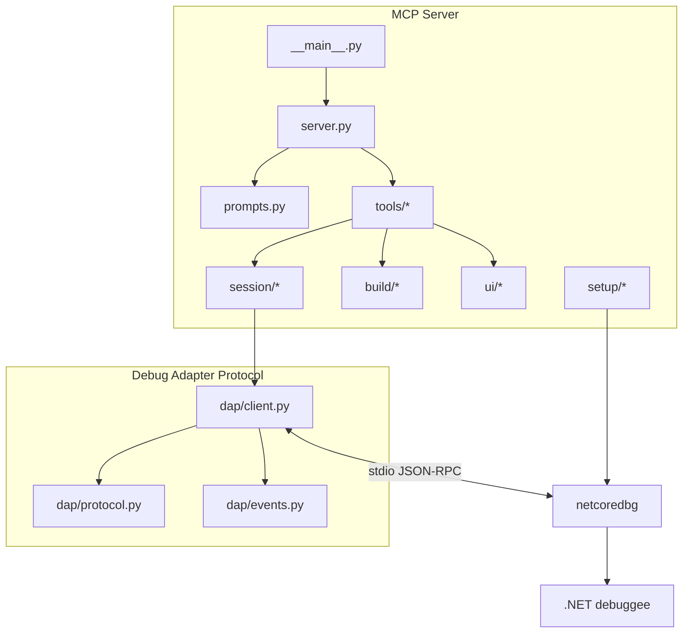

[English](README.md) | [Русский](README.ru.md)

# netcoredbg-mcp

[](https://pypi.org/project/netcoredbg-mcp/)
[](LICENSE)
[](#требования)
[](https://modelcontextprotocol.io/)
[](#ограничения)

`netcoredbg-mcp` даёт AI-агентам полноценный отладчик для .NET-приложений.
Через Model Context Protocol агент может запускать процесс или подключаться к
нему, ставить точки останова, выполнять код пошагово, смотреть переменные,
вычислять выражения, читать вывод отладки и управлять поверхностями Windows UI
Automation, включая окна WPF, WinForms и Avalonia, без IDE.

**131 MCP-инструмент · 8 промптов · 4 ресурса · 1792 собранных теста · релиз v0.20.0**

## Быстрые ссылки

- **Старт:** [Быстрый старт](#быстрый-старт) · [Установка](#установка) · [Настройка клиентов](#настройка-клиентов)
- **Использование:** [Первая сессия отладки](#первая-сессия-отладки) · [Отладка GUI-приложений](#отладка-gui-приложений) · [Визуальная инспекция](#визуальная-инспекция)
- **Справочник:** [Доступные инструменты](#доступные-инструменты) · [Ресурсы](#mcp-ресурсы) · [Промпты](#mcp-промпты) · [Архитектура](#обзор-архитектуры)
- **Проект:** [Contributing](CONTRIBUTING.md) · [Changelog](CHANGELOG.md) · [License](LICENSE)

## Что нового в v0.20.0

- **Named pack manifests** — запуски `oracle_pack` и `app_diagnostics` теперь
  отдают bounded `pack_manifest` descriptors и refs на `pack-manifest.json`
  через run-plan, run-probe, evidence-bundle и event-delta facades.
- **Source classifications and rollups** — named packs записывают
  per-source classifications, cleanup/freshness/redaction/limits rollups и
  безопасные evidence refs, чтобы агент мог аудировать oracle evidence без
  восстановления transient state.
- **NovaScript replay ledger closure** — bounded action-oracle
  app-diagnostics replay записан как downstream `PASS`, а broad tails
  `#268..#272` остаются явно open для non-duplicate follow-up work.

## Основные возможности

| Возможность | Что умеют агенты |
|---|---|
| Управление отладкой | Запускать, подключаться, перезапускать, продолжать, приостанавливать, завершать и пошагово выполнять .NET-код |
| Точки останова | Работать с file, function, conditional, hit-count, exception и tracepoint-сценариями |
| Инспекция | Смотреть threads, stack frames, scopes, variables, modules, expressions, source, disassembly и memory |
| GUI-автоматизация | Читать дерево окон, искать элементы, кликать, вводить текст, делать screenshots и annotations, работать с clipboard, окнами и UI evidence |
| Интеграция сборки | Запускать pre-launch `dotnet build`, получать progress notifications и build diagnostics, чистить заблокированные debug-процессы |
| Runtime smoke | Предзапусковая очистка, instrumentation groups, output checkpoints, freshness checks и bounded scenario runner |
| Безопасность multi-agent | Владение сессией через `mcp-mux`, read-only-наблюдатели, освобождение владения после inactivity timeout |

## Быстрый старт

```powershell
# 1. Установите MCP-сервер
pipx install netcoredbg-mcp

# 2. Запустите первичную настройку
netcoredbg-mcp --setup

# 3. Зарегистрируйте сервер в Claude Code
claude mcp add netcoredbg -- netcoredbg-mcp --project-from-cwd
```

Затем попросите агента:

```text
Set a breakpoint in Program.cs, run the app, and inspect local variables when it stops.
```

## Важные замечания

> [!IMPORTANT]
> Для отладки .NET Core файл `dbgshim.dll` рядом с `netcoredbg.exe` должен
> совпадать с major-версией целевого runtime. Setup wizard сканирует
> установленные runtime и готовит совместимые копии dbgshim.

> [!IMPORTANT]
> `start_debug` — long-poll-инструмент. Если debuggee — GUI-приложение,
> ответ может вернуться только после остановки на breakpoint, выхода процесса или
> timeout. Используйте screenshots и UI tools, пока приложение работает;
> инспекцию переменных запускайте только в состоянии stopped.

> [!CAUTION]
> Не коммитьте `.mcp.json`, `.netcoredbg-mcp.launch.json`, credentials,
> инвентарь серверов или локальные пути downstream-проектов. Launch profiles
> поддерживают `inherit`, чтобы секреты оставались в окружении процесса
> MCP-сервера.

## Установка

### Требования

- Windows для GUI automation и сценариев FlaUI/pywinauto.
- Python 3.10 или новее.
- .NET SDK/runtime для целевого приложения.
- `netcoredbg`; используйте `netcoredbg-mcp --setup`, если не нужна ручная
  установка.
- MCP-клиент: Claude Code, Cursor, Cline, Roo Code, Windsurf, Continue или
  Claude Desktop.

### Рекомендуемая установка

```powershell
pipx install netcoredbg-mcp
netcoredbg-mcp --setup
netcoredbg-mcp --version
```

Мастер настройки скачивает или находит `netcoredbg`, сканирует версии dbgshim,
собирает FlaUI bridge при необходимости и печатает готовый фрагмент конфигурации
MCP.

### Ручная установка

```powershell
pip install netcoredbg-mcp
$env:NETCOREDBG_PATH = "C:\Tools\netcoredbg\netcoredbg.exe"
netcoredbg-mcp --project-from-cwd
```

Ручная установка нужна, если вы закрепляете локально управляемую сборку
`netcoredbg` или корпоративная среда блокирует автоматические загрузки.

### Обновление

```powershell
pipx upgrade netcoredbg-mcp
netcoredbg-mcp --setup
```

Запускайте setup после обновления, если изменился целевой .NET runtime, нужна
новая сборка FlaUI bridge или фрагменты конфигурации MCP-клиента должны быть
сгенерированы
заново.

## Конфигурация

### Профили окружения запуска

`start_debug` может читать `.netcoredbg-mcp.launch.json` из найденного project
root и применять переменные окружения профиля к debuggee process. Окружение процесса
сборки при этом не меняется.

```json
{
  "defaultProfile": "default",
  "profiles": {
    "default": {
      "env": {
        "DOTNET_ENVIRONMENT": "Development",
        "APP_MODE": "Debug"
      },
      "inherit": ["PATH"]
    }
  }
}
```

Приоритет детерминированный:

1. `inherit` копирует только явно перечисленные переменные из процесса MCP-сервера.
2. Значения profile `env` переопределяют унаследованные значения.
3. Прямые значения `start_debug(env={...})` переопределяют профиль.

Значения `env`, равные `null`, передаются в DAP как явные null, чтобы запросить
удаление или unset semantics там, где адаптер это поддерживает. Ответы tools
включают только имена переменных, counts, profile name, source path и redacted
metadata; значения окружения не возвращаются.

Файл `.gitignore` исключает `.netcoredbg-mcp.launch.json` по умолчанию.
Коммитьте профиль только тогда, когда он содержит не секреты, а значения,
которыми можно безопасно делиться.

### Базовая конфигурация сервера

Используйте `--project-from-cwd` для CLI-агентов, которые запускают сервер из
workspace. Используйте `--project`, когда MCP-клиент стартует из стабильного
глобального расположения и нужно явно ограничить все debug paths.

```jsonc
{
  "mcpServers": {
    "netcoredbg": {
      "command": "netcoredbg-mcp",
      "args": ["--project-from-cwd"]
    }
  }
}
```

Если setup не установил managed `netcoredbg`, добавьте `NETCOREDBG_PATH`:

```jsonc
{
  "mcpServers": {
    "netcoredbg": {
      "command": "netcoredbg-mcp",
      "args": ["--project-from-cwd"],
      "env": {
        "NETCOREDBG_PATH": "C:\\Tools\\netcoredbg\\netcoredbg.exe"
      }
    }
  }
}
```

### Конфигурация на уровне проекта

Используйте project-local MCP config, если клиент это поддерживает. Храните
machine-specific secrets и пути к бинарным файлам вне git.

```jsonc
{
  "mcpServers": {
    "netcoredbg": {
      "command": "netcoredbg-mcp",
      "args": ["--project", "C:\\Work\\MyDotNetApp"]
    }
  }
}
```

## Настройка клиентов

### Claude Code

```powershell
claude mcp add netcoredbg -- netcoredbg-mcp --project-from-cwd
```

### Cursor, Cline, Roo Code, Windsurf, Continue, Claude Desktop

Добавьте тот же server shape в файл конфигурации MCP для вашего клиента:

```jsonc
{
  "mcpServers": {
    "netcoredbg": {
      "command": "netcoredbg-mcp",
      "args": ["--project-from-cwd"]
    }
  }
}
```

Типичные расположения конфигов:

| Клиент | Типичный путь к конфигу |
|---|---|
| Cursor | `%USERPROFILE%\.cursor\mcp.json` |
| Cline | VS Code extension MCP settings |
| Roo Code | `%USERPROFILE%\.roo\mcp.json` или project `.roo\mcp.json` |
| Windsurf | `%USERPROFILE%\.codeium\windsurf\mcp_config.json` |
| Continue | `%USERPROFILE%\.continue\config.json` |
| Claude Desktop | `%APPDATA%\Claude\claude_desktop_config.json` |

## Первая сессия отладки

### Long-Poll Pattern

Инструменты выполнения ждут значимого debugger event. `start_debug`,
`continue_execution`, `step_over`, `step_into` и `step_out` возвращаются, когда
debuggee останавливается, выходит, завершается или достигает timeout.

### Типичный workflow

```text
1. Поставьте breakpoint в коде, который нужно проверить.
2. Запустите отладку с pre_build=true.
3. Дождитесь state=stopped.
4. Прочитайте call stack, scopes и variables.
5. Вычислите нужные expressions или перейдите к следующей строке.
6. Продолжите или завершите session.
```

### Пример запуска с pre-build

```json
{
  "program": "bin/Debug/net8.0/MyApp.dll",
  "build_project": "MyApp.csproj",
  "pre_build": true,
  "stop_at_entry": false
}
```

Для приложений .NET 6+ можно передать собранный `.exe`, если рядом есть
подходящие `.dll` и `.runtimeconfig.json`. Сервер выберет DLL-цель, чтобы
избежать конфликтов `deps.json`.

## Отладка GUI-приложений

### Правило

Не используйте debugger inspection tools, пока GUI app работает штатно. Сначала
остановитесь на breakpoint или приостановите process; иначе stack, scopes и
variables недоступны по устройству отладчика.

### GUI workflow

```text
1. Запустите приложение.
2. Используйте ui_take_screenshot или ui_get_window_tree, чтобы наблюдать UI.
3. Используйте UI tools для кликов, ввода, выбора и ожидания изменений состояния.
4. Поставьте breakpoint перед кодом, который нужно проверить.
5. Выполните действие в UI.
6. Когда state=stopped, проверьте variables и call stack.
```

### Stealth Mode

Используйте stealth mode, когда пользователь должен сохранять focus в другом
приложении, пока агент запускает и инспектирует debuggee в фоне.

```text
start_debug(
    program="bin/Debug/net8.0/App.dll",
    build_project="App.csproj",
    stealth_mode=True,
)
ui_get_window_tree()
ui_click(automation_id="btnSave")
```

В stealth mode чтение UIA tree и клики по automation-id не активируют окно
debuggee. `ui_send_keys` и fallback для blank screenshot могут использовать
flash-focus: bridge ненадолго выводит debuggee вперед, выполняет операцию и
восстанавливает прежнее foreground window. Вызовите `ui_bring_to_front()`, если
debuggee должен явно выйти из stealth mode.

### Визуальная инспекция

Screenshots возвращают MCP image content, поэтому vision-capable agents могут
смотреть layout и state. Annotated screenshots добавляют Set-of-Mark labels к
элементам, по которым можно кликать через `ui_click_annotated`.

```text
ui_take_screenshot()
ui_take_annotated_screenshot()
ui_click_annotated(element_id=3)
```

### Доказательства runtime smoke

Для повторяемой проверки агентом используйте runtime smoke-инструменты вместе:
`debug_hygiene_preflight` очищает устаревшее состояние отладчика,
`output_checkpoint` и `output_assert_since` подтверждают, что вывод изменился
после известной точки, `verify_debug_freshness` проверяет, что live process
соответствует ожидаемым workspace и artifacts, а `run_runtime_smoke` запускает
bounded scenario plan с cleanup.

Manual smoke fixtures теперь покрывают базовое console/WinForms-приложение,
`tests/fixtures/WpfSmokeApp` и `tests/fixtures/AvaloniaSmokeApp`. Соберите все
три fixture projects, прежде чем заявлять полное GUI smoke coverage; если
binaries отсутствуют, эти manual scenarios намеренно пропускаются.

Для WPF product-smoke workflows начните с
[`docs/examples/runtime-smoke-wpf-workflow-plan.json`](docs/examples/runtime-smoke-wpf-workflow-plan.json).
Он документирует схему `netcoredbg.runtime_smoke.v1`, операции
DataGrid/ListBox/focus, output assertions и `cleanup.restore_files` с graceful
debug stop. Пример запускает WPF fixture DLL через `dotnet`, поэтому freshness
ожидает `expected_process_name: "dotnet"` и `expected_modules:
["WpfSmokeApp.dll"]`. Соответствующий manual scenario:
`WPF One-Call Runtime Smoke Workflow`.

Теперь WPF workflow заранее подключает UI Automation после запуска, выбирает
стабильное пригодное top-level window, объединяет cell evidence из
`GridPattern` с descendant text fallback и восстанавливает fixture files, даже
если Windows недолго удерживает attributes или locks. Avalonia остаётся
first-class compatibility target: её manual fixture должна давать ограниченное
`UNSUPPORTED` или `BLOCKED` evidence для UIA gaps, а не выпадать из release
checks.

## Edit-and-Continue

`apply_code_change` применяет поддерживаемые source edits к остановленной .NET
debug session без restart process. Инструмент предназначен для method-body
changes, найденных во время live investigation; если меняется shape программы,
нужен rebuild.

### EnC Setup

Соберите EnC-capable `netcoredbg` через встроенный setup flow:

```powershell
netcoredbg-mcp setup --enc
```

Команда запускает `scripts/build-netcoredbg-enc.ps1`, собирает поддерживаемый
fork `thebtf/netcoredbg` с `ncdbhook.dll` и устанавливает debugger, принимающий
custom DAP request `applyDeltas`. Если `ncdbhook.dll` отсутствует,
`apply_code_change` вернет понятную ошибку вместо crash.

### Runtime Code Change Workflow

```text
find_code_symbol(name="OrderService")
get_source_context(file="Services/OrderService.cs", line=42, radius=8)
apply_code_change(
    file="Services/OrderService.cs",
    edits=[{"start_line": 42, "end_line": 44, "new_text": "return fixedValue;"}],
)
continue_execution()
```

Debug session должна быть в STOPPED state. Успешное изменение обновляет source
file и применяет IL/metadata/PDB deltas через `netcoredbg`; session остается
STOPPED, пока вы не продолжите выполнение или step.

Rude edits вроде добавления fields, изменения method signatures или generics
отклоняются до runtime application. Для них используйте
`restart_debug(rebuild=True)`.

## Доступные инструменты

| Категория | Количество | Tools |
|---|---:|---|
| Debug control | 12 | `start_debug`, `attach_debug`, `stop_debug`, `restart_debug`, `continue_execution`, `pause_execution`, `step_over`, `get_step_in_targets`, `step_into`, `step_out`, `get_debug_state`, `terminate_debug` |
| Breakpoints and exceptions | 6 | `add_breakpoint`, `remove_breakpoint`, `list_breakpoints`, `clear_breakpoints`, `add_function_breakpoint`, `configure_exceptions` |
| Inspection and DAP coverage | 15 | `get_threads`, `get_call_stack`, `get_scopes`, `get_variables`, `evaluate_expression`, `set_variable`, `get_exception_info`, `get_modules`, `get_progress`, `get_loaded_sources`, `disassemble`, `get_locations`, `quick_evaluate`, `get_exception_context`, `get_stop_context` |
| Tracepoints | 4 | `add_tracepoint`, `remove_tracepoint`, `get_trace_log`, `clear_trace_log` |
| Snapshots and object analysis | 5 | `create_snapshot`, `diff_snapshots`, `list_snapshots`, `analyze_collection`, `summarize_object` |
| Memory | 2 | `read_memory`, `write_memory` |
| Output and build diagnostics | 4 | `get_output`, `search_output`, `get_output_tail`, `get_build_diagnostics` |
| Runtime smoke orchestration | 8 | `debug_hygiene_preflight`, `instrumentation_group_create`, `instrumentation_group_inspect`, `instrumentation_group_clear`, `output_checkpoint`, `output_assert_since`, `verify_debug_freshness`, `run_runtime_smoke` |
| UI automation | 46 | Дерево окон, поиск элементов, focus, keyboard, mouse, screenshots, annotations, selection, clipboard, управление окнами, expand/collapse, value setting, virtualization, grid evidence, UI snapshots, UI events |
| Code search | 4 | `find_code_symbol`, `find_code_references`, `get_source_context`, `search_source` |
| Edit-and-Continue | 1 | `apply_code_change` |
| Process management | 1 | `cleanup_processes` |

## MCP-ресурсы

| URI | Содержимое |
|---|---|
| `debug://state` | Текущее состояние debug session |
| `debug://breakpoints` | Активные breakpoints и verification state |
| `debug://output` | Буферизированный вывод debuggee и сборки |
| `debug://threads` | Текущий thread list |

## MCP-промпты

| Prompt | Когда использовать |
|---|---|
| `debug` | Общий debugging workflow |
| `debug-gui` | WPF, WinForms, Avalonia и UI Automation debugging |
| `debug-exception` | Exception-first investigation |
| `debug-visual` | Screenshot и Set-of-Mark workflows |
| `debug-mistakes` | Частые ошибки агента при отладке и восстановлении после них |
| `investigate` | Параметризованное расследование symptoms |
| `debug-scenario` | Debugging plans под конкретный сценарий |
| `dap-escape-hatch` | Продвинутые DAP commands без first-class MCP wrappers |

## Безопасность multi-agent

При запуске через `mcp-mux` mutating debug tools принадлежат конкретной сессии.
Один агент может управлять live debug session, а другие сохраняют read-only
observability через state, output, screenshots и inspection tools. Ownership
автоматически освобождается после настроенного inactivity timeout.

## Обзор архитектуры



### Как это работает

1. `__main__.py` разбирает CLI flags, настраивает project-root policy и запускает
   FastMCP stdio server.
2. `server.py` регистрирует tools, prompts, resources, progress notifications и
   session ownership checks.
3. Tool modules разделяют debugger control, breakpoints, inspection, memory,
   output, process cleanup и UI automation.
4. `SessionManager` владеет debugger state, path validation, event handling,
   snapshots, tracepoints, output buffers и process cleanup.
5. `DAPClient` говорит с `netcoredbg` через JSON-RPC over stdio.
6. UI automation использует FlaUI bridge на Windows и pywinauto fallback там,
   где он поддерживается.

## Параметры командной строки

```text
netcoredbg-mcp --help
netcoredbg-mcp --version
netcoredbg-mcp --setup
netcoredbg-mcp setup --enc
netcoredbg-mcp --project C:\Work\MyApp
netcoredbg-mcp --project-from-cwd
```

| Option | Назначение |
|---|---|
| `--version` | Напечатать package version |
| `--setup` | Запустить первичную настройку и выйти |
| `--project PATH` | Ограничить debug operations конкретным project root |
| `setup --enc` | Собрать и установить EnC-capable `netcoredbg` с `ncdbhook.dll` |
| `--project-from-cwd` | Определить project root из process working directory и MCP roots |

`--project` и `--project-from-cwd` взаимно исключают друг друга.

## Переменные окружения

| Variable | Default | Назначение |
|---|---|---|
| `NETCOREDBG_PATH` | auto-discovered after setup | Явный путь к `netcoredbg` |
| `NETCOREDBG_PROJECT_ROOT` | unset | Project root fallback |
| `MCP_PROJECT_ROOT` | unset | Generic MCP project root fallback |
| `NETCOREDBG_ALLOWED_PATHS` | empty | Дополнительные allowed path prefixes через запятую |
| `NETCOREDBG_SCREENSHOT_MAX_WIDTH` | `1568` | Максимальная ширина inline screenshot |
| `NETCOREDBG_SCREENSHOT_QUALITY` | `80` | Качество сжатия screenshot |
| `NETCOREDBG_MAX_TRACE_ENTRIES` | `1000` | Вместимость tracepoint log |
| `NETCOREDBG_EVALUATE_TIMEOUT` | `0.5` | Timeout tracepoint expression в секундах |
| `NETCOREDBG_RATE_LIMIT_INTERVAL` | `0.1` | Rate-limit interval для tracepoint hits |
| `NETCOREDBG_MAX_SNAPSHOTS` | `20` | Вместимость snapshots |
| `NETCOREDBG_MAX_VARS_PER_SNAPSHOT` | `200` | Variables, сохраняемые в одном snapshot |
| `NETCOREDBG_MAX_OUTPUT_BYTES` | `10000000` | Общий лимит output buffer |
| `NETCOREDBG_MAX_OUTPUT_ENTRY` | `100000` | Лимит одной output entry |
| `NETCOREDBG_SESSION_TIMEOUT` | `60.0` | Inactivity timeout для multi-agent ownership |
| `NETCOREDBG_STACKTRACE_DELAY_MS` | `0` | Diagnostic delay перед stackTrace requests |
| `FLAUI_BRIDGE_PATH` | auto-discovered | Явный путь к FlaUI bridge executable |
| `LOG_LEVEL` | `INFO` | Python logging level |
| `LOG_FILE` | unset | Необязательный diagnostic log file |

## Решение проблем

### `netcoredbg` не найден

**Симптом:** startup или `start_debug` сообщает, что `netcoredbg` не найден.

**Причина:** setup не установил managed debugger, а `NETCOREDBG_PATH` не задан.

**Исправление:** запустите `netcoredbg-mcp --setup` или задайте
`NETCOREDBG_PATH` как явный путь к `netcoredbg.exe`.

**Проверка:** `netcoredbg-mcp --version` выполняется успешно, а MCP-клиент может
получить список server tools.

### Breakpoints не привязываются

**Симптом:** breakpoint остаётся unverified или process не останавливается там,
где ожидалось.

**Причина:** stale build output, wrong target DLL, optimized Release binaries или
строка без executable IL.

**Исправление:** запускайте с `pre_build=True`, отлаживайте `Debug`
configuration, проверьте, что source file соответствует built assembly, и
посмотрите `list_breakpoints()` на DAP-adjusted lines.

**Проверка:** breakpoint response сообщает `verified=true` или включает DAP line
adjustment.

### GUI выглядит зависшим

**Симптом:** окно WPF, WinForms или Avalonia перестаёт перерисовываться после debug command.

**Причина:** debugger остановил UI thread на breakpoint или pause.

**Исправление:** инспектируйте variables в состоянии stopped, затем вызовите
`continue_execution()`, прежде чем ждать реакции GUI на clicks или keystrokes.

**Проверка:** `get_debug_state()` сообщает `running`, и screenshots снова
обновляются.

### Path rejected в worktree

**Симптом:** launch или build падает с path validation error.

**Причина:** project root был resolved в другой checkout или worktree path
находится вне allowed root set.

**Исправление:** используйте `--project-from-cwd` из активного worktree или
добавьте prefix worktree в `NETCOREDBG_ALLOWED_PATHS`.

**Проверка:** `start_debug` принимает build и program paths внутри worktree.

## Ограничения

- GUI automation ориентирована на Windows.
- `netcoredbg` и DAP capabilities зависят от runtime и целевого приложения.
- Memory reads и writes требуют поддержки debug adapter и валидных memory
  references.
- Native debugging, browser automation и non-.NET runtimes вне scope.

## Участие в разработке

См. [CONTRIBUTING.md](CONTRIBUTING.md): setup, tests, PR expectations и правила
для sensitive data.

## Лицензия

MIT. См. [LICENSE](LICENSE).
