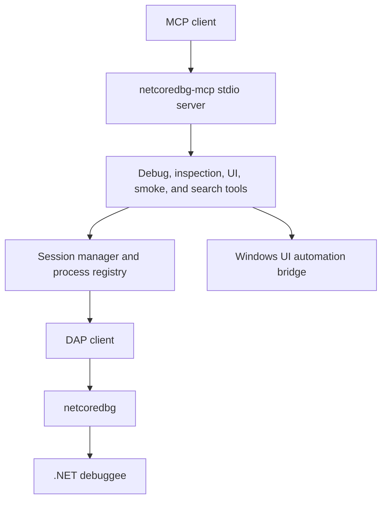

[English](README.md) | [Русский](README.ru.md)

# netcoredbg-mcp

[](https://pypi.org/project/netcoredbg-mcp/)
[](LICENSE)
[](#требования)
[](https://modelcontextprotocol.io/)
[](#ограничения)

Отлаживайте .NET-приложения в coding-агенте с поддержкой MCP, не выходя из его
рабочего процесса. `netcoredbg-mcp` объединяет `netcoredbg`, Debug Adapter
Protocol и Windows UI Automation: агент наблюдает за запущенным приложением,
намеренно останавливает его и изучает состояние, объясняющее поведение.

**Python 3.10+ · автоматизация Windows GUI · 135 инструментов · 8 промптов · 4 ресурса · v0.23.11**

## Возможности

| Задача | Что делает MCP-сервер |
|---|---|
| Разобраться в сбое | Запускает или подключается к .NET-процессу, ставит точки останова, читает потоки, стеки, области видимости, переменные, модули, вывод и исключения. |
| Управлять desktop-приложением | Находит элементы UI, читает дерево окон, кликает, вводит текст, выбирает элементы, работает с буфером обмена и собирает ограниченный evidence для WPF, WinForms и Avalonia. |
| Не выдавать preview за evidence | Делает preview для навигации или по явному запросу сохраняет lossless screenshot с метаданными целостности. |
| Проверить исправление | Выполняет ограниченный runtime-smoke plan с cleanup, output checkpoints, freshness checks и записанным evidence. |
| Искать по проекту | Находит C# symbols и references, читает source context или выполняет ограниченный запрос `search_source`. |

Опубликованный Python-пакет — точка входа для потребителя. Экспериментальный
.NET host и Native Scene Probe остаются только в исходниках и не добавляют
инструменты в этот wheel.

## Быстрый старт

Установите пакет, дайте мастеру настройки найти или подготовить отладчик, затем
зарегистрируйте публичный CLI в MCP-клиенте. Команда ниже предназначена для Claude Code:

```powershell
pipx install netcoredbg-mcp
netcoredbg-mcp --setup
claude mcp add --scope user netcoredbg -- netcoredbg-mcp --project-from-cwd
```

После изменения конфигурации перезапустите MCP-клиент. Из .NET workspace
попросите агента:

```text
Set a breakpoint in Program.cs, run the application, and show the local values when it stops.
```

`--project-from-cwd` ищет вверх от каталога запуска сервера solution или
.NET-проект. Используйте `--project`, когда сервер нужно закрепить за одним project root.

## Требования

- Python 3.10 или новее.
- `pipx` (рекомендуется) или `pip` для установки пакета.
- .NET SDK/runtime, подходящий для отлаживаемого приложения.
- `netcoredbg`. Мастер настройки умеет скачать или найти его и ищет кандидатов
  `dbgshim.dll`.
- MCP-клиент: Claude Code, Cursor, Cline, Roo Code, Windsurf, Continue или
  Claude Desktop.
- Windows — для GUI-автоматизации. Возможности отладки зависят от target runtime
  и возможностей `netcoredbg`.

## Установка и настройка

### Рекомендуемая установка

`pipx` изолирует command-line server от project environments:

```powershell
pipx install netcoredbg-mcp
netcoredbg-mcp --setup
netcoredbg-mcp --version
```

Мастер настройки проверяет .NET SDK, подготавливает или находит `netcoredbg`,
ищет кандидатов `dbgshim`, при необходимости собирает FlaUI bridge в Windows и
выводит фрагмент конфигурации клиента.

### Установка через менеджер пакетов

Используйте `pip`, если Python-пакетами управляет ваше окружение:

```powershell
pip install --upgrade netcoredbg-mcp
$env:NETCOREDBG_PATH = "C:\Tools\netcoredbg\netcoredbg.exe"
netcoredbg-mcp --project C:\Work\MyDotNetApp
```

После обновления выполните `netcoredbg-mcp --setup`, если изменился target runtime
или нужен новый managed debugger либо FlaUI bridge.

### Конфигурация клиента

Используйте `--project-from-cwd` только когда клиент запускает сервер из .NET
workspace или передаёт local MCP roots. Если нет явного `--project` и operator
environment pin, local MCP roots имеют приоритет. Когда нет ни operator pin,
ни пригодного local root, сервер ищет в startup directory marker solution,
project или Git и при отсутствии marker использует сам startup directory.

```json
{
  "mcpServers": {
    "netcoredbg": {
      "command": "netcoredbg-mcp",
      "args": ["--project-from-cwd"]
    }
  }
}
```

Если клиент запускает серверы из постоянного global location, закрепите target
project явно, а не полагайтесь на startup directory сервера:

```json
{
  "mcpServers": {
    "netcoredbg": {
      "command": "netcoredbg-mcp",
      "args": ["--project", "C:\\Work\\MyDotNetApp"]
    }
  }
}
```

Если отладчиком управляют вне setup flow, передайте его путь через environment
клиентского процесса, а не коммитьте его в репозиторий. Используйте тот же
режим выбора проекта, что подходит клиенту; этот пример для global location
закрепляет target явно:

```json
{
  "mcpServers": {
    "netcoredbg": {
      "command": "netcoredbg-mcp",
      "args": ["--project", "C:\\Work\\MyDotNetApp"],
      "env": {
        "NETCOREDBG_PATH": "C:\\Tools\\netcoredbg\\netcoredbg.exe"
      }
    }
  }
}
```

Не добавляйте в source control `.mcp.json`, `.netcoredbg-mcp.launch.json`,
учётные данные и локальные project paths.

### Запуск из source checkout

Установленный CLI — маршрут потребителя. Используйте source checkout только при
разработке самого сервера:

```powershell
uv sync --locked --project C:\Work\netcoredbg-mcp
cd C:\Work\MyDotNetApp
uv run --no-sync --project C:\Work\netcoredbg-mcp netcoredbg-mcp --project-from-cwd
```

`--no-sync` не даёт supervised-перезапуску сервера менять общее виртуальное
окружение. После изменения dependencies или lockfile синхронизируйте окружение явно.

## Первая отладочная сессия

`start_debug` запускает debug session и обычно возвращает результат, когда она
уже работает. `continue_execution`, `step_over`, `step_into` и `step_out` —
long-poll operations: они возвращают результат, когда debuggee останавливается,
завершается, принудительно прекращается или достигает timeout.

Для консольных программ используйте такую последовательность:

1. Добавьте breakpoint в интересующий вас участок кода.
2. Вызовите `start_debug` с программой и при необходимости с `pre_build=true`.
3. Дождитесь `state=stopped`.
4. Прочитайте `get_call_stack`, `get_scopes` и `get_variables`.
5. Вычисляйте выражения и переходите по шагам только в состоянии остановки.
6. Продолжите или завершите сессию.

Для WPF, Avalonia и WinForms используйте последовательность из раздела Desktop UI ниже.
Она запускает приложение без breakpoint, ждёт загрузки окна и только затем
добавляет точку останова: breakpoint до запуска может выглядеть как зависание окна.

Пример launch request:

```json
{
  "program": "bin/Debug/net8.0/MyApp.dll",
  "build_project": "MyApp.csproj",
  "pre_build": true,
  "stop_at_entry": false
}
```

Для .NET 6+ принимается собранный `.exe`, если рядом есть соответствующие `.dll`
и `.runtimeconfig.json`. Вызовите `inspect_debug_launch_compatibility(program)`,
когда нужно проверить выбранные runtime и shim без запуска процесса.

## Desktop UI и visual evidence

Пока GUI debuggee находится в состоянии `RUNNING`, наблюдайте за ним и управляйте
им через UI tools. Когда UI thread остановлен breakpoint или pause, доступны
stack и variables, но окно не будет нормально реагировать, пока вы не продолжите
выполнение.

```text
start_debug(...)
ui_get_window_tree() # Дождитесь загрузки окна приложения.
add_breakpoint(file="MainWindow.xaml.cs", line=42)
ui_find_element(automation_id="saveButton")
ui_click(automation_id="saveButton")
# Trigger the breakpoint, then inspect state after it reports STOPPED.
```

### Режимы screenshot

`ui_take_screenshot()` возвращает WebP navigation preview с
`evidence_grade=preview_only`. Он подходит для поиска следующего UI action, но
не для утверждений на основе lossless visual evidence.

Для артефакта с исходным raster и метаданными целостности включите режим явно:

```text
ui_take_screenshot(evidence=true)
```

Обычно этот режим возвращает `evidence_grade=lossless_raster`, сохраняет session-scoped
PrintWindow PNG и добавляет SHA-256 с geometry provenance. Для strict physical target
после вероятно чёрного PrintWindow raster допустима одна проверенная попытка `BitBlt`.
Такой ответ явно содержит `method=BitBlt`, `fallback=flash-focus`,
`fallback_reason=probable_black_printwindow` и
`evidence_grade=typed_bitblt_fallback`; в нём есть authority `GetWindowDC`, ROP,
PID target, стабильные geometry/DPI и подтверждение foreground activation/restoration.
Malformed, чёрный, нестабильный, несовпадающий или неполно подтверждённый fallback
ничего не сохраняет. Любой raw-derived crop требует `evidence=true`; preview-only
capture его не даёт.

Без ожидаемого target сохранённое evidence возвращает
`target_comparability.status=UNASSERTED`: это валидное lossless evidence, но
оно не доказывает соответствие размеру после resize. Для сравнения raw raster,
а не производного изображения, передайте все три параметра physical target:

```text
ui_take_screenshot(evidence=true, expected_hwnd=..., expected_physical_width=..., expected_physical_height=...)
```

Ответ возвращает `MATCHED` или `MISMATCH`; raw evidence сохраняется только
при статусе `MATCHED`. `max_width` меняет лишь preview и HD derivative, но не
это сравнение. `ui_resize_window()` возвращает request-versus-readback
`target_comparability.status`: `MATCHED`, `MISMATCH` или `UNAVAILABLE`;
`resized=true` подтверждает завершение request, а не соответствие запрошенному
размеру.

`ui_take_annotated_screenshot()` возвращает Set-of-Mark labels, после чего можно
вызвать `ui_click_annotated(element_id=...)`. Используйте `ui_bring_to_front()`,
только когда debuggee должен намеренно выйти из stealth mode.

## Карта инструментов

Опубликованный MCP catalog содержит 135 инструментов.

| Категория | Количество | Примеры |
|---|---:|---|
| Управление отладкой | 14 | `start_debug`, `attach_debug`, `continue_execution`, `pause_execution`, `terminate_debug` |
| Точки останова и исключения | 7 | File/function breakpoints и настройка exceptions |
| Инспекция и покрытие DAP | 15 | Stacks, scopes, variables, modules, disassembly, source locations |
| Трейспойнты | 6 | Добавление, чтение, очистка и cursor trace evidence |
| Снимки и анализ объектов | 5 | Создание, сравнение, список и summary captured state |
| Память и вывод | 6 | Memory, debugger output и build diagnostics |
| Runtime smoke | 21 | Hygiene, validation, execution, lifecycle и cleanup evidence |
| UI-автоматизация | 55 | Windows, elements, focus, input, screenshots, grids и monitors |
| Поиск по коду | 4 | Symbols, references, context и regex search |
| Edit-and-Continue | 1 | `apply_code_change` |
| Управление процессами | 1 | `cleanup_processes` |

Сервер также предоставляет четыре ресурса: `debug://state`,
`debug://breakpoints`, `debug://output` и `debug://threads`.

Восемь промптов задают готовые workflows: `debug`, `debug-gui`,
`debug-exception`, `debug-visual`, `debug-mistakes`, `investigate`,
`debug-scenario` и `dap-escape-hatch`.

### Граница code search

`find_code_symbol`, `find_code_references` и `get_source_context` выполняются
в процессе MCP-сервера. Для `search_source` enumeration project files и
синхронное ожидание остаются в этом процессе; чтение/сканирование каждого
source file и regex matching запускаются в отдельном ограниченном Python
subprocess с timeout по умолчанию пять секунд и максимумом 1 000 результатов.
Учитывается только корневой `.gitignore` проекта; вложенные ignore files не
читаются.

## Проверка через runtime smoke

Используйте runtime-smoke tools, когда нужна ограниченная и повторяемая проверка,
а не разовый диалог с отладчиком. Начните с `debug_hygiene_preflight`, создайте
output checkpoint, выполните validated plan и завершите запуск его cleanup-контрактом.
`verify_debug_freshness` подтверждает, что live process соответствует ожидаемым
workspace и artifacts.
Для длительной orchestration используйте lifecycle family:
`runtime_smoke_start`, `runtime_smoke_tail_events`, `runtime_smoke_get_result`
и `runtime_smoke_stop`. Consumer-mode release gate описан в
[production testing playbook](docs/PRODUCTION-TESTING-PLAYBOOK.md), а примеры в
[`docs/examples/`](docs/examples/) покрывают WPF workflow, WPF DataGrid drag/drop
и diagnostic-plan shapes.

### Происхождение ввода

Runtime-smoke plans умеют отличать ввод runner от ввода оператора или внешнего
источника. Для product verdict без ввода оператора задайте одновременно
`input_policy.no_global_input=true` и `run_confidence.no_operator=true`.
Первый параметр запрещает runner global input, второй требует от monitor
confidence evidence для action window.

Итоговый `run_confidence` бывает `CLEAN_PROVEN`, когда monitor подтверждает
отсутствие ввода оператора, `DIRTY_UNPROVEN`, когда он обнаруживает physical или
foreign input либо получает некорректные или неатрибутируемые данные о вводе, и
`UNPROVEN`, когда evidence monitor недоступен или неполон. Product verdict
допустим только при `CLEAN_PROVEN`.

Когда plan разрешает runner-controlled global input, например `ui.drag`, задайте
`input_policy.no_global_input=false` и оставьте `run_confidence.no_operator=true`,
если product verdict требует confidence evidence. Каждое покрытое input event
должно иметь provenance `runner_injected`. `foreign_injected` или `physical`
дают `DIRTY_UNPROVEN`; такой запуск нельзя считать product verdict.

## Справочник командной строки

| Команда или option | Назначение |
|---|---|
| `netcoredbg-mcp --version` | Печатает версию установленного пакета. |
| `netcoredbg-mcp --setup` | Подготавливает или находит необходимые компоненты отладчика и выводит фрагмент конфигурации клиента. |
| `netcoredbg-mcp setup --enc` | Устанавливает предсобранный Edit-and-Continue debugger с `ncdbhook.dll` для Windows x64; сборка из исходников включается отдельно. |
| `netcoredbg-mcp --project C:\Work\MyApp` | Закрепляет все debug operations за одним project root. |
| `netcoredbg-mcp --project-from-cwd` | Определяет project по startup directory и совместимым local MCP roots. |

`--project` и `--project-from-cwd` взаимоисключающие. `--enc` используйте
только с `setup` или `--setup`.

## Справочник конфигурации

| Переменная | Назначение |
|---|---|
| `NETCOREDBG_PATH` | Явный путь к `netcoredbg`. |
| `NETCOREDBG_PROJECT_ROOT` / `MCP_PROJECT_ROOT` | Авторитетный запасной project root. |
| `NETCOREDBG_ALLOWED_PATHS` | Дополнительные comma-separated path prefixes, доступные серверу. |
| `FLAUI_BRIDGE_PATH` | Явный путь к FlaUI bridge executable. |
| `NETCOREDBG_SCREENSHOT_MAX_WIDTH` / `NETCOREDBG_SCREENSHOT_QUALITY` | Размер inline preview и WebP quality. |
| `NETCOREDBG_SESSION_TIMEOUT` | Тайм-аут неактивности при multi-agent ownership. |
| `LOG_LEVEL` / `LOG_FILE` | Управление diagnostic logging сервера. |

Явный `--project` или project-root environment variable имеет приоритет над MCP
client roots. Сетевые/UNC client roots отклоняются.

## Архитектура


```mermaid
graph TB
    Client[MCP client] --> Server[netcoredbg-mcp stdio server]
    Server --> Tools[Debug, inspection, UI, smoke, and search tools]
    Tools --> Session[Session manager and process registry]
    Session --> DAP[DAP client]
    DAP --> Debugger[netcoredbg]
    Debugger --> App[.NET debuggee]
    Tools --> UI[Windows UI automation bridge]
```

Публичный console script запускает FastMCP stdio server. Его tool modules
используют общий session manager, который владеет состоянием отладчика,
проверенной областью проекта, очисткой процессов, выводом, снимками и trace evidence.
DAP client работает с `netcoredbg`; Windows UI operations используют FlaUI bridge,
когда он доступен, и pywinauto fallback для поддерживаемых операций.

## Устранение неполадок

### `netcoredbg` не найден

**Симптом:** startup или `start_debug` сообщает, что debugger не найден.

**Причина:** setup не установил managed debugger, а `NETCOREDBG_PATH` не задан.

**Решение:** выполните `netcoredbg-mcp --setup` или задайте полный путь к
`netcoredbg.exe` в environment MCP-клиента.

**Проверка:** снова выполните `netcoredbg-mcp --setup` и убедитесь, что в выводе
указан найденный или подготовленный debugger. Затем проверьте, что MCP-клиент
выводит инструменты сервера.

### Breakpoint остаётся неподтверждённым

**Симптом:** процесс не останавливается на запрошенной строке source code.

**Причина:** возможны stale build output, неверная target DLL, optimized Release
binaries или строка без executable IL.

**Решение:** используйте `pre_build=true`, отлаживайте Debug build, проверьте
соответствие source и assembly и прочитайте `list_breakpoints()` для
DAP-adjusted locations.

**Проверка:** ответ содержит `verified=true` или скорректированную строку.

### GUI выглядит зависшим

**Симптом:** окно WPF, WinForms или Avalonia перестаёт перерисовываться после
команды отладки.

**Причина:** его UI thread остановлен breakpoint или pause.

**Решение:** изучите состояние во время остановки, затем вызовите
`continue_execution()` и только после этого ожидайте UI input.

**Проверка:** `get_debug_state()` возвращает `running`, а свежие screenshots
обновляются.

### Отклонён путь к worktree

**Симптом:** запуск или build сообщает об ошибке path validation.

**Причина:** сервер определил другой project root либо worktree находится за
пределами разрешённых paths.

**Решение:** запустите сервер из этого worktree с `--project-from-cwd` или
добавьте его prefix в `NETCOREDBG_ALLOWED_PATHS`.

**Проверка:** `start_debug` принимает build и program paths внутри worktree.

## Ограничения

- GUI automation ориентирована на Windows.
- Поведение `netcoredbg` и DAP зависит от target runtime и поддержки debugger.
- Memory tools требуют валидных memory references, поддерживаемых адаптером.
- Native debugging, browser automation и не-.NET runtimes не поддерживаются.

## Участие в разработке

Правила development setup, ожидания по тестам, sensitive-data rules и требования
к pull request описаны в [CONTRIBUTING.md](CONTRIBUTING.md).

## Лицензия

MIT. См. [LICENSE](LICENSE).
