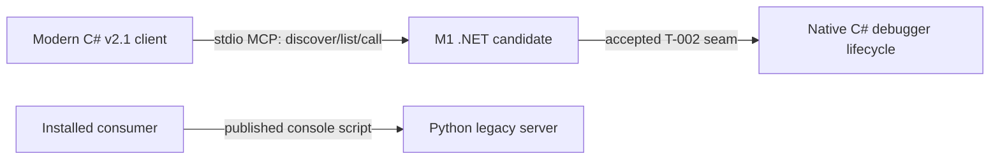

# Architecture — D2 Decision Record and Design for Milestone M1

## Design-depth decision

**Rung: D2.** M1 creates a durable protocol/front-door boundary consumed across
sessions and components. It remains a bounded milestone, not a D3 migration
program: it does not design full catalog migration, package publication, or
Python retirement.

## Context

The frozen audit records a Python-backed .NET strangler whose installed SDKs
cannot satisfy MCP 2026-07-28. The legacy host’s initialize/paired-session
assumptions cannot establish modern request context. Modern traffic instead
requires `server/discover`, request-local metadata, `tools/list`/`tools/call`,
standard result behavior, and explicit application handles.

M1 deliberately proves only discover → list → call → MRTR/native
start-state-stop. The native C# debugger/DAP lifecycle seam is not verified in
the frozen source; M1 therefore starts with a mandatory Explore/Design gate.

## ADR-001 — Adopt the official C# v2.1.0 SDK for a tools-based front door

**Status:** Accepted design decision; implementation waits on T-002 seam
receipt.

### Alternatives

| Alternative | Benefits | Rejected trade-off |
|---|---|---|
| A. Hand-write 2026 JSON-RPC/MCP in the existing host. | Could retain local host structure. | Reimplements standard discovery, metadata, cache/result decoration, MRTR, and version behavior despite official support. |
| B. Upgrade Python’s published public path to Python MCP v2.0.0. | Uses an official current SDK on the existing executable. | Changes the retained consumer path and does not prove the requested .NET strangler. |
| C. Add an additive C# `ModelContextProtocol` v2.1.0 candidate. | Official support for discover, tools, metadata, cache, result, version, and MRTR semantics; reversible boundary. | Requires a new C# dependency and an accepted native lifecycle seam. |

### Decision

Choose C. The candidate implements only MCP methods `server/discover`,
`tools/list`, and `tools/call`; debugger actions are cataloged tool names, not
methods. The server MUST implement discovery, but it retains no first-request
ordering state: any valid supported modern RPC may be a fresh process's first
request because its own `_meta` carries context. M1 deliberately sends discover
first only as a compatibility/proof probe and separately tests list/call first.
Discovery declares tools; discovery/list use official cacheable result behavior.
Every complete tool call uses official `CallToolResult` with `resultType:
complete`, content, structured content, and applicable `isError`.

Runtime validates application arguments before MRTR or native action. Empty
program/extra fields produce complete `invalid_tool_arguments` with
`isError: true`; missing/short/malformed handle remains uniform not-found. No
validation failure launches, reads, or stops native state.

`start_debug` is M1’s mandatory MRTR demonstration. A valid supplied program
may complete. A valid no-program call with form elicitation receives official
`InputRequiredResult` and one `elicitation/create` request. M1 emits no
`requestState`; a new-id retry repeats arguments and uses `inputResponses`.
Valid no-program without capability produces deterministic complete application
error. The server never initiates MCP requests.

### Consequences and tags

| Decision | Tag | Consequence |
|---|---|---|
| Official C# SDK, not bespoke framing | Compatibility: forward | Standard 2026 behavior is typed and testable through the SDK. |
| Optional client discovery | Compatibility: forward | Server implements discover while list/call remain request-local first-call options. |
| Runtime validation before native work | Safety: bounded | Advertised input schemas have load-bearing no-side-effect enforcement. |
| `tools/list` / `tools/call` catalog contract | Compatibility: precise | Tool names and input schemas are discoverable; no false method routing. |
| MRTR without `requestState` in M1 | Security: bounded | Avoids an unnecessary integrity/replay surface; retry reconstructs input from repeated arguments plus `inputResponses`. |

## ADR-002 — Treat debugSessionId as a live local capability

**Status:** Accepted design decision; concrete native handle waits on T-002.

A successful `tools/call(start_debug)` mints an opaque, high-entropy,
process-local `debugSessionId` in its application structured content. Calls to
`get_debug_state` and `stop_debug` put it in `params.arguments`. The token is a
capability in one trusted local domain, not authentication. It is never listed,
connection-bound, inferred as current, persisted, or logged.

The registry lifetime is the live native debugger plus host process, not an
elapsed TTL. Creator disconnect does not stop a live debugger. Independent and
interleaved requests may use the capability. A process restart discards every
entry. Random/malformed, stopped/closed, native-unavailable, and prior-process
tokens are externally identical: a complete tool application error
`DEBUG_SESSION_NOT_FOUND`.

### Atomic stop rule

`stop_debug` atomically resolves **and removes** the token. One winning caller
owns native stop and returns stop success. A concurrent/later caller cannot
resolve it, returns `DEBUG_SESSION_NOT_FOUND`, and must not issue another native
stop. This is an at-most-once stop rule; it is not a claim that repeated stop
responses are idempotent successes.

## ADR-003 — Add a strangler candidate without public release cutover

**Status:** Accepted design decision.

.NET owns only the three M1 MCP methods and tool catalog described in ADR-001.
Python owns `netcoredbg-mcp`, its dependency constraint, and every non-M1 route.
There is no dual owner for a public tool name, and M1 does not translate the
legacy relay into asserted modern behavior.



### Data flow

```mermaid
sequenceDiagram
    participant C as Modern Client
    participant F as M1 .NET Front Door
    participant R as Request Context
    participant S as Capability Registry
    participant D as Accepted Native Seam

    Note over C,F: Any valid RPC may be first; this probe deliberately sends discover first
    C->>F: server/discover + request _meta
    F->>R: validate current metadata
    F-->>C: cacheable discover; tools capability
    C->>F: tools/list + request _meta
    F-->>C: cacheable ordered three-tool catalog
    C->>F: tools/call(start_debug, valid program) + request _meta
    F->>F: validate arguments before native action
    F->>D: native start
    D-->>S: mint and store token
    F-->>C: complete CallToolResult structured content
    C->>F: tools/call(get_debug_state, debugSessionId)
    F->>F: validate arguments then resolve explicit token
    F->>S: resolve explicit token
    S->>D: read state
    F-->>C: complete CallToolResult
    C->>F: tools/call(stop_debug, debugSessionId)
    F->>F: validate arguments then atomically remove token
    F->>S: atomically remove token
    S->>D: native stop once
    F-->>C: complete CallToolResult
```

### Deployment and executable rollback

M1 is an internal candidate, not package publication. The rollback rehearsal is
mechanical: stop selecting the candidate, confirm no persisted state/package/
console-script/client configuration changed, then rerun the established Python
consumer journey. `PRODUCT_WORKS` on that journey proves rollback. Any M1 task
that proposes modifying `pyproject.toml`, `uv.lock`, the public entrypoint, or
customer configuration returns to architecture because that is release-prep
scope.

## Verified anchors and native-seam limit

| Responsibility | Verified anchor | M1 rule |
|---|---|---|
| Legacy host entry/composition | `host/NetCoreDbg.Mcp.Host/Program.cs`, `RelayComposition.cs`, `NetCoreDbg.Mcp.Host.csproj` | Existing v1.4.1 relay is legacy evidence, not the native tool seam. |
| Host test convention | `host/NetCoreDbg.Mcp.Host.Tests/ProductionCompositionTests.cs`, `FakePythonServer.cs`, `DuplexChannel.cs` | Use as test-layout evidence only. |
| Existing Python lifecycle | `src/netcoredbg_mcp/tools/debug.py` | Python-only behavior evidence; never call it a native anchor. |
| Legacy parity | `tests/test_host_proxy.py`, `tests/critical/test_host_proxy_critical.py`, `tests/test_mcp_compliance.py` | Retain unchanged as a separate parity gate. |
| Published package | `pyproject.toml`, `uv.lock` | Do not modify in M1. |

T-002 must identify and prove a bounded native C# lifecycle seam from
repository/vendored DAP/process sources. If none can safely support start,
state, and stop, it returns a written blocker to architecture. No Code task is
claimable before an accepted T-002 receipt cites the exact seam.

## Plan-challenger correction record (draft; awaiting fresh independent GO)

The first independent Challenge-FULL verdict was **REVISE**. This revised
draft applied these correction classes:

| Correction class | Applied disposition |
|---|---|
| Tool wire contract | Replaced invented start/state/stop MCP methods with `tools/list` and `tools/call` tool names. |
| MRTR | Added mandatory `InputRequiredResult`/new-id retry path with no `requestState`. |
| Exact version fields | Standardized error data to `requested` and `supported`. |
| Cache/result contract | Limited cache metadata to discover/list; specified complete `CallToolResult` for tools. |
| Schema validity | Replaced overlapping wire/application union with kind-discriminated application payloads. |
| Native readiness | Replaced Python-as-native assumption with T-002 Explore/Design blocker. |
| Token lifecycle/race | Removed expiry; specified live-debugger/process bound and atomic stop winner/loser behavior. |
| Delivery semantics | Renamed Release 1 to internal M1, set `release_intent: none`, and excluded public publication. |
| Challenge/readiness | Recorded the first independent REVISE and requires a fresh independent Challenge-FULL GO before implementation readiness. |
| Task graph | Replaced ambiguous edges with a single `Blocked by` direction matching Mermaid. |
| Client request ordering | Corrected discovery to server-mandatory/client-optional and added fresh-process list/call-first proof. |
| Runtime validation | Added exclusive invalid-arguments payload and no-native-side-effect contract. |
| Command materialization | Made T-001/T-002 the owners of exact quickstart commands and T-006/T-007 their readiness gate. |

The additive strangler premise and SDK choice remain sound. This package is
`READY_FOR_INDEPENDENT_RECHECK`, not implementation-ready, until a fresh
independent Challenge-FULL verdict is GO and the native-seam exploration result
is accepted.