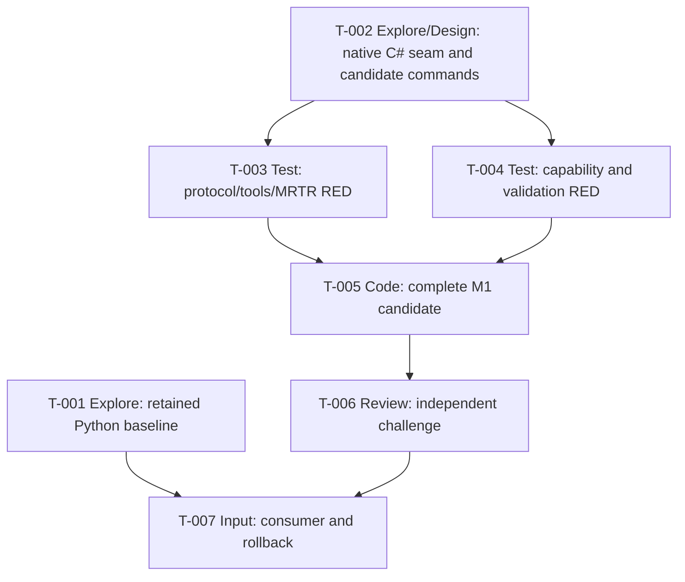

# Tasks — Internal Milestone M1 Modern Stateless .NET Strangler

## Operating contract

M1 is an internal candidate, not a public release. **Blocked by** is the sole
prerequisite direction: every Mermaid edge is blocker → blocked task and exactly
matches the corresponding field. Native Code cannot start until T-002 proves a
bounded C# seam and both RED test tasks pass.

## T-001 — Characterize retained Python parity, rollback, and commands

- **Type:** Explore
- **Requirements:** FR-012, FR-013, NFR-004
- **Blocked by:** None
- **Scope:** Establish the unchanged installed Python consumer journey,
  published `netcoredbg-mcp` script, fixture/program, observable denominator,
  and rollback replay. Before T-007, materialize the retained-Python and
  rollback command blocks in `quickstart.md` from this receipt; do not guess
  commands in advance.
- **Acceptance checkpoint:** Receipt records exact setup/install/invocation
  command(s), fixture/program, expected denominator, rollback replay command,
  required environment/cleanup, and no-change boundaries. It updates the named
  quickstart blocks and makes no modern conformance claim.
- **Granularity check:** Independent parity/rollback baseline, without hidden
  protocol or code work.

## T-002 — Prove/reject native C# seam and materialize candidate commands

- **Type:** Explore/Design
- **Requirements:** FR-011, NFR-004
- **Blocked by:** None
- **Scope:** Inspect repository/vendored C# DAP/process sources for an exact
  bounded C# start/state/stop seam. `src/netcoredbg_mcp/tools/debug.py` is only
  comparative Python evidence. Select the candidate project/invocation boundary
  only if the seam is proven, then materialize the candidate command block in
  `quickstart.md`; no command is guessed before this receipt.
- **Acceptance checkpoint:** An accepted receipt names exact source anchors,
  observable lifecycle contract, candidate project/invocation boundary, exact
  build command, candidate launch command, current C# v2.1.0 client/fixture
  command, required environment, cleanup, and quickstart update. If it cannot
  provide all fields or no bounded seam exists, it returns to architecture and
  T-003–T-005 remain unclaimable.
- **Granularity check:** Resolves the missing native and command-materialization
  premise before tests/code claim a candidate exists.

## T-003 — Specify modern first-request, tools, MRTR, and validation RED

- **Type:** Test
- **Requirements:** FR-001 through FR-007, FR-014, NFR-001
- **Blocked by:** T-002
- **Scope:** Add real C# v2.1.0 SDK/process RED coverage that proves server
  discovery implementation but no discovery prerequisite: fresh candidate
  processes accept discover, valid list, and valid call as first requests.
  Cover current `_meta`, exact `-32022` data, tools capability, cacheable
  discover/list fields, ordered catalog/schemas, complete result envelopes,
  MRTR/new-id/no-requestState/no-server-request behavior, and stdout purity.
  Exercise empty `program`, additional fields for all tools, missing/short/
  malformed handles, exact invalid-arguments versus not-found public payloads,
  `isError: true`, and zero native launch/state/stop side effects.
- **Acceptance checkpoint:** All assertions are RED before production code and
  become GREEN unchanged after T-005. Tests use observable fixture counters or
  equivalent seam evidence to prove prohibited native side effects are zero.
- **Granularity check:** One wire/catalog/MRTR/runtime-validation contract;
  longer-lived capability races remain T-004.

## T-004 — Specify capability lifecycle, validation, and atomic-stop RED

- **Type:** Test
- **Requirements:** FR-008, FR-009, FR-010, FR-014, NFR-003
- **Blocked by:** T-002
- **Scope:** Add RED tests for explicit token issuance, no current/list/
  connection ownership, independent/interleaved reuse, creator disconnect,
  debugger/process lifetime, four uniform unusable-token classes, and atomic
  concurrent stop. Also reassert missing/short/malformed handles as not-found,
  extra state/stop fields as invalid arguments, exact public classes, and zero
  native state/stop actions on invalid input.
- **Acceptance checkpoint:** Tests fail before production code. They prove one
  stop winner/success, all losers not-found, native stop once, no expiry case,
  and no repeated-stop success claim.
- **Granularity check:** Capability/race behavior remains distinct from T-003's
  protocol/MRTR contract while jointly covering validation where it touches
  native state/stop safety.

## T-005 — Implement complete M1 candidate from accepted seam

- **Type:** Code
- **Requirements:** FR-001 through FR-010, FR-014, NFR-001, NFR-003
- **Blocked by:** T-003, T-004
- **Scope:** From T-002's accepted receipt, implement only discover/list/call
  and three cataloged debugger tools. Runtime-validate inputs before any native
  side effect; return exact invalid-arguments or uniform not-found application
  result class, with applicable `isError`. Implement cache only for discover/
  list, complete tool results, MRTR retry without requestState, explicit
  process-local capability, and atomic stop. No stubs/fake native handlers,
  Python route proxy, connection binding, durable state, package change, or
  fourth tool.
- **Acceptance checkpoint:** T-003/T-004 become GREEN against a real
  process/client exchange, including zero prohibited native side effects. The
  accepted T-002 receipt and its candidate command-block update are present.
- **Granularity check:** Smallest end-to-end M1 native slice; adjacent migration
  remains excluded.

## T-006 — Independently challenge candidate and quickstart readiness

- **Type:** Review
- **Requirements:** FR-001 through FR-012, FR-014, NFR-001, NFR-003
- **Blocked by:** T-005
- **Scope:** Review protocol names, absence of first-request prerequisite,
  cache placement, version fields, MRTR/new-id/no-requestState, server-request
  absence, runtime advertised-schema parity, validation/no-side-effect proof,
  token/race behavior, native seam fidelity, channel purity, scope, and no
  package/public-entrypoint change. Verify the T-002 candidate command block is
  present/current in quickstart.
- **Acceptance checkpoint:** Written independent verdict names requirement
  evidence; it rejects a missing/stale T-002 candidate block or schema/runtime
  divergence. Blocking findings return to T-005.
- **Granularity check:** Independent quality and journey-readiness gate; no
  production edit authority.

## T-007 — Capture consumer evidence and rollback rehearsal

- **Type:** Input
- **Requirements:** FR-012, FR-013, NFR-002, NFR-004
- **Blocked by:** T-001, T-006
- **Scope:** Run the materialized `quickstart.md` candidate, installed-Python,
  and candidate-removal rollback commands. Refuse to run or accept evidence if
  either T-001/T-002 command block is absent or stale. Record M1 merge decision;
  do not publish a package.
- **Acceptance checkpoint:** Two separate `PRODUCT_WORKS` receipts and rollback
  replay prove Python still works without data/package/entrypoint/configuration
  reversal; exact executed commands/fixtures/denominators are retained.
- **Granularity check:** Customer-facing retention and reversible selection,
  without adding publication work.

## M1 closure rule

M1 is merge-ready only after T-007. Publication, entrypoint cutover, or further
tool-family work requires a separately authorized later slice.