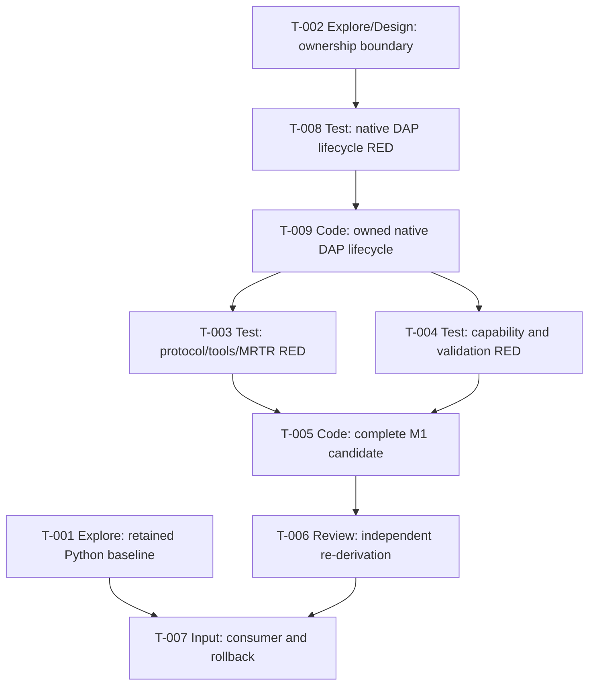

# Tasks — Internal Milestone M1 Modern Stateless .NET Strangler

## Operating contract

M1 is an internal candidate, not a public release. **Blocked by** is the sole
prerequisite direction: every Mermaid edge is blocker → blocked task and
exactly matches that task's field. The repository has no native C# DAP
lifecycle component. T-002 chooses the authorized ownership boundary; T-008
creates and runs the lifecycle RED harness; T-009 creates the production component.
Independent T-009 acceptance hardens incomplete discriminators, proves the corrected
cases RED against frozen production, then the same final 11-case T-008 harness goes
GREEN with a lifecycle-only receipt. T-003/T-004 then create modern MCP RED suites;
T-005 implements the front door and mechanically materializes the candidate command receipt. No task claims an
existing seam or candidate command before its owning work makes it real.

## T-001 — Characterize retained Python parity, rollback, and commands

- **Type:** Explore
- **Requirements:** FR-012, FR-013, NFR-004
- **Blocked by:** None
- **Scope:** Establish the unchanged installed Python consumer journey,
  published `netcoredbg-mcp` script, fixture/program, observable denominator,
  and rollback replay. Before T-007, materialize only retained-Python and
  rollback quickstart blocks from this receipt.
- **Acceptance checkpoint:** Receipt records exact setup/install/invocation,
  fixture/program, expected denominator, rollback replay, environment/cleanup,
  and no-change boundaries. It makes no modern candidate claim.
- **Granularity check:** Independent parity/rollback baseline without protocol
  or candidate code work.

## T-002 — Establish owned lifecycle boundary

- **Type:** Explore/Design
- **Requirements:** FR-011, NFR-005
- **Blocked by:** None
- **Scope:** Record the authorized proposed ownership: new internal executable
  `host/NetCoreDbg.Mcp.Stateless/`, namespace `NetCoreDbg.Mcp.Stateless`, narrow
  `DebugAdapter/NetCoreDbgSession.cs` and `DapSessionState.cs`, and sibling
  `host/NetCoreDbg.Mcp.Stateless.Tests/DebugAdapter/NetCoreDbgSessionTests.cs`.
  Bind the BCL-only lifecycle input/output, DAP facts, and exclusions. It does
  not inspect for, claim, or adapt an existing seam; it does not invent or own
  executable commands.
- **Acceptance checkpoint:** The boundary names `netcoredbg --interpreter=vscode`,
  UTF-8 `Content-Length` byte framing, `request_seq` correlation, response-gated
  initialize/initialized/launch/configurationDone, event-backed coarse state,
  and idempotent terminate/disconnect/process-tree cleanup.
- **Granularity check:** Resolves ownership without creating source or asserting
  executable commands.

## T-008 — Specify owned native DAP lifecycle RED

- **Type:** Test
- **Requirements:** FR-011, NFR-005
- **Blocked by:** T-002
- **Scope:** Create `host/NetCoreDbg.Mcp.Stateless.Tests/`, its controlled executable
  DAP adapter fixture project, and a complete reflection/process contract driver; add
  its RED cases at `DebugAdapter/NetCoreDbgSessionTests.cs`. The driver must launch the
  fixture and assert future internal assembly/type behavior without a production project,
  reference, or compile-time type dependency. Cases prove process ownership for
  `netcoredbg --interpreter=vscode`; ASCII `Content-Length` headers with UTF-8 byte-length
  JSON bodies; `seq` to `request_seq` correlation; a `capabilities` event before initialize
  response while launch remains response-gated; initialize/initialized/launch and
  capability-gated configurationDone sequencing; event-backed stopped, continued, exited,
  terminated state; and concurrent StopAsync/DisposeAsync
  terminate→disconnect→bounded-exit→process-tree-kill cleanup.
- **Acceptance checkpoint:** `dotnet test
  host/NetCoreDbg.Mcp.Stateless.Tests/NetCoreDbg.Mcp.Stateless.Tests.csproj` builds, runs,
  and collects every named case before production exists. Each absent future
  assembly/type behavior is a runtime contract assertion failure, never missing
  csproj/reference/type compilation; no fake native handler, unbounded wait, generic DAP
  client, or external DAP/JSON-RPC dependency is introduced.
- **Granularity check:** Native lifecycle contract only; no MCP front-door
  behavior, catalog, or capability registry.

## T-009 — Implement owned native DAP lifecycle component

- **Type:** Code
- **Requirements:** FR-011, NFR-005
- **Blocked by:** T-008
- **Scope:** Create only the new internal executable project
  `host/NetCoreDbg.Mcp.Stateless/` selected by T-002 and its real internal
  `NetCoreDbgSession`. It owns ProcessStartInfo, redirected stdio, Content-Length frames,
  outbound sequence/pending response correlation, coarse event-backed state, and one
  idempotent cleanup task. Supply only the production assembly discovery/reference wiring
  required for T-008's test source/assertions; do not create or alter its test
  project, executable adapter fixture, or contract driver. It uses BCL and
  `System.Text.Json`; it neither references nor modifies `NetCoreDbg.Mcp.Host`.
- **Acceptance checkpoint:** The lifecycle project builds. Independent T-009
  acceptance hardens incomplete discriminators, proves the corrected cases RED against
  frozen production, then the same final T-008-owned 11-case suite goes GREEN through
  its controlled adapter fixture; readiness and cleanup prove one owner,
  capability-gated terminate, disconnect, bounded exit, and process-tree-kill fallback.
- **Granularity check:** Smallest owned DAP lifecycle slice; no MCP front door,
  tool, capability registry, public entrypoint, server/discover, C# SDK/client,
  candidate launch command, or generic DAP framework.

## T-003 — Specify modern first-request, tools, MRTR, and validation RED

- **Type:** Test
- **Requirements:** FR-001 through FR-007, FR-014, NFR-001
- **Blocked by:** T-009
- **Scope:** Add C# v2.1.0
  SDK/process RED coverage: fresh candidate processes accept discover, valid
  list, and valid call as first requests; current `_meta`, exact `-32022` data,
  tools capability, cacheable discover/list, ordered catalog/schemas, complete
  envelopes, MRTR/new-id/no-requestState/no-server-request, stdout purity,
  invalid arguments, uniform handles, and zero prohibited native actions.
- **Acceptance checkpoint:** Assertions are RED before MCP production code and
  become GREEN unchanged after T-005, with fixture/seam evidence for zero
  prohibited native side effects.
- **Granularity check:** Wire/catalog/MRTR/validation only; capability races
  remain T-004.

## T-004 — Specify capability lifecycle, validation, and atomic-stop RED

- **Type:** Test
- **Requirements:** FR-008, FR-009, FR-010, FR-014, NFR-003
- **Blocked by:** T-009
- **Scope:** Add RED tests for
  explicit token issuance; no current/list/creator/client/connection ownership;
  independent/interleaved requests while one candidate process remains live;
  stdio client-close candidate shutdown as a separate transport boundary,
  observed only through the official public `McpClient.Completion` result as
  `StdioClientCompletionDetails` (`ProcessId` remains optional); uniform
  unusable tokens; concurrent atomic stop; validation classes; and zero
  invalid-input native actions. The suite MUST NOT use SDK-internal reflection,
  a bespoke MCP process launcher, reconnect, token transfer, or debugger-
  capability survival after the stdio client closes.
- **Acceptance checkpoint:** Tests prove one stop winner/success, all losers
  not-found, one native session cleanup, no elapsed-expiry case, and no
  repeated-stop success claim before T-005 implements MCP behavior. A separate
  bounded transport assertion disposes the official client, awaits its public
  `Completion`, requires stdio completion details, and proves client close ends
  the candidate process without any post-close capability assertion.
- **Granularity check:** Capability/race behavior remains distinct from T-003.

## T-005 — Implement complete M1 candidate from the owned seam

- **Type:** Code
- **Requirements:** FR-001 through FR-010, FR-014, NFR-001, NFR-003, NFR-004
- **Blocked by:** T-003, T-004
- **Scope:** Implement only discover/list/call and three cataloged debugger
  tools in the completed candidate. Validate before session use; implement cache
  only for discover/list, complete tool results, MRTR retry without
  requestState, explicit process-local capability, and atomic stop. Use the
  completed `NetCoreDbgSession`; do not recreate DAP lifecycle work. After the
  modern RED suites become GREEN, mechanically verify and materialize the actual
  candidate launch, official C# v2.1.0 client, environment, cleanup, and
  seven-step modern `PRODUCT_WORKS` receipt.
- **Acceptance checkpoint:** T-003/T-004 become GREEN in a real process/client
  exchange, including zero prohibited native side effects; the T-005 command
  block records the mechanically verified candidate launch/C# v2.1.0 client,
  environment, cleanup, and seven-step modern `PRODUCT_WORKS` receipt.
- **Granularity check:** Smallest end-to-end MCP slice; no seam creation, legacy
  relay, package/entrypoint change, or adjacent migration.

## T-006 — Independently re-derive candidate, ownership, and quickstart readiness

- **Type:** Review
- **Requirements:** FR-001 through FR-014, NFR-001 through NFR-005
- **Blocked by:** T-005
- **Scope:** The sole independent checker re-derives the D1 boundary and every
  Mermaid/`Blocked by` relation, then reviews MCP contract, lifecycle fidelity,
  no-side-effect proof, token/race behavior, channel purity, no external DAP/
  JSON-RPC dependency, no public or legacy-relay cutover, and T-005's final
  modern command receipt.
- **Acceptance checkpoint:** Written verdict names requirement evidence and
  rejects stale or absent final receipts, a generic DAP component, schema/runtime
  divergence, or any edge/field mismatch. Findings return to their owning task.
- **Granularity check:** Sole independent quality gate; no production edit
  authority and no second checker.

## T-007 — Capture consumer evidence and rollback rehearsal

- **Type:** Input
- **Requirements:** FR-012, FR-013, NFR-002, NFR-004
- **Blocked by:** T-001, T-006
- **Scope:** Run materialized candidate, installed-Python, and candidate-removal
  rollback commands. Refuse evidence if T-001 retained blocks or T-005's final
  modern candidate block is absent or stale. Record M1 merge decision; do not publish.
- **Acceptance checkpoint:** Separate `PRODUCT_WORKS` receipts and rollback
  replay prove Python works without data/package/entrypoint/configuration
  reversal; exact commands/fixtures/denominators are retained.
- **Granularity check:** Customer-facing retention and reversible selection,
  without publication work.

## M1 closure rule

M1 is merge-ready only after T-007. Publication, entrypoint cutover, or further
tool-family work requires a separately authorized later slice.
