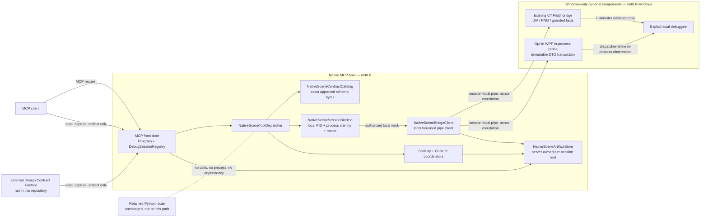
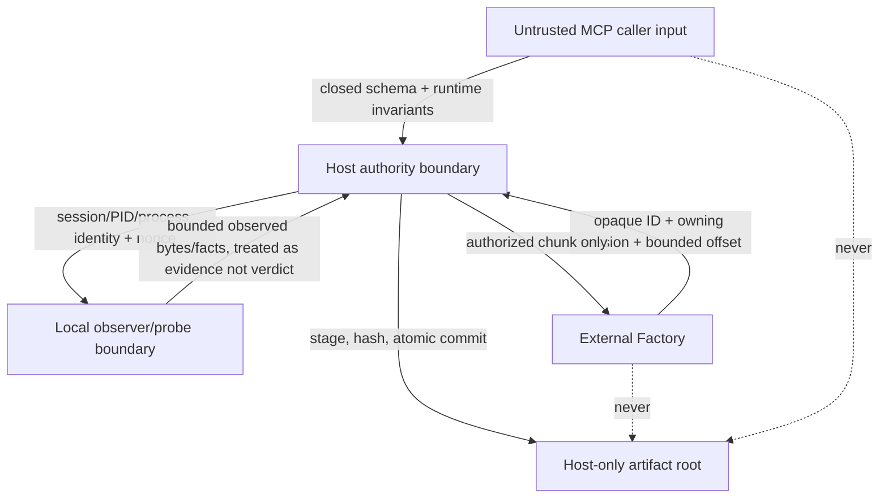
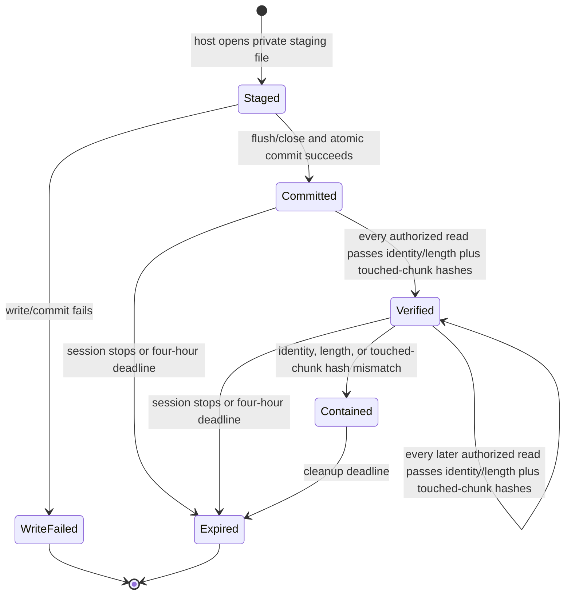
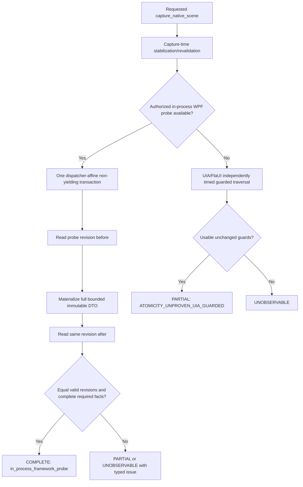

# Architecture — Native Scene Probe

**Status**: Phase 1 design only. T001 operator approval authorizes only M0-G0 T002–T007; no component described here exists because of this document, and no M0 implementation is authorized until T007 has produced GREEN contract/runtime-validator and corpus-integrity evidence. T007 does not claim observer, artifact, stability, or atomicity behavior; T032/T034 own the full behavioral C001–C024 execution after M0/M1 implementation.

## 1. Architectural intent

The native scene probe is an additive C#/.NET evidence boundary for one explicit local debug session. It produces bounded, attributable observation facts, compact manifests, opaque artifact capabilities, and typed uncertainty. It does not determine design conformance.

The design has five deliberately separate authorities:

1. **Native host** — validates MCP input, owns `debugSessionId` lookup and positive candidate binding, starts/stops local observer/probe work, creates server-owned artifacts, and services bounded artifact reads.
2. **Windows C# bridge** — supplies UIA/FlaUI physical/accessibility/raster facts only. It is not an atomic-scene or DTCG authority.
3. **Opt-in WPF in-process probe** — supplies M1 framework facts and is the only authority allowed to create a `COMPLETE` atomic-scene record, under a single dispatcher-affine non-yielding transaction.
4. **Artifact store** — holds committed immutable evidence under host-only roots. It accepts no caller path and exposes no root.
5. **Design Contract Factory** — external future consumer of retrieved facts. It owns DTCG Format/Resolver semantics, comparison, diagnosis, and repair planning, but has no debug-session, target-discovery, or filesystem authority.

The new route never calls, starts, imports, or otherwise depends on the retained Python route. The retained route is a separate rollback/parity reference and remains unchanged.

## 2. Deployment and component map



| Component | Runtime location | Inputs | Output/ownership | Dependencies and limits |
|---|---|---|---|---|
| `Program` / `DebugSessionRegistry` | Cross-platform host | MCP stdio request, existing debug-session handle | Existing lifecycle; future additive native-scene dispatch; shutdown cleanup | `net8.0`; preserves `start_debug`, `get_debug_state`, and `stop_debug` contracts. |
| `NativeSceneToolDispatcher` | Cross-platform host | One of six closed request roots | Small structured result/error envelope | Structural validation occurs before side effects; no DTCG fields are produced. |
| `NativeSceneContractCatalog` | Cross-platform host | Exact approved schema/corpus bytes, version input | Supported version/capability classification | Future runtime embeds/copies the exact approved feature-contract bytes; it defines no duplicate schema. |
| `NativeSceneSessionBinding` | Cross-platform host | `debugSessionId`, expected candidate identity, local component handshake | Positive local PID/process identity binding and capability authorization | No target scan, no remote target, no connection-global target. |
| `NativeSceneBridgeClient` | Cross-platform host | Authorized capture command | Bounded local C# component lifecycle, correlation, cancellation result | BCL pipes/process/semaphore; exactly one in-flight request on one synchronous bridge connection. |
| Existing FlaUI bridge | Windows process | Local, nonce-authorized command | Lossless PNG, window/UIA geometry/accessibility, guarded facts | `net8.0-windows`; existing FlaUI/System.Drawing only; cannot emit atomic `COMPLETE`. |
| `DesignProbe.Wpf` | Explicit debuggee process | Local authorized probe request | Framework-specific facts and immutable snapshot DTO | Test/Gallery-only opt-in; no production listener; cannot compare DTCG contracts. |
| `NativeSceneArtifactStore` | Cross-platform host filesystem | Validated bounded evidence stream/DTO | Immutable manifest descriptor and capability-bound chunks | BCL files/crypto/time; host-only root; no path is public input/output. |
| Design Contract Factory | External consumer | Compact manifest and bounded artifact chunks | Comparison, verdict, diagnosis, repair plan outside this repository | Cannot access host roots or infer a capture from provenance labels. |

## 3. Interface contract and compatibility

### Public primitives

| Milestone | Primitive | Inputs beyond MCP envelope | Successful result | Compatibility |
|---|---|---|---|---|
| M0 | `get_ui_probe_capabilities` | None | Supported protocol/schema versions, an exact six-entry fixed name/milestone primitive declaration, explicit settle-condition states, structurally fixed `sampleCount` limits 2/16, namespaces, candidate provenance | **ADDITIVE**; supported protocol/schema arrays are non-empty, unique, and contain their active `/1` values; must not enumerate artifact IDs. |
| M0 | `capture_visual_evidence` | Explicit `sceneRequest`, bounded window/element scope | Compact manifest with a separately retrievable lossless PNG descriptor and optional `preview_only` descriptor | **ADDITIVE**; no PNG bytes in result. The manifest carries a non-null immutable scope equal at runtime to the request scope. A `COMPLETE` result requires at least one descriptor with `mediaType: image/png` and `evidenceGrade: lossless_visual`; `PARTIAL`/`UNOBSERVABLE` may contain zero artifacts only when evidence could not be committed. |
| M0 | `read_capture_artifact` | Opaque `artifactId`, zero-based `offset`, bounded `maxBytes` | Padded standard-base64 chunk, byte count, terminal flag, manifest-bound metadata | **ADDITIVE**; each JSON-scene chunk declares at most 16,777,216 bytes and raster chunks at most 67,108,864; every authorized read verifies identity/length and each touched internal 65,536-byte chunk hash before any byte release; no paths, roots, or full artifact. |
| M1 | `wait_for_ui_stable` | Explicit `sceneRequest` | Bounded historical stability receipt with `revalidatedByCapture: false` | **ADDITIVE**; receipt is historical evidence only. |
| M1 | `capture_element_snapshot` | Explicit `sceneRequest`, unique element selector | Compact manifest with one element's facts and `not_applicable` scene atomicity | **ADDITIVE**; manifest `evidenceScope` is `null`. `COMPLETE` requires an `application/vnd.netcoredbg.native-scene+json`/`observed_facts` descriptor for a one-node `element_snapshot` artifact; `PARTIAL` may retain qualified facts; `UNOBSERVABLE` has no artifacts. |
| M1 | `capture_native_scene` | Explicit `sceneRequest` | Compact manifest and separately retrievable bounded scene artifact | **ADDITIVE**; manifest `evidenceScope` is `null`; every evidence-returning/committing branch is capture-revalidated; atomic status remains limited by the authority rules below. A `COMPLETE` result requires at least one descriptor with `mediaType: application/vnd.netcoredbg.native-scene+json` and `evidenceGrade: observed_facts`; `PARTIAL`/`UNOBSERVABLE` may contain zero artifacts only when evidence could not be committed. |

Every request includes `debugSessionId`, `protocolVersion`, and `schemaVersion`. Every root and `sceneRequest` is closed. A malformed request, malformed version syntax, invalid type, or exceeded limit receives `INVALID_TOOL_ARGUMENTS` before lookup. A syntactically valid known version absent from the negotiated declaration receives `UNSUPPORTED_PROTOCOL`. A valid request for an unavailable declared primitive or condition receives `UNSUPPORTED_CAPABILITY`. `toolError` is six one-of tool/code branches; only the per-primitive outcome mapping in the data model is legal, while `ARTIFACT_NOT_FOUND` retains its separate fixed reader envelope.

The `primitives` capability member remains an array but is exactly six entries: Draft-7 `minItems: 6` and `maxItems: 6`, plus one `allOf`/`contains` rule for each approved name, require all six. Each `primitiveCapability` is structurally constrained by `oneOf` fixed `{name, milestone}` pairs: `get_ui_probe_capabilities`, `capture_visual_evidence`, and `read_capture_artifact` pair only with M0; `wait_for_ui_stable`, `capture_element_snapshot`, and `capture_native_scene` pair only with M1. Runtime asserts the exact paired set and rejects an omission, duplicate, or cross-milestone pairing. `supportedProtocolVersions` and `supportedSchemaVersions` independently require `minItems: 1`, `uniqueItems: true`, and `contains` their active `/1` version. The declaration separately states the availability of `dispatcherIdle`, `stableLayout`, `animationState`, `windowGeometry`, `contextMaterialization`, and `asyncLoadSettled`.

Current existing tools retain their contracts. The new names are registered only at their milestone, have no aliases, and do not implement `check_element_tokens`.

### M0-G0 contract-validation boundary

T004–T007 load the approved schema/corpus bytes and exercise only request/result contract validators against concrete fixtures. Their acceptance is exact-byte loading, validator agreement, corpus syntax and internal-reference integrity, expected classification vocabulary, active-version membership/uniqueness, scope/null capture branches, conditional chunk length, fixed primitive-name/milestone pairs, and rejected error tool/code cross-pairs. Corpus metadata distinguishes `contractGateExpectation` from `runtimeBehaviorRequired`; T007 validates the metadata and contract-gate fixtures but does not execute observer, artifact, stability, or atomicity behavior. T032 and T034 run every C001–C024 behaviorally after the M0/M1 components exist and record the complete mapping.

### Identity and authorization rules

| Identifier | Creation/binding | Public constraint | Authority it confers |
|---|---|---|---|
| `debugSessionId` | Existing native session registry; mapped to one live local debug context | Compatibility minimum length: 16 | Lookup of the explicit native debug session only; not artifact/probe capability authority. |
| Probe capability / nonce | Host after positive session, PID, and process-identity binding | At least 128 CSPRNG bits; base64url length 22–86 | One session-local bridge/probe connection and request correlation. |
| `captureId` | Host at accepted capture | At least 128 CSPRNG bits; base64url length 22–86 | Attribution only; a capture does not itself expose storage. |
| `artifactId` | Host after atomic artifact commit | At least 128 CSPRNG bits; base64url length 22–86; session/capture-bound and non-enumerable | Bounded retrieval only when paired with its owning valid `debugSessionId`. |

The host must not derive any identifier from a path, process ID, window handle, user input, timestamp, or counter. A capability is invalidated by session stop and at the four-hour retention deadline, whichever arrives first.

## 4. Trust boundaries



| Boundary | Trust rule | Failure behavior |
|---|---|---|
| MCP caller → host | Request data is untrusted. Validate closed request shape and schema syntax, then enforce semantic/runtime limits before lookup or action. | `INVALID_TOOL_ARGUMENTS`, no session/observer/artifact action. |
| Host → session | The host resolves only a current explicit `debugSessionId`, then positively binds a local PID and process identity. | `DEBUG_SESSION_NOT_FOUND` or `CANDIDATE_MISMATCH`; never process discovery. |
| Host → bridge/probe | A session-specific local pipe, nonce/capability, correlation ID, byte/time limits, and single in-flight ownership are required. | `OBSERVER_UNAVAILABLE` for launch, framing, mismatch, timeout, disconnect, or cancellation cleanup failure; never partial successful facts. |
| Bridge/probe → host | Facts are accepted only under the declared observer namespace and authority; payload bounds are checked before DTO materialization. | Typed issue, `PARTIAL`, or `UNOBSERVABLE`; no inferred fact or verdict. |
| Host → artifact root | Only the host creates paths beneath a per-session root and commits staged files atomically. | `ARTIFACT_WRITE_FAILED`; no descriptor is returned for uncommitted data. |
| Factory/caller → artifact reader | `artifactId` plus valid owning session and bounded range is the only retrieval request. Relative provenance is diagnostic text, never an input. | Unknown/foreign/expired/deleted/unavailable IDs all yield exactly `{kind: "tool_error", tool: "read_capture_artifact", code: "ARTIFACT_NOT_FOUND", message: "Artifact is not available."}`—no additional member, artifact metadata, or free-text variation. |

There is no remote socket endpoint, arbitrary URI dereference, caller-selected destination, filesystem import, root disclosure, or process scan. A local named pipe is a session-scoped host/observer transport, not a remote network listener.

## 5. Request, capture, and error data flows

### 5.1 Capability and visual-capture flow (M0)

```mermaid
sequenceDiagram
    participant C as MCP caller
    participant H as Native host
    participant S as Session binding
    participant B as C# Windows bridge
    participant A as Artifact store

    C->>H: capture_visual_evidence(closed request)
    H->>H: Validate syntax, version, limits
    H->>S: Resolve debugSessionId; bind PID/process identity
    S-->>H: Bound session + nonce authorization
    H->>B: One correlated local-pipe capture request
    B-->>H: Bounded lossless raster stream + observed provenance
    H->>A: Stage, flush/close, SHA-256, atomic commit
    A-->>H: Immutable descriptor + artifactId
    H-->>C: Compact manifest only
```

1. `get_ui_probe_capabilities` is the prerequisite for a consumer to depend on a primitive or context condition. It declares supported/unsupported/unobservable, never probes arbitrary candidates or lists artifacts.
2. For a capture, the host validates the complete request before bridge/probe work. A `null` scene-context field means expressly unconstrained; it does not let an adapter invent a substitute default.
3. The bridge transfers lossless data to a host staging writer through bounded local frames. MCP capture responses carry the manifest, never the raw PNG or scene JSON. The planned local protocol uses UTF-8 JSON control frames and explicit bounded raw-data frames; it is implementation-private and does not create a second public wire format.
4. The PNG's `rasterCaptureId` and `capturedAt` remain independent from a scene capture's `captureId`/epoch. An optional preview is `preview_only` and cannot determine observation completeness or Factory comparison.
5. The committed descriptor carries media type, byte length, SHA-256, artifact schema version, capture ID, retention policy, evidence grade, capture time, and optional relative provenance label. The label cannot be dereferenced or submitted later.

### 5.2 Stability and scene-capture flow (M1)

```mermaid
sequenceDiagram
    participant C as MCP caller
    participant H as Native host
    participant X as Stability coordinator
    participant P as WPF probe or UIA bridge
    participant A as Artifact store

    C->>H: wait_for_ui_stable(sceneRequest)
    H->>X: Bounded condition observation
    X-->>C: Historical receipt, revalidatedByCapture=false

    C->>H: capture_element_snapshot or capture_native_scene(sceneRequest)
    H->>X: Settle again or immediately revalidate
    X-->>H: Capture-time receipt, revalidatedByCapture=true
    H->>P: Authorized bounded snapshot request
    alt WPF in-process transaction
        P->>P: revision-before; non-yielding DTO materialization; revision-after
        P-->>H: Immutable DTO, equal revisions, declared authority
        H->>A: Commit scene artifact when present
        H-->>C: COMPLETE manifest only when all evidence is complete
    else UIA/FlaUI guarded traversal or qualified capture
        P-->>H: Independently timed facts and guards
        H->>A: Commit qualified evidence when usable
        H-->>C: PARTIAL/UNOBSERVABLE, each capture-time revalidated
    end
```

A successful `wait_for_ui_stable` is never a permission token. `capture_element_snapshot` and `capture_native_scene` perform their own settle cycle or immediately revalidate every required condition before evidence commit or return. Every element/scene result branch that may return or commit capture evidence records `revalidatedByCapture: true`, including `PARTIAL` and `UNOBSERVABLE`. A changed epoch/sequence, required condition failure, timeout, or changed probe revision is reported honestly instead of reusing an old receipt.

### 5.3 Artifact retrieval and containment flow (M0)

```mermaid
sequenceDiagram
    participant C as Caller or Factory
    participant H as Native host
    participant A as Artifact store

    C->>H: read_capture_artifact(debugSessionId, artifactId, offset, maxBytes)
    H->>H: Validate range and negotiated maxBytes
    H->>A: Authorize session/capture-bound capability
    alt unknown, foreign, expired, deleted, unavailable
        A-->>H: Unavailable without metadata
        H-->>C: {kind: "tool_error", tool: "read_capture_artifact", code: "ARTIFACT_NOT_FOUND", message: "Artifact is not available."}
    else authorized artifact read
        A->>A: Verify identity + length; re-hash every touched 65,536-byte chunk
        alt all touched chunks match their internal commit hashes
            A-->>H: Exact bounded raw range
            H-->>C: Padded standard base64 chunk
        else identity, length, or touched chunk mismatch
            A-->>H: No data
            H-->>C: ARTIFACT_INTEGRITY_FAILED, zero bytes
        end
    end
```

The reader accepts `0 <= offset <= committedLength` and `1 <= maxBytes <= 65,536`. At end-of-artifact, including a zero-byte artifact, it returns `bytesRead: 0`, `dataBase64: ""`, and `endOfArtifact: true`. For every non-empty chunk, decoded base64 length is exactly `bytesRead`; reads preserve original byte order; a returned range never exceeds `maxBytes` or the committed file length.

## 6. Artifact and scene lifecycle

### Artifact state machine



| State | Public visibility | Required invariant |
|---|---|---|
| `staged` | None | Path is private; no descriptor, capability, or read exists. |
| `committed` | Descriptor only | Artifact is atomically committed under the host session root; commit records public full SHA-256 and an internal 65,536-byte chunk-hash table. |
| `verified` | Authorized bounded reads | Every read verifies file identity/length and re-hashes every touched internal chunk before release. |
| `contained` | Integrity error only | Authorized mismatch emitted no artifact bytes; operator may inspect local diagnostics outside MCP. |
| `expired`/`deleted` | None | Public read is indistinguishable from foreign/unknown: exactly `{kind: "tool_error", tool: "read_capture_artifact", code: "ARTIFACT_NOT_FOUND", message: "Artifact is not available."}`; no additional member, metadata, or free-text variation. |

### Scene and custom-data bounds

| Datum | Structural limit | Required runtime rule |
|---|---:|---|
| Scene graph | 4,096 nodes | Node IDs are unique; parent references resolve in-graph; parent/child relation is acyclic and mutually consistent. |
| Scene artifact and `application/vnd.netcoredbg.native-scene+json` chunk metadata | 16,777,216 UTF-8 serialized bytes | Host checks exact committed serialized size; schema conditionally applies the same ceiling to reader chunk metadata. |
| Visual artifact and PNG/WebP chunk metadata | 67,108,864 bytes | Host checks committed raster length independently from scene size; schema retains this reader chunk ceiling. |
| Manifest/structured response | 262,144 bytes | Serialize and reject over-limit result before MCP emission. |
| Artifact descriptors / issues | 4 / 256 | Manifest does not expand beyond its schema limits. |
| Custom JSON object or array | 256 members | Enforced structurally before interpretation. |
| Custom JSON nesting | 16 levels | Host rejects deeper input before DTO materialization. |
| Custom JSON UTF-8 payload | 262,144 bytes per payload | Host measures serialized payload before accepting it. |
| `selectedState` / `currentState` | 262,144 serialized UTF-8 bytes each | Host measures each independently before DTO materialization and rejects an oversized value. |
| Settle samples | Request 2–16; capability constants 2 / 16 | Request is rejected outside the fixed range before observer work. |

## 7. Atomicity and evidence authorities



| Evidence producer | May report | Must not report |
|---|---|---|
| Opt-in in-process WPF probe | `COMPLETE` atomic scene only when the same probe-owned revision is valid and equal immediately before/after whole immutable-DTO materialization; framework facts within its declared namespace | DTCG resolution, token mapping, comparison, diagnosis, repair advice, or a production remote listener |
| UIA/FlaUI bridge | Window/process identity, physical geometry, accessibility, raw PNG, guarded traversal observations | `COMPLETE` atomic scene, computed-style authority, value-source/token provenance, or comparison verdict |
| Host | Explicit authority, completeness, provenance, bounded artifact metadata, typed uncertainty/errors | Elevating evidence beyond producer authority or inventing facts after a failed observer/probe request |
| Raster/preview | Adjacent corroboration with independent capture identity/time; `preview_only` as applicable | Same scene epoch by implication, completeness authority, or external conformance authority |
| Factory | DTCG/token interpretation and conclusions after consuming observed artifacts | Debug-session target selection, filesystem/root retrieval, or claims that the host returned a verdict |

For `capture_element_snapshot`, manifest and persisted-artifact atomicity are `not_applicable`; a `COMPLETE` response has a retrievable one-node `element_snapshot` artifact while a `PARTIAL` response may retain qualified facts and an `UNOBSERVABLE` response has no artifacts. A persisted `native_scene` `PARTIAL` artifact uses only in-process or UIA-guarded atomicity; its UIA branch keeps all guards unchanged plus `ATOMICITY_UNPROVEN_UIA_GUARDED`. One element cannot confer a complete scene epoch. For `uia_guarded`, host `sceneEpoch`/`sequence` identify the host operation only and never imply dispatcher consistency.

## 8. Operational lifecycle and cleanup

1. The existing host creates a debug session through its existing native lifecycle. The future native-scene route attaches only by explicit `debugSessionId` and positive local candidate identity.
2. Capability declaration decides whether a bridge or probe feature is supported, unsupported, or unobservable. Unsupported components do not cause the host to try Python or scan processes.
3. The host creates a session-scoped local bridge/probe authorization and manages the component as a bounded child/client operation. A bridge connection serializes one request at a time; a cancellation, protocol violation, disconnect, oversized transfer, or timeout cancels the operation and invokes idempotent cleanup.
4. The host owns all artifact commits and expiry. Component exit, request cancellation, and host shutdown cannot leave staged artifacts readable.
5. Host shutdown uses the existing hosted-service disposal seam to stop active work and expire session capabilities. Cleanup is bounded and idempotent; availability errors do not become successful partial evidence.
6. Diagnostics from host/bridge/probe remain on stderr or local diagnostics. MCP stdout contains only MCP protocol traffic.

## 9. Dependency decisions

| Dependency area | Decision | Rationale |
|---|---|---|
| JSON and serialization | BCL `System.Text.Json` | Fits the JSON contract without a production serialization package. |
| Local transport | BCL `System.IO.Pipes` with explicit framing/correlation | Session-local communication needs bounded ownership, not generic RPC. |
| Artifact persistence, IDs, integrity | BCL `FileStream`, `SHA256`, `RandomNumberGenerator` | Supports staged writes, immutable verification, and CSPRNG opaque IDs. |
| Time and coordination | BCL `TimeProvider`, `SemaphoreSlim` | Deterministic expiry/settle testing and per-connection serialization. |
| Test-only contract oracle | `NJsonSchema` 11.6.1 | Candidate Draft-7 parity oracle; any transitive Newtonsoft dependency stays in the test graph. |
| Test-only time | `Microsoft.Extensions.TimeProvider.Testing` 10.9.0 | Provides `FakeTimeProvider` for expiry and deadline proofs. |
| Existing Windows evidence | `FlaUI.UIA3` 5.0.0 and `System.Drawing.Common` 8.0.10 in `bridge/` | Existing UIA/raster evidence stays isolated from host. |
| Excluded | JsonSchema.Net, StreamJsonRpc, MessagePack, protobuf/gRPC, ImageSharp, Python interop, DTCG packages | License/dependency/transport/authority mismatch with the approved design. |

## 10. Reversibility and non-goals

| Decision | Reversibility | Rollback boundary |
|---|---|---|
| Add six native probe primitives | Reversible | Remove additive registration/dispatcher and preserve existing three native tools. |
| Session-owned immutable artifact store | Reversible for future route | Retained committed evidence follows its expiry policy; rollback does not expose paths or reinterpret descriptors. |
| Bounded C# bridge client and Windows bridge mode | Reversible | Stop/remove native-scene mode while preserving existing bridge stdin behavior. |
| Opt-in WPF atomic probe | Reversible | Do not load/register the probe; UIA remains qualified fallback. |
| Factory boundary | Partially reversible interface contract | Never move Factory comparison into host as a rollback shortcut. |

The following are deliberately absent: Python changes; public route selection or cutover; package/release activity; a Factory/Gallery implementation; a DTCG resolver/comparator; `check_element_tokens`; remote listening; path/URI artifact access; screenshot-driven verdicts; and M2-M5 presentation, provenance, complex-control, or Avalonia expansion.