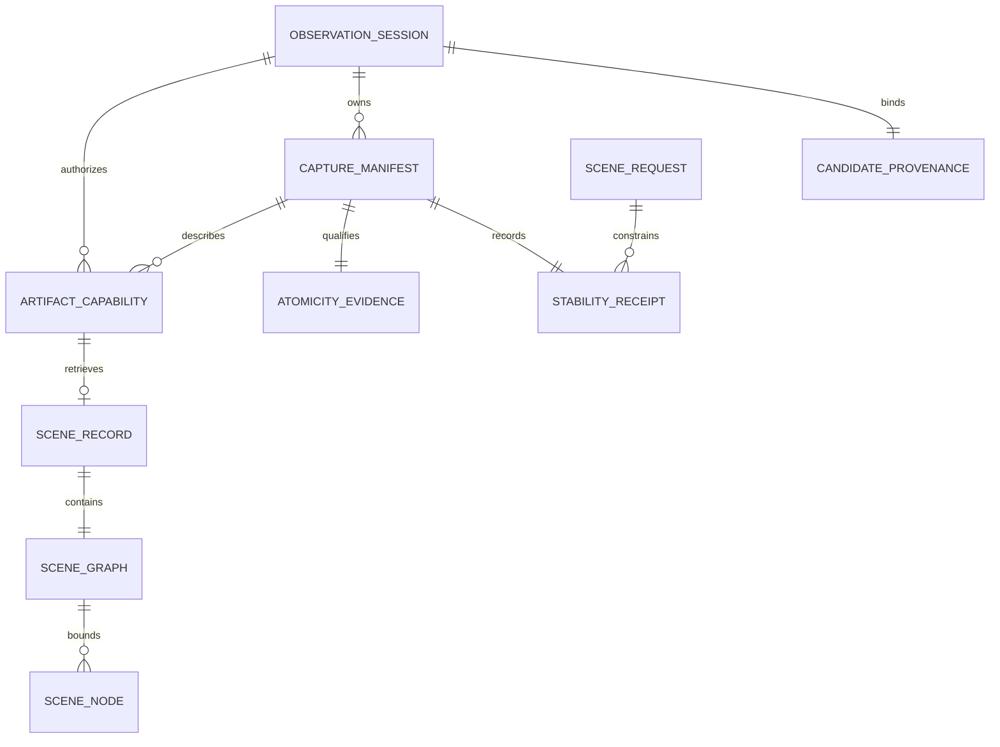

# Data Model — Native Scene Probe Contract Candidate

## Status and boundary

This packet is a **candidate** for the `native-scene-probe/1` contract. It is
not an implementation authorization. Recorded operator approval of the frozen
schemas and parity corpus authorizes only M0-G0 tasks T002–T007; the first M0
primitive task, T008, remains prohibited until T007 is GREEN.

The contract exposes exactly six additive primitives:

| Milestone | Primitive | Role |
|---|---|---|
| M0 | `get_ui_probe_capabilities` | Declares versions, availability, context support, limits, namespaces, and candidate provenance. |
| M0 | `capture_visual_evidence` | Creates separately retrievable lossless visual evidence and optional non-authoritative preview evidence. |
| M0 | `read_capture_artifact` | Reads a bounded, base64-encoded portion of one authorized immutable artifact. |
| M1 | `wait_for_ui_stable` | Produces a time-bounded stability receipt. |
| M1 | `capture_element_snapshot` | Observes one uniquely resolved element after capture-time stabilization or revalidation. |
| M1 | `capture_native_scene` | Observes one bounded scene graph under an explicit atomicity authority. |

The producer emits observations, completeness, provenance, and typed
uncertainty only. DTCG resolution, token-to-property mapping, comparison,
diagnosis, and repair planning are external Design Contract Factory concerns.
`artifactId`, not a provenance label or storage location, is the sole artifact
retrieval authority.

## Schema map

| Model entity | Probe schema definition | Scene-artifact schema definition | Notes |
|---|---|---|---|
| Versioned request base | `requestBase` | — | Every primitive carries `debugSessionId`, `protocolVersion`, and `schemaVersion`. |
| Six primitive arguments | `getUiProbeCapabilitiesArguments`, `captureVisualEvidenceArguments`, `readCaptureArtifactArguments`, `waitForUiStableArguments`, `captureElementSnapshotArguments`, `captureNativeSceneArguments` | — | Closed roots; no compatibility aliases. |
| Capability declaration | `uiProbeCapabilities`, `probeCapabilities`, `primitiveCapability`, `contextCapabilities`, `settleConditionCapabilities`, `negotiatedLimits` | — | The six-entry primitive array is closed structurally: `primitiveCapability.oneOf` fixes each name/milestone pair, so exactly three named primitives are M0 and exactly three are M1; capability lookup does not enumerate artifact capabilities. |
| Scene request context | `sceneRequest`, `sceneScope`, `viewportConstraint`, `dpiPolicy`, `settlePolicy`, `requestStateValue`, `candidateExpectation` | `sceneRequest`, `requestStateValue` | Each context member is required and is a constrained value or `null`; each selected/current state has an independent pre-materialization UTF-8 ceiling. |
| Canonical/fallback identity | `canonicalIdentity`, `elementSelector` | `canonicalIdentity`, `accessibilityIdentity` | `contractId` is canonical; `automationId` remains fallback/accessibility identity. |
| Candidate provenance | `candidateProvenance`, `candidateSource`, `observerVersion` | same | Candidate source is an explicit verified launch/probe manifest; no source-control inference exists. |
| Stability receipt | `stabilityReceipt`, `stabilityEvidence`, `conditionObservation` | `stabilityEvidence`, `conditionObservation` | A standalone receipt is evidence, never capture authorization. |
| Atomicity evidence | `atomicityEvidence`, `inProcessAtomicity`, `uiaGuardedAtomicity`, `notApplicableAtomicity` | `atomicityEvidence`, `inProcessAtomicity`, `uiaGuardedAtomicity` | Equal revisions for a complete atomic scene are a runtime invariant in addition to structural validation. |
| Capture results | `visualEvidenceCapture`, `elementSnapshotCapture`, `nativeSceneCapture`, `captureManifestBase`, `captureIssue` | `sceneArtifact` | Every element snapshot, every native-scene result branch that returns or commits evidence, and every persisted scene artifact requires capture-time `revalidatedByCapture: true`; a `COMPLETE` visual manifest structurally contains a lossless PNG descriptor and a `COMPLETE` native-scene manifest structurally contains an observed-facts native-scene JSON descriptor, while `PARTIAL`/`UNOBSERVABLE` captures may have no committed artifacts. |
| Typed failure | `toolError`, `artifactNotFoundError`, `errorCode` | — | `ARTIFACT_NOT_FOUND` has one fixed disclosure-free envelope; other error payloads contain no invented evidence or artifact bytes. |
| Artifact capability/descriptor | `publicCapabilityId`, `artifactDescriptor`, `artifactRetention`, `captureArtifactChunk` | `publicCapabilityId` | Public artifact/capture/probe capabilities are base64url, 22–86 characters, CSPRNG-minted with at least 128 bits, session- and capture-bound, and non-enumerable. |
| Scene record | — | `sceneArtifact`, `sceneGraph`, `sceneNode`, `geometry`, `relation` | Stored JSON contains observed facts, stated authority, and typed opaque adapter facts. |
| Custom adapter evidence | `jsonValue` | `customAdapterEvidence`, `jsonValue` | Unknown negotiated namespaces are retained without generic interpretation and are structurally/runtime bounded before materialization. |

## Entities and relationships

### Evidence Contract and Approval Record

The Evidence Contract is the versioned candidate represented by the two JSON
Schemas and `parity-corpus.json`. Its immutable approval state is external to
all six runtime primitives:

1. **candidate** — planning artifacts may be revised; no product implementation
   is authorized.
2. **approved** — the operator has recorded approval of the exact artifact
   bytes; this authorizes only M0-G0 T002–T007.
3. **M0-G0 GREEN** — only a GREEN T007 exact-byte Draft-7 schema load, request/result validator-parity pass over the concrete corpus fixtures, internal-reference check, corpus syntax/integrity check, expected-classification-vocabulary check, and negative structural/version-case check authorizes T008, the first M0 primitive task. T007 does not claim observer, artifact-lifecycle, stability, atomicity, or other runtime behavior.
4. **superseded** — a later candidate replaces it; it cannot authorize a new
   implementation.

An Approval Record binds the approved schema and corpus byte identities,
operator decision, and approval time. It is deliberately not a public capture
field and does not give a caller session, candidate, storage, or comparison
authority.

### Observation Session and Candidate Provenance

An Observation Session begins with one explicit `debugSessionId` whose native
host has positively bound it to one local candidate. The host does not discover
a candidate by scanning. A request with no live valid session is
`DEBUG_SESSION_NOT_FOUND` before an observer, capture, or artifact action.

`candidateProvenance` records the observed PID, process identity, optional
HWND, binary SHA-256, applicable assembly/probe/observer versions, supplied
contract/story hashes, capture time, and an explicit verified launch/probe
manifest source. It is immutable after capture commit. Repository, worktree,
branch, HEAD, or tree facts are absent unless a later contract adds an explicit
verified manifest field; they are never inferred from a working directory or a
process scan.

### Capability Declaration

A successful `get_ui_probe_capabilities` response is bound to the same session
and candidate as later calls. It declares the exact supported version strings,
one availability entry for each of the six named primitives, every
scene-context support state, every settle-condition support state, supported
custom namespaces, and negotiated ceilings. It does not list, probe, test, or
reveal any `artifactId`.

`capabilities.primitives` remains an array for declaration order, but has
`minItems: 6`, `maxItems: 6`, and six Draft-7 `allOf`/`contains` clauses. Its
`primitiveCapability.oneOf` branches bind the only legal name/milestone pairs:
the three M0 names and the three M1 names. Together those rules structurally
require every pair exactly once; runtime preserves that declaration in the
published result.
`capabilities.settleConditions` declares `supported`,
`unsupported`, or `unobservable` for dispatcher-idle, stable-layout,
animation-state, window-geometry, context-materialization, and async-load
settlement. The negotiated sample-count bounds use
`settleSampleCountMin` and `settleSampleCountMax`, each structurally within
2–16; runtime also requires the minimum not to exceed the maximum and every
request to lie within the declared interval.

A version that does not match the version syntax is invalid input. A
syntactically valid version which the declaration does not support is
`UNSUPPORTED_PROTOCOL`. A structurally valid request for a declared-unavailable
context, settle condition, or primitive capability is `UNSUPPORTED_CAPABILITY`.

### Scene Request Context

`sceneRequest` is an all-explicit closed object. The following fields are
always present: `storyId`, `sceneId`, `fixtureId`, `scope`, `appearance`,
`theme`, `density`, `contrast`, `viewport`, `expectedDpiPolicy`, `focusTarget`,
`selectedState`, `currentState`, `scrollOffsets`, `animationPolicy`,
`settlePolicy`, `contractSetHash`, and `expectedCandidateIdentity`.

A non-null value constrains the requested observation. `null` expressly means
that the caller does not constrain that aspect; it never authorizes an adapter
to invent a default with different scene meaning. The nested `settlePolicy` is
not nullable because every stability/capture request must state its bounded
settle contract. Before DTO materialization, `selectedState` and `currentState`
are independently limited to 262,144 serialized UTF-8 bytes, in addition to
the recursive JSON depth and member limits.

`contractId` plus optional `instanceKey`, `templatePart`, `storyScope`, and
`componentSlot` form canonical identity. `automationId` is captured only as
fallback/accessibility identity and cannot be promoted to canonical identity by
inference. The element selector requires a canonical identity or an explicit
fallback `automationId`; runtime resolution must yield exactly one element.

### Stability Receipt

`wait_for_ui_stable` returns a receipt with conditions, measured settle time,
observation time, scene epoch, and sequence. Each condition is `met`,
`not_met`, `unsupported`, or `unobservable`. A standalone receipt is historical
evidence only: its `revalidatedByCapture` is `false`.

`settlePolicy.sampleCount` is explicit and must be an integer from 2 through
16. The host refuses a value outside its negotiated `settleSampleCountMin` /
`settleSampleCountMax` interval before observer work begins.

`capture_element_snapshot` and `capture_native_scene` must perform their own
settle cycle or immediately revalidate every required condition before they
return or commit capture evidence. Every element-snapshot result and every
`COMPLETE`, `PARTIAL`, or `UNOBSERVABLE` native-scene result branch that may
return or commit evidence sets `revalidatedByCapture` to `true`; persisted
scene artifacts do the same. A changed epoch, changed authority revision,
missing required evidence, or failed settle cannot reuse an older receipt as
authorization.

### Capture Manifest, Artifacts, and Reads

Every capture has a server-minted public `captureId`; every artifact has a
server-minted public `artifactId`. Each is base64url text from 22 through 86
characters, generated from at least 128 CSPRNG bits. A `debugSessionId` remains
the established compatibility handle with base64url length 16 through 256; it
is not a substitute for an artifact or capture capability. A successful or
qualified capture returns a compact manifest rather than embedding PNG or scene
bytes. The manifest has at most four immutable `artifactDescriptor` values and
at most 256 typed `issues`.

Artifacts pass through this state machine:

1. **staged** — private, not returnable, and not readable;
2. **committed** — atomically written beneath the server-owned per-session
   root and described by the CSPRNG-minted, unguessable `artifactId`;
3. **verified** — first authorized read verified full SHA-256, immutable file
   identity, and length;
4. **expired/deleted** — no read is possible; and
5. **contained** — an authorized integrity mismatch releases no bytes.

An artifact descriptor has immutable media type, byte length, SHA-256, schema
version, capture ID, retention, evidence grade, capture time, and optional
relative provenance label. The label is diagnostic only and must never be
accepted by any primitive, dereferenced, or used to locate storage.

Unknown, foreign-session, foreign-capture, expired, deleted, and otherwise
unavailable capabilities return exactly this complete, fixed, disclosure-free
`ARTIFACT_NOT_FOUND` envelope, with no artifact metadata or free-text detail:
`{"kind":"tool_error","tool":"read_capture_artifact","code":"ARTIFACT_NOT_FOUND","message":"Artifact is not available."}`.
After authorization, SHA-256, immutable-identity, or length mismatch returns
`ARTIFACT_INTEGRITY_FAILED` with no bytes.

`read_capture_artifact` reads exactly one raw byte range by zero-based offset
and returns padded standard base64. `dataBase64` decodes to exactly
`bytesRead`; `bytesRead` does not exceed the requested `maxBytes`; and
`endOfArtifact` is true exactly when the returned range ends at the committed
length. These calculated relationships, plus authorization and file checks,
are runtime invariants because Draft 7 cannot compare decoded byte counts or
arithmetic across fields.

A `COMPLETE` visual manifest structurally contains at least one descriptor
whose `mediaType` is `image/png` and whose `evidenceGrade` is
`lossless_visual`. Lossless PNG artifacts have their own `rasterCaptureId` and
`capturedAt` and are bounded independently from scene artifacts. Preview
artifacts are `preview_only`: they can never determine completeness or an
external comparison, and their timing is not silently assigned to a scene
epoch. `PARTIAL` and `UNOBSERVABLE` visual captures may have no artifacts when
evidence cannot be committed.

### Atomicity and Scene Record

A `capture_native_scene` result is `COMPLETE` only when an
`in_process_framework_probe` performs one dispatcher-affine, non-yielding
transaction, materializes the whole graph as an immutable DTO, records equal
valid probe-owned revisions immediately before and after materialization, and
structurally contains at least one descriptor whose `mediaType` is
`application/vnd.netcoredbg.native-scene+json` and whose `evidenceGrade` is
`observed_facts`. The equality and transaction behavior are runtime invariants;
the schema requires the fields, authority, and committed scene descriptor but
cannot compare two dynamic revisions.

A `uia_guarded` traversal is independently timed. Matching window, client,
DPI, and visual-tree-fingerprint guards yield `PARTIAL` with
`ATOMICITY_UNPROVEN_UIA_GUARDED`; changed or unusable guards yield
`UNOBSERVABLE`. It can never be `COMPLETE` for an atomic-scene claim. An
element snapshot uses `not_applicable` atomicity and cannot claim a complete
scene epoch.

A persisted scene artifact has status `COMPLETE` or `PARTIAL` and therefore contains at least one observed graph node and root. An `UNOBSERVABLE` capture result commits no scene artifact and returns no scene-artifact descriptor; its uncertainty remains in the compact capture manifest.

A scene artifact is a bounded immutable graph of at most 4,096 nodes. A node
has an ID, an optional parent relation, optional slot relation, canonical
identity when available, fallback accessibility identity, logical and physical
geometry, DPI, transform, clip, visibility/accessibility facts, and bounded
custom adapter evidence. Node IDs are unique; parent references resolve within
the same graph; the resulting parent relation is acyclic; and the inverse
parent relation is the graph's child relation. Those cross-node properties are
runtime invariants beyond Draft 7 structural validation.

A custom adapter fact contains a versioned namespace, declared evidence
authority, and typed opaque JSON payload. Before DTO materialization, recursive
JSON is limited to nesting depth 16 and to 256 members per array or object;
each custom payload is also limited to 262,144 serialized UTF-8 bytes. The
parent response or artifact retains its own total byte ceiling. The host
preserves an unknown negotiated namespace as bounded opaque evidence or records
an unsupported issue. It never reinterprets the payload as design-contract
semantics.

## Outcome taxonomy

| Class | Codes or states | Rule |
|---|---|---|
| Complete observation | `COMPLETE` | Completeness only; it is not a design conclusion. Atomic scene completeness adds the in-process transaction invariant. |
| Qualified observation | `PARTIAL`, `UNOBSERVABLE` | Carries only attributable facts and typed issues actually observed. |
| Invalid input | `INVALID_TOOL_ARGUMENTS` | Closed-object, type, format, version-syntax, or bound violation; no lookup/action. |
| Session/version/capability | `DEBUG_SESSION_NOT_FOUND`, `UNSUPPORTED_PROTOCOL`, `UNSUPPORTED_CAPABILITY`, `CANDIDATE_MISMATCH` | Typed boundary outcome without target discovery. |
| Observer/selection/stability | `OBSERVER_UNAVAILABLE`, `SCENE_NOT_FOUND`, `SCENE_AMBIGUOUS`, `ELEMENT_NOT_FOUND`, `ELEMENT_AMBIGUOUS`, `UI_NOT_STABLE` | No fabricated observation. |
| Artifact lifecycle | `ARTIFACT_WRITE_FAILED`, `ARTIFACT_NOT_FOUND`, `ARTIFACT_INTEGRITY_FAILED` | Not-found is disclosure-free; integrity failure is authorized containment with no bytes. |

## Exact limits and schema-enforcement boundary

| Contract limit | Exact ceiling | Structural representation | Runtime check required |
|---|---:|---|---|
| Raw artifact read | 65,536 bytes | `maxBytes`, `bytesRead` | Decoded byte count and requested-range arithmetic. |
| Lossless visual artifact | 67,108,864 bytes | Lossless/preview descriptor `byteLength` | Actual committed-file length. |
| Scene artifact | 16,777,216 bytes | Scene descriptor `byteLength` | Actual serialized/committed scene-artifact length. |
| Manifest or structured response | 262,144 bytes | `structuredResponseMaxBytes` capability | Serialized response byte size. |
| Scene graph | 4,096 nodes | `sceneGraph.nodes.maxItems` | Unique IDs, resolved/acyclic relations. |
| Issues | 256 entries | `issues.maxItems` | None beyond structural count. |
| Artifact references | 4 entries | `artifacts.maxItems` | None beyond structural count. |
| Retention | 14,400 seconds or session stop | `artifactRetention.maximumAgeSeconds` | Earlier session-stop expiry. |
| Settle timeout | 30,000 ms | `settlePolicy.timeoutMs`, `settleDurationMs`, `negotiatedLimits.settleTimeoutMaxMs` | Cross-field stable-duration relation. |
| Settle samples | 2–16 | `settlePolicy.sampleCount`, `negotiatedLimits.settleSampleCountMin`, `negotiatedLimits.settleSampleCountMax` | Negotiated minimum is not greater than the maximum; each request lies within that interval. |
| Debug-session handle | 16–256 base64url characters | `debugSessionId` | Existing compatibility resolution and non-enumerability. |
| Public artifact/capture/probe capability | 22–86 base64url characters | `publicCapabilityId` | At least 128 CSPRNG bits at minting; session/capture binding and non-enumerability. |
| Recursive JSON | depth 16; 256 array items or object properties | `jsonValue.maxItems`, `jsonValue.maxProperties` | Depth check before DTO materialization. |
| Request selected/current state (each) | 262,144 serialized UTF-8 bytes | `requestStateValue` | Pre-materialization byte count, independent of recursive JSON bounds and total request/artifact ceiling. |
| Custom adapter payload | 262,144 serialized UTF-8 bytes | `customAdapterEvidence.payload` | Pre-materialization byte count; parent response/artifact ceiling remains in force. |
| General labels | 1–256 characters | `shortString`, `opaqueLabel` | No retrieval authority. |
| Prose/error text | 1–1,024 characters | `prose` | None beyond structural length. |
| Byte offset | 0–9,007,199,254,740,991 | `byteOffset` | Offset does not exceed the authorized artifact length. |

Draft 7 validates document shape, closed roots, enumerations, scalar ranges,
collection maxima, and public capability syntax. It cannot prove serialized
byte totals, JSON nesting depth, base64 decoded length, cross-field
arithmetic/equality, CSPRNG generation, artifact ownership, file identity,
cryptographic verification, local-process binding, or dispatcher transaction
semantics. Runtime performs those checks before DTO materialization or byte
release as applicable; they are mandatory runtime/schema-parity checks and are
not relaxed by this candidate schema.

## Corpus role

`contracts/parity-corpus.json` binds C001–C024 to exactly one expected
classification per case: a complete/qualified observation, capability
declaration, artifact chunk, typed error, or schema rejection. Every case
declares its `contractGateExpectation` and `runtimeBehaviorRequired` stage.

T007 validates exact-byte loading of both Draft-7 schemas, request/result
validator parity for concrete fixtures present, internal references, corpus
syntax and integrity, expected classification vocabulary, and the declared
negative structural/version cases. It does not execute or claim observer,
artifact-lifecycle, stability, atomicity, or other runtime behavior; the
runtime-marked C005–C016 and C020 cases are explicitly deferred from that
claim. T032 runs every C001–C024 behaviorally after implementation and records
the complete case-to-result mapping. Recorded approval starts only M0-G0
T002–T007, and only a GREEN T007 authorizes T008; the corpus has no other
authority to start product implementation.
