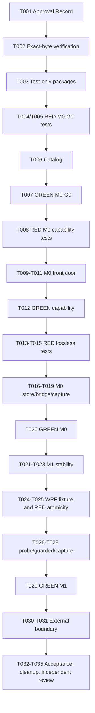

# Tasks: Native Scene Probe

**Input**: `specs/004-native-scene-probe/{spec.md,plan.md,architecture.md,research.md,data-model.md,quickstart.md,contracts/}`

**Scope**: M0-G0, M0, and M1 only. The six additive primitives are `get_ui_probe_capabilities`, `capture_visual_evidence`, `read_capture_artifact`, `wait_for_ui_stable`, `capture_element_snapshot`, and `capture_native_scene`.

## NOT AUTHORIZED — operator approval is a hard gate

This is a future execution checklist, not execution authorization. Publishing or merging this planning packet is allowed and does not constitute T001 approval. **T001 is the first and absolute blocking implementation task.** Until a durable operator Approval Record approves the exact merged bytes and SHA-256 hashes of all three candidate files below, no product source, test-project, package, build, formatter, SpecKit workflow, external-agent invocation, implementation commit/push/PR, release, product publication, or public-route action may occur:

- `specs/004-native-scene-probe/contracts/native-scene-probe.schema.json`
- `specs/004-native-scene-probe/contracts/native-scene-artifact.schema.json`
- `specs/004-native-scene-probe/contracts/parity-corpus.json`

T001 authorizes **only** M0-G0 T002–T007; it authorizes no M0 primitive implementation. T008+ remains hard-blocked until T007 has recorded GREEN M0-G0 contract/runtime-validator and corpus-integrity evidence. Within the authorized M0-G0 slice, T002 verifies approved bytes and T003–T007 may perform only exact-byte catalog, request/result validator parity, corpus integrity, and negative structural/version work—not live observer, artifact, stability, atomicity, or full C001–C024 behavior. No task permits Python invocation/change/dependency, Factory or Gallery implementation, DTCG resolution/comparison, `check_element_tokens`, storage-path/root exposure, UIA atomicity claims, public cutover/release, or M2–M5 work.

**Dependency budget**: production uses the BCL plus existing packages only. During M0-G0 after T001/T002, only the test project may add `NJsonSchema` **11.6.1** and `Microsoft.Extensions.TimeProvider.Testing` **10.9.0**. `JsonSchema.Net`, Python interop, DTCG packages, StreamJsonRpc, MessagePack, protobuf/gRPC, and ImageSharp remain excluded.

## Format and execution rules

- `[P]` means genuinely independent work in disjoint files after its listed dependencies are met.
- `[USn]` maps the task to the feature user story. Shared tasks retain the first story whose acceptance they establish.
- All test tasks explicitly establish **RED before GREEN**. A RED receipt records the expected missing behavior; it is not bypassed with a mock, skip, or assertion weakening.
- Each task names its required exact paths and an observable acceptance checkpoint. No task may substitute process scanning, a remote target, an unbounded transport, or an inferred default for the approved contract.

---

## Phase 1: Setup / Approval Record

**Purpose**: freeze one authoritative contract before any implementation surface can change.

- [ ] T001 [US1] Record the operator's approval in `specs/004-native-scene-probe/contracts/approval-record.md`, identifying the exact bytes and SHA-256 of `specs/004-native-scene-probe/contracts/native-scene-probe.schema.json`, `specs/004-native-scene-probe/contracts/native-scene-artifact.schema.json`, and `specs/004-native-scene-probe/contracts/parity-corpus.json`, plus the operator decision and approval time. **Acceptance**: the record has all three exact paths and hashes, an affirmative operator decision, and timestamp; it authorizes only M0-G0 T002–T007, while all T008+ M0 implementation remains blocked.
- [ ] T002 [US1] Verify the three approved byte hashes in `specs/004-native-scene-probe/contracts/approval-record.md` against the three named candidate files without editing the schema or corpus. **Depends on**: T001. **Acceptance**: each hash matches its exact file and the record states that no copied, renamed, or duplicate schema is authoritative.

**Checkpoint**: the contract is approved as exact bytes; only M0-G0 contract parity work T002–T007 may now start. No primitive is registered by this phase.

---

## Phase 2: M0-G0 / User Story 1 — Freeze and prove the wire (Priority: P1)

**Goal**: prove that one approved Draft-7 contract has byte-identical schema/corpus sources, valid contract-gate fixtures, and unambiguous declared classifications before any of the six primitives is implemented or registered; live behavior is not part of this phase.

**Independent test**: load the exact approved bytes, validate corpus syntax/internal references and C001–C024 metadata, and run only concrete contract-gate fixtures through request/result validators. Verify active-version non-empty/unique/contains rules, visual scope versus element/native null manifests, conditional chunk metadata ceilings, fixed primitive-name/milestone pairs, and rejected tool/error-code cross-pairs; do not execute observer-output, artifact, stability, or atomicity behavior.

- [ ] T003 [US1] Add test-only `NJsonSchema` version `11.6.1` and `Microsoft.Extensions.TimeProvider.Testing` version `10.9.0` to `host/NetCoreDbg.Mcp.Stateless.Tests/NetCoreDbg.Mcp.Stateless.Tests.csproj`; do not change `host/NetCoreDbg.Mcp.Stateless/NetCoreDbg.Mcp.Stateless.csproj` or `bridge/FlaUIBridge.csproj`. **Depends on**: T001, T002. **Acceptance**: project-file review proves both new references are test-only at the exact versions and the production dependency graph remains BCL plus existing packages.
- [ ] T004 [P] [US1] Write failing exact-byte contract-validator and corpus-integrity tests in `host/NetCoreDbg.Mcp.Stateless.Tests/NativeScene/NativeSceneSchemaParityTests.cs` using only the approved files under `specs/004-native-scene-probe/contracts/`; cover exact-byte loading, schema compilation, closed roots, `sceneRequest`, `evidenceScope` visual/null branches, scalar/collection limits, conditional native-scene/raster chunk metadata ceilings, request/result validator agreement on concrete fixtures, required element-snapshot completeness branches, persisted partial atomicity branches, active-version non-empty/unique/contains constraints, fixed 2/16 capability constants, internal references, expected-classification vocabulary, and C001–C024 metadata integrity. **Depends on**: T003. **Acceptance**: the first focused run is RED because no native contract catalog/validator exists; it validates the exact six declaration, fixed capability constants, scope/version/error/chunk rules, and no behavior.
- [ ] T005 [P] [US1] Write failing negative contract-wire tests in `host/NetCoreDbg.Mcp.Stateless.Tests/NativeScene/NativeSceneNegativeWireTests.cs` for malformed protocol/schema syntax (`INVALID_TOOL_ARGUMENTS`), recognized unsupported versions (`UNSUPPORTED_PROTOCOL`), omitted/duplicate active version declarations, closed-object violations, invalid range/identifier, invalid visual/null scope branch, wrong tool/error-code pair, native-scene chunk metadata above 16,777,216 bytes, raster chunk metadata above 67,108,864 bytes, request sample count outside 2–16, declared sample minimum other than 2, declared sample maximum other than 16, depth 17, more than 256 members, and a 262,145-byte custom payload. **Depends on**: T003. **Acceptance**: the first focused run is RED because the contract classifier/validator is absent; every negative is structural or version-only. The corpus validator requires explicit `contractGateExpectation` and `runtimeBehaviorRequired` metadata and preserves C001–C024.
- [ ] T006 [US1] Implement the exact-byte catalog and request/result contract validators in `host/NetCoreDbg.Mcp.Stateless/NativeScene/NativeSceneContractCatalog.cs`; link only the three approved artifacts as resources from `host/NetCoreDbg.Mcp.Stateless/NetCoreDbg.Mcp.Stateless.csproj`. **Depends on**: T004, T005. **Acceptance**: catalog/validators read the byte-identical approved resources, classify syntax separately from unsupported versions, validate corpus syntax/references, active-version and fixed primitive-name/milestone pairs, scope/null and tool/code branch rules, and define neither a duplicate schema nor a primitive registration, observer call, artifact operation, stability flow, or atomicity flow.
- [ ] T007 [US1] Turn the M0-G0 suites GREEN in `host/NetCoreDbg.Mcp.Stateless.Tests/NativeScene/{NativeSceneSchemaParityTests.cs,NativeSceneNegativeWireTests.cs}` and run the focused command in `specs/004-native-scene-probe/quickstart.md`. **Depends on**: T006. **Acceptance**: the exact approved bytes load; request/result validators agree on concrete contract-gate fixtures; every C001–C024 corpus entry has valid syntax/internal references, allowed expected-classification vocabulary, and explicit `contractGateExpectation`/`runtimeBehaviorRequired` metadata; active-version, scope/null, chunk-ceiling, partial-atomicity, and tool/code-cross-pair negatives are rejected; and omitted, duplicate, or cross-milestone primitive pairs are rejected. This is the M0 authorization gate, but it does not execute or mark GREEN observer, artifact, stability, or atomicity behavior.

**Checkpoint**: M0-G0 is accepted only with an approval record plus GREEN exact-byte contract/runtime-validator parity, corpus integrity, and negative structural/version evidence. GREEN T007 authorizes the next internal M0 implementation tasks, not release, public use, or a behavioral GREEN claim.

---

## Phase 3: Shared M0 foundation

**Purpose**: establish the native-only host front door, explicit local-session binding, and capability declaration that M0 capture/read work requires.

- [ ] T008 [US1] Write failing front-door and capability tests in `host/NetCoreDbg.Mcp.Stateless.Tests/NativeScene/NativeSceneCapabilityTests.cs` using `host/NetCoreDbg.Mcp.Stateless.Tests/ModernMcp/ModernMcpProcessDriver.cs`; cover each of the six fixed name/milestone pairs exactly once, M0 availability, M1 unavailable states, protocol/schema/limit/context declaration, explicit settle-condition capability states, structurally fixed `settleSampleCountMin: 2` and `settleSampleCountMax: 16`, request `sampleCount` 2–16, no artifact enumeration, explicit session lookup, positive local candidate binding, remote/stale/mismatched rejection, and unchanged existing tool contracts. **Depends on**: T007. **Acceptance**: the first run is RED because no native-scene MCP dispatch exists, while retained native tools remain observable through their unchanged contracts.
- [ ] T009 [US1] Implement native-scene request/result envelopes and the capability declaration in `host/NetCoreDbg.Mcp.Stateless/NativeScene/NativeSceneToolDispatcher.cs`, sourcing version and limit facts only from `host/NetCoreDbg.Mcp.Stateless/NativeScene/NativeSceneContractCatalog.cs`. **Depends on**: T008. **Acceptance**: only the six approved names and typed observation envelopes exist; the `primitives` array contains exactly the six fixed name/milestone pairs and runtime rejects any omission, duplicate, or cross-milestone pairing; output declares settle-condition states, fixed 2/16 sample-count capability constants, and no `artifactId` enumeration, DTCG field, comparison/verdict, diagnosis, repair advice, or alias.
- [ ] T010 [US1] Implement explicit local candidate/session binding and nonce authorization in `host/NetCoreDbg.Mcp.Stateless/NativeScene/NativeSceneSessionBinding.cs`, integrating only the necessary existing lifecycle seams in `host/NetCoreDbg.Mcp.Stateless/DebugAdapter/{NetCoreDbgSession.cs,DapSessionState.cs}`. **Depends on**: T008. **Acceptance**: a request resolves one live explicit `debugSessionId` to a positively identified local candidate or returns the prescribed typed result before bridge/probe work; it never scans processes, accepts a remote target, or invokes Python.
- [ ] T011 [US1] Add additive native-scene dispatch composition and session-stop disposal wiring in `host/NetCoreDbg.Mcp.Stateless/{Program.cs,NativeScene/NativeSceneToolDispatcher.cs}`. **Depends on**: T009, T010. **Acceptance**: only the M0-supported primitives are callable at this stage; existing `start_debug`, `get_debug_state`, and `stop_debug` behavior is unchanged, and shutdown reaches future native-scene ownership cleanup without a public route cutover.
- [ ] T012 [US1] Turn `host/NetCoreDbg.Mcp.Stateless.Tests/NativeScene/NativeSceneCapabilityTests.cs` GREEN with the controlled `ModernMcpProcessDriver` session. **Depends on**: T011. **Acceptance**: capability results accurately declare M0/M1 availability and limits, invalid/missing/remote/mismatched sessions trigger no target discovery, and the retained route is neither called nor changed.

**Checkpoint**: a native host can safely declare its M0 state for one explicit local session, but it cannot yet return a lossless artifact.

---

## Phase 4: User Story 2 — Lossless evidence and safe reads (Priority: P2)

**Goal**: create attributable lossless PNG evidence under host ownership and retrieve it only through session-bound opaque, bounded reads.

**Independent test**: a controlled local session creates a compact visual manifest, reconstructs original bytes from beginning/middle/end chunks, and proves indistinguishable unavailable outcomes plus zero-byte integrity containment after a prior successful read and same-identity/same-length in-place tampering across an unaligned two-chunk range.

### RED tests and controlled evidence fixture

- [ ] T013 [P] [US2] Write failing artifact lifecycle, authorization, range, integrity, fake-time expiry, and session-stop cleanup tests in `host/NetCoreDbg.Mcp.Stateless.Tests/NativeScene/NativeSceneArtifactStoreTests.cs`. **Depends on**: T012. **Acceptance**: the initial test run is RED and specifies staged-versus-committed visibility, 128-bit CSPRNG base64url IDs, commit-time full SHA-256 plus server-internal fixed 65,536-byte chunk hashes, identity/length and every-touched-chunk verification before every authorized byte release, same-identity/same-length in-place tampering after a prior success across an unaligned two-chunk range, exactly `{kind: "tool_error", tool: "read_capture_artifact", code: "ARTIFACT_NOT_FOUND", message: "Artifact is not available."}` for unavailable IDs, `ARTIFACT_INTEGRITY_FAILED` zero-byte containment, 65,536-byte ceiling, terminal reads, expiry, and cleanup.
- [ ] T014 [P] [US2] Write failing local bridge lifecycle tests in `host/NetCoreDbg.Mcp.Stateless.Tests/NativeScene/NativeSceneBridgeLifecycleTests.cs`. **Depends on**: T012. **Acceptance**: the initial test run is RED and specifies one in-flight correlated pipe request, bounded connect/write/read/response framing, cancellation/disconnect/oversize cleanup, typed `OBSERVER_UNAVAILABLE`, and no diagnostics on MCP stdout.
- [ ] T015 [P] [US2] Write failing controlled visual-evidence tests in `host/NetCoreDbg.Mcp.Stateless.Tests/NativeScene/NativeSceneVisualEvidenceTests.cs`, using `host/NetCoreDbg.Mcp.Stateless.Tests/ModernMcp/ModernMcpProcessDriver.cs` and the existing controlled adapter at `host/NetCoreDbg.Mcp.Stateless.Tests/Fixtures/ControlledDapAdapter/{Program.cs,ControlledDapAdapter.csproj}`. **Depends on**: T012. **Acceptance**: the initial test run is RED and specifies a compact manifest, independently identified/timed lossless PNG, no raw PNG in MCP content, bounded chunk reconstruction and SHA-256/length match, and optional preview marked `preview_only`.

### Implementation and GREEN acceptance

- [ ] T016 [US2] Implement server-owned staged/atomic artifact commits, immutable descriptors, opaque capability minting, session/capture authorization, bounded padded-base64 reads, commit-time full SHA-256 plus internal fixed 65,536-byte chunk-hash table, every-read identity/length and touched-chunk verification before release, `TimeProvider` retention, and idempotent cleanup in `host/NetCoreDbg.Mcp.Stateless/NativeScene/NativeSceneArtifactStore.cs`. **Depends on**: T013. **Acceptance**: the store exposes no caller-selected path/root or chunk-table authority; unknown, foreign, expired, deleted, and unavailable capabilities return exactly `{kind: "tool_error", tool: "read_capture_artifact", code: "ARTIFACT_NOT_FOUND", message: "Artifact is not available."}` with no additional member, metadata, or free-text variation; identity, length, or touched-chunk mismatch returns no bytes; and all file/crypto/time behavior uses BCL APIs.
- [ ] T017 [US2] Implement the bounded native C# local-pipe client in `host/NetCoreDbg.Mcp.Stateless/NativeScene/NativeSceneBridgeClient.cs`. **Depends on**: T014. **Acceptance**: it has one synchronous, nonce-authorized, correlated in-flight request per connection with bounded cancellation cleanup; it uses no Python, remote listener, or generic RPC package.
- [ ] T018 [US2] Add the bridge evidence command while preserving the existing stdin bridge mode in `bridge/{Program.cs,JsonRpcHandler.cs,Commands/NativeSceneEvidenceCommands.cs,Commands/ScreenshotCommands.cs}`. **Depends on**: T014, T015. **Acceptance**: the existing C# raster owner can provide bounded lossless PNG and window/process evidence only under the local authorization/correlation contract; it cannot expose paths, issue design conclusions, or claim scene atomicity.
- [ ] T019 [US2] Integrate M0 visual capture and artifact retrieval through `host/NetCoreDbg.Mcp.Stateless/NativeScene/NativeSceneToolDispatcher.cs`, `host/NetCoreDbg.Mcp.Stateless/NativeScene/NativeSceneBridgeClient.cs`, and `host/NetCoreDbg.Mcp.Stateless/NativeScene/NativeSceneArtifactStore.cs`. **Depends on**: T016, T017, T018. **Acceptance**: `capture_visual_evidence` returns a compact attributable manifest and every `COMPLETE` result has at least one `image/png` descriptor with `lossless_visual` evidence grade; `PARTIAL`/`UNOBSERVABLE` may contain zero artifacts only when evidence could not be committed. `read_capture_artifact` emits only authorized bounded chunks; the route never invokes the retained Python path or returns storage location/root metadata.
- [ ] T020 [US2] Turn `host/NetCoreDbg.Mcp.Stateless.Tests/NativeScene/{NativeSceneArtifactStoreTests.cs,NativeSceneBridgeLifecycleTests.cs,NativeSceneVisualEvidenceTests.cs}` GREEN and run the M0 focused command in `specs/004-native-scene-probe/quickstart.md`. **Depends on**: T019. **Acceptance**: all controlled M0 trials reconstruct bytes and manifest integrity exactly; every `COMPLETE` visual capture proves an `image/png`/`lossless_visual` descriptor; unavailable trials reveal zero artifact metadata; a post-success same-identity/same-length in-place tamper across an unaligned two-chunk range emits zero bytes; cancellation/session-stop tests leave no readable staged or expired artifact.

**Checkpoint**: M0 produces only attributable lossless evidence and safe reads. It remains an internal capability milestone: no Factory/Gallery implementation, public route cutover, packaging, or release follows.

---

## Phase 5: Shared M1 foundation

**Purpose**: make stability evidence historical and require capture-time settle/revalidation before element or scene evidence commits.

- [ ] T021 [US3] Write failing stability and stale-receipt tests in `host/NetCoreDbg.Mcp.Stateless.Tests/NativeScene/NativeSceneStabilityTests.cs`. **Depends on**: T020. **Acceptance**: the first run is RED and specifies explicit complete `sceneRequest`, bounded 2–16 sample policy, standalone `revalidatedByCapture: false`, fresh capture-time settle/revalidation, and rejection/qualification after a changed condition without sleeps; it includes C023, where a `PARTIAL` evidence capture after a prior wait cannot return `revalidatedByCapture: false`.
- [ ] T022 [US3] Implement bounded stability observation and immediate capture-time revalidation in `host/NetCoreDbg.Mcp.Stateless/NativeScene/NativeSceneStabilityCoordinator.cs`, wiring invocation only from `host/NetCoreDbg.Mcp.Stateless/NativeScene/NativeSceneToolDispatcher.cs`. **Depends on**: T021. **Acceptance**: prior receipts are never authorization tokens; unsupported/unobservable/not-stable conditions are typed honestly, every element snapshot and native-scene branch that returns or commits capture evidence records `revalidatedByCapture: true`, time is injected, and no observer fallback uses Python or target scanning.
- [ ] T023 [US3] Turn `host/NetCoreDbg.Mcp.Stateless.Tests/NativeScene/NativeSceneStabilityTests.cs` GREEN using fake time from the approved test-only package. **Depends on**: T022. **Acceptance**: mutating a required condition after `wait_for_ui_stable` forces fresh settle/revalidation in later capture and cannot produce an authorized stale capture; `PARTIAL` and `UNOBSERVABLE` evidence branches remain capture-revalidated.

**Checkpoint**: stability receipts are useful historical evidence only; M1 capture may now build on an explicit capture-time condition check.

---

## Phase 6: User Story 3 — Honest scene atomicity (Priority: P3)

**Goal**: create bounded element and scene facts with a `COMPLETE` atomic scene limited to the opt-in WPF transaction, and honestly qualified UIA fallback evidence otherwise.

**Independent test**: a controlled WPF fixture proves equal probe-owned revisions around one dispatcher-affine immutable-DTO transaction; changed revision and guarded UIA variations prove that no unsupported atomic claim is emitted.

### Controlled fixture and RED tests

- [ ] T024 [US3] Create the test-only controlled WPF fixture in `host/NetCoreDbg.Mcp.Stateless.Tests/Fixtures/NativeSceneProbe.WpfFixture/{NativeSceneProbe.WpfFixture.csproj,App.xaml,ProbeFixtureWindow.xaml.cs}` and add its non-production project reference in `host/NetCoreDbg.Mcp.Stateless.Tests/NetCoreDbg.Mcp.Stateless.Tests.csproj`. **Depends on**: T023. **Acceptance**: the fixture can be started only by the focused test harness, exposes deterministic probe-owned revision variations, and creates neither a production listener nor a Factory/Gallery dependency.
- [ ] T025 [US3] Write failing element/scene atomicity tests in `host/NetCoreDbg.Mcp.Stateless.Tests/NativeScene/NativeSceneAtomicityTests.cs` against the controlled fixture. **Depends on**: T024. **Acceptance**: the first run is RED and covers unique/missing/ambiguous selection; a `COMPLETE` element snapshot's retrievable one-node `element_snapshot` artifact, `PARTIAL` committed qualified element facts, `UNOBSERVABLE` element artifact absence; bounded observed graph facts and opaque adapter values; equal versus changed revisions; UIA guarded unchanged/mutated/unusable conditions; 0 guarded traversals reported as atomic `COMPLETE`; and no DTCG/verdict fields.

### Implementation and GREEN acceptance

- [ ] T026 [US3] Implement the opt-in WPF probe project in `host/NetCoreDbg.Mcp.DesignProbe.Wpf/{NetCoreDbg.Mcp.DesignProbe.Wpf.csproj,LocalProbeClient.cs,WpfAtomicSnapshotTransaction.cs,WpfSceneSnapshotDto.cs}`. **Depends on**: T025. **Acceptance**: only a local capability-authorized request may invoke a dispatcher-affine, non-yielding full immutable-DTO materialization with immediately before/after probe revisions; it has no production listener, session discovery, DTCG behavior, or repair logic.
- [ ] T027 [US3] Add guarded UIA element/scene evidence to `bridge/{Commands/NativeSceneEvidenceCommands.cs,Commands/ElementCommands.cs,JsonRpcHandler.cs}`. **Depends on**: T025. **Acceptance**: bridge output is limited to independently timed identity, accessibility, geometry, transform, clipping, DPI, and guard facts; it returns `PARTIAL` with `ATOMICITY_UNPROVEN_UIA_GUARDED` for usable guards and `UNOBSERVABLE` for changed/unusable guards, never atomic `COMPLETE`.
- [ ] T028 [US3] Implement bounded element/scene capture qualification and artifact hand-off in `host/NetCoreDbg.Mcp.Stateless/NativeScene/{NativeSceneCaptureCoordinator.cs,NativeSceneToolDispatcher.cs}`. **Depends on**: T022, T026, T027. **Acceptance**: `capture_element_snapshot` uses `not_applicable` atomicity and `evidenceScope: null`; its `COMPLETE` result has an `application/vnd.netcoredbg.native-scene+json`/`observed_facts` descriptor whose capture-bound `element_snapshot` artifact has exactly one node/root, `PARTIAL` may retain qualified facts, and `UNOBSERVABLE` has no artifacts. `capture_native_scene` emits `COMPLETE` only for equal valid in-process revisions and the required descriptor; every element/scene branch that returns or commits evidence has `revalidatedByCapture: true`, `evidenceScope: null`, and every persisted native-scene `PARTIAL` artifact uses in-process or UIA-guarded atomicity with the existing UIA unchanged-guard/issue condition.
- [ ] T029 [US3] Turn `host/NetCoreDbg.Mcp.Stateless.Tests/NativeScene/NativeSceneAtomicityTests.cs` GREEN and run the M1 focused command in `specs/004-native-scene-probe/quickstart.md`. **Depends on**: T028. **Acceptance**: controlled equal revisions yield one authorized `COMPLETE` atomic scene with an `application/vnd.netcoredbg.native-scene+json`/`observed_facts` descriptor; a `COMPLETE` element snapshot retrieves a one-node `element_snapshot` artifact; element `PARTIAL` retains only committed qualified facts and element `UNOBSERVABLE` returns none; changed revisions never do; persisted native-scene partials accept only in-process or unchanged-guard UIA atomicity; matching UIA guards stay qualified; changed/unusable guards become unobservable; raster remains independently timed corroboration; every evidence-returning/committing element or scene branch has the required revalidation and null evidence scope.

**Checkpoint**: M1 emits bounded observation facts with explicit authority and qualified uncertainty. It still does not interpret design contracts.

---

## Phase 7: User Story 4 — External observation-only boundary (Priority: P4)

**Goal**: demonstrate that an external consumer can retrieve evidence through opaque bounded MCP reads while the native host remains strictly an observation producer.

**Independent test**: use the controlled MCP driver as an external caller with only a valid session and artifact capability; reconstruct an artifact without path/root or debug-target authority and inspect every response for observation-only content.

- [ ] T030 [US4] Run the previously RED-first boundary assertions in `host/NetCoreDbg.Mcp.Stateless.Tests/NativeScene/{NativeSceneCapabilityTests.cs,NativeSceneVisualEvidenceTests.cs,NativeSceneAtomicityTests.cs}` through `host/NetCoreDbg.Mcp.Stateless.Tests/ModernMcp/ModernMcpProcessDriver.cs`. **Depends on**: T020, T029. **Acceptance**: an external caller retrieves only bounded chunks using an owning `debugSessionId` plus `artifactId`; capture/read results contain no server path/root, target-discovery authority, DTCG resolution, token mapping, `PASS`/`FAIL`, root cause, or repair advice; capture remains usable when no Factory exists.
- [ ] T031 [US4] Perform the focused source-boundary inspection of `host/NetCoreDbg.Mcp.Stateless/{Program.cs,NativeScene/NativeSceneToolDispatcher.cs,NativeScene/NativeSceneContractCatalog.cs,NativeScene/NativeSceneSessionBinding.cs,NativeScene/NativeSceneBridgeClient.cs,NativeScene/NativeSceneArtifactStore.cs,NativeScene/NativeSceneStabilityCoordinator.cs,NativeScene/NativeSceneCaptureCoordinator.cs}`, `bridge/{Program.cs,JsonRpcHandler.cs,Commands/NativeSceneEvidenceCommands.cs}`, and `host/NetCoreDbg.Mcp.DesignProbe.Wpf/`. **Depends on**: T030. **Acceptance**: inspection records zero Python invocation/dependency/change, zero Factory/Gallery/comparator/DTCG implementation, zero `check_element_tokens`, zero path/root retrieval, zero UIA atomicity claim, zero public cutover/release behavior, and zero M2–M5 surface.

**Checkpoint**: the external boundary is proven observation-only and storage-safe; comparison remains external and unavailable Factory behavior does not alter capture results.

---

## Phase 8: Final focused acceptance, cleanup, and independent review

**Purpose**: verify the approved M0/M1 capability as an internal slice, clean test-owned residue, and obtain an independent scope-boundary verdict without widening the release scope.

- [ ] T032 [US1] Run the full approved focused acceptance set exactly as specified in `specs/004-native-scene-probe/quickstart.md` against `host/NetCoreDbg.Mcp.Stateless.Tests/NetCoreDbg.Mcp.Stateless.Tests.csproj`. **Depends on**: T007, T020, T023, T029, T030. **Acceptance**: all eight named test classes pass with a non-zero denominator and behaviorally execute every C001–C024; the receipt preserves the complete case-to-result mapping, including C005–C016 and C020 runtime behavior, C021–C024 negatives, session/locality proof, required COMPLETE visual/native-scene/element descriptors, element completeness branches, artifact lifecycle/read evidence, and same-identity/same-length two-chunk tamper containment. This is not a full suite, package build/release, or public-route action.
- [ ] T033 [US2] Verify focused cleanup behavior through `host/NetCoreDbg.Mcp.Stateless.Tests/NativeScene/{NativeSceneArtifactStoreTests.cs,NativeSceneBridgeLifecycleTests.cs}` and remove only temporary evidence created by their controlled test roots. **Depends on**: T032. **Acceptance**: cancellation, disconnect, commit failure, four-hour fake-time expiry, and session stop leave no staged or expired artifact readable through MCP; committed evidence remains retained only under the approved stop-or-four-hour policy; no caller path/root or internal chunk table is exposed.
- [ ] T034 [US1] Execute the scenario-level future acceptance playbook in `specs/004-native-scene-probe/quickstart.md` using the controlled fixtures and record the evidence receipt in `specs/004-native-scene-probe/acceptance-receipt.md`. **Depends on**: T033. **Acceptance**: scenarios A–E re-execute and record the full behavioral C001–C024 mapping: M0 chunk reconstruction/non-disclosure plus post-success same-identity/same-length two-chunk tamper containment and required COMPLETE visual descriptor; M1 WPF and guarded-UIA qualification, element descriptor completeness branches, stale-wait revalidation, and required COMPLETE scene descriptor; and external observation-only consumption. The receipt explicitly records that no release, publication, Factory, or M2–M5 work was performed.
- [ ] T035 [US4] Obtain an independent boundary review of the exact candidate surfaces listed in T031, the exact contracts in `specs/004-native-scene-probe/contracts/`, the focused tests under `host/NetCoreDbg.Mcp.Stateless.Tests/NativeScene/`, and `specs/004-native-scene-probe/acceptance-receipt.md`. **Depends on**: T034. **Acceptance**: the review verdict independently confirms every landed finding is fixed, challenged with evidence, clarified, or deferred as accepted technical debt; it explicitly verifies the approval gate; the validator-only T007 boundary; native-only dependency boundary; full behavioral C001–C024 corpus proof; fixed six primitive-name/milestone pairs; required COMPLETE artifact descriptors; artifact non-disclosure/integrity containment; honest atomicity; no design verdict; and M2–M5/public-release exclusions.

**Final checkpoint**: an independently reviewed internal M0/M1 capability candidate exists only if T001–T035 are complete. No task in this checklist authorizes merge, package publication, deployment, release, route cutover, Factory/Gallery delivery, `check_element_tokens`, or M2–M5.

---

## Dependencies and execution order

### Phase dependencies

1. **Approval / M0-G0**: T001 is mandatory and authorizes only T002–T007. Those tasks establish the sole approved wire source and contract-validator/corpus-integrity evidence; GREEN T007 is required before T008+ but does not prove live behavior.
2. **Shared M0 foundation**: T008–T012 depend on GREEN M0-G0 and establish explicit local authority before observer/artifact activity.
3. **US2 M0**: T013–T020 depend on the M0 front door. T020 is required before M1 begins.
4. **Shared M1 and US3**: T021–T029 depend on M0. The `COMPLETE` branch depends on the opt-in WPF probe; UIA remains a qualified fallback.
5. **US4 and final review**: T030–T035 require M0/M1 evidence. They verify boundaries and acceptance only; they do not add a Factory, cutover, or release.

### Parallel opportunities

- After T003, **T004** and **T005** may run in parallel: they edit separate M0-G0 test files.
- After T012, **T013**, **T014**, and **T015** may run in parallel: they edit separate focused M0 test files.
- No other task is marked `[P]`: subsequent tasks share an implementation surface, use a preceding acceptance receipt, or must preserve a causal RED-to-GREEN sequence.

---

## MVP and incremental strategy

1. **Approved contract increment (US1 / M0-G0)**: complete T001–T007. Stop if the byte-identical contract, corpus integrity, contract-gate fixture, or structural/version classification is not proven. This increment exposes no primitive and makes no observer/artifact/stability/atomicity claim.
2. **First internal value increment (M0 / US2)**: complete T008–T020. Validate attributable lossless evidence and opaque bounded reconstruction under the controlled local session. Stop; do not release or cut over.
3. **Qualified scene increment (M1 / US3)**: complete T021–T029. Validate stability revalidation and the WPF-versus-UIA authority distinction.
4. **Consumption-boundary increment (US4)**: complete T030–T031. Validate an external caller can consume facts without gaining storage or debugger authority.
5. **Acceptance/review increment**: complete T032–T035. Preserve focused proof and independent review only; all non-goals remain excluded.

---

## Requirement and success-criterion traceability

| Requirement / criterion | Tasks |
|---|---|
| FR-001 | T001, T002 |
| FR-002 | T004, T006, T007 |
| FR-003 | T005, T007 |
| FR-004 | T008, T010, T012 |
| FR-005 | T008, T009, T012 |
| FR-006 | T015, T018, T019, T020 |
| FR-007 | T013, T016, T020 |
| FR-008 | T013, T016, T019, T020 |
| FR-009 | T013, T016, T020 |
| FR-010 | T013, T016, T020 |
| FR-011 | T015, T019, T020, T029 |
| FR-012 | T004, T021, T022, T023 |
| FR-013 | T021, T022, T023, T028 |
| FR-014 | T024, T025, T026, T028, T029 |
| FR-015 | T025, T027, T028, T029 |
| FR-016 | T025, T027, T028, T029 |
| FR-017 | T008, T009, T025, T030, T031 |
| FR-018 | T019, T030, T031 |
| FR-019 | T001, T007, T031, T035 |
| FR-020 | T008, T010, T017, T019, T031 |
| FR-021 | T016, T017, T019, T030, T031 |
| SC-001 | T004, T005, T007, T032 |
| SC-002 | T015, T019, T020, T032 |
| SC-003 | T013, T016, T020, T032 |
| SC-004 | T025, T026, T027, T028, T029, T032 |
| SC-005 | T021, T022, T023, T029, T032 |
| SC-006 | T030, T031, T034, T035 |
| SC-007 | T008, T010, T017, T019, T031, T035 |
