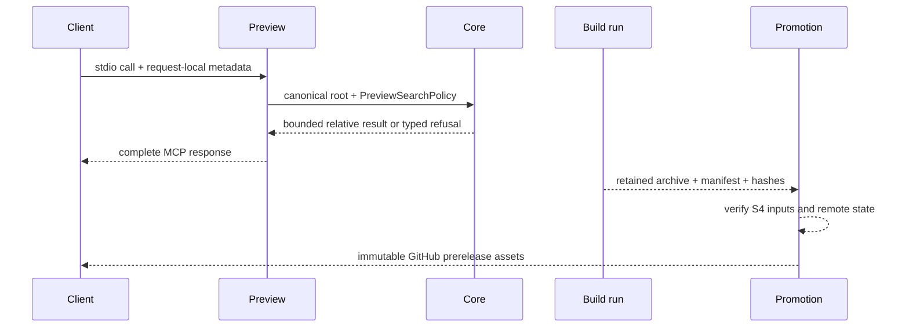

# Architecture — A1 Safe Read-Only Stateless Preview

## Ownership map

| Component | Owner | Excluded responsibility |
|---|---|---|
| `NetCoreDbg.Mcp.CodeSearch.Core` | Traversal/matching/policy execution | Root selection, MCP SDK, process state. |
| Compatibility host adapters | Legacy root resolution and relay contract | Preview strict policy/default selection changes. |
| Preview executable | Strict launch root, modern one-tool dispatch, response adaptation | DAP, Native Scene, bridge, Python relay, mux, HTTP. |
| Build workflow | Pinned source-run archive/manifest pair | Tag/release publication. |
| Promotion workflow / `release` | Approved exact-byte state machine | Rebuild, default selector/PyPI changes. |
| Python package | Existing default/rollback journey | Preview behavior ownership. |

## Data flow

## Boundary assertions

- The only shared code is traversal/matching with explicit policy input.
- Root-selection semantics are intentionally host-specific.
- Preview server lifetime does not persist identity, session, artifact, or
  configuration state.
- Supply-chain identity starts at source-pinned build bytes, not a later rebuild.
- Promotion is idempotent only for verified matching partial remote state.
