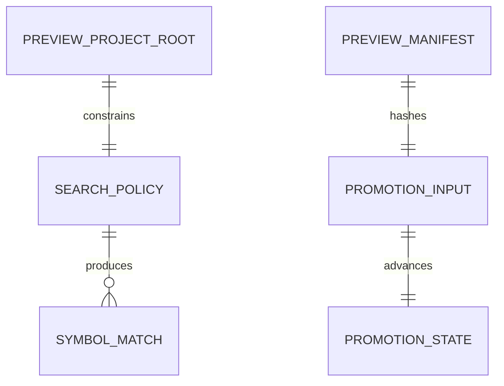

# Data Model — A1 Safe Read-Only Stateless Preview

## Runtime entities

| Entity | Fields | Invariants |
|---|---|---|
| `PreviewProjectRoot` | canonical local root; containment prefix | Constructed only from one valid `--project`; no environment/client/CWD authority; root non-reparse. |
| `SearchPolicy` | traversal rules; limits; error mode | `LegacySearchPolicy` preserves compatibility behavior; `PreviewSearchPolicy` enforces A1 strict rules. |
| `SymbolMatch` | root-relative file; positive line; name; kind; context | Sorted ordinally by file/line/kind; path never absolute; context <=512 Unicode scalar values. |
| `SearchFailure` | lowercase kind; uppercase error; tool | Closed `{kind,error,tool}` shape; no path/exception/counter/partial result. |
| `PreviewManifest` | schema version; version; tag; commit; RID; archive; executable | Validates against `contracts/preview-manifest.schema.json` and verifier equations in `research.md`. |
| `PromotionInput` | build run ID; commit; tag; archive/manifest/exe hashes; destination | Exactly equals T07 proof receipt and S4 approval record. |
| `PromotionState` | unstarted; draft_empty; draft_partial; draft_complete; published_complete; collision | Transitions only as `contracts/promotion-state-machine.md` permits; collision is terminal for the approved version. |

## Relationships

No runtime entity is persisted across preview process lifetime. Promotion
records are release evidence, not preview-server state.
