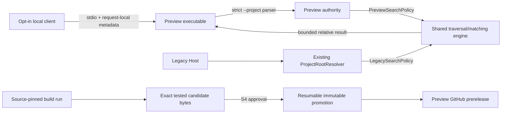

# Plan — A1 Safe Read-Only Stateless Preview

**Branch:** `work/stateless-preview-a1` | **Spec:** [spec.md](spec.md)

**Input:** [requirements checklist](checklists/requirements.md), [research](research.md), [data model](data-model.md), [architecture](architecture.md), [manifest schema](contracts/preview-manifest.schema.json), [promotion state machine](contracts/promotion-state-machine.md), and [ADR-004](../../docs/adr/ADR-004-stateless-preview.md).

## Summary

Deliver a Windows x64, self-contained, one-tool modern MCP preview beside the
unchanged Python route. It reuses only a policy-driven BCL traversal/matching
engine, isolates root authority and catalog at compile time, and promotes only
the exact source-run artifact that passed client and S2/S3 evidence.

## D2 calibration

**D2:** A1 adds a consumer artifact, strict local-file authority, exact modern
MCP contract, shared C# ownership seam, and approval-gated promotion workflow.
Wrong choices change legacy parity, expose local paths, or publish unverifiable
bytes across implementation/review/release sessions.

## Technical Context

| Context | Planned decision |
|---|---|
| Language/runtime | C# / .NET 8; preview uses MCP SDK 2.1.0 and compatibility host remains SDK 1.4.1. |
| Platform | Windows x64 self-contained single-file preview only. |
| Dependencies | BCL plus existing MCP SDK; no Python, bridge, DAP, Native Scene, mux, or HTTP dependency. |
| Storage/state | No preview server persistence; GitHub Actions artifact is build-to-promotion transport only. |
| Limits | The exact limits, failure order, output measurement, deadline, and cancellation rules in `spec.md` govern. |
| Tests | Policy/host parity, modern process contract, source-run consumer matrix, S2/S3 review, and post-publish identity proof. |

## Constitution Check

No `.specify/memory/constitution.md` exists in this checkout. Binding gates are
the repository `AGENTS.md`, parent D3 map, ADR-004, and this packet: no Python
cutover, strict file authority, consumer proof before tag, S4 publication
approval, and immutable recovery. **Result: PASS for planning only; rerun before
implementation.**

## Architecture



`NetCoreDbg.Mcp.CodeSearch.Core` owns `SymbolSearchEngine`, `SearchPolicy`,
final-target checking, traversal, ignore matching, C# matching, deterministic
results, and typed failures. It never chooses a root or references an MCP SDK.
`LegacySearchPolicy` preserves the existing host contract, including its current
extensions/result/order/error behavior. `PreviewSearchPolicy` supplies the
strict A1 limits and no-partial failures. `ProjectRootResolver` remains only in
the legacy adapter; preview owns launch-only strict parsing.

## Migration and exact parity owners

The legacy project adds a core reference and replaces only embedded engine use
in `NativeCodeSearch.cs`; `ProjectRootResolver.cs`, `RelayComposition.cs`, and
`ToolsRelay.cs` remain the SDK-1.4 root/relay adapter surface. Green migration
requires these exact owners to remain unchanged:

- `tests/test_host_proxy.py::test_host_native_code_search_has_exact_python_catalog_and_call_parity`
- `tests/test_host_proxy.py::test_host_publicly_owns_only_native_code_search_calls_and_retains_python_rollback`
- `tests/test_host_proxy.py::test_host_native_code_search_resolves_operator_client_and_cwd_roots_like_python`
- `tests/test_host_proxy.py::test_host_native_code_search_preserves_python_order_ignore_and_symlink_boundary`
- `tests/test_host_proxy.py::test_host_forwarded_search_timeout_is_structured_and_session_stays_usable`

A1 is parallel change in a strangler fig. Only opt-in users select preview; no
state/data/artifact transfers. Rollback removes preview selection and replays
the Python journey. Withdrawal stops future download only; any correction uses
a new immutable tag.

## Typed tracer tickets

| Ticket | Type | Blocks | Acceptance checkpoint |
|---|---|---|---|
| A1-T01 Freeze exact contracts and matrices | Explore | None | Contract fixes policy seam, exact metadata/schema/envelopes, launch/call matrix, ceilings/precedence, manifest equations, remote state machine, and S4 binding. |
| A1-T02 Add core/legacy RED suite | Test | T01 | RED tests encode preview strict authority/budget/no-partial behavior and legacy parity-policy fixtures. |
| A1-T03 Extract policy-driven BCL engine | Code | T01,T02 | T02 turns GREEN; `NetCoreDbg.Mcp.Host.csproj` references core and all five named Python/host parity owners remain GREEN. |
| A1-T04 Add preview modern-contract RED suite | Test | T01,T03 | RED process tests freeze namespaced metadata, first request, exact one-tool behavior, matrix, stdout, EOF, and excluded-route absence. |
| A1-T05 Compose closed preview executable | Code | T03,T04 | T04 turns GREEN; preview references no DAP/NativeScene/Python/bridge/mux component. |
| A1-T06 Implement manual build/promote workflow | Code | T01,T05 | Source-pinned build retains archive+manifest; promotion has no rebuild and implements the exact remote-state classifier. |
| A1-T07 Prove source-run candidate bytes | Test | T05,T06 | Downloaded build-run archive/manifest/exe, not a local substitute, pass full matrix, installed-client/EOF, manifest, Python rollback, and exact-hash receipt. |
| A1-T08 Run S2/S3 review of exact candidate | Review | T06,T07 | Security/code/workflow reviewers inspect the exact source-run hashes and candidate evidence; denominators are nonzero and clean. |
| A1-T09 Approve or decline exact promotion | Input | T08 | Operator approves/declines exact run ID, commit, tag, hashes, and prerelease destination. Decline leaves it unpublished. |
| A1-T10 Promote and post-publish identity proof | Test | T09 | `release` promotes only approved bytes; it classifies remote state, proves remote asset equality to T07, then replays install/shutdown/rollback from the published asset. |

## Milestone map

| Milestone | Tickets | Value |
|---|---|---|
| M1 — Approval-gated Stateless preview release | T01–T10 plus `release` handoff | Consumer can opt into a checksum-verified Windows x64 one-tool preview with a safe root boundary while Python remains default and rollback works. |

## Requirements-to-files map

| Requirement | Tickets | Planned files |
|---|---|---|
| A1-REQ-003–005 | T02,T03 | `host/NetCoreDbg.Mcp.CodeSearch.Core/{SymbolSearchEngine,SearchPolicy,SearchFailure}.cs`; `host/NetCoreDbg.Mcp.CodeSearch.Core.Tests/`; `host/NetCoreDbg.Mcp.Host/{NetCoreDbg.Mcp.Host.csproj,NativeCodeSearch.cs}` |
| A1-REQ-004 | T03 | `host/NetCoreDbg.Mcp.Host/{ProjectRootResolver.cs,RelayComposition.cs,ToolsRelay.cs}` only as adapter/parity consumers; five named `tests/test_host_proxy.py` owners |
| A1-REQ-002,005 | T04,T05 | `host/NetCoreDbg.Mcp.Stateless.Preview/{NetCoreDbg.Mcp.Stateless.Preview.csproj,Program.cs,PreviewProjectRootParser.cs,PreviewToolCatalog.cs,PreviewToolHandler.cs}` and preview process tests |
| A1-REQ-006 | T07,T10 | `tests/preview/`, external-client fixture, `docs/PRODUCTION-TESTING-PLAYBOOK.md` preview journey, source-run/post-publish receipts under `.agent/runs/` |
| A1-REQ-001,007 | T01,T06,T08,T09,T10 | `.github/workflows/stateless-preview.yml`, `specs/005-stateless-preview/contracts/{preview-manifest.schema.json,promotion-state-machine.md}`, `docs/RELEASE-PROTOCOL.md` preview collision/retry row, GitHub release assets |

## Publication mechanics

T06 supplies two manual workflow modes. `build` creates a retained archive/
manifest pair for a pinned commit. T07 downloads that pair and runs the complete
consumer/security evidence before T08 review and T09 approval. `promote` uses
only the approved run and delegates every retry to the state machine: it may
create an absent tag/release on first attempt, or resume only a matching
annotated-tag/matching draft-or-complete-prerelease state. It never rebuilds,
moves/deletes tags, overwrites assets, or turns a mismatch into recovery.

## Project Structure

```text
specs/005-stateless-preview/
├── spec.md
├── checklists/requirements.md
├── research.md
├── data-model.md
├── architecture.md
├── quickstart.md
├── contracts/
│   ├── preview-manifest.schema.json
│   └── promotion-state-machine.md
└── tasks.md

host/
├── NetCoreDbg.Mcp.CodeSearch.Core/           # Planned shared BCL traversal/matching
├── NetCoreDbg.Mcp.CodeSearch.Core.Tests/     # Planned policy/limit tests
├── NetCoreDbg.Mcp.Host/                      # Existing legacy adapter, core consumer
└── NetCoreDbg.Mcp.Stateless.Preview/          # Planned closed SDK-2.1 preview
```

`docs/RELEASE-PROTOCOL.md` gains only a preview-channel collision/retry row;
the existing Python channel remains authoritative for `vX.Y.Z` releases.
