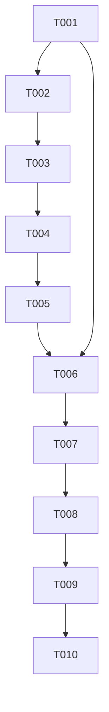

# Tasks: A1 Safe Read-Only Stateless Preview

**Input:** `specs/005-stateless-preview/{spec.md,plan.md,research.md,data-model.md,architecture.md,quickstart.md,contracts/}` and `docs/adr/ADR-004-stateless-preview.md`.

**Scope:** One Windows x64 opt-in `find_code_symbol` preview only. Python remains
default and rollback oracle. No task authorizes DAP, Native Scene, bridge,
Python cutover, PyPI/default selection, or publication before S4.

## Format and execution rules

- `[P]` means genuinely independent file ownership after listed dependencies.
- `[USn]` maps a task to a user story in `spec.md`.
- Every test task records RED before its implementation turns it GREEN.
- T009 is the S4 approval boundary; T010 publication is owned by `release`.

---

## Phase 1: Contract and shared-core foundation

**Purpose:** freeze A1 authority, preserve legacy parity, and create one
policy-driven traversal/matching owner before preview composition.

- [ ] T001 [US1] Freeze exact A1 metadata, tool/result/error, launch/call matrix, budget, manifest equation, source-run identity, and recovery-state contracts in `specs/005-stateless-preview/{spec.md,research.md,contracts/preview-manifest.schema.json,contracts/promotion-state-machine.md}`. **Acceptance:** every A1-REQ has a source-backed, closed observable contract; no future artifact/source SHA is fabricated.
- [ ] T002 [P] [US2] Write RED strict-preview and legacy-preservation tests in `host/NetCoreDbg.Mcp.CodeSearch.Core.Tests/` and extend the named parity owners in `tests/test_host_proxy.py`. **Depends on:** T001. **Acceptance:** tests distinguish `PreviewSearchPolicy` no-partial/refusal behavior from legacy root/order/ignore/error behavior.
- [ ] T003 [US1] Extract `SymbolSearchEngine`, `SearchPolicy`, and `SearchFailure` into `host/NetCoreDbg.Mcp.CodeSearch.Core/`, then reference it from `host/NetCoreDbg.Mcp.Host/{NetCoreDbg.Mcp.Host.csproj,NativeCodeSearch.cs}`. **Depends on:** T001, T002. **Acceptance:** T002 and all five named host/Python parity tests are GREEN; `ProjectRootResolver.cs` keeps legacy authority.

**Checkpoint:** one algorithm owner exists without changing the Python-selected
compatibility contract.

---

## Phase 2: User Story 1 — Safe opt-in symbol search

**Goal:** a fresh modern preview process exposes exactly one safe native route.

**Independent test:** use the future source-run artifact to discover/list/call
one contained symbol and observe the exact result and EOF shutdown.

- [ ] T004 [P] [US1] Write RED modern process-contract tests in `host/NetCoreDbg.Mcp.Stateless.Preview.Tests/` using the existing `host/NetCoreDbg.Mcp.Stateless.Tests/ModernMcp/ModernMcpProcessDriver.cs` patterns. **Depends on:** T001, T003. **Acceptance:** tests freeze namespaced metadata, first request, version/cache/catalog/input/text/structured contract, stdout purity, EOF, and prohibited-route absence.
- [ ] T005 [US1] Create the closed executable in `host/NetCoreDbg.Mcp.Stateless.Preview/{NetCoreDbg.Mcp.Stateless.Preview.csproj,Program.cs,PreviewProjectRootParser.cs,PreviewToolCatalog.cs,PreviewToolHandler.cs}`. **Depends on:** T003, T004. **Acceptance:** T004 is GREEN and the project graph has no DAP/NativeScene/Python/bridge/artifact/mux/HTTP reference or dispatch path.

---

## Phase 3: User Story 2 — Containment and deterministic refusal

**Goal:** all invalid authority, input, file, resource, and excluded-route cases
fail without unintended I/O or partial output.

**Independent test:** execute every required matrix row from the source-run
artifact and confirm its exact named outcome.

- [ ] T006 [US3] Implement manual source-pinned build/promotion workflow in `.github/workflows/stateless-preview.yml` and preview recovery authority in `docs/RELEASE-PROTOCOL.md`. **Depends on:** T001, T005. **Acceptance:** build retains an archive/manifest pair for one source SHA; a deterministic state-classifier fixture covers `unstarted`, `draft_empty`, `draft_partial`, `draft_complete`, `published_complete`, and `collision`; promotion implements every `contracts/promotion-state-machine.md` rule with no rebuild, Python `v*`/PyPI/default collision, overwrite, or tag move.
- [ ] T007 [US2] Download the T006 source-run pair and run RED-to-GREEN launch/configuration/fixture/tool/filesystem/resource/protocol/transport matrix tests in `tests/preview/` plus the external-client fixture. **Depends on:** T005, T006. **Acceptance:** complete T07 receipt records build run, source SHA, archive/manifest/executable hashes, full matrix, installed client, EOF, and Python rollback; no local substitute is accepted.

**Checkpoint:** exact candidate bytes—not merely source—prove safe consumer
behavior before review or publication approval.

---

## Phase 4: User Story 3 — Approved immutable promotion

**Goal:** a release owner can promote only the independently reviewed T07 bytes
and recover matching interrupted remote state without mutating identities.

**Independent test:** bind S4 inputs to the T07 receipt, promote/download remote
assets, prove byte equality, and replay the consumer/rollback journey.

- [ ] T008 [US3] Run dependency/CVE, .NET unsafe, OWASP path/input/output, secret/manifest, attack-surface, and two independent security reviews against T07's exact run/SHA/hashes; record the receipt in `.agent/reports/stateless-preview-s2s3-review.md`. **Depends on:** T006, T007. **Acceptance:** all S2/S3 denominators are nonzero with no unresolved high finding.
- [ ] T009 [US3] Capture exact S4 approve-or-decline decision in `specs/005-stateless-preview/contracts/approval-record.md`. **Depends on:** T008. **Acceptance:** record names T07 run, commit, tag, archive/manifest/executable hashes, destination, decision, and time; decline ends at local proof.
- [ ] T010 [US3] Invoke `release` to classify/promo the approved candidate and record post-publish proof in `.agent/runs/stateless-preview-<version>/`. **Depends on:** T009. **Acceptance:** release receipt incorporates T006's six-state classifier evidence; real promotion uses only approved bytes, handles only its legal matching recovery state, proves remote identity to T07, then replays installed search/EOF/Python rollback; mismatch hard-refuses.

---

## Final coverage and dependency map

| Requirement | Tasks |
|---|---|
| A1-REQ-001 | T001, T005, T006, T007, T010 |
| A1-REQ-002 | T001, T004, T005, T007 |
| A1-REQ-003 | T001, T002, T003, T007 |
| A1-REQ-004 | T002, T003 |
| A1-REQ-005 | T001, T002, T004, T007 |
| A1-REQ-006 | T006, T007, T010 |
| A1-REQ-007 | T001, T006, T007, T008, T009, T010 |

**Final checkpoint:** only T001–T010 completion plus an S4 approval records a
consumer-ready preview. No planning task authorizes a public release by itself.
