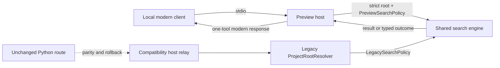

# Architecture: A1 Local Stateless Preview

## Ownership

| Component | Owns | Must not own |
|---|---|---|
| Shared core | Traversal, ignore matching, C# symbol matching, deterministic values, policy outcomes. | Root source selection, MCP SDK, response envelopes. |
| `LegacySearchPolicy` | Compatibility-preserving behavior. | Preview authority or fail-closed policy changes. |
| Legacy host adapters | Existing root precedence, relay/catalog, compatibility envelopes. | Preview tool registration. |
| `PreviewSearchPolicy` | Strict verified traversal, limits, typed no-partial outcomes. | Environment/client/CWD fallback authority. |
| Preview host | Exact CLI root parser and modern one-tool response adapter. | DAP, Native Scene, bridge, artifacts, Python relay, mux, HTTP. |
| Local fixture/tests | Deterministic positive/denial/rollback evidence. | Workflow, release, tag, or consumer distribution. |

## Data flow

## Safety invariants

1. Root selection happens before preview MCP startup and has exactly one CLI
   authority.
2. Preview file content arrives only through policy-verified traversal operations.
3. Any preview path, I/O, or budget refusal clears accumulated results before
   response serialization.
4. Compatibility policy retains existing intentional best-effort behavior;
   preview policy does not inherit it.
5. Static hard-link provenance is not claimed in this child; reparse/final-path
   containment is the enforced boundary.
6. The preview process retains no request metadata, session, artifact, or route
   configuration after a request or EOF.
