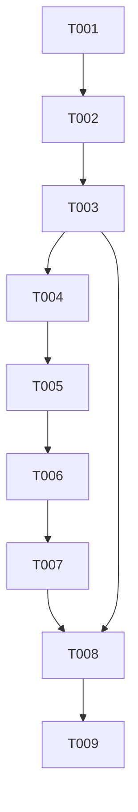

# Tasks: A1 Local Stateless Preview

**Input:** `specs/006-a1-local-preview/{spec.md,plan.md,research.md,data-model.md,architecture.md,quickstart.md,contracts/}` and parent `specs/005-stateless-preview/`.

**Scope:** Realize parent A1 T001–T005 and their direct local test, parity,
rollback, and one-checker acceptance evidence. Child task IDs T001–T009 are
local numbering; this iteration does not execute parent T006–T010. Every task
excludes `.github/workflows/**`, release protocol, artifacts, tags, PyPI,
package/default selection, publication, and S4.

## Execution Rules

- `[P]` marks genuinely independent files after their stated dependencies.
- Every test task establishes RED before the subsequent implementation turns it
  GREEN; no skip/mock/weakening substitutes for the missing behavior.
- Existing Python route, `ProjectRootResolver`, `RelayComposition`, and
  `ToolsRelay` behavior remain the rollback/parity contract.
- Static hard-link provenance is not a claim or test obligation in this child;
  reparse and final-path authority are enforced and tested.

---

## Phase 1: Shared policy core

**Purpose:** make one SDK-free engine own traversal/matching while preserving
legacy behavior through a distinct explicit policy.

- [ ] T001 [P] [US2] Create RED strict-preview policy tests in `host/NetCoreDbg.Mcp.CodeSearch.Core.Tests/{PreviewSearchPolicyBoundaryTests.cs,SymbolSearchEngineTests.cs}` covering core-owned verified root `.gitignore`/directory/`.cs` opens, reparse/final-path refusal, unreadable fault injection, no partial output, count/byte/result/response/deadline limits, cancellation, argument-before-I/O, and redaction. **Acceptance:** every core-owned path, I/O, resource, cancellation, and result-redaction case has a deterministic failing test with nonzero denominator; process launch/configuration/protocol/EOF cases remain T004/T007.
- [ ] T002 [US3] Extract `SymbolSearchEngine`, `SearchPolicy`, `SearchFailure`, and SDK-free ignore/matching helpers into `host/NetCoreDbg.Mcp.CodeSearch.Core/`; add references from `host/NetCoreDbg.Mcp.Host/{NetCoreDbg.Mcp.Host.csproj,NativeCodeSearch.cs}` and `netcoredbg-mcp.sln`. **Depends on:** T001. **Acceptance:** `LegacySearchPolicy` preserves current behavior; preview typed outcomes are available without MCP SDK/root-source selection; no duplicate engine remains in the host adapter.
- [ ] T003 [US3] Turn the core suite and existing compatibility parity owners GREEN in `host/NetCoreDbg.Mcp.CodeSearch.Core.Tests/`, `host/NetCoreDbg.Mcp.Host.Tests/`, `tests/test_code_search.py`, and `tests/test_host_proxy.py`. **Depends on:** T002. **Acceptance:** five named host/Python parity journeys, including root precedence and Python-owned timeout follow-up, pass unchanged; strict preview policy tests pass independently.

**Checkpoint:** the shared engine has one owner, while legacy behavior remains
reversible and Python stays the parity/rollback route.

---

## Phase 2: User Story 1 — Closed local modern preview

**Goal:** launch a fresh one-tool preview process against an explicit local root.

**Independent Test:** first-request discover/list/call succeeds; the catalog is
one tool; a contained symbol returns exact deterministic structured/text data;
EOF exits cleanly.

- [ ] T004 [P] [US1] Create RED process-contract tests in `host/NetCoreDbg.Mcp.Stateless.Preview.Tests/` using local launch/output-resolution patterns from `host/NetCoreDbg.Mcp.Stateless.Tests/ModernMcp/`; create deterministic C# fixture files in `tests/fixtures/PreviewSearchApp/`. **Depends on:** T003. **Acceptance:** failing tests cover supported request-local metadata and unsupported-version handling, exact catalog/input/result/error contract, strict launch roots, alternate authority denial, stdout purity, EOF, excluded routes, and local fixture behavior without DAP fixtures. Missing/malformed metadata is not a child-owned observable contract.
- [ ] T005 [US1] Implement `host/NetCoreDbg.Mcp.Stateless.Preview/{NetCoreDbg.Mcp.Stateless.Preview.csproj,Program.cs,PreviewProjectRootParser.cs,PreviewToolCatalog.cs,PreviewToolHandler.cs}` and add it plus its test project to `netcoredbg-mcp.sln`. **Depends on:** T003, T004. **Acceptance:** preview references only the shared core and modern MCP hosting dependencies; it has exactly one tool, no stateful/bridge/Python/mux/HTTP path, and its root parser is independent of `ProjectRootResolver`.
- [ ] T006 [US1] Turn preview process tests GREEN in `host/NetCoreDbg.Mcp.Stateless.Preview.Tests/` and run the positive section of `specs/006-a1-local-preview/quickstart.md`. **Depends on:** T005. **Acceptance:** source-run preview accepts discover/list/call as first request, has one read-only idempotent tool, returns exact bounded root-relative data, preserves metadata non-retention, emits only JSON-RPC on stdout, and exits after EOF.

---

## Phase 3: User Story 2 — Local containment proof

**Goal:** prove strict root/file/resource behavior on the real preview process.

**Independent Test:** all local denial matrix rows emit only their named outcome
with no outside-root content, partial result, or state carry-over.

- [ ] T007 [US2] Execute the full local denial matrix through `host/NetCoreDbg.Mcp.Stateless.Preview.Tests/` and `tests/preview/`, including invalid launch roots, environment/CWD/client-root non-authority, reparse/final-path fixtures, malformed input, unreadable fault seam, limits, cancellation, excluded methods/tools, and EOF. **Depends on:** T006. **Acceptance:** every A1L-REQ-001/003/005 denial outcome is proven against the process or injected verified-open seam; all failures clear partial results and redact root/exception/counter values.

---

## Phase 4: User Story 3 — Local rollback proof and independent acceptance

**Goal:** demonstrate that the local preview changes no selected consumer route.

**Independent Test:** remove preview selection, replay installed Python behavior,
and verify all compatibility owners before accepting the source slice.

- [ ] T008 [US3] Run the local rollback and focused acceptance playbook in `specs/006-a1-local-preview/quickstart.md`, recording the result in `.agent/runs/a1-local-preview/receipt.md`. **Depends on:** T003, T007. **Acceptance:** existing Python journey reaches `PRODUCT_WORKS`; legacy host parity stays green; preview source-run journey and full denial matrix pass; the receipt records no workflow, package, tag, release, or selector action.
- [ ] T009 [US3] Obtain one independent acceptance check for the exact local candidate and receipt; record it in `.agent/reports/a1-local-preview-acceptance.md`. **Depends on:** T008. **Acceptance:** the checker re-derives every A1L-REQ-001…006 and A1L-SC-001…005 from nonzero evidence, finds no unresolved blocking defect, and confirms workflow/publication surfaces untouched.

---

## Coverage and order

| Requirement | Tasks |
|---|---|
| A1L-REQ-001 | T001, T004, T005, T007 |
| A1L-REQ-002 | T004, T005, T006 |
| A1L-REQ-003 | T001, T004, T006, T007 |
| A1L-REQ-004 | T001, T002, T003, T008 |
| A1L-REQ-005 | T004, T006, T007 |
| A1L-REQ-006 | T003, T007, T008, T009 |
| A1L-SC-001 | T006, T008 |
| A1L-SC-002 | T001, T007, T008 |
| A1L-SC-003 | T003, T008 |
| A1L-SC-004 | T004, T006, T007 |
| A1L-SC-005 | T008, T009 |

**Final checkpoint:** this child ends with a locally implemented, source-run
preview and rollback proof only. It neither creates nor permits a workflow,
consumer artifact, tag, release, or publication.
