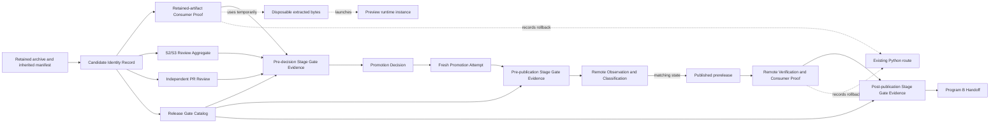

# Data model — A1 opt-in preview artifact runway

## Scope and authority

This model binds one Windows x64, self-contained, opt-in preview artifact from its retained build through a possible Program B handoff. It does not model a Python package release, change the `netcoredbg-mcp` command, select the preview by default, transfer runtime state, or authorize Program C work.

The inherited [preview manifest schema](../005-stateless-preview/contracts/preview-manifest.schema.json) remains the authority for `schema_version`, `version`, `tag`, `commit`, `rid`, `archive`, and `executable`. It also remains the authority for the archive and executable names, sizes, lowercase SHA-256 values, and manifest cross-field equations described in the parent research. This document does not restate or extend that schema.

Feature-local serialized forms are owned by these contracts:

- [Candidate Identity Record schema](contracts/candidate-identity.schema.json)
- [Promotion Decision schema](contracts/promotion-decision.schema.json)
- [Promotion recovery contract](contracts/promotion-recovery.md)

The field names below name the model. The linked contracts own JSON property spelling, canonical serialization, and machine validation. A reference to an immutable record includes the record identifier and the SHA-256 of its stored bytes.

## Lifetimes and storage classes

| Class | Contents | Authority and lifetime |
| --- | --- | --- |
| Retained candidate payload | The build-run ZIP archive and its raw manifest file. | The ZIP archive is the candidate payload. The manifest identifies its archive and executable member. GitHub Actions retention controls availability, but it does not change the payload identity. |
| Durable release evidence | Candidate Identity Record, Consumer Proof Receipt, S2/S3 Review Aggregate, Independent PR Review Receipt, Release Gate Catalog, Stage Gate Evidence, Promotion Decision, Promotion Attempt, Remote Observation, Remote Classification, Remote Verification, and Program B Handoff. | Each record is sealed once. A later observation, stage result, attempt, or decision creates another record and never edits an earlier one. |
| Disposable verification material | Download directory, extracted executable, process-local logs, and fixture-specific process state. | It exists only to verify downloaded bytes. It is not candidate authority and must not be used as promotion input. |
| Preview runtime state | One local stdio process and its selected `--project` root. | It ends with the process. A1 creates no shared process, session, subscription, artifact handle, or persisted state. |
| Existing rollback route | The installed Python package, `netcoredbg-mcp` command, default selection, and established Python consumer journey. | It remains outside the candidate. A1 records rollback evidence about it but does not modify it. |

The candidate identity closes over this tuple: the source commit, build run and retained artifact, raw manifest bytes, manifest-defined archive and executable identities, preview version and tag, and intended prerelease destination. A record that differs in any member describes a different candidate.

## Candidate Identity Record

The Candidate Identity Record is the durable association between the retained payload and the candidate that can receive proof, review, or a decision. Its serialized root contains `schema_version` and `candidate` as defined by the [Candidate Identity Record schema](contracts/candidate-identity.schema.json).

### Fields

| Field | Content |
| --- | --- |
| `schema_version` | The version of the Candidate Identity Record contract. |
| `candidate` | The immutable candidate object. It contains `source`, `build`, `preview_manifest`, and `destination`. |
| `candidate.source` | The full source revision, canonical `refs/heads/main` target, and trusted merged-main build provenance. The commit, canonical main target, inherited manifest `commit`, and tag target must be equal. |
| `candidate.build` | The trusted manual-build workflow/run/ref/SHA provenance, retained artifact ID/digest, and recorded retention metadata for the payload. |
| `candidate.preview_manifest` | `file` identifies the raw manifest asset and its SHA-256. `contents` carries the inherited parent-manifest values for version, tag, RID, archive, and executable. It is not a second manifest schema. |
| `candidate.destination` | The intended GitHub prerelease destination, including the preview tag and expected archive and manifest assets. It excludes PyPI and the Python release channel. |

### Validation rules

- The record is valid only when the retained archive and raw manifest are available from the recorded trusted build run, which executed from canonical `refs/heads/main` at the exact candidate commit.
- The manifest bytes validate against the inherited schema. Its cross-field equations bind the preview version, tag, archive name, manifest filename, executable member, sizes, and SHA-256 values.
- `candidate.source`, canonical main target, build-run head SHA/ref, preview version, tag, RID, archive identity, executable identity, and any post-merge tag/scan target must exactly equal the manifest/candidate source commit.
- The build run, artifact ID, artifact digest, archive bytes, manifest bytes, and executable member must all describe the same candidate. A local rebuild, source-tree output, later workflow run, replacement artifact, arbitrary reachable commit, unmerged branch commit, or unrelated post-merge receipt fails validation.
- Retention metadata records the actual GitHub configuration. It does not impose a repository retention period.
- The destination is a separate opt-in GitHub prerelease destination. The record must not point to `.github/workflows/publish.yml`, PyPI, the Python `v*` namespace, or the default Python route.
- A sealed record is immutable. Corrected inputs require a new Candidate Identity Record and, when the version or tag changes, a new preview namespace value.

### State transitions

```text
assembled -> validated -> sealed
assembled or validated -> refused
sealed -> no transition
```

Only `sealed` records can receive proof, review, a decision, or a remote observation. A refused assembly is not repaired in place.

## Consumer Proof Receipt

A Consumer Proof Receipt is durable evidence that an independently downloaded candidate completed the required consumer or post-publication journey. It records results, not extracted files or live process state.
The serialized receipt validates against the [Artifact Consumer Proof schema](contracts/artifact-consumer-proof.schema.json). Every durable record reference is a closed `github_artifact_file_reference` (repository, run ID, artifact ID, safe relative path, and raw-byte SHA-256); a URI, local path, artifact name, or matching commit alone is never an authority.

### Fields

| Field | Content |
| --- | --- |
| `receipt_schema_version`, `receipt_id`, and `receipt_sha256` | The receipt format and immutable receipt identity. |
| `proof_stage` | Either `retained_artifact` before S4 or `remote_release` after a published prerelease exists. |
| `candidate_identity_record` | A closed GitHub artifact-file reference to the sealed Candidate Identity Record and its raw-byte SHA-256. |
| `download_origin` | For `retained_artifact`, the recorded Actions repository/workflow/run/artifact/files. For `remote_release`, the observed GitHub prerelease assets and their fresh download facts. |
| `input_identity_results` | Raw manifest, archive, and extracted executable size and SHA-256 checks, plus the inherited manifest equation results. |
| `fixture_identity` | A non-secret fixture and scenario-set identifier. Durable evidence does not store a private local project path. |
| `scenario_results` | The positive journey and every defined launch, authority, input, containment, resource, protocol, transport, shutdown, and rollback denial outcome. Each row records its scenario ID, observed result, and result status. |
| `runtime_results` | The explicit `--project` launch assertion, one-tool discovery/list/call result, stdout JSON-RPC purity result, and EOF/clean-exit result. |
| `python_rollback_result` | Evidence that removing only preview selection left the installed Python route unchanged and that its established consumer journey reached `PRODUCT_WORKS`. |
| `outcome` and `recorded_at` | The terminal pass, fail, or refusal result and audit time. Measured elapsed time may be recorded for traceability, but it is not a release target. |
| `producer` | The post-implementation producer `python tests/preview/validate_preview_artifact.py`, whose record must validate against the proof schema and semantic closure rules. This data model does not claim that the command has run. |

### Validation rules

- The proof downloads the archive and manifest through `download_origin`. It verifies all recorded identities before extraction, launch, or MCP traffic.
- The proof launches only the executable extracted from the verified archive, with exactly `--project <fixture-root>`. It never launches repository `bin/**` output or a rebuilt executable.
- The executed scenario set has a nonzero defined denominator. Each defined row has a recorded outcome. An omitted row requires an explicit documented exclusion, and an exclusion cannot replace an executed required row.
- `retained_artifact` proof must bind the retained candidate payload before it can become an entry in passing `pre-decision` Stage Gate Evidence.
- `remote_release` proof must use freshly downloaded public prerelease assets. Its archive, manifest, and executable results must equal both the Candidate Identity Record and the retained-artifact proof.
- The rollback result removes only the preview selection before state exists. It must not reinstall, replace, or reconfigure the Python package, entry point, or default selector.
- A terminal receipt is immutable. A rerun creates a new receipt rather than changing earlier results.

### State transitions

```text
planned -> identity_verified -> executing -> sealed_pass
planned or identity_verified or executing -> sealed_fail
planned or identity_verified -> sealed_refused
```

`sealed_pass`, `sealed_fail`, and `sealed_refused` are terminal. Only a `sealed_pass` retained-artifact receipt can contribute to passing pre-decision Stage Gate Evidence.

## S2/S3 Review Aggregate

The S2/S3 Review Aggregate is one immutable closed record for all seven required lenses. It validates against the [S2/S3 Review schema](contracts/s2-s3-review.schema.json) and is distinct from the Promotion Decision and independent PR review.

### Fields

| Field | Content |
| --- | --- |
| `receipt_id` and sealed record reference | A bounded opaque review identifier and the enclosing immutable GitHub artifact-file reference. |
| `candidate_identity_reference` | The closed Candidate Identity Record reference and exact canonical-main binding. |
| `results` | The seven ordered required S2/S3 lens results, each with a nonzero denominator, closed status/result code, and no raw diagnostic text. |
| `coverage_summary` | Derived `7/7/0` lens completion and unresolved-high result; it is never caller-supplied admission data. |
| `outcome` and `recorded_at` | Closed pass/fail/incomplete/refused status and record time. |
| `producer` | The future independent review producer and semantic sealing operation; no raw path, command, secret, or diagnostic enters the durable receipt. |

### Validation rules

- Required S2/S3 coverage is exactly the D3 program's dependency/CVE, .NET unsafe-pattern, OWASP input/output/path, attack-surface, secret/asset-manifest, path/process fail-closed, and exploitability lenses in closed order.
- Each lens denominator is nonzero and every result uses the shared bounded ID/status/result-code vocabulary. A missing, zero, stale, candidate-mismatched, path-bearing, or unredacted receipt makes the evidence ineligible for `APPROVE`.
- An unresolved high-severity finding makes the evidence ineligible for `APPROVE`.
- A review receipt can inspect source/workflow only when canonical main commit, trusted build run, artifact, manifest, archive, and executable bindings equal the Candidate Identity Record.
- The receipt does not grant promotion. A GitHub environment reviewer can guard workflow execution, but it cannot replace the Decision, current Promotion Attempt, or this review record.

### State transitions

```text
planned -> reviewing -> sealed_pass
planned or reviewing -> sealed_fail
planned or reviewing -> sealed_incomplete
```

Every sealed review receipt is immutable. A corrected candidate needs fresh review evidence.

## Stage Gate Evidence

Stage Gate Evidence is the sealed exact-candidate record defined by [stage-gate-evidence.schema.json](contracts/stage-gate-evidence.schema.json). It carries evidence for one catalog stage only. It does not predict or substitute evidence for another stage.

### Fields

| Field | Content |
| --- | --- |
| `stage_evidence_id` and producer | A bounded opaque ID and the future semantic-sealing operation. |
| `candidate_identity_record`, candidate, source ref, and source commit | The one canonical-main candidate that every entry must match. |
| `release_gate_catalog` | The sealed static catalog that defines the stage subset. |
| `stage` | Exactly one of `pre-decision`, `pre-publication`, or `post-publication`. |
| `gate_evidence` | The complete catalog-defined descriptor/evidence set for that stage, with structural typed record references and closed results. |

### Validation rules

- The catalog is static applicability. Stage Gate Evidence is the later proof that one stage's descriptors are satisfied. The catalog does not require a future stage record before it exists.
- The resolver derives the descriptor subset for `stage` and requires exact ordered equality. It rejects missing, duplicate, extra, stale, wrong-type, wrong-stage, candidate-mismatched, or failed entries.
- The `pre-decision` set includes retained downloaded consumer proof, the sealed seven-lens aggregate, the distinct independent PR review, and candidate exact-head Sonar. It admits an `APPROVE` Decision only when every entry passes.
- The `pre-publication` set includes post-merge exact-head Sonar for the canonical candidate commit. The fresh Promotion Attempt requires it before the first remote mutation.
- The `post-publication` set includes freshly downloaded remote consumer/byte proof. Only closeout and Program B Handoff require it.

### State transitions

```text
collecting -> sealed_pass
collecting -> sealed_fail
sealed_pass or sealed_fail -> no transition
```

## Release Gate Catalog

The Release Gate Catalog is the exact-head applicability record defined by [release-gate-catalog.schema.json](contracts/release-gate-catalog.schema.json). It contains definitions only, not gate outcomes or mutable remote evidence.

### Fields

| Field | Content |
| --- | --- |
| `catalog_schema_version`, producer, and resolution time | Closed catalog format, resolver operation, and audit time. |
| `candidate_identity_record`, `source_ref`, and `source_commit` | The same structural candidate reference, literal `refs/heads/main`, and exact canonical candidate commit. |
| `policy_authority_snapshots` | Exactly five raw-byte SHA-256 snapshots at that commit: `AGENTS.md`, `CONTRIBUTING.md`, `docs/RELEASE-PROTOCOL.md`, `docs/adr/ADR-004-stateless-preview.md`, and this feature's `spec.md`. |
| `gate_descriptors` | Exactly six fixed descriptor rows. Each names one stage, gate ID, typed record, authority rule codes, and evidence requirement codes. |

### Validation rules

- Candidate source/build ref, canonical main target, post-merge scan/tag target, catalog source commit, and every authority snapshot head must agree exactly.
- The independent `resolve_release_gate_catalog` operation re-derives all five policy hashes, six descriptor rows, typed record shapes, and requirement/rule codes. A caller list, count, same-repository JSON, untracked `.agent` file, or newer branch readback is never catalog authority.
- The catalog maps each current release-protocol obligation to a descriptor or to a named, bounded inapplicability disposition. The implementation tests reject an omitted or silent disposition.

### State transitions

```text
deriving -> sealed
deriving -> refused
sealed or refused -> no transition
```

## Promotion Decision

The Promotion Decision is the candidate-approval record defined by [promotion-decision.schema.json](contracts/promotion-decision.schema.json). It pre-authorizes one candidate and names its decision author plus authorized GitHub dispatcher. It does not contain a historical consuming run.

### Fields

| Field | Content |
| --- | --- |
| `candidate_identity_record` and candidate | A closed canonical-main candidate reference and exact embedded binding. |
| `pre_decision_stage_evidence` | One passing Stage Gate Evidence record for exactly the `pre-decision` descriptor subset. |
| `decision` | Exactly `APPROVE` or `DECLINE`. |
| `decision_author`, `authorized_dispatcher`, and attempt template | Structured GitHub identities and a static template. A future attempt adds live run facts. |
| `decided_at` | The decision time. |

### Validation rules

- `APPROVE` requires passing retained proof, the closed `7/7/0` aggregate, distinct independent PR review, and candidate exact-head Sonar through the pre-decision Stage Gate Evidence set.
- `APPROVE` does not require post-merge or remote proof. Those facts do not exist at this stage.
- The Decision is not a permission readback. Only its named dispatcher may create a fresh Promotion Attempt.
- `DECLINE` can preserve negative evidence but never admits mutation.

## Promotion Attempt

A Promotion Attempt is the fresh execution-authorization record defined by [promotion-attempt.schema.json](contracts/promotion-attempt.schema.json). It binds one `APPROVE` Decision to the current `workflow_dispatch` invocation before remote mutation.

### Fields

| Field | Content |
| --- | --- |
| `attempt_id` and `recorded_at` | A bounded opaque attempt ID and audit time. |
| `candidate_identity_record` and `promotion_decision` | Closed record references whose raw bytes/hash and embedded candidate equality must match. |
| `dispatcher` and `workflow_run` | The current authenticated `github.actor` and the current canonical promote run ID, attempt, ref, SHA, and dispatch event. |
| `permission_readback` | The current run's sealed readback proving required permissions. |
| `pre_decision_stage_evidence` and `pre_publication_stage_evidence` | The approved pre-decision set and the newly validated pre-publication set. |
| `remote_observation` and `remote_classification` | Fresh current-attempt records used to select the only legal remote action. |

### Validation rules

- The current actor, run ID, run attempt, ref/SHA, Decision hash, authorized dispatcher, and permission readback must agree exactly. A different dispatcher or old attempt is refused.
- The attempt revalidates the Decision's pre-decision set and requires a passing pre-publication set before it creates a tag, release, or asset. It must not require post-publication proof.
- The same authorized dispatcher may retry only through a new attempt and fresh matching classification. An attempt cannot start Program B/C.
## Remote Observed State

Remote Observed State is a sealed point-in-time observation of the prerelease destination that validates against [remote-observation.schema.json](contracts/remote-observation.schema.json). The [Promotion recovery contract](contracts/promotion-recovery.md) and [remote-classification schema](contracts/remote-classification.schema.json) derive the only allowed action from it. It records closed live-readback facts, never arbitrary diagnostics.

### Fields

| Field | Content |
| --- | --- |
| `observation_id` and `observed_at` | A bounded opaque snapshot identity and observation time. |
| `candidate_identity_record` and `promotion_attempt` | Closed references to the same canonical candidate and fresh consuming attempt. |
| `retained_artifact_availability` | A closed availability/status code for the recorded Actions payload. |
| `tag_observation` and `release_observation` | Closed absence/presence/type/state facts, tag name, peeled target commit, and expected prerelease metadata. |
| `asset_observations` | Bounded expected asset identities, metadata size, downloaded-byte size, and SHA-256 comparison results. |
| `readback_status` | A closed complete/unreadable status and safe reason code; no raw API, path, endpoint, or credential text. |

### Validation rules

- Each promotion or recovery attempt obtains a fresh Remote Observed State before a remote mutation.
- A tag matches only when it is annotated, has the approved tag name, and peels to the approved source commit.
- A release matches only when it targets that tag, retains the approved destination metadata, and has the required draft or prerelease state.
- Asset metadata alone does not prove identity. The observer downloads remote assets and compares their bytes, sizes, and SHA-256 values to the Candidate Identity Record and inherited manifest.
- An unreadable API response, incomplete asset readback, unavailable retained artifact, or mismatched byte result remains an observation. It is never treated as an absent tag or release.
- The snapshot is immutable. A later retry creates a new Remote Observed State.

### State transitions

```text
requested -> sealed_complete
requested -> sealed_unreadable
sealed_complete or sealed_unreadable -> no transition
```

## Recovery Classification

Recovery Classification derives the only permitted promotion action from one Candidate Identity Record and one sealed Remote Observed State. It is immutable evidence for one attempt. It is not a mutable field on the candidate.

### Fields

| Field | Content |
| --- | --- |
| `classification_id`, `classification_sha256`, and `classified_at` | The immutable classification identity and time. |
| `candidate_identity_reference` | The candidate used for all comparisons. |
| `remote_observed_state_reference` | The sealed observation that was classified. |
| `state` | One of `unstarted`, `tag_only`, `draft_empty`, `draft_partial`, `draft_complete`, `published_complete`, or `collision`. |
| `admission` | Whether promotion may perform the stated action. |
| `allowed_action` | The sole remote action permitted for the observed state, or `refuse`. |
| `reason_codes` | The identity mismatch, unreadability, expiry, or matching facts that produced the classification. |

### Validation rules and transitions

The [Promotion recovery contract](contracts/promotion-recovery.md) owns the serialized classifier. The following model rules are mandatory.

| Observed state | Required facts | Allowed action | Resulting state or result |
| --- | --- | --- | --- |
| `unstarted` | The approved retained artifact is available. The approved tag and release are both absent. | Create the annotated tag at the approved commit and create the matching draft prerelease. | `draft_empty`. An interruption after tag creation is observed as `tag_only`. |
| `tag_only` | The approved annotated tag exists and peels to the approved commit. No release exists. | Create only the matching draft prerelease. Do not recreate, move, or delete the tag. | `draft_empty`. |
| `draft_empty` | The matching annotated tag and draft prerelease exist. Neither approved asset exists. | Upload only the approved archive and manifest. | `draft_partial` or `draft_complete`. |
| `draft_partial` | The matching tag and draft prerelease exist. The observed asset set is a proper subset of the approved asset pair, and every existing asset exactly matches its expected name, size, and SHA-256. | Upload only the missing approved asset or assets. | `draft_complete`. |
| `draft_complete` | The matching tag and draft prerelease exist. Both approved assets have matching remotely downloaded bytes. | Re-verify both assets and publish the prerelease. | `published_complete`. |
| `published_complete` | The matching annotated tag and published prerelease exist. Both remotely downloaded assets match the candidate. | Do not mutate. Produce the remote-release Consumer Proof Receipt. | Post-publication proof only. |
| `collision` | Any other observation, including a wrong tag type or target, mismatched release metadata, mismatched asset, unexpected asset identity, incomplete non-draft release, unavailable retained artifact, or unreadable readback. | Refuse. Do not mutate a remote object. | A corrected payload requires a new candidate, version, and tag as applicable. |

The normal remote sequence is `unstarted` to `draft_empty` to `draft_partial` to `draft_complete` to `published_complete`. `tag_only` is the safe recovery state for an interruption after the tag exists but before a release exists. Any state may produce a later `collision` classification when a fresh observation no longer matches.

No classification permits `--clobber`, asset replacement, asset deletion, tag movement, tag deletion, tag reuse, or release replacement. Recovery always starts with a new Remote Observed State.

## Program B Handoff

The Program B Handoff is the durable A1 closeout record defined by the [Program B Handoff schema](contracts/program-b-handoff.schema.json). It proves that A1 reached its handoff gate through an exact [Release Gate Catalog](contracts/release-gate-catalog.schema.json); it does not authorize Program B implementation by itself.

### Fields

| Field | Content |
| --- | --- |
| `handoff_schema_version`, `handoff_id`, and `producer` | The closed handoff format, identifier, and future helper operation that produced it. The stored record's raw-byte SHA-256 lives in its enclosing GitHub artifact-file reference, never as a self-hash. |
| `candidate_identity_record`, candidate, source ref, and source commit | The sealed Candidate Identity Record's structured reference, exact embedded binding, canonical `refs/heads/main`, and exact source head. |
| `approved_promotion_decision` and `promotion_attempt` | One immutable `APPROVE` Decision and its fresh matching current-attempt authorization record. |
| `pre_decision_stage_evidence`, `pre_publication_stage_evidence`, and `post_publication_stage_evidence` | Three passing Stage Gate Evidence records that each bind the same static catalog and their exact descriptor subset. |
| `published_remote_observation`, `published_remote_classification`, and `remote_verification_receipt` | A complete published prerelease observation, `published_complete` classifier, and remote archive/manifest/executable verification for the same attempt and candidate. |
| `remote_consumer_proof` | A passing `remote_release` Artifact Consumer Proof Receipt for freshly downloaded public assets. |
| `release_gate_catalog` | The static exact-head catalog with five tracked authority snapshots and six fixed descriptors. |
| `completion_scope`, `program_b_authorization_required`, and `program_c_authorization_required` | The constant A1 completion scope and two literal `true` flags that prevent the record from claiming either later authorization. |
| `recorded_at` | The time when the handoff record was sealed. |

### Validation rules

- A handoff validates only through the Program B Handoff semantic validator: it resolves and hashes every structured record, validates its typed shape, and requires canonical candidate/source equality across the Candidate Identity, Decision, Attempt, stage evidence, remote evidence, proof, and catalog.
- The Decision must be `APPROVE`; its named dispatcher must match the fresh Attempt actor/run/permission readback. The Attempt must carry passing pre-decision and pre-publication evidence before remote mutation.
- The remote classification must be `published_complete`; remote archive, manifest, and executable bytes must equal the Candidate Identity Record; and the remote Consumer Proof Receipt must pass the complete matrix, clean EOF, and unchanged Python rollback.
- The static catalog must bind the same exact head and five authority snapshots. The handoff requires a passing stage record for each of the three stages, so the post-publication remote proof is required only after publication.
- Literal `program_b_authorization_required: true` and `program_c_authorization_required: true` prove the handoff is evidence only. The record cannot start Program B/C, change Python/default selection, or contain extracted executable, local project path, process ID, debug session, subscription, artifact handle, or preview runtime state.

### State transitions

```text
assembled -> sealed_ready_for_separate_program_b_authorization
assembled -> sealed_not_ready
sealed_ready_for_separate_program_b_authorization or sealed_not_ready -> no transition
```

A separately accepted Program B scope may cite a sealed ready handoff. It is a separate authorization record, not a transition that changes the A1 handoff.

## Disposable extracted bytes and preview runtime state

### Extracted verification bytes

| Field | Content |
| --- | --- |
| `archive_reference` | The downloaded archive digest and manifest reference used for extraction. |
| `extraction_location` | The temporary extraction location. It is not durable evidence. |
| `executable_member_result` | The extracted member name, size, and SHA-256 comparison to the manifest. |
| `disposal_result` | Whether the temporary extraction and process state were removed after the proof attempt. |

The state is `absent -> extracted -> reverified -> launched or rejected -> disposed`. A mismatch goes directly to `rejected` and then `disposed`. Extracted bytes cannot become a candidate, a Stage Gate Evidence entry, a Promotion Decision input, or a remote asset source.

### Preview runtime instance

| Field | Content |
| --- | --- |
| `runtime_id` | A process-local execution identifier. It is not a durable release identifier. |
| `executable_reference` | The reverified extracted executable that started the process. |
| `project_authority` | The one explicit local `--project` root for this process. |
| `lifecycle` | `not_started`, `launch_refused`, `running`, `stdin_closed`, `exited`, or `terminated`. |
| `observed_protocol_result` | The process-local MCP behavior summarized by the Consumer Proof Receipt. |

The runtime state is `not_started -> launch_refused` or `not_started -> running -> stdin_closed -> exited`. A failed execution moves to `terminated` before disposal. It has no shared daemon, remote listener, process reuse, or stateful session. Only the durable Consumer Proof Receipt retains the allowed outcome summary.

## Python rollback relationship

The Python route is an external retained relationship, not an A1 payload or promotion state. Both proof stages record the same rollback rule:

```text
installed Python route selected by default
  -> preview selected explicitly
  -> preview selection removed before state exists
  -> unchanged Python route replayed to PRODUCT_WORKS
```

An identity failure, failed proof, declined decision, recovery collision, or unpublished candidate leaves the Python route selected and usable. No A1 transition changes the Python package, console entry point, default selector, version namespace, or existing release workflow.

## Relationships



A durable record can reference an earlier durable record only when their candidate bindings match exactly. Disposable extracted bytes and runtime state may support a proof, but neither can replace a retained archive, a manifest, an evidence receipt, a decision, a remote observation, or the unchanged Python rollback route.
