# Implementation Plan: A1 Opt-In Preview Artifact Runway

**Branch**: `010-a1-preview-artifact` | **Date**: `2026-08-26` | **Spec**: [spec.md](spec.md)

**Input**: Feature specification from `specs/010-a1-preview-artifact/spec.md`; the accepted A1 local source-run packet in `specs/005-stateless-preview/`; the Program A D3 map; and ADR-004.

## Summary

Turn the existing Windows x64, one-tool, opt-in .NET preview into a consumer-real artifact runway: source-pinned build, retained artifact and identity record, independently downloaded consumer and denial proof, exact-candidate security/review evidence, explicit promotion decision, and resumable GitHub prerelease promotion. The public Python package, `netcoredbg-mcp` command, default selection, and rollback journey remain unchanged. Program B starts only after the exact approved preview is published and its remote bytes are verified; Program C remains separately authorized work. This Plan stage designs and verifies those future implementation/release interfaces; it does not itself create a tag, release, asset, or Program B change.

## Technical Context

**Language/Version**: C# / .NET 8 (`net8.0`) for the preview executable; Python >=3.10 remains the unchanged public consumer route.

**Primary Dependencies**: `ModelContextProtocol` 2.1.0, `Microsoft.Extensions.Hosting` 10.0.10, the existing `NetCoreDbg.Mcp.CodeSearch.Core` project, GitHub Actions artifacts and GitHub prerelease APIs.

**Storage**: No runtime persistence. Candidate identity, proof, decision, and promotion records are immutable release evidence; retained GitHub Actions artifacts and GitHub prerelease assets are the distribution stores.

**Testing**: .NET xUnit process/contract tests, existing Python pytest compatibility coverage, and independently installed consumer MCP journeys against downloaded candidate and remote bytes.

**Target Platform**: Windows x64 self-contained local-stdio preview executable; GitHub-hosted build and opt-in GitHub prerelease distribution.

**Project Type**: Native .NET MCP CLI artifact, GitHub Actions build/promotion workflow, and release/consumer documentation contracts.

**Performance Goals**: No new artifact size, throughput, or proof-duration target is imposed without an existing contract. Record measured archive/executable bytes and elapsed proof duration for traceability; retain the existing 256 KiB MCP response cap and test-local 2/5-second bounds only for their current contracts.

**Constraints**: Build once and promote the same bytes; bind source, archive, manifest, executable, review, approval, and remote proof to one candidate identity; fail closed on mismatch; preserve closed catalog, strict local-root authority, stdout purity, and Python rollback; never overwrite/move/delete tags or conflicting assets; keep Program B/C outside scope.

**Scale/Scope**: One `win-x64` self-contained executable, one read-only `find_code_symbol` route, one opt-in preview destination, two released assets (archive and manifest), and one candidate identity per promotion attempt.

## Constitution Check

No `.specify/memory/constitution.md` exists in the current checkout; the installed plan template is generic and non-authoritative. Binding planning gates are [`AGENTS.md`](../../AGENTS.md), [`CONTRIBUTING.md`](../../CONTRIBUTING.md), [`docs/RELEASE-PROTOCOL.md`](../../docs/RELEASE-PROTOCOL.md), the [Program A D3 map](../../.agent/runs/python-removal-strangler-program-v1/stateless-convergence-program-v4.md), [ADR-004](../../docs/adr/ADR-004-stateless-preview.md), and this feature specification.

| Gate | Initial evaluation |
|---|---|
| Preserve the public Python/default route and its rollback proof | PASS — explicitly bounded by FR-001, FR-004, FR-010, and FR-011. |
| Bind every proof/review/promotion step to one exact downloaded artifact | PASS for research — FR-002 through FR-009 require the binding; Phase 0 must choose the concrete record and verifier shape. |
| Keep the preview isolated to one local, read-only, opt-in route | PASS — inherited A1 architecture and FR-004/FR-011 exclude DAP, UI, stateful, Python, and default-selection work. |
| Fail closed for identity, containment, review, and recovery failures | PASS for research — FR-005, FR-006, and FR-009 require denials; Phase 1 must express their interfaces and state transitions. |
| Respect release, security, review, consumer-proof, and immutable-tag boundaries | PASS for planning only — no publication is authorized by this plan; promotion remains an explicit S4/release boundary after its named evidence passes. |
| Keep secrets and private local paths out of tracked evidence | PASS — contracts use public identifiers/hashes and generic fixture paths only. |

**Initial result: PASS for Phase 0 research.** Research resolved the technical inputs without a gate violation; Phase 1 must now make the candidate, evidence, decision, and recovery interfaces enforceable.

## Design Depth

**D2 justification:** This plan is a child of the existing Program A D3 cut, not a new program. A wrong artifact identity, promotion, or recovery decision affects a durable external consumer/release contract across multiple source, workflow, review, and release sessions; the artifact is therefore multi-consumer and lives as long as the preview channel. The plan will meet the D2 floor with alternatives, an ADR-bound decision, tracer-bullet tickets, acceptance checkpoints, a milestone map, a requirements-to-files map, and the existing parallel-change rollback boundary—without re-expanding Program B or Program C.


## Architecture Decision

### Alternatives

| Shape | Decision | Rationale |
|---|---|---|
| Extend the existing Python `publish.yml` tag/PyPI workflow | Rejected | Its `v*` trigger, Python `dist/` artifact, independent non-draft release job, and PyPI environments belong to the default Python channel. They cannot establish proof before S4 or preserve a separate preview namespace. |
| Two independent build and promotion workflows | Deferred | It can preserve a cross-run handoff but creates another workflow identity and additional drift. The accepted parent A1 plan already selects one explicit manual workflow with two modes. |
| One manual preview workflow with `build` and `promote` modes | Selected | It preserves build-once/promote-same identity, makes the approval handoff explicit, keeps the preview namespace isolated, and can serialize mutations per preview tag. |
| Preview PyPI package or default-selector change | Rejected | That changes the Python consumer route and belongs to Program C, not this opt-in artifact runway. |

### Selected architecture

The existing [ADR-004](../../docs/adr/ADR-004-stateless-preview.md) remains the architecture decision for the separate one-tool executable and its strict root authority. This plan extends its release mechanics without changing its runtime route: a manual `stateless-preview.yml` build emits a retained candidate archive and manifest for one exact source commit; downloaded candidate proof and S2/S3 evidence create immutable records; an explicit S4 Decision authorizes exactly one `promote` attempt; live remote classification then creates or resumes only the matching prerelease state. The existing Python workflow and public selector remain a parallel, unchanged route.

### Planning versus release execution

This planning pass does not perform a live `promote` action. AR-05 specifies the code and workflow behavior that implements FR-008 through FR-010; AR-06 specifies the future release-stage remote proof required by FR-012/FR-013 after an exact S4 approval. They remain within this feature's implementation plan because the accepted specification and clarification require a published, remotely verified preview before Program B, but neither is authority for the current planning session to publish or begin Program B.

```mermaid
flowchart LR
  PY[Published Python route\nunchanged default and rollback] --> RB[Rollback proof]
  SHA[Canonical main source SHA] --> BUILD[Manual build mode]
  BUILD --> ART[Retained Actions artifact\narchive + manifest]
  ART --> CID[Candidate Identity Record]
  CID --> CP[Downloaded candidate\nconsumer + denial proof]
  CID --> Review[S2/S3 Review Aggregate\nand independent PR review]
  CID --> Catalog[Release Gate Catalog]
  CP --> PreDecision[Pre-decision Stage Gate Evidence]
  Review --> PreDecision
  Catalog --> PreDecision
  PreDecision --> DEC{S4 decision}
  DEC -->|DECLINE| PY
  DEC -->|APPROVE| Attempt[Fresh Promotion Attempt]
  Catalog --> PrePublication[Pre-publication Stage Gate Evidence]
  Attempt --> PrePublication
  PrePublication --> REMOTE[Matching-only remote promotion]
  REMOTE --> PostPublication[Post-publication Stage Gate Evidence]
  PostPublication --> HANDOFF[Program B handoff record]
  REMOTE -->|collision or unreadable state| REFUSE[Fail closed; new candidate required]
```



## Operational Interfaces

The feature exposes release-operator and consumer-validation interfaces, not a new runtime MCP route:

- [Candidate Identity Record schema](contracts/candidate-identity.schema.json) binds canonical merged-main build provenance, inherited manifest identity, destination, and retention facts.
- [Artifact Consumer Proof schema](contracts/artifact-consumer-proof.schema.json) binds retained/remote origin, identity verification, redaction-safe matrix closure, EOF, and unchanged Python rollback.
- [S2/S3 Review schema](contracts/s2-s3-review.schema.json) binds the closed seven-lens review record that security and code/workflow reviewers seal for one candidate.
- [Promotion Decision schema](contracts/promotion-decision.schema.json) binds an `APPROVE` or `DECLINE` to the exact candidate, closed evidence, explicit decision author, and named authorized dispatcher.
- [Promotion Attempt schema](contracts/promotion-attempt.schema.json) binds a future consuming promotion run/attempt, authenticated dispatcher, permission readback, exact Decision, and live state classification before any remote mutation.
- [Release Gate Catalog](contracts/release-gate-catalog.schema.json) snapshots tracked exact-head policy authorities and requires an independent resolver to derive the closed pre-decision, pre-publication, and post-publication gate set.
- [Remote evidence schemas](contracts/remote-observation.schema.json), [classification](contracts/remote-classification.schema.json), and [verification](contracts/remote-verification.schema.json) close the records used for live matching-state and remote-byte admission.
- [Promotion recovery contract](contracts/promotion-recovery.md) defines `tag_only` recovery, collision refusal, semantic evidence admission, and remote-byte verification.
- [Workflow contract](contracts/stateless-preview-workflow.md) fixes canonical-main dispatch, least-privilege permissions, non-cancelling tag concurrency, attempt authorization, and build/promote admission order.
- [Program B Handoff contract](contracts/program-b-handoff.md) defines a machine-checkable A1 closeout record that requires separate Program B/C authorization.
- [Data model](data-model.md) defines durable evidence relationships and keeps extracted bytes/runtime state non-authoritative.
- [Quickstart](quickstart.md) is the post-implementation consumer validation guide; it is not publication authorization or an evidence receipt.

## Security review ownership

The project-specific S3/S4 security contract is the authoritative review source: the [Program A S3/S4 contract](../../.agent/runs/python-removal-strangler-program-v1/stateless-convergence-program-v4.md#s3s4-security-contract), `AGENTS.md`, `CONTRIBUTING.md`, [ADR-004](../../docs/adr/ADR-004-stateless-preview.md), [the release protocol](../../docs/RELEASE-PROTOCOL.md), and the active platform **Security Review** wiki (`nvmd-ai/wiki/security-review.md`, S3/S4 classification and multi-lens review guidance). AR-04 must use independent security, code, and workflow review lenses over the closed candidate/review/catalog/attempt/remote records. A review finding is resolved only by updating the named contract or implementation owner and revalidating the same candidate; no prose assertion or static permission equivalence substitutes for current-attempt authorization, canonical-main provenance, or durable-evidence redaction.

## Project Structure

### Documentation and contracts

```text
specs/010-a1-preview-artifact/
├── spec.md
├── plan.md
├── research.md
├── data-model.md
├── quickstart.md
└── contracts/
    ├── artifact-consumer-proof.schema.json
    ├── candidate-identity.schema.json
    ├── independent-pr-review.schema.json
    ├── program-b-handoff.md
    ├── program-b-handoff.schema.json
    ├── promotion-attempt.schema.json
    ├── promotion-decision.schema.json
    ├── promotion-recovery.md
    ├── release-gate-catalog.md
    ├── release-gate-catalog.schema.json
    ├── remote-classification.schema.json
    ├── remote-observation.schema.json
    ├── remote-verification.schema.json
    ├── s2-s3-review.schema.json
    ├── stage-gate-evidence.schema.json
    └── stateless-preview-workflow.md
```

### Planned source, workflow, and validation surfaces

```text
.github/workflows/
└── stateless-preview.yml                  # new: manual build|promote pipeline

scripts/
└── stateless_preview_artifact.py          # new: manifest/identity/proof helpers

host/NetCoreDbg.Mcp.Stateless.Preview/
└── NetCoreDbg.Mcp.Stateless.Preview.csproj # existing one-tool net8.0 artifact input

host/NetCoreDbg.Mcp.Stateless.Preview.Tests/
├── PreviewMcpProcessDriver.cs              # extend transport reuse, never source-output proof
└── PreviewArtifactConsumerTests.cs          # new: extracted-candidate MCP/EOF assertions

tests/
├── preview/
│   └── validate_preview_artifact.py         # new: retained/remote identity and matrix runner
├── test_stateless_preview_artifact.py       # new: identity, classifier, and refusal regression coverage
└── fixtures/PreviewSearchApp/               # existing contained-marker fixture

docs/
├── RELEASE-PROTOCOL.md                      # extend only preview collision/retry/remote-proof row
└── PRODUCTION-TESTING-PLAYBOOK.md           # add exact preview artifact consumer journey
```

**Structure Decision:** Keep runtime implementation in the existing preview project; add only workflow/evidence/consumer-validation seams around it. No Python package, default selector, legacy relay, DAP, Native Scene, bridge, or production artifact code is moved into this feature.

## Tracer-Bullet Execution Plan

| ID | Type | Scope and blocking edges | Acceptance checkpoint |
|---|---|---|---|
| AR-01 | Code | Implement canonical-main retained build identity, inherited manifest equations, and static exact-head release-gate catalog definitions. Blocks AR-02, AR-03, and AR-06. | One immutable archive/manifest/identity/catalog candidate binds `refs/heads/main`, origin-main, trusted build, and all descriptor/source snapshots; source/provenance/catalog regression cases pass without touching `publish.yml`. |
| AR-02 | Test | Implement and run downloaded-retained artifact consumer proof with redaction-safe receipt sealing. Depends on AR-01; blocks AR-04. | RED-to-GREEN proof covers discovery/list/call, full inherited denial matrix, stdout/EOF, and unchanged Python rollback from retained—not local—bytes. |
| AR-03 | Code | Implement one typed seven-lens review aggregate and stage-gate evidence resolver for the pre-decision subset. Depends on AR-01; blocks AR-04 and AR-05. | Schema/semantic tests reject any missing, duplicate, stale, zero-denominator, unredacted, candidate-mismatched, or non-independent lens; exactly `7/7/0` and the pre-decision gate subset are derived. |
| AR-04 | Review | Run the seven independent S2/S3 lenses and the distinct typed independent PR review over the retained candidate. Depends on AR-02 and AR-03; blocks AR-05. | All aggregate and distinct PR-review evidence is sealed against the same candidate; no unresolved high-severity finding remains. |
| AR-05 | Input | Record `APPROVE` or `DECLINE` after AR-04, naming the decision author and authorized dispatcher. `DECLINE` ends safely. | Decision binds exactly the candidate and passing pre-decision stage evidence; it grants no historical run and no other dispatcher. |
| AR-06 | Code | Implement fresh current-attempt authorization plus pre-publication stage-gate admission before the first remote mutation. Depends on AR-01 and AR-05; blocks AR-07. | A current dispatcher/run/attempt/permission record matches the Decision and canonical-main source; pre-decision and pre-publication subsets pass while post-publication proof is not yet required. |
| AR-07 | Code | Implement matching-only remote recovery, draft-asset byte verification, publish transition, and typed remote observation/classification/verification records. Depends on AR-06; blocks AR-08. | `unstarted`, `tag_only`, draft states, `published_complete`, and collision admit only their legal action; no rebuild/overwrite/delete/replay path exists. |
| AR-08 | Test | At the later approved release boundary, run post-publication remote proof, satisfy the post-publication gate subset, and seal the Program B Handoff. Depends on AR-07. | Fresh remote archive/manifest/executable proof, full consumer/denial/EOF/Python rollback, all three stage sets, and a non-authorizing machine-valid handoff pass together. |

### Granularity quiz

| Ticket | Independently meaningful outcome | Verifiable without completing later tickets? |
|---|---|---|
| AR-01 | A canonical immutable candidate can be built and identified. | Yes — retained artifact/identity/catalog validation. |
| AR-02 | The retained bytes—not source output—prove the consumer and rollback journey. | Yes — no review/approval/release needed. |
| AR-03 | Review aggregation and pre-decision gate admission cannot skip a required lens. | Yes — typed semantic fixtures. |
| AR-04 | The candidate receives independent review evidence. | Yes — sealed review records, no decision needed. |
| AR-05 | A release authority can bind a decision to one candidate/dispatcher. | Yes — schema/admission fixture, no mutation. |
| AR-06 | A future promote run cannot replay an approval or mutate before its stage gates. | Yes — current-attempt/pre-publication fixtures. |
| AR-07 | Recovery can only advance matching remote state. | Yes — classifier/draft-byte fixtures. |
| AR-08 | The public bytes and handoff proof satisfy the complete A1 boundary. | Yes — release-stage remote proof. |

Each ticket is one vertical outcome rather than a layer-only chore. A changed candidate after any failure re-enters AR-01; it never inherits later proof, review, decision, or stage evidence.

## Milestone Map

| Milestone | Tickets | Release it closes | Binding horizon constraints |
|---|---|---|---|
| A1 artifact runway — opt-in prerelease | AR-01 through AR-08 | Developers could not obtain, verify, use, roll back, or independently trust the selected native direction from real bytes. A future approved Windows x64 preview prerelease will deliver exactly one contained read-only route while Python remains the default. This plan designs that release path but performs no publication. | Canonical main build; one `win-x64` artifact; staged pre-decision/pre-publication/post-publication gates; typed seven-lens and PR review; current-attempt authorization; closed catalog; full remote proof/handoff; no Program B/C or Python cutover; immutable collision recovery. |

This is the smallest independently releasable child of the existing Program A A1 cut. Program A's later A2/A3 work remains in the parent D3 map; Program B/C are not elaborated here.

## Requirements-to-Files Map

| Requirement | Tickets | Planned files |
|---|---|---|
| FR-001 to FR-003; SC-001 | AR-01 | `.github/workflows/stateless-preview.yml`; `scripts/stateless_preview_artifact.py`; `tests/test_stateless_preview_artifact.py`; `contracts/{candidate-identity.schema.json,release-gate-catalog.schema.json,release-gate-catalog.md,stage-gate-evidence.schema.json,stateless-preview-workflow.md}` |
| FR-004 to FR-005; SC-002 and SC-004 | AR-02, AR-08 | `tests/preview/validate_preview_artifact.py`; `host/NetCoreDbg.Mcp.Stateless.Preview.Tests/{PreviewMcpProcessDriver.cs,PreviewArtifactConsumerTests.cs}`; `tests/fixtures/PreviewSearchApp/`; `contracts/{artifact-consumer-proof.schema.json,remote-observation.schema.json,remote-classification.schema.json,remote-verification.schema.json}`; `quickstart.md` |
| FR-006; SC-003 | AR-03, AR-04 | `contracts/{s2-s3-review.schema.json,independent-pr-review.schema.json,stage-gate-evidence.schema.json,release-gate-catalog.schema.json,promotion-recovery.md}`; `data-model.md`; `docs/RELEASE-PROTOCOL.md`; exact candidate review receipts outside tracked source |
| FR-007; SC-005 | AR-05, AR-06 | `contracts/{promotion-decision.schema.json,promotion-attempt.schema.json,stage-gate-evidence.schema.json,stateless-preview-workflow.md}`; `scripts/stateless_preview_artifact.py`; `.github/workflows/stateless-preview.yml` |
| FR-008 to FR-010; SC-005 and SC-006 | AR-06, AR-07, AR-08 | `.github/workflows/stateless-preview.yml`; `contracts/{promotion-attempt.schema.json,promotion-recovery.md,stateless-preview-workflow.md,release-gate-catalog.md,stage-gate-evidence.schema.json}`; `tests/test_stateless_preview_artifact.py`; `docs/RELEASE-PROTOCOL.md` |
| FR-011; SC-004 | AR-01, AR-02, AR-08 | `pyproject.toml` and `.github/workflows/publish.yml` are explicit unchanged comparison surfaces; `quickstart.md`; installed Python consumer proof |
| FR-012 to FR-013; SC-007 | AR-08 | `contracts/{program-b-handoff.schema.json,program-b-handoff.md,release-gate-catalog.schema.json,stage-gate-evidence.schema.json,artifact-consumer-proof.schema.json,remote-verification.schema.json}`; `data-model.md`; `quickstart.md`; sealed handoff receipt outside tracked source |

## Migration and Rollback

This feature uses the existing strangler-fig parallel-change pattern. The new preview is opt-in and has no automatic consumer migration, shared daemon, persisted session, or Python route transfer. Rollback removes only preview selection before any stateful session begins, then replays the unchanged installed Python consumer journey. A `DECLINE`, failed proof, expired retained artifact, unreadable remote state, or `collision` leaves Python selected and usable. A correction changes candidate/version and begins a new identity lifecycle; it never mutates a published tag or asset.

## Post-Design Constitution Check

| Gate | Post-design evaluation |
|---|---|
| Preserve Python default and rollback | PASS — the plan names Python surfaces only as unchanged comparison/rollback oracles. |
| Exact identity and downloaded-artifact proof | PASS — schemas, data model, harness, and remote reproof bind the same archive/manifest/executable identities. |
| Security, review, and release boundaries | PASS — AR-03/AR-04 keep closed S2/S3 evidence, independent exact-head catalog derivation, authenticated S4 decision, applicable release gates, and later remote mutation separate. |
| Fail-closed recovery | PASS — the feature-local classifier adds `tag_only` without permitting blind retry, tag/asset mutation, rebuild, untrusted record location, unvalidated actor admission, or catalog under-enumeration. |
| Program B/C scope containment | PASS — a closed handoff record proves the FR-012/FR-013 prerequisite with literal separate Program B/C authorization flags; this plan performs no release or Program B action, and Program C/default-cutover work stays excluded. |
| No secret/private-path leakage | PASS — operator contracts use structured public provenance/hashes and quickstart commands use generic paths. |

**Post-design result: PASS.** No Constitution Check violation requires Complexity Tracking.
