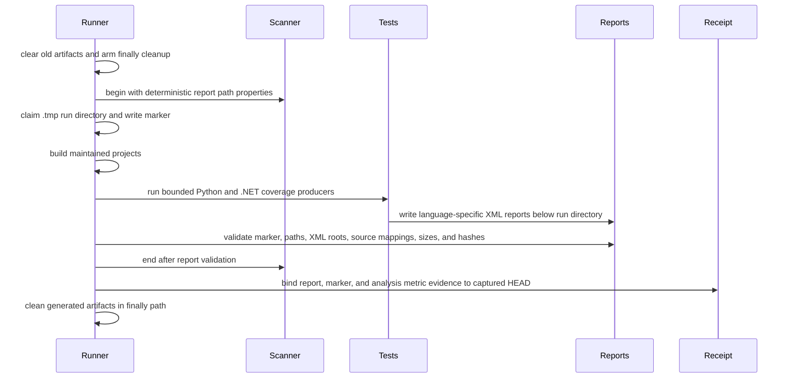

# ADR-010: Bind coverage reports to the exact-head scanner transaction

**Status**: Proposed  
**Date**: 2026-08-24

## Context

The exact-head scanner at `e2849df2d7cdcd0969e3966695678e5d4c408f32` completed its Compute Engine task but failed the quality gate because `new_coverage` was `0.0` against the required `80`. The current runner builds projects between scanner begin and end. It does not run coverage producers or set report import paths.

The coverage fix must not weaken the quality gate, change SonarQube server settings, accept an external report artifact, change credential handling, or merge Python and .NET coverage into one format.

## Decision

Add one runner-owned coverage phase between the existing build phase and scanner end. The runner derives `.tmp/sonarqube-coverage/<run_id>` paths before scanner begin because SonarScanner clears `.sonarqube` during begin and scanner engine uses `.scannerwork`. It arms cleanup after pre-scan cleanup, then claims the UUID-named report directory and writes its canonical marker after begin succeeds. The directory must not already exist.

The phase owns two evidence sets.

- The Python set contains one Cobertura XML report.
- The .NET set contains one OpenCover XML report for each member of the closed five-project test inventory.

The runner derives the complete test inventory and all report paths before scanner begin. It passes one relative Python path and one comma-delimited, normalized .NET path list as separate begin arguments. It claims those `.tmp` locations only after begin succeeds, then requires the same locations to exist before scanner end.

All coverage producers share the existing `CE_TIMEOUT_SECONDS` deadline. Each producer receives only the remaining deadline budget. On timeout or cancellation, the runner terminates its owned process tree, waits for it to exit, and then runs cleanup. The original producer failure remains the receipt's causal failure. A cleanup failure is retained separately under `cleanup.failure`. After scanner end, the runner brackets the fixed coverage-metric query with matching current-analysis readbacks before it accepts the metric binding.

## Alternatives

### External artifact handoff

A test job could publish coverage and the scanner could import it later. This would need a new artifact transfer contract for source SHA, retention, path safety, and hashes. It also leaves the local release command unable to prove coverage without another system. Rejected.

### Separate coverage orchestration command

A separate command could run tests and then call the existing scanner. That would duplicate the scanner lock, worktree checks, credential scrubbing, cleanup, and receipt rules. Rejected.

### One generic merged report

A merged report would blur the language-specific producer and importer contracts. It would add a conversion step that SonarQube does not require. Rejected.

## Consequences

- The runner gains test execution and coverage dependencies. The implementation must receive explicit dependency approval before changing `pyproject.toml`, `uv.lock`, or a `.csproj`.
- Scanner runtime becomes longer. The receipt records only provenance metadata, not report contents or credentials.
- Coverage failures become visible before scanner end. A failure cannot publish PASS.
- The runner must clean generated scanner artifacts after every outcome following pre-scan cleanup, including scanner-begin failure. Cleanup must not hide the first causal failure.

## Non-goals

This decision does not repair the 137 current new-code findings. It does not change the inherited Previous-version New Code definition. It does not change the quality gate or configured scanner transport.
