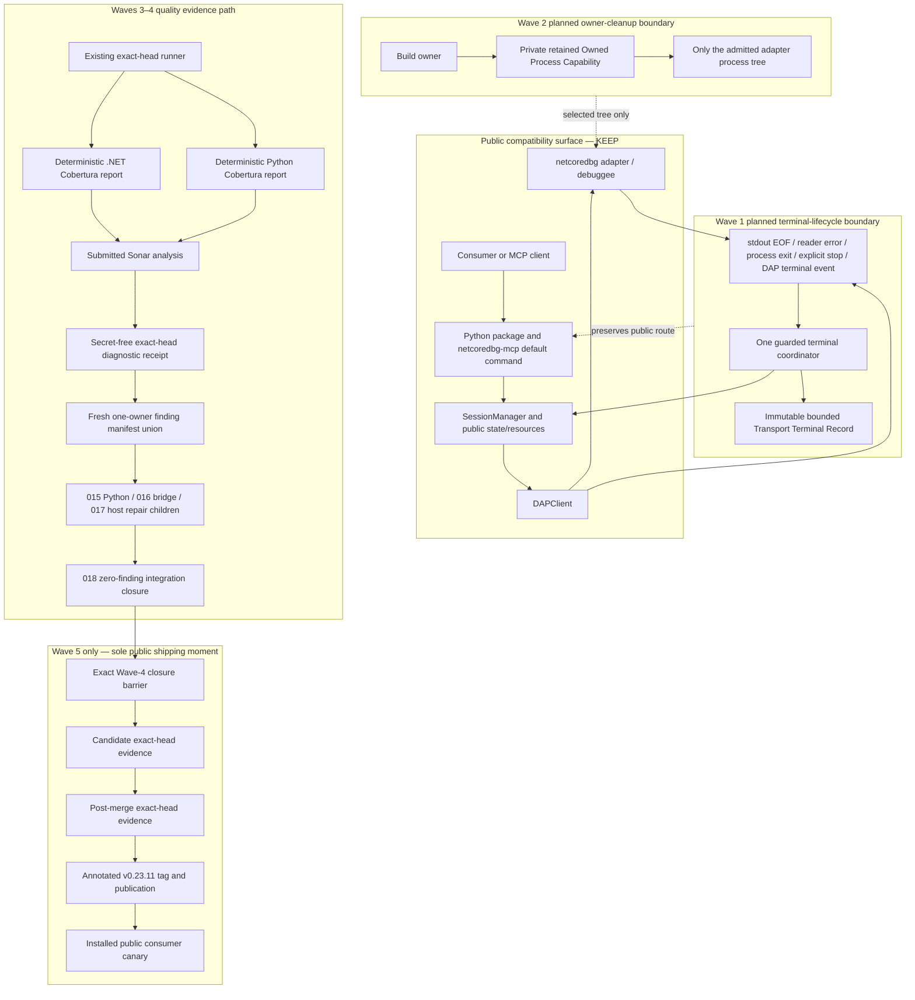
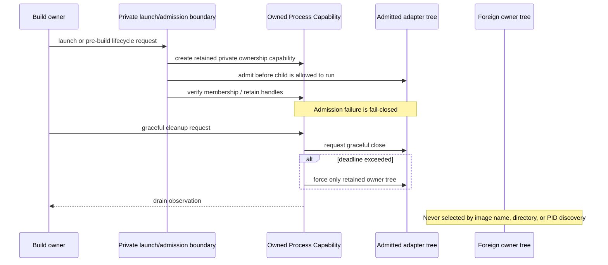
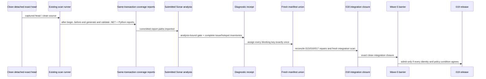
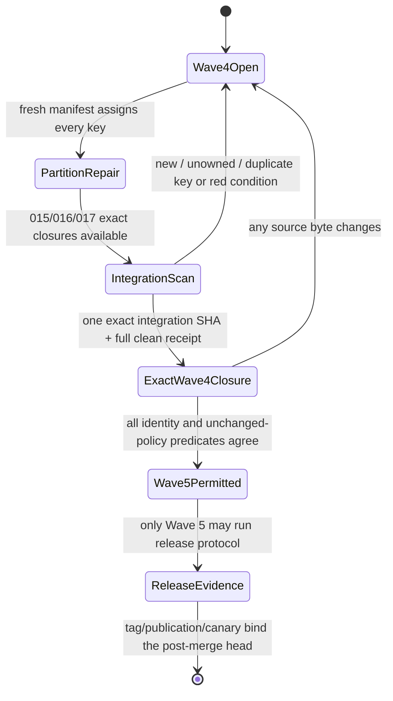

# Architecture: v0.23.11 Issue #450 and Complete Sonar Remediation Program

**Status**: Planned architecture. Components and flows describe required future boundaries; no implementation or wave acceptance is asserted here.  
**Source identity**: `e95223ba1bddd7a08e440e4a0eca3db9f3c068b9`  
**Program shape**: one public v0.23.11 release iteration, five internal verified waves.

## Architectural Intent

The program deliberately keeps three concerns separate:

1. **Runtime truth (Wave 1)**: adapter transport death must become one bounded manager-visible terminal outcome without fabricating DAP semantics or an unknown producer cause.
2. **Process ownership (Wave 2)**: cleanup must target a retained owner capability, never a same-image/process-discovery selector.
3. **Release quality truth (Waves 3–5)**: coverage, findings, and release evidence must all bind to exact heads and a fresh full denominator without changing gates.

The public Python/default route and stateless-preview boundary remain outside all three mutation paths. They are final comparison and consumer surfaces.

## Component Map



## Component Ownership

| Component | Current role | Planned owner | Must own | Must not own |
|---|---|---|---|---|
| Public Python package / CLI | Existing public/default surface. | All waves compare; Wave 5 proves from installed bytes. | Stable public behavior and default route. | Native cutover, private child evidence, or Sonar policy. |
| `DAPClient` | Reads/writes DAP and currently observes EOF locally. | Wave 1 / spec 012. | Terminal-signal observation, pending-request failure, bounded process/stream facts. | Public state authority or inferred producer cause. |
| `SessionManager` / `SessionState` | Owns user-visible session state/resources. | Wave 1 / spec 012. | One manager-visible terminal/unavailable transition and DAP semantic distinction. | Unbounded stream drain, foreign cleanup, or process ownership reconstruction. |
| Transport Terminal Record | New bounded evidence object planned by Wave 1. | Wave 1 / spec 012. | Immutable first-signal/diagnostic snapshot. | A fabricated DAP event or mutable second cleanup owner. |
| Build cleanup / `BuildSession` | Current pre-build path selects processes and has a post-spawn Job attempt. | Wave 2 / spec 013. | Owner admission, selected-tree cleanup, graceful/forced drain facts. | Global image-name kills, PID-reuse authority, or historical EOF causality. |
| Owned Process Capability | New private capability planned by Wave 2. | Wave 2 / spec 013. | Retained owner handles/job and verified membership/drain. | General process framework or authority over other owners. |
| `run_sonarqube_exact_head.py` | Current scan/reconciliation/receipt authority. | Wave 3 / spec 014. | Exact-head scanner transaction and secret-safe receipt behavior. | Server-policy changes or a non-exact scan substitute. |
| Coverage reports | New generated same-transaction inputs. | Wave 3 / spec 014. | Deterministic report/source/head provenance and bounded cleanup. | Stale report reuse or threshold change. |
| Finding Manifest Union | New scan-derived allocation record. | Wave 4 / spec 018 after 015–017 routing. | One current key → one repair owner. | Static historical partition authority. |
| Repair children | Future source remediation units. | Specs 015, 016, 017. | Only manifest-owned Python, bridge, or host findings. | Cross-partition scope, gate disposition changes, or release actions. |
| Wave-4 integration closure | Future convergence evidence. | Spec 018. | Fresh whole-project exact integration SHA and zero-blocking result. | Unbounded source repair or public tag. |
| Release integration | Existing release protocol applied to clean final head. | Spec 019 / release owner. | Candidate/post-merge identity, package/consumer proof, tag/publication/canary. | Any source correction or policy exception. |

## Runtime Data and Control Flow

### 1. Transport death → truthful public state

```mermaid
sequenceDiagram
  participant A as Adapter/process
  participant C as DAPClient observers
  participant F as Guarded finalizer
  participant R as Terminal Record
  participant M as SessionManager
  participant U as Public state/resource user

  A-->>C: EOF, read fault, process exit, or DAP terminal signal
  C->>F: request finalization with observed signal
  Note over F: First caller owns the finalization task
  F->>R: freeze bounded facts
  F->>C: fail pending work once; bounded cleanup/drain
  F->>M: one terminal/unavailable callback
  M->>U: publish non-running truthful state
  A-->>C: later competing signal
  C->>F: enrich facts only; no second publication
```

**Required semantics**:

- `DAP exited` remains a debuggee exit observation with its exit code when present.
- `DAP terminated` remains a debug-session termination observation and does not imply a known debuggee exit code.
- EOF/process/reader events must not be emitted as fabricated DAP events.
- The first finalizer owns any terminate/kill decision; later signals may enrich bounded diagnostics but cannot repeat cleanup or manager publication.
- The manager remains the only owner of public `RUNNING`/terminal state and resource publication.

### 2. Pre-build cleanup → owner-only process tree



**Required semantics**:

- A numeric PID, process name, output directory, WMI discovery, or `psutil` traversal is an observation/selector, never the primary ownership authority.
- Admission must precede the process running under the owner claim; ignored assignment failure is not a valid admission outcome.
- Graceful cleanup precedes bounded forced cleanup; the latter is constrained to the retained capability.
- Tree-drain evidence is a required completion fact. A foreign process is never a fallback cleanup target.

### 3. Exact-head scan → fresh manifest → sole release entry



## Evidence and State Boundaries

| Boundary | Authoritative input | Output | Rejection condition |
|---|---|---|---|
| Wave 1 finalization | First terminal signal plus concurrent enrichment facts. | One immutable terminal record and one manager callback. | Second cleanup/publication, unbounded diagnostics, stale `RUNNING`, or fabricated DAP semantics. |
| Wave 2 admission | Retained launch handles/Job membership before resume. | Owner capability scoped to one adapter tree. | Image/PID/directory fallback, post-spawn-only claim, ignored assignment failure, or foreign selection. |
| Wave 3 coverage transaction | Captured exact head, committed scanner config, two generated report paths. | Analysis-bound diagnostic receipt. | Missing/stale/empty/unmapped/out-of-transaction report, head mismatch, or policy change. |
| Wave 4 ownership union | Fresh full diagnostic receipt. | One owner per blocking key. | Incomplete pagination, historical-only partition, missing/duplicate owner, or accepted/suppressed key. |
| Wave 4 closure | Child 015–017 future closures plus fresh integration receipt. | Exact `integration_sha` and zero-blocking result. | Any remaining finding/hotspot/new violation, non-OK coverage/gate, or identity mismatch. |
| Wave 5 release | Exact Wave-4 closure at unchanged source bytes. | Candidate/post-merge/tag/publication/canary evidence. | Missing/partial/stale closure, source drift, red consumer journey, or non-OK exact-head gate. |

## Wave-5 Barrier



`Wave5Permitted` is an entry state, not a publication result. It has no transition from any Wave-1, Wave-2, Wave-3, partial Wave-4, dashboard-only, or stale-receipt state.

## Program Invariants

| ID | Architectural invariant | Enforcement point |
|---|---|---|
| **PRG-001** | Exactly one public v0.23.11 release iteration exists; Waves 1–4 are internal and carry `release_intent: none`. | Parent cut, data-model `WaveContract`, Wave-5 barrier. |
| **PRG-002** | Every terminal signal converges through one guarded finalizer and truthful manager state. | Wave-1 observer/finalizer/manager boundary. |
| **PRG-003** | Cleanup authority is a retained pre-resume owner capability, never a selector. | Wave-2 launch/admission/cleanup boundary. |
| **PRG-004** | Python and .NET coverage are real deterministic reports generated/imported in the same exact-head transaction. | Wave-3 runner/config/report boundary. |
| **PRG-005** | The current full project denominator converges to zero blocking findings and hotspots. | Wave-4 manifest, repair children, integration closure. |
| **PRG-006** | Every scan and release decision names the exact head it describes. | Receipt identity fields and tag-target comparison. |
| **PRG-007** | Python/default and stateless-preview behavior stay outside child mutation paths and remain final comparison surfaces. | Child non-goals and Wave-5 installed-consumer proof. |
| **PRG-008** | Policy is never weakened to make a result green. | Child refusal paths; existing Sonar/release authorities. |
| **PRG-009** | Every complete diagnostic scan has one fresh one-owner manifest union. | Wave-3/4 receipt-to-manifest transition. |
| **PRG-010** | Claims identify observed evidence versus inference and name source/primary documentation. | Research records, child contracts, and exact closure evidence. |

## Deliberate Non-Architecture

- No second Python/native route, compatibility shim, or stateless-preview migration is introduced.
- No generic lifecycle framework or cross-platform process framework is designed here; each child owns the smallest boundary necessary for its invariant.
- No alternate scanner, server-side setting, policy waiver, dashboard interpretation, or manual disposition is an evidence source.
- No Wave-1 record claims why the historical adapter died; it makes a future observed cause diagnosable.
- No Wave-5 action can consume a prior clean receipt after source bytes change.

## Relationship to the Data Model

[data-model.md](data-model.md) defines the identity and lifecycle of `ProgramContract`, `WaveContract`, `TransportTerminalRecord`, `OwnedProcessCapability`, `CoverageTransaction`, `FindingManifestUnion`, `ExactHeadReceipt`, `WaveClosure`, and `ReleaseEvidenceBundle`. The model is an evidence contract; it does not create a new runtime persistence service.