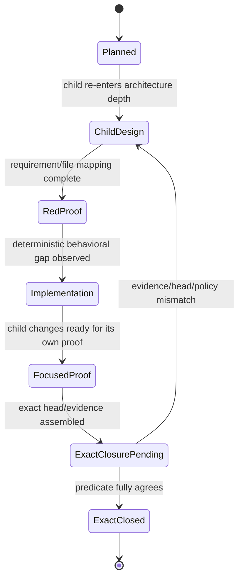
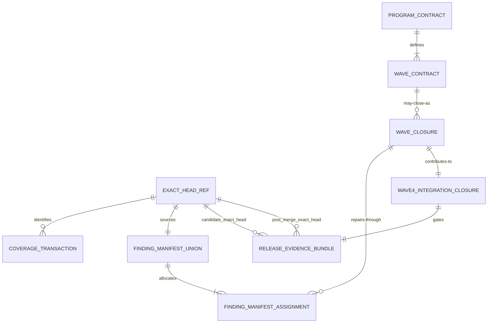

# Data Model: v0.23.11 Issue #450 and Complete Sonar Remediation Program

**Status**: Contract model for future implementation/evidence. It records no current acceptance state.  
**Purpose**: Make program identity, one-owner remediation, and exact-head release admission explicit without introducing a new runtime database or persistent service.

## Modeling Rules

1. Evidence records are append-only or immutable once their named exact head is sealed. A changed head creates a new record; it does not mutate a prior record into evidence for different bytes.
2. `release_intent` is a program-control value, not a version label. Only Wave 5 may carry `v0.23.11`; Waves 1–4 are literally `none`.
3. A selector (PID, process image, discovered directory) is not an `OwnedProcessCapability`.
4. A report file is not a `CoverageTransaction` until source/head/provenance/import/denominator fields agree.
5. A current finding exists in exactly one `FindingManifestAssignment` after every complete diagnostic scan.
6. A `WaveClosure` is internal evidence only. It has no tag, publication, or release effect unless it is the Wave-5 `ReleaseEvidenceBundle`.

## Entity Overview

| Entity | Identity | Required fields | Immutable / cardinality rule |
|---|---|---|---|
| **ProgramContract** | `program_id = issue450-sonar-v02311` | `source_baseline_sha`, `release_version`, `public_release_iterations`, `waves`, `anchor_ids`, `route_invariants` | Exactly one program contract for this cut; `public_release_iterations = 1`; anchors are PRG-001…PRG-010. |
| **WaveContract** | `(program_id, wave_number)` | `child_specs`, `release_intent`, `depends_on`, `entry_predicate`, `closure_predicate`, `non_goals`, `appetite` | Five rows only; Wave numbers 1–5 are unique and ordered. |
| **ExactHeadRef** | `(repository_project_key, sha, role, scan_run_id)` | `sha`, `captured_head`, `post_scan_head`, `scanner_revision`, `analysis_id`, analysis-current IDs/revisions, `role` | All supplied SHA-like values must be identical for one valid receipt; roles distinguish diagnostic/candidate/post-merge. |
| **TransportTerminalRecord** | `(session_instance_id, finalization_id)` | `first_signal`, `process_exited`, `returncode`, `protocol_terminated`, `dap_exited`, `last_dap_event`, `stderr_tail`, `stderr_truncated`, `reader_error`, `explicit_stop` | Created once by one guarded finalizer; bounded fields cannot grow after publication. |
| **OwnedProcessCapability** | `(owner_instance_id, launch_identity)` | `owner_id`, `job_handle_identity`, `root_process_handle_identity`, `thread_handle_identity`, `membership_verified`, `admitted_before_resume`, `tree_drain_status` | No raw PID/image/directory may serve as the identity authority. |
| **CoverageTransaction** | `(ExactHeadRef, transaction_id)` | `dotnet_report_path`, `python_report_path`, `report_hashes`, `generated_after_begin`, `generated_before_end`, `nonzero_denominators`, `import_observation`, `policy_snapshot` | Exactly two required language reports; both paths are deterministic project-root-relative paths selected by Wave 3. |
| **FindingManifestUnion** | `(ExactHeadRef, manifest_id)` | `project_key`, `analysis_id`, `current_analysis_revision`, `issue_inventory.keys`, `issue_inventory.blocking_keys`, `hotspot_inventory`, `pagination_complete`, `assignments_hash` | Refreshed from every complete diagnostic scan; never inferred from historical partition counts. |
| **FindingManifestAssignment** | `(manifest_id, finding_key)` | `finding_key`, `component`, `path`, `rule`, `owner_child`, `disposition`, `assignment_revision` | Exactly one assignment for every blocking key; `owner_child ∈ {015,016,017}`. |
| **WaveClosure** | `(wave_number, exact_sha)` | `exact_sha`, `child_spec_path`, `receipt_path`, `requirements`, `proof_refs`, `policy_snapshot`, `closure_status` | One closure record applies to one child/head only; `closure_status` is an evidence outcome, never copied forward. |
| **Wave4IntegrationClosure** | `(wave=4, integration_sha)` | `input_closure_hashes`, `diagnostic_receipt_ref`, `manifest_ref`, `integration_sha`, `zero_blocking_result`, `policy_results` | Exists only after all 015–017 closures and one fresh integration receipt agree. |
| **ReleaseEvidenceBundle** | `(release_version, post_merge_sha)` | `wave4_closure_ref`, `candidate_receipt_ref`, `post_merge_receipt_ref`, `consumer_proof_ref`, `tag_target_sha`, `publication_ref`, `canary_ref` | Only Wave 5 may create it; every head/tag reference must agree with the valid post-merge target. |

## ProgramContract

```text
ProgramContract
├── id: "issue450-sonar-v02311"
├── source_baseline_sha: "e95223ba1bddd7a08e440e4a0eca3db9f3c068b9"
├── release_version: "0.23.11"
├── public_release_iterations: 1
├── internal_wave_count: 5
├── anchors: [PRG-001 … PRG-010]
├── route_invariants:
│   ├── public_python_default_route: preserved
│   └── stateless_preview_boundary: preserved
└── gate_weakening: prohibited
```

`source_baseline_sha` is the starting research identity. It is not a release-candidate identity and must not be mistaken for final release evidence.

## WaveContract

| Wave | Child spec path(s) | `release_intent` | Depends on | Closure object |
|---|---|---|---|---|
| 1 | `specs/012-adapter-transport-death-lifecycle/` | `none` | Parent contract | `WaveClosure(1, exact_sha)` |
| 2 | `specs/013-owner-scoped-prebuild-cleanup/` | `none` | Exact Wave-1 closure | `WaveClosure(2, exact_sha)` |
| 3 | `specs/014-sonarqube-cross-language-coverage/` | `none` | Exact Wave-2 closure | `WaveClosure(3, exact_sha)` + `CoverageTransaction` |
| 4 | `specs/015-sonar-python-current-findings/`, `016-sonar-bridge-current-findings/`, `017-sonar-host-current-findings/`, `018-sonar-zero-finding-integration/` | `none` | Exact Wave-3 closure and fresh manifest | `Wave4IntegrationClosure(4, integration_sha)` |
| 5 | `specs/019-v02311-issue450-sonar-release/` | `v0.23.11` | Exact Wave-4 integration closure | `ReleaseEvidenceBundle(0.23.11, post_merge_sha)` |

### Wave state vocabulary

These are allowed future states, not a report of current state:



`ExactClosed` for Waves 1–4 does not transition to a public-release state. Wave 5 has an additional `ReleaseEvidenceBundle` path only after its exact Wave-4 entry predicate is met.

## ExactHeadRef

```text
ExactHeadRef
├── repository_project_key: "thebtf_netcoredbg_mcp"
├── sha: 40-character Git SHA
├── role: diagnostic | candidate | post-merge
├── scan_run_id: receipt-safe identifier
├── captured_head: SHA
├── post_scan_head: SHA
├── scanner_revision: SHA
├── analysis_id: Sonar analysis identity
├── analysis_current_before_issues: { analysis_id, revision: SHA }
├── analysis_current_after_issues: { analysis_id, revision: SHA }
├── analysis_current_final: { analysis_id, revision: SHA }
└── pagination_complete: boolean
```

### Exact-head invariants

- `sha == captured_head == post_scan_head == scanner_revision == analysis_current_before_issues.revision == analysis_current_after_issues.revision == analysis_current_final.revision`.
- `analysis_id` equals all three analysis-binding IDs and belongs to the submitted scanner task and fixed project key.
- `pagination_complete=true` is mandatory for issues and hotspots. `total=0` is valid only with `result_empty=true`.
- A `candidate` receipt cannot satisfy a tag predicate; only the matching clean `post-merge` receipt is release-tag evidence.
- A diagnostic receipt can allocate Wave-4 work but cannot by itself satisfy Wave-5 entry.

## TransportTerminalRecord

```text
TransportTerminalRecord
├── session_instance_id: opaque session-scoped identity
├── finalization_id: opaque one-shot coordinator identity
├── first_signal: dap-terminated | dap-exited | stdout-eof | reader-error | process-exit | explicit-stop
├── process_exited: boolean
├── returncode: integer | unknown
├── protocol_terminated: boolean
├── dap_exited: boolean
├── dap_exit_code: integer | unknown
├── last_dap_event: { sequence, event, bounded_body_preview } | none
├── stderr_tail: bounded text
├── stderr_truncated: boolean
├── stdout_eof: boolean
├── reader_error: bounded safe diagnostic | none
├── explicit_stop_requested: boolean
└── finalized_at: monotonic/trace-safe observation
```

### Terminal-record invariants

- Exactly one finalization owner creates the record for `(session_instance_id, finalization_id)`.
- `protocol_terminated`, `dap_exited`, and `process_exited` remain separate booleans/facts; no one is derived by silently copying another.
- `returncode` is `unknown` unless a process exit was actually observed. It is not assigned a guessed value.
- `stderr_tail`, event preview, and reader-error text have child-012-defined bounds/redaction rules; absence of a cause is representable.
- The manager’s public terminal/unavailable state is derived from the finalization callback, not from the record pretending to be a DAP event.

## OwnedProcessCapability

```text
OwnedProcessCapability
├── owner_instance_id: opaque caller/session identity
├── launch_identity: opaque launch record
├── root_process_handle_identity: retained handle reference
├── primary_thread_handle_identity: retained until admission result
├── job_handle_identity: private unnamed/non-inheritable Job reference
├── admitted_before_resume: boolean
├── membership_verified: boolean
├── graceful_cleanup_requested: boolean
├── forced_cleanup_requested: boolean
├── tree_drain_status: pending | drained | timed_out | failed
└── auxiliary_observations: { pid?, creation_time?, image_path?, session_id? }
```

### Ownership invariants

- `root_process_handle_identity`, Job membership, and pre-resume admission are authoritative; `auxiliary_observations` are defense-in-depth evidence only.
- An admission failure must have `admitted_before_resume=false` and cannot transition to a running owned tree.
- `forced_cleanup_requested=true` is legal only after the owner’s grace policy has been observed; it targets the owned Job/tree only.
- `tree_drain_status=drained` requires the child-selected accounting barrier. Physical process disappearance assertions may be supplementary but cannot replace the ownership boundary.
- Any image-name/PID/directory/WMI/psutil-only cleanup attempt has no legal `OwnedProcessCapability` representation.

## CoverageTransaction

```text
CoverageTransaction
├── exact_head_ref: ExactHeadRef
├── transaction_id: scanner run identity
├── begin_at: event/order token
├── dotnet_report:
│   ├── path: deterministic project-root-relative Cobertura XML
│   ├── sha256: hex digest
│   ├── produced_at: transaction-bound observation
│   ├── nonempty: boolean
│   └── source_mapping_observed: boolean
├── python_report: same required fields
├── end_at: event/order token
├── report_import_observation: analysis-bound scanner fact
├── new_coverage_condition: { actual, threshold: "80", status }
├── generated_cleanup: bounded report-root result
└── policy_snapshot: immutable policy identity
```

### Coverage invariants

- Both reports must be produced after scanner begin and before scanner end from the `ExactHeadRef.sha` source tree.
- Both report paths are deterministic and configured in committed analysis configuration; no wildcard/stale collector directory is the source of truth.
- Both reports are nonempty and have a child-defined nonzero relevant denominator before import can be accepted.
- The coverage condition’s threshold remains the observed `80`; changing threshold, new-code definition, exclusions, baseline, or server policy has no legal transaction state.
- A current/latest-project dashboard result that is not bound to the submitted analysis ID has no legal `report_import_observation` for this program.

## FindingManifestUnion and Assignment

```text
FindingManifestUnion
├── exact_head_ref: ExactHeadRef
├── manifest_id: immutable manifest identity
├── generated_at: receipt-bound observation
├── issue_inventory:
│   ├── total: non-negative integer
│   ├── pagination_complete: boolean
│   ├── result_empty: boolean
│   ├── keys: set<FindingKey> (every current result)
│   └── blocking_keys: subset<FindingKey> (only current blocking results)
├── new_code_inventory: same completeness fields
├── hotspot_inventory: same completeness fields
├── assignments: set<FindingManifestAssignment>
└── assignments_hash: digest over canonical one-owner entries

FindingManifestAssignment
├── finding_key: Sonar issue key
├── component: current project component
├── source_path: current receipt path when provided
├── rule: current rule identity
├── owner_child: 015 | 016 | 017
├── evidence_head: SHA
└── status: assigned | repaired_pending_rescan | fixed_in_current_head | blocking
```

### Manifest invariants

- A manifest is fresh only when it derives from a complete exact-head diagnostic receipt with matching project/analysis/revision bookends.
- `issue_inventory.keys` retains the full current issue denominator. `issue_inventory.blocking_keys` is its subset whose current dispositions block Wave 4.
- Every `issue_inventory.blocking_keys` member occurs in exactly one `assignments` row. A key with no source path still requires an owner; its child resolves the path from current evidence before editing.
- `owner_child=015` owns manifest-routed Python product/test/tool paths, except Wave-3 scanner/coverage ownership; `016` owns `bridge/**`; `017` owns `host/**`.
- `FALSE_POSITIVE`, `ACCEPTED`, WONTFIX, suppression, `NOSONAR`, exclusion, baseline reset, or a policy/definition change is not a legal `status` transition to fixed.
- A new key discovered after repair is added to the existing manifest lineage and re-assigned; it cannot be left outside the union because an old count looked complete.
- `result_empty=true` is required when a result total is zero. A missing page or failed endpoint is incomplete evidence, not an empty inventory.

## WaveClosure and Wave4IntegrationClosure

```text
WaveClosure
├── wave_number: 1 | 2 | 3 | 4
├── exact_sha: SHA
├── child_spec_path: exact repository-relative packet path
├── receipt_path: future acceptance evidence path
├── requirements: set<PRG anchor and child anchor>
├── focused_proof_refs: immutable evidence references
├── review_ref: immutable evidence reference
├── route_preservation_ref: immutable comparison proof
├── policy_snapshot: immutable policy identity
└── closure_status: exact_closed | rejected | incomplete

Wave4IntegrationClosure
├── integration_sha: SHA
├── child_closures: { 015, 016, 017 }
├── manifest_union: FindingManifestUnion
├── diagnostic_receipt: ExactHeadRef
├── current_blocking_count: integer
├── current_hotspot_blocking_count: integer
├── new_violations: integer
├── new_coverage_condition_status: OK | ERROR | WARN | NONE
├── quality_gate_status: OK | ERROR | WARN | NONE
└── closure_status: exact_closed | rejected | incomplete
```

### Closure invariants

- A Wave-1/2/3 closure binds one child/head and has `release_intent: none`; it cannot be re-labelled v0.23.11 or converted into tag authority.
- A Wave-4 integration closure is exact only when every child closure input, manifest union, diagnostic receipt, and `integration_sha` match the same integration source identity as required by the parent plan.
- `current_blocking_count=0`, `current_hotspot_blocking_count=0`, `new_violations=0`, `new_coverage_condition_status=OK` at unchanged `80`, and `quality_gate_status=OK` are all necessary but are not enough without complete pagination and exact identity agreement.
- The record must retain the 015/016/017 closure references and `assignments_hash`; an unexplained zero count has no provenance.
- Any source change after `integration_sha` invalidates that closure as Wave-5 entry evidence, even if the source change is small or intended as a release-only correction.

## ReleaseEvidenceBundle

```text
ReleaseEvidenceBundle
├── release_version: "0.23.11"
├── wave4_integration_closure: Wave4IntegrationClosure
├── candidate_exact_head: ExactHeadRef(role=candidate)
├── candidate_consumer_proof: installed public Python/default journey
├── review_gate_evidence: current exact candidate evidence
├── post_merge_exact_head: ExactHeadRef(role=post-merge)
├── annotated_tag:
│   ├── name: "v0.23.11"
│   ├── tag_object: immutable Git tag object
│   └── target_sha: SHA
├── publication: remote package/release/workflow evidence
└── post_publication_canary: installed consumer evidence
```

### Release invariants

- `wave4_integration_closure.integration_sha == candidate_exact_head.sha` before release candidate work begins. If a release-preparation source correction changes the head, the program returns to its owning earlier wave and establishes new closure evidence.
- The candidate receipt is necessary but not tag-authorizing.
- `post_merge_exact_head.sha == annotated_tag.target_sha`; the post-merge receipt is the only Sonar receipt eligible for the tag gate.
- The installed consumer proof uses the public Python/default surface. A private helper, local source tree, or source-only test does not populate `candidate_consumer_proof`.
- The bundle cannot include a policy waiver, suppression, threshold change, excluded denominator, or accepted-risk disposition.

## Relationships



## Requirement-to-Model Traceability

| Requirement | Model enforcement |
|---|---|
| **PRG-001** | `ProgramContract.public_release_iterations=1`; five unique `WaveContract` rows; `release_intent=none` for Waves 1–4 and `v0.23.11` only for Wave 5. |
| **PRG-002** | One `TransportTerminalRecord` per guarded finalization; distinct DAP/process facts; one manager callback evidence in Wave-1 closure. |
| **PRG-003** | `OwnedProcessCapability` requires pre-resume admission/retained authority; selector-only cleanup cannot be modeled as owned. |
| **PRG-004** | `CoverageTransaction` has exactly two deterministic language reports, transaction order, import, nonzero denominator, and unchanged threshold fields. |
| **PRG-005** | `FindingManifestUnion` and `Wave4IntegrationClosure` represent the full current denominator and zero-blocking final conditions. |
| **PRG-006** | `ExactHeadRef` equality constraints flow from scan to Wave-4 integration to `ReleaseEvidenceBundle` tag target. |
| **PRG-007** | `ProgramContract.route_invariants` and every `WaveClosure.route_preservation_ref` represent unchanged public/default and preview boundaries. |
| **PRG-008** | No legal evidence/manifest/transaction transition represents suppression, exclusion, baseline, accepted risk, threshold/new-code, or server-policy weakening. |
| **PRG-009** | Fresh `FindingManifestUnion` plus one `FindingManifestAssignment` per blocking key. |
| **PRG-010** | `proof_refs`, primary-source research refs, and exact child paths make observed/inferred claims auditable. |

## Manual Data Audit Questions

Use [quickstart.md](quickstart.md) for non-mutating command shapes. A reviewer must be able to answer these questions from retained future evidence:

1. Which exact head, analysis ID, and current-analysis revision does this record describe?
2. Does the current inventory prove complete pagination, including the zero-total semantics when applicable?
3. Does every blocking finding key have exactly one manifest owner?
4. Were Python and .NET reports created and imported in the same captured scan transaction, under unchanged policy?
5. Is the claimed Wave-4 integration SHA the same identity as every closure/receipt input?
6. Did any source byte change after Wave-4 closure and before Wave-5 entry?
7. Does the final annotated tag target the matching post-merge exact-head receipt and public consumer proof?