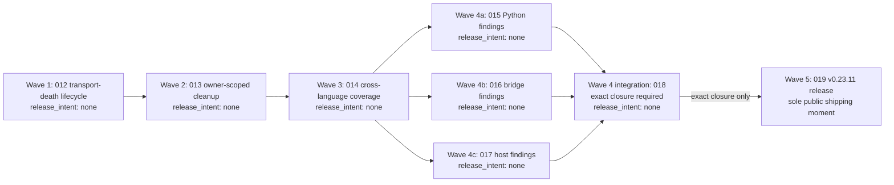

# Implementation Plan: v0.23.11 Issue #450 and Complete Sonar Remediation Program

**Branch**: `work/issue450-eof-sonar-remediation`  
**Date**: 2026-08-30  
**Spec**: [spec.md](spec.md)  
**Design depth**: D3 program contract  
**Status**: Active parent plan. Wave 1 is internally accepted; Waves 2–5 and any release remain unaccepted.

## Summary

This plan governs one public v0.23.11 release iteration made of five internal verified waves:

1. `specs/012-adapter-transport-death-lifecycle/` — Issue #450 transport-death lifecycle.
2. `specs/013-owner-scoped-prebuild-cleanup/` — owner-scoped pre-build cleanup.
3. `specs/014-sonarqube-cross-language-coverage/` — exact-head Python and .NET coverage transaction.
4. `specs/015-sonar-python-current-findings/`, `specs/016-sonar-bridge-current-findings/`, `specs/017-sonar-host-current-findings/`, and `specs/018-sonar-zero-finding-integration/` — complete fresh current-finding remediation and reconciliation.
5. `specs/019-v02311-issue450-sonar-release/` — the sole v0.23.11 public release moment.

Waves 1–4 have `release_intent: none`. They deliver exact-head internal closure evidence only; they must not be called releases, tags, prereleases, or independently shippable public increments. Wave 5 is the sole public shipping moment and is hard-gated on exact Wave-4 closure.

The starting scan at `e95223ba1bddd7a08e440e4a0eca3db9f3c068b9` is intentionally preserved as a failed baseline: 1,121 current issues, 1,076 blocking dispositions, 45 fixed dispositions, 172 new violations, `new_coverage=0.0` against threshold `80`, and no hotspots. The plan neither changes that evidence nor treats it as a future acceptance receipt.

## Technical Context

| Concern | Current authority / planned constraint |
|---|---|
| Public runtime | Python `>=3.10`; the `netcoredbg-mcp` console entry point remains the public/default route. |
| Issue #450 source seam | `src/netcoredbg_mcp/dap/client.py` observes stdout EOF and fails pending DAP requests; `src/netcoredbg_mcp/session/manager.py` currently transitions terminal state only from DAP events; `src/netcoredbg_mcp/session/state.py` derives `debuggeeAlive` from retained PID plus state. |
| Owner cleanup source seam | `src/netcoredbg_mcp/build/cleanup.py` currently has a default global image-name path; `src/netcoredbg_mcp/build/session.py` has a post-spawn Job Object attempt that does not establish ownership before resume. |
| Scan authority | `scripts/run_sonarqube_exact_head.py` and `SonarQube.Analysis.xml` are retained as the sole runnable exact-head scan authority. |
| Coverage direction | Wave 3 is constrained by primary-source research to deterministic root-relative Cobertura reports for .NET and Python in the one scanner transaction; concrete changes remain child-owned. |
| Evidence root | Exact-head scan receipts remain under the primary coordination root `.agent/e/sonarqube/thebtf_netcoredbg_mcp/`, in directories named by their exact SHA and runner-recorded identity; source work remains in the candidate worktree. |
| Release authority | `docs/RELEASE-PROTOCOL.md` requires candidate and post-merge exact-head scans, analysis-bound quality gate, full issue/hotspot pagination, exact tag target, and consumer evidence. |
| Non-authority | `.specify/feature.json` is stale and is not read, updated, or treated as planning authority. |

## D3 Calibration

**Bound unit**: this parent program contract, not its first child. A wrong plan would either publish a broken v0.23.11 package, weaken a global quality gate, retain a cross-owner process-kill risk, or lose user-visible debug state across multiple long-lived consumer, repository, scanner, and release contracts. It spans sessions and has multiple maintainers/consumers. The required rung is therefore D3.

This packet stops at the five-wave cut. It records the named first child and the constraints that travel into every child, but it does not design any child’s implementation inside the parent. Child 012 is separately calibrated D1 by the Governor; the other children must re-enter their own design pass before source work.

## Planning Constraints

| Constraint | Planning treatment | Future evidence owner |
|---|---|---|
| One public release iteration | Retained as PRG-001; Waves 1–4 have `release_intent: none`. | Wave 5 / spec 019 |
| No stale transport state | Retained as a dedicated Wave-1 user outcome, not blended with build cleanup. | Wave 1 / spec 012 |
| No foreign cleanup | Retained as a dedicated Wave-2 ownership outcome, not claimed causal for historical EOF. | Wave 2 / spec 013 |
| Both languages covered | One scanner transaction, fixed report provenance, unchanged threshold. | Wave 3 / spec 014 |
| Entire current denominator | Fresh one-owner union after every complete diagnostic scan. | Wave 4 / specs 015–018 |
| Exact source identity | Candidate/post-merge analysis and tag all bind to their exact head. | Wave 5 / spec 019 |
| Route preservation | Python/default and stateless-preview paths are comparison surfaces, not migration work. | All waves; final proof in 019 |
| No weakened gate | All waivers and policy changes are prohibited rather than fallback options. | All waves; enforced by 014/018/019 |

## Phase 0 — KEEP / ADAPT / DISCARD

| Existing component or rule | Ruling | Research tier | Reason / owning wave |
|---|---|---|---|
| Public Python package, console entry point, default route, and rollback journey | **KEEP** | Cross-cutting researched | PRG-007 makes this the compatibility authority; no child may replace it. |
| Stateless-preview boundary | **KEEP** | Cross-cutting researched | The program is unrelated to preview migration; any boundary change is out of scope. |
| `DAPClient` stdout reader and `SessionManager` event/state machinery | **ADAPT** | Full for Wave 1 | Existing machinery is the smallest repair seam; add a single terminal bridge rather than a second state model. |
| DAP `exited` versus `terminated` semantics | **KEEP** | Full for Wave 1 | DAP distinguishes debuggee exit from debugging termination; the terminal record must not collapse them. |
| Default image-name cleanup and unverified discovered PIDs | **DISCARD** | Full for Wave 2 | They select processes, not owners, and violate cross-owner safety. |
| Existing `BuildSession` Job Object attempt | **ADAPT** | Full for Wave 2 | It establishes useful Win32 direction but currently assigns after subprocess creation and ignores assignment result. |
| Exact-head scanner runner and secret-safe receipt location | **KEEP / ADAPT** | Full for Wave 3 | Keep it as sole authority; adapt only its same-transaction coverage production/import and generated-artifact handling. |
| Sonar project key, threshold, new-code policy, issue/hotspot rules, and server policy | **KEEP** | Cross-cutting researched | PRG-008 forbids weakening these gates. |
| Baseline receipt at `e952…` | **KEEP as immutable evidence** | Full baseline read | It governs starting facts but not current owner allocation after later scans. |
| Historical v0.23.10 partition counts | **DISCARD as current authority** | Deferred to Wave 4 | PRG-009 requires a fresh manifest union; historical counts may be context only. |
| Release protocol’s candidate/post-merge exact-head gates | **KEEP** | Full cross-cutting read | Wave 5 consumes the existing release protocol rather than inventing a parallel release lane. |

## Anchored Requirement Index

Every child task and file map must cite these stable IDs. The wording is intentionally identical to [spec.md](spec.md#requirements-mandatory).

| ID | Binding statement | Primary wave(s) |
|---|---|---|
| **PRG-001** | The program MUST deliver one public v0.23.11 release iteration through five internal verified waves. Waves 1–4 MUST have `release_intent: none`; Wave 5 alone may ship publicly. | All; public action only 5 |
| **PRG-002** | Adapter stdout EOF, reader failure, process exit, explicit stop, and DAP terminal signals MUST converge through one guarded transport-death finalizer that prevents stale public `RUNNING`/live-debuggee state. | 1 |
| **PRG-003** | Pre-build cleanup MUST act only on an owner-scoped, pre-resume acknowledged process-tree capability; global image-name, directory-discovery, and unverified PID cleanup MUST be removed from the default path. | 2 |
| **PRG-004** | The exact-head runner MUST produce, validate, and import real Python and .NET coverage reports in the same scanner transaction while the existing `80` threshold remains unchanged. | 3 |
| **PRG-005** | Every current finding in the fresh complete project denominator MUST be repaired in source and reconciled to zero blocking findings and zero blocking hotspots. | 4 |
| **PRG-006** | Every release-critical Sonar observation and final publication decision MUST bind to the exact candidate or post-merge head that it claims to describe. | 3–5 |
| **PRG-007** | The public Python/default route and stateless-preview boundary MUST remain unchanged throughout Waves 1–4 and must be proven through the public surface at Wave 5. | 1–5 |
| **PRG-008** | The program MUST NOT weaken any gate through suppression, exclusion, baseline reset, accepted risk, false-positive/WONTFIX disposition, threshold/new-code change, or Sonar server-policy mutation. | 3–5 |
| **PRG-009** | After every complete diagnostic exact-head scan, the program MUST maintain a fresh manifest union assigning each blocking key to exactly one owner. | 3–4 |
| **PRG-010** | Decisions, child contracts, and public/internal documentation MUST distinguish observed facts from inferences and cite current primary GitHub or repository evidence. | All |

## Architecture Decision

### Alternatives considered

| Shape | Decision | Reason |
|---|---|---|
| Ship Issue #450 as a public patch before Sonar remediation | Rejected | The strict exact-head gate makes such a release unavailable without a prohibited waiver. |
| Ship Sonar cleanup first, then Issue #450 | Rejected | It leaves the observed user-facing stale state behind the same 1,076-item program and duplicates the release path. |
| Combine transport death and global cleanup into one child | Rejected | The stale-state root cause is accepted; the global kill is a separately proven risk not causally established for either recorded EOF. |
| Split all source remediation into five public releases | Rejected | Governor authority requires exactly one public v0.23.11 release iteration. |
| Use a new scanner or accept coverage from a separate/implicit run | Rejected | It weakens exact-head provenance and duplicates the existing release authority. |
| One public release iteration with five internal verified waves | Selected | It preserves the strict global denominator while making the causal cuts explicit and preventing the Wave-1 fix from being redefined by Sonar work. |

### Selected architecture

The program is a single evidence pipeline. Wave 1 fixes the transport-to-manager terminal notification and bounded diagnostics; Wave 2 replaces global cleanup selection with owner-scoped containment; Wave 3 makes the existing exact-head scanner measure both shipped language surfaces; Wave 4 uses fresh complete scans to allocate and eliminate every current finding; Wave 5 packages and releases only the final exact clean integration head. The public Python/default route and stateless-preview boundary stay outside the mutation path and remain final comparison surfaces.

See [architecture.md](architecture.md) for the component/data-flow diagram and [data-model.md](data-model.md) for the program evidence vocabulary.

## Five-Wave Dependency Plan

| Wave | Child specification(s) | Value | Prerequisites | Exact closure predicate | `release_intent` | Appetite |
|---|---|---|---|---|---|---|
| **1** | `012-adapter-transport-death-lifecycle` | A dead adapter cannot leave public state running/live, and future producer failures retain bounded diagnostics. | Parent anchors; D1 child research and deterministic RED first. | Exact wave head binds RED→GREEN EOF and exited-without-terminated proof, one finalizer/publication, bounded diagnostics, focused public behavior, route comparison, and review evidence. | `none` | Few sessions; stop/re-cut before adding cleanup, coverage, or route work. |
| **2** | `013-owner-scoped-prebuild-cleanup` | One owner’s pre-build cleanup cannot kill another owner’s adapter/tree. | Wave-1 closure; Win32 ownership research debt discharged. | Exact wave head binds two-owner behavior, pre-resume admission, no default image-name kill, graceful/forced owner-tree drain, and no foreign selection. | `none` | Few sessions; one private ownership boundary, not a general process framework. |
| **3** | `014-sonarqube-cross-language-coverage` | The existing exact-head scan imports real same-run Python and .NET coverage under unchanged policy. | Wave-2 closure; coverage primary-source research; retained exact-head runner. | Exact wave head binds report paths/source/head provenance, nonzero denominators, analysis import, unchanged `80` coverage condition, and complete diagnostic receipt. Remaining global findings stay blocking. | `none` | Few sessions; re-cut only inside 014 if the official producer/import route needs a smaller sub-slice. |
| **4** | `015-sonar-python-current-findings`, `016-sonar-bridge-current-findings`, `017-sonar-host-current-findings`, `018-sonar-zero-finding-integration` | Every key in a fresh full denominator has one owner and is remediated in source. | Wave-3 closure and a fresh diagnostic manifest union. | Specs 015–017 close their assigned source keys; 018 binds those child closures and a fresh integration analysis to one exact integration SHA with clean current/new-code/hotspot evidence. | `none` | Needs decomposition: three disjoint repair children plus one bounded integration child. |
| **5** | `019-v02311-issue450-sonar-release` | Consumers receive one public v0.23.11 package from the exact clean integration head. | **Exact Wave-4 closure only; see barrier below.** | Candidate and post-merge exact-head receipts, public Python/default consumer proof, annotated tag target equality, publication result, and post-publication canary bind to the release head. | `v0.23.11` | Few sessions, release integration only; source corrections return to the owning earlier wave. |

### Wave-5 entry barrier

Wave 5 is forbidden until all of the following are available and agree:

1. `specs/018-sonar-zero-finding-integration/acceptance-receipt.md` is a future exact Wave-4 closure artifact, not merely a planned path or a clean-looking dashboard.
2. That closure names one `integration_sha` equal to the captured head, post-scan head, scanner metadata revision, and current-analysis revision in its fresh diagnostic exact-head receipt.
3. The receipt proves complete current issue and hotspot pagination for `thebtf_netcoredbg_mcp`, `blocking_count=0`, zero blocking hotspots, `new_violations=0`, `new_coverage` condition `OK` at unchanged threshold `80`, and quality-gate `OK`.
4. The receipt resolves and hashes/references the exact Wave-4 child closure inputs from specs 015, 016, and 017; no key is missing, duplicated, suppressed, accepted, or left in an unowned partition.
5. No source byte has changed after that `integration_sha`. If it has, the release candidate re-enters the responsible earlier wave and establishes new evidence.

This is a hard dependency, not a checklist preference. The existence of a spec 019 packet may document release intent, but it does not allow a Wave-5 task, tag, publication, or release-preparation mutation before this predicate is true.

## MoSCoW Scope

| Class | Scope |
|---|---|
| **Must** | PRG-001 through PRG-010; one public release iteration; five internal verified waves; no gate weakening; exact Wave-4-to-Wave-5 barrier; preserved Python/default and preview boundaries. |
| **Should** | Bounded terminal diagnostics, a deterministic coverage-report transaction, one-owner manifest reconciliation, source-level documentation that makes future audits possible. |
| **Could** | Additional nonblocking diagnostic presentation only after the required bounded record exists and only in the owning child; it cannot delay or alter the required record. |
| **Won’t** | A second public release, speculative producer-cause repair, Sonar policy changes, process-framework redesign, stale manifest reuse, Python retirement, or stateless-preview migration. |

## Integration Simulation

### Path A — Issue #450 user journey

1. A legacy Python-route session has reached `RUNNING` and retains a debuggee PID.
2. Adapter stdout EOF, reader fault, process exit, DAP termination, or explicit stop signals the planned terminal coordinator.
3. The coordinator elects one finalizer, preserves a bounded terminal record, fails pending calls, and invokes one manager transition.
4. The manager publishes terminal/unavailable resources; `SessionState.to_dict()` cannot derive a live debuggee from stale `RUNNING` state.
5. A user sees truthful state instead of a later dead-client error. The unknown producer cause remains unclaimed.

### Path B — Concurrent pre-build owners

1. Owner A and owner B each have independent adapters/descendants.
2. Owner A requests cleanup before a build.
3. Wave-2 ownership admission selects only A’s retained pre-resume capability; it does not enumerate by image name, directory, or unproven PID.
4. A graceful deadline may lead to forced cleanup only for A’s contained tree; tree-drain accounting closes the action.
5. B remains outside A’s capability and is neither inspected as an owner nor terminated.

### Path C — Exact scan through public release

1. Wave 3 captures one clean detached head and invokes the existing scanner authority.
2. In that transaction, Python and .NET reports are created, validated, imported, and tied to the submitted analysis.
3. Wave 4 refreshes the complete current denominator and assigns every key to exactly one child before parallel remediation.
4. Wave-4 integration obtains one fresh clean receipt at `integration_sha` and satisfies the entry barrier.
5. Only then does Wave 5 create a candidate whose consumer proof uses the public Python/default surface; candidate and post-merge scans, tag, publication, and canary all bind to exact heads.

## Migration and Rollback

| Wave | Live users/data carried | Pattern | Rollback / failure behavior |
|---|---|---|---|
| 1 | Existing public Python callers and their current session-state schema. | Internal parallel change behind existing client/manager seam. | Before public release, revert the owned change if focused proof fails. Do not preserve stale-state behavior as a compatibility contract. |
| 2 | Existing build callers; no durable user data migration. | Replace unsafe selection with private owner capability. | Admission failure leaves an unproven process untouched and reports a typed failure; it must not fall back to global/image/PID selection. |
| 3 | Existing scanner receipt schema and primary-root secret boundary. | Additive same-transaction report production/import to existing runner. | A report/import failure blocks the wave; it must not lower policy or use an external/stale report. |
| 4 | Existing source behavior across Python/bridge/host paths. | Incremental partition repair with one fresh manifest union. | A regression returns to its source owner; new keys refresh the same Wave-4 union rather than creating an unscheduled Wave 6. |
| 5 | Public Python/default consumers and package metadata. | Standard release protocol; no route migration. | Any red consumer or exact-head gate returns source work to the owning wave and invalidates release evidence. No partial tag/publication acts as rollback. |

## Requirements-to-Files Map

The parent owns the program contract and release intent, not implementation source. Every row therefore names exact parent/child contract files and the known source surfaces. For Wave 4, an individual source file is intentionally selected only by the fresh one-owner manifest; guessing its path before the manifest would violate PRG-009.

| Requirement(s) | Program tasks | Exact contract/evidence files | Known mutation or comparison surfaces | Observable acceptance owner |
|---|---|---|---|---|
| PRG-001, PRG-006, PRG-010 | T001, T002, T020 | `specs/011-issue450-sonar-release-program/{spec.md,plan.md,tasks.md,architecture.md,data-model.md,quickstart.md,checklists/requirements.md}`; `specs/019-v02311-issue450-sonar-release/{spec.md,plan.md,tasks.md}`; `.agent/reports/release-v0.23.11.md` | `docs/RELEASE-PROTOCOL.md` comparison authority; no parent source edit | Wave 5 |
| PRG-002, PRG-007, PRG-010 | T003–T006 | `specs/012-adapter-transport-death-lifecycle/{spec.md,plan.md,tasks.md,acceptance-receipt.md}` | `src/netcoredbg_mcp/dap/client.py`; `src/netcoredbg_mcp/session/manager.py`; `src/netcoredbg_mcp/session/state.py`; `tests/test_client.py`; `tests/test_debuggee_liveness.py` | Wave 1 |
| PRG-003, PRG-007, PRG-008, PRG-010 | T007–T010 | `specs/013-owner-scoped-prebuild-cleanup/{spec.md,plan.md,tasks.md,research.md,acceptance-receipt.md}` | `src/netcoredbg_mcp/build/cleanup.py`; `src/netcoredbg_mcp/build/session.py`; `tests/test_build_cleanup.py`; `tests/test_build_session.py` | Wave 2 |
| PRG-004, PRG-006, PRG-008, PRG-009, PRG-010 | T011–T014 | `specs/014-sonarqube-cross-language-coverage/{spec.md,plan.md,tasks.md,research.md,acceptance-receipt.md}`; the secret-free diagnostic receipt path recorded by the exact Wave-3 runner under `.agent/e/sonarqube/thebtf_netcoredbg_mcp/` | `scripts/run_sonarqube_exact_head.py`; `SonarQube.Analysis.xml`; `pyproject.toml`; `uv.lock`; `.config/dotnet-tools.json` when created by child | Wave 3 |
| PRG-005, PRG-008, PRG-009, PRG-010 | T015–T019 | `specs/015-sonar-python-current-findings/{spec.md,plan.md,tasks.md,research.md,acceptance-receipt.md}`; `specs/016-sonar-bridge-current-findings/{spec.md,plan.md,tasks.md,research.md,acceptance-receipt.md}`; `specs/017-sonar-host-current-findings/{spec.md,plan.md,tasks.md,research.md,acceptance-receipt.md}`; `specs/018-sonar-zero-finding-integration/{spec.md,plan.md,tasks.md,acceptance-receipt.md}` | Manifest-selected exact files under `src/netcoredbg_mcp/**`, `tests/**`, `scripts/**` excluding Wave-3 runner ownership; `bridge/**`; `host/**` | Wave 4 / spec 018 |
| PRG-007, PRG-008, PRG-010 | T003–T020 | Child specs 012–019; `docs/RELEASE-PROTOCOL.md`; `docs/SONARQUBE-ONBOARDING.md` | `pyproject.toml`; `src/netcoredbg_mcp/__main__.py`; public package/CLI/MCP paths are unchanged comparison surfaces | All; final proof Wave 5 |

## Research Tiering and Debt

| Component / decision | Research state at parent | Citation / debt carrier |
|---|---|---|
| Wave-1 terminal lifecycle | Full current-source plus primary GitHub research completed for planning. | `.agent/runs/issue450-adapter-eof-lifecycle/investigation.md`; `agent://GitHubDapLifecycle`; debt carried to 012: bounded stream/process join, one guarded terminal publisher, DAP semantic distinction. |
| Wave-2 ownership | Full current-source plus Windows process-ownership research completed for planning. | `agent://GitHubProcessOwnership`; debt carried to 013: validate exact private boundary and no post-spawn ownership claim. |
| Wave-3 coverage | Full current scanner/config source and coverage research completed for planning. | `agent://GitHubSonarCoverage`; debt carried to 014: current exact scanner/server import proof and generated-artifact cleanup details. |
| Wave-4 Python, bridge, host finding file distribution | Deliberately deferred until the fresh manifest exists. | Debt carried to 015/016/017: read current manifest-assigned source, rule semantics, and existing tests before each child design. |
| Wave-5 release mechanics | Existing release protocol read at planning depth. | Debt carried to 019: reread current protocol and all accepted child receipts at the release candidate’s exact head. |

## Final D3 Challenge — Inline FULL Mode

**Verdict: GO for the program shape; not a release or implementation acceptance decision.** The post-research challenge did not change the Governor cut or the plan’s selected architecture.

| Finding | Tag | Evidence |
|---|---|---|
| Treating the five waves as five public releases would violate the governing cut and invite gate bypass. | contract-gap corrected | PRG-001 and the `release_intent: none` fields make the sole public release iteration explicit. |
| Combining transport death with build cleanup would conflate a source-proven root cause with an unconfirmed incident cause. | actionable corrected | Investigation distinguishes the missing manager notification from the foreign-kill risk; Waves 1 and 2 remain separate. |
| Preserving the existing runner is lower risk than substituting a scanner. | existing-code leverage | `scripts/run_sonarqube_exact_head.py` already binds clean worktree, project key, CE task, analysis, pagination, and secret-safe receipts. |
| A static Wave-4 file split would go stale. | contract-gap corrected | PRG-009 requires a fresh one-owner manifest union after every diagnostic scan. |
| More report formats or a generic process framework might be useful later. | noise | Neither changes the required outcome and both are excluded from this cut. |

Nine-point review: staleness checked against current baseline/source/primary research; false dependencies rejected (Sonar is release-coupled but not Wave-1 correctness); complexity constrained by re-entering children; value supports each causal cut; scope creep excluded; assumptions listed in `spec.md`; confirmation bias checked by retaining unknown EOF producer and rejecting the global-kill causal leap; secret boundary retained by the existing runner; no authentication/security policy change is introduced.

## Handoff

Next invocation: `architect specs/012-adapter-transport-death-lifecycle --of specs/011-issue450-sonar-release-program` at D1, appetite `few sessions`, with the Wave-1 lifecycle research debt in the preceding table. It must create the deterministic RED before any product edit and must not open Wave 2, coverage, route, or release work.
