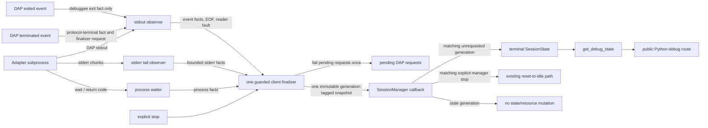

# Architecture: Adapter Transport-Death Lifecycle

## Design boundary

The existing `DAPClient` owns the adapter subprocess. The existing `SessionManager` owns the debug-session state and resource notifications. The defect exists because transport death stops at the client boundary. This child adds one narrow handoff between those owners.

The design does not add a lifecycle service, a second state machine, a new transport, or a public route. It makes the client responsible for observing and finalizing its process lifetime, then gives the manager one immutable fact to consume.

## Caller-first sketch

The intended call direction is shown before private helper details:

```python
# Shape only. Names below are guidance, not a frozen public API.
client = DAPClient(netcoredbg_path)
manager = SessionManager(...)

# Before process startup, the manager issues and binds the generation, then
# installs the sole synchronous sink. The client receives this exact identity.
generation = manager.issue_adapter_run_generation()
client.set_transport_terminal_handler(manager.on_transport_terminal)
run_id = await client.start(generation=generation)
assert run_id == generation

# The client-owned _DapRun starts the stdout, stderr, and process observers.
# Any terminal producer requests the one finalization task.
await client.request_terminal(...)  # EOF, read fault, DAP terminated, wait, or stop

# The client publishes one frozen terminal fact. The manager applies policy.
manager.on_transport_terminal(terminal)

# The existing public route observes state, not a new tool.
state = await get_debug_state()
```

The names above are descriptive rather than frozen public API. The implementation may use different private names, but it must preserve manager-issued pre-start generation, client ownership of the `_DapRun` capsule, single callback delivery, and asynchronous finalization.

## Frozen arena synthesis

The selected base is the client-owned per-run `_DapRun` capsule. This description corrects the arena labels: it is the content selected by the synthesis, not the proposal label attached during comparison. `SessionManager` issues and binds the generation before process startup. `DAPClient` receives and uses that generation for the `_DapRun`, observers, finalizer, and frozen terminal fact.

The synthesis grafts four constraints onto that base:

1. Manager-issued pre-start generation with returned-identity equality, which closes callback-before-binding.
2. Manager comparisons of active and stopping generation, rather than a global stop Boolean.
3. Named callback dispositions: apply unrequested, record during stop, ignore stale, and ignore duplicate.
4. Projection-before-state-transition ordering, so the existing state/thread publication carries terminal diagnostics and truthful liveness together.

The synthesis rejects a manager-owned subprocess finalizer, an async terminal queue, a returned PID-plus-generation record, derived manager lifecycle phases, and an explicit-stop transport cause. Stop is manager policy at callback consumption. The client finalizer never fabricates that cause.

## Component ownership

| Component | Owns | Must not own |
|---|---|---|
| `DAPClient` in `src/netcoredbg_mcp/dap/client.py` | One manager-issued adapter-run generation as its input, the client-owned per-run `_DapRun` capsule, process identity, stdout reader, stderr tail drainer, process waiter, mutable pre-snapshot facts, one guarded finalizer, run-local pending-request terminalization, and one immutable terminal callback. | Session state mutation, resource publication, generation issuance, DAP debuggee lifecycle interpretation beyond storing protocol facts, route selection, build cleanup policy. |
| Stdout observer | DAP framing, parsing, last-event capture before handlers, EOF and reader-fault observation for its captured `_DapRun`. | Stderr retention, process escalation, direct manager callback, direct resource update. |
| Stderr observer | Bounded tail capture and completion state for its captured `_DapRun`. | DAP parsing, terminal classification by itself, manager state, unbounded raw output retention. |
| Process waiter | Adapter process completion and return-code observation for its captured `_DapRun`. | Interpreting adapter code as a debuggee exit code, direct public state mutation, a second cleanup path. |
| Guarded finalizer | A synchronous no-await election, then one generation-bound cleanup decision, bounded observer join, frozen terminal snapshot, pending-request terminalization, and callback delivery. | A guessed historical producer cause, a new public route, repeated callback/state mutation. |
| `SessionManager` in `src/netcoredbg_mcp/session/manager.py` | Manager-issued pre-start generation, active/stopping generation comparison, terminal callback registration, one matching-generation terminal state change or explicit-stop reset path, execution-waiter wake, and existing state/thread resource path. | Process kill/terminate choice, stream draining, direct raw diagnostic collection, client lifecycle collection. |
| `SessionState` in `src/netcoredbg_mcp/session/state.py` | Safe serializable projection of terminal facts alongside existing session fields. | Mutable observer state, raw unbounded stderr/event bodies, OS liveness probing. |
| `get_debug_state` in `src/netcoredbg_mcp/tools/debug.py` | Existing read-only response envelope for current `SessionState.to_dict()`. | New client or process ownership, a route-specific workaround, synchronization policy. |

## Data flow



## Finalization protocol

### 1. Build facts before publishing them

The client holds a private, run-scoped collector while observers operate. Observers record only their own facts:

- stdout records the last parsed DAP event before invoking existing handlers;
- stderr writes into a fixed-capacity tail and records whether data was dropped;
- the process waiter records adapter completion and return code; and
- a terminal producer records the first signal that asked for finalization.

The collector is not exposed through `get_debug_state` and is never a public wire object.

### 2. Elect one owner

`_DapRun` is the client-owned per-run capsule. The first terminal request synchronously checks its phase, assigns its first trigger, and assigns its one finalizer task before any `await`. Every later request for that run joins the task rather than opening a second cleanup branch. No additional lock is required for this election because cooperative scheduling cannot interleave a no-await section.

### 3. Fence generations and settle stop precedence

Before awaiting `DAPClient.start()`, `SessionManager` increments and binds a branded generation, then passes that exact generation to the client. `DAPClient` constructs its `_DapRun` with the supplied generation and returns the same identity. This pre-start binding closes callback-before-binding, including under eager task scheduling. A late snapshot from an earlier generation is stale local evidence; it does not set state, wake a waiter, or publish a resource for the new session.

`SessionManager.stop()` marks its own active stop operation before awaiting the client finalizer. When a matching terminal callback is consumed, the manager uses that current stop state—not a frozen transport-record flag—to select the existing reset-to-idle path. A matching callback consumed with no active manager stop is unrequested transport death and makes the one terminal transition. If an unrequested terminal callback was already consumed before stop begins, it remains the terminal outcome; a later user stop is a separate deliberate reset, not a duplicate terminalization.

### 4. Join only within bounds

The elected finalizer:

1. marks new DAP work terminal and resolves every unsettled pending request once;
2. permits adapter completion and stderr drain their configured bounded observation window;
3. if the adapter is still live and the selected trigger requires cleanup, performs the existing bounded graceful/forced termination sequence itself;
4. waits for the relevant observer completions only within their defined bounds;
5. takes an immutable snapshot from the collector; and
6. invokes the manager callback once.

An observer that finishes after the snapshot has been published cannot alter the snapshot, make another kill/terminate attempt, or invoke the manager again. The snapshot marks missing fact groups as unknown rather than waiting forever.

### 5. Apply one manager-owned outcome

The manager first compares the snapshot generation with its active client-run generation. A mismatch makes no state, waiter, or resource mutation.

For a matching unrequested transport death, the manager callback is the only point where an active session turns terminal. It records the safe terminal projection, applies one existing terminal state transition, wakes execution waiters, and invokes the existing state/thread resource-notification path once.

For a matching explicit `SessionManager.stop()`, the manager has already marked its current stop operation before it awaits the client finalizer. The callback consults that manager state, records the same terminal facts, and does not apply a preliminary terminal state transition or resource publication. The existing stop method then performs its established one reset-to-idle path. This prevents the current stop behavior from becoming a `TERMINATED` publication followed by a second `IDLE` publication.

The prior direct state transition from the DAP `terminated` event migrates into the matching unrequested callback path. A DAP `terminated` event remains stored as a protocol fact, but it cannot bypass the finalizer and create a second manager transition.

## State and protocol semantics

| Incoming signal | Client action | Manager/public outcome |
|---|---|---|
| DAP `exited` | Store the debuggee exit code and last-event fact; dispatch its normal handler. Do not request session finalization solely for this event. | Existing debuggee-exit data is available. The session remains subject to later DAP `terminated` or transport death. |
| DAP `terminated` | Store protocol termination and request finalization. Do not invent a debuggee exit code or adapter return code. | One terminal session transition after the finalizer's bounded fact collection. |
| Stdout EOF | Store EOF fact and request finalization. | One terminal session transition, even if no DAP terminal event arrives. |
| Reader fault | Store a bounded fault classification and request finalization. | One terminal session transition. The fault is not labeled as a crash without process evidence. |
| Adapter process completion | Store process-complete and return-code fact, then request finalization. | One terminal session transition. Adapter code remains distinct from debuggee exit code. |
| Explicit `stop()` | Request/await the same finalizer. | The manager callback consults current stop state and records transport facts. The existing manager stop/reset path, not a preliminary terminal transition, is the one public outcome. |

The existing `DebugState.TERMINATED` value denotes a terminal DAP session in this child. It does not prove a retained `debuggeePid` is dead, and it does not overwrite an explicitly observed DAP `exited` fact.

## Public state and resource behavior

The public behavior change is deliberately narrow:

- `get_debug_state` remains the same read-only tool and response-envelope route.
- After an unrequested client terminal callback completes, `data.state` no longer remains `running`.
- `debuggeeAlive` is false or explicitly unavailable after that unrequested callback. A retained PID is historical diagnostics, not an liveness assertion.
- The state carries a safe bounded terminal summary sufficient to understand which facts were observed. It does not expose unbounded stderr, unbounded event bodies, raw process handles, or a guessed producer cause.
- The manager uses its existing `_set_state` and state/thread resource-notification mechanism once per unrequested terminalization. During explicit stop, it uses its existing reset-to-idle notification path once and does not add a preceding terminal notification.

## Failure containment

| Failure | Containment rule |
|---|---|
| Adapter does not exit before the natural-exit bound | Only the finalizer may use the existing controlled escalation. It records that the forced path was required. |
| Stderr never reaches EOF because a handle remains open | Bound the drain wait, snapshot observed tail/truncation/unknown state, and finish terminalization. |
| A callback or resource subscriber fails | Existing manager notification behavior contains subscriber failure. The terminal state remains set; no retry creates a second lifecycle transition. |
| A duplicate terminal signal arrives | It joins the existing generation-bound finalizer or sees the published snapshot. It cannot repeat cleanup or manager callback. |
| The next session starts after a terminal session | The next client run has its own generation, collector, finalizer scope, snapshot, and manager callback binding. A late prior-generation snapshot is ignored for public state, waiters, and resources. |
| A process PID is reused externally | This child never uses PID liveness probing or PID-based cleanup to determine the public session state. |

## Explicit non-goals

This architecture does not include:

- Windows Job Objects, owner-scoped cleanup, image-name cleanup removal, or any `build/**` change;
- a Sonar suppression, exception, coverage adjustment, scanner change, policy change, or remediation task;
- a public Python/default-route cutover, package change, stateless-preview change, workflow change, or release action;
- a new debuggee cause classifier, crash reporter, event log collector, or HWND chronology system; or
- a claim that the original Issue #450 adapter EOF was caused by a crash, a debugger defect, a foreign process kill, or a pipe bug.
