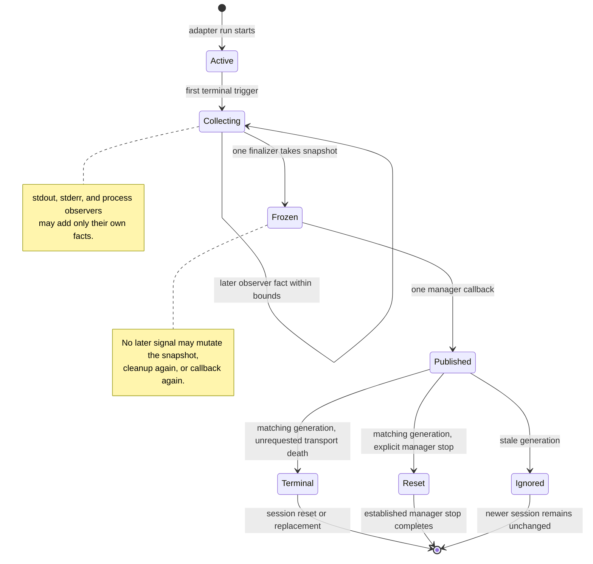

# Data Model: Adapter Transport-Death Lifecycle

This model describes semantic facts and invariants. It deliberately does not freeze Python private attribute names, JSON key spellings, buffer sizes, task names, or timeout values. Those are local implementation details as long as the requirements and bounded behavior remain true.

## Entities

| Entity | Semantic content | Lifecycle and invariants |
|---|---|---|
| **Adapter run identity** | A branded generation issued by `SessionManager` before `DAPClient.start()`; one process instance; one client-owned `_DapRun` capsule. | The manager binds the generation before process startup. `DAPClient` receives it, uses it for every run-bound observer and finalizer fact, and returns the same identity. A terminal record belongs to exactly one adapter run and cannot be reused by a later start. |
| **Manager generation binding** | The issued adapter-run generation and its active/stopping comparisons owned by one `SessionManager` client association. | A callback may mutate state only when snapshot generation equals the active binding. The stopping comparison selects policy only at callback consumption. A prior-generation snapshot is stale evidence and has no public side effect. |
| **Terminal trigger** | One first observed signal: DAP `terminated`, stdout EOF, reader fault, or adapter process completion. | Exactly one first trigger is retained. A later signal cannot replace it. DAP `exited` is not a terminal trigger. Explicit manager stop is not a transport trigger or snapshot cause. |
| **DAP event fact** | Event sequence and event name; a bounded safe body summary; optional DAP debuggee exit code when `exited` was observed. | The last event is captured before handlers execute. It is a protocol fact, not an adapter-process fact. |
| **Adapter exit fact** | Whether process completion was observed; adapter return code when observed. | Unknown return code remains unknown. It is never copied into a DAP `exited` fact. |
| **Stderr tail fact** | Fixed-capacity tail bytes or normalized text; truncation marker; observer completion/unknown marker. | The tail is bounded at collection time. No code path retains complete stderr solely for this terminal record. |
| **Reader-failure fact** | A bounded category and safe summary for a parse/read failure. | Present only when a reader error occurred. It must not label the adapter as crashed without an observed process fact. |
| **Pre-snapshot collector** | Private mutable aggregation of observer facts while the one finalizer joins observers. | Never public. Mutable only before snapshot freeze. One collector belongs to one adapter run. |
| **`DapTransportTerminal`-style snapshot** | Immutable combination of trigger, adapter facts, DAP facts, stream facts, bounded diagnostics, and finalization outcome. | Created once after bounded joining. Published once to the manager. It cannot change after publication. |
| **Terminal public projection** | Safe bounded subset of the snapshot that answers public state questions. | Stored with `SessionState`; it reveals observed/unknown facts without raw unbounded stream payload, process handle, or invented cause. |
| **Pending request terminalization** | A pending DAP request changes from unresolved to one terminal exception/cancellation outcome. | Each unsettled request is completed at most once by the finalizer. A later observer cannot replace the outcome. |
| **Manager public outcome** | For unrequested transport death: existing active state becomes terminal, execution waiter wakes, and state/thread resource revisions advance through the existing path. For explicit manager stop: terminal facts are recorded while the existing reset-to-idle path remains the outcome. | Consumes one terminal snapshot once. Repeated client signals cannot create a second logical terminal transition or reset publication. |

## Semantic shape of the terminal snapshot

The implementation may use a frozen dataclass named `DapTransportTerminal`, a frozen nested value, or an equivalent immutable local shape. Its type must encode these facts without conflating them:

```text
terminal snapshot
├── origin
│   ├── adapter-run generation
│   └── first terminal trigger
├── adapter process
│   ├── adapter PID
│   ├── process completion observed marker
│   └── adapter return code when observed
├── DAP protocol
│   ├── protocol-terminated observed marker
│   ├── last DAP event summary
│   └── DAP debuggee exit code when `exited` was observed
├── streams
│   ├── stdout EOF marker
│   ├── bounded reader-failure summary when present
│   └── bounded stderr tail, truncation, and drain-completion state
└── finalization
    ├── bounded observation/cleanup outcome
    └── explicit unknown markers for facts not observed before the bound
```

The tree identifies required meaning, not mandatory member names. The implementation must avoid an untyped `dict[str, Any]` as the internal source of truth because it makes contradictory or missing lifecycle combinations too easy to create. A typed immutable value is the intended boundary.
## Frozen synthesis constraints

The selected base is a client-owned `_DapRun` capsule, corrected from the arena's swapped proposal labels. The manager-issued generation is its pre-start input, not a client-issued identity. The capsule owns mutable process, stream, pending-request, observer, and finalizer state. The manager owns only issued, active, and stopping generation comparison plus the public outcome.

The synthesis grafts pre-start manager issuance with identity equality, generation-scoped stop comparison, named callback dispositions, and projection-before-state-transition ordering. It rejects a manager-side subprocess coordinator, an async terminal queue, derived manager phase states, a PID-plus-generation return record, and an explicit-stop transport cause.

The finalizer election has no `await`: it checks the run phase, records the first trigger, and assigns the sole finalizer task synchronously. Therefore no concurrent observer can elect a second owner.


## Legal fact combinations

| Situation | DAP `exited` fact | DAP `terminated` fact | Adapter exit fact | Stdout EOF | Public session outcome |
|---|---|---|---|---|---|
| Normal protocol completion | May be present with debuggee exit code. | Present. | May be unknown at terminal snapshot. | May be later. | Terminal DAP session; no claim that debuggee exit follows from `terminated`. |
| Debuggee exits before session ends | Present. | Absent at this point. | Unknown. | Absent at this point. | Existing session remains governed by later protocol/transport facts. |
| Raw stdout EOF | May be absent. | Absent. | Known or unknown. | Present. | Terminal DAP session once finalizer publishes; no causal label for EOF. |
| Adapter exits first | May be absent. | May be absent. | Present, return code may be known. | May arrive later. | Terminal DAP session once finalizer publishes; adapter code is not debuggee code. |
| Reader failure | May be present or absent. | May be present or absent. | Known or unknown. | May be absent. | Terminal DAP session; reader error is bounded and not called a crash by itself. |
| Explicit stop racing EOF | Any. | Any. | Known or unknown. | Any. | One finalization record and one cleanup owner. The callback records facts while the existing manager reset-to-idle path remains the sole public state/resource outcome. |

## State transition model



`Active`, `Collecting`, `Frozen`, and `Published` are lifecycle model states. They do not require new public `DebugState` values. For unrequested transport death, the public manager uses its established `DebugState.TERMINATED` destination. For explicit manager stop, it uses its established reset-to-idle destination without first publishing `TERMINATED`.

## Cardinality rules

1. One adapter run has zero or one terminal snapshot before its first terminal trigger, then exactly one after finalization begins and completes.
2. One snapshot has exactly one first terminal trigger. It can carry zero or more later observed facts gathered before freezing.
3. One `SessionManager` issues and binds one generation before process startup, then registers one callback for its owned client. `DAPClient` receives the bound generation and returns the same identity. Re-registration is idempotent or rejected; it cannot create multiple callbacks.
4. Finalizer election has no `await` between phase check, first-trigger assignment, and sole-finalizer-task assignment. Later terminal requests join that task.
5. A snapshot whose generation does not equal the active binding has no manager state, waiter, or resource effect.
6. One matching published snapshot causes one manager-owned public outcome: one terminal transition when no matching manager stop is active at callback consumption, or one existing reset-to-idle path when that current manager stop operation is active.
7. That manager outcome calls the existing state/thread publication mechanism once. Transport duplicates must not create another logical publication.
8. One unsettled request receives one terminal outcome. Resolved requests remain resolved.
9. One later session has a new manager-issued run identity, `_DapRun` capsule, collector, finalizer scope, snapshot, and callback association. It does not inherit terminal facts from the previous run.

## Bounds and privacy rules

| Data | Required bound | Public treatment |
|---|---|---|
| stderr | A named fixed tail-capacity budget enforced during append. | Only the safe bounded tail and whether it was truncated may appear in state diagnostics. |
| DAP event body | A named fixed summary budget enforced before retention. | No full raw event body is exposed solely for diagnostics. |
| Reader error | A named fixed safe summary budget. | Error category and bounded detail may be exposed; raw traceback/source payload is not required. |
| wait/drain time | Named bounded observation and cleanup intervals. | The terminal snapshot marks timeout/unknown rather than making a delayed observer block state forever. |
| process identity | PID only as diagnostic identity; no handle serialization. | A historical PID must never drive a post-terminal `debuggeeAlive=true` claim. |
| terminal history | One current terminal snapshot per current/last client run. | The child does not build an unbounded incident ledger or persistence system. |

The record must use the repository's existing safety conventions for diagnostic text: it should not log or serialize an unbounded payload, credential-like value, or a private path merely because it occurred on stderr or in an event body.

## Invalid states made unrepresentable

The implementation must prevent or reject these combinations at the typed boundary:

- a frozen terminal snapshot with no first terminal trigger;
- an adapter return code marked known while adapter completion is unobserved;
- a DAP debuggee exit code stored as the adapter process return code;
- `protocol terminated` treated as proof of a debuggee exit;
- a DAP `exited` event as the sole terminal trigger;
- a post-freeze mutation of a terminal fact;
- two finalizer owners for one run;
- an await in finalizer election between phase check and sole-task assignment;
- a snapshot from a different adapter-run generation mutating the active manager state, waiters, or resource revisions;
- a manager treating a frozen transport record as the authority for planned-versus-unrequested shutdown rather than using its current stop state at callback consumption;
- an explicit manager stop represented as a fabricated transport trigger or cause;
- two manager callbacks or two logical manager terminal transitions for one snapshot; and
- an unbounded stderr/event/error value inserted into the terminal snapshot or its public projection.

## Storage boundary

There is no persistent database, release record, telemetry pipeline, Sonar record, or process registry extension in this child. The terminal snapshot is run-scoped runtime state. `SessionState` retains only the current safe projection needed by the existing `get_debug_state` surface until the manager resets or replaces the session.
