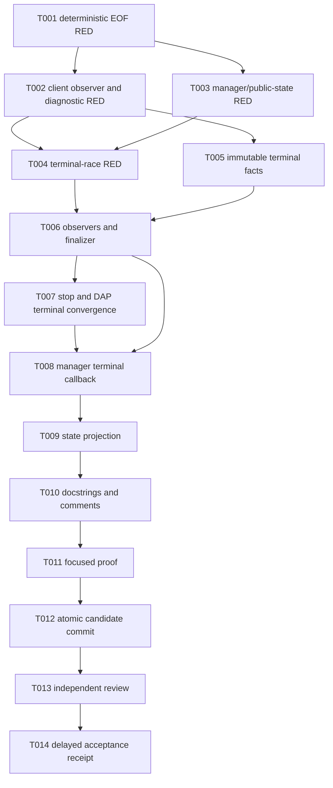

# Tasks: Adapter Transport-Death Lifecycle

**Input:** `specs/012-adapter-transport-death-lifecycle/{spec.md,plan.md,research.md,architecture.md,data-model.md,quickstart.md,checklists/requirements.md}`.  
**Parent:** `specs/011-issue450-sonar-release-program/`, Wave 1 only.  
**Source base:** `e95223ba1bddd7a08e440e4a0eca3db9f3c068b9`.

## Scope and execution rules

- This is a D1 child for the legacy Python adapter transport/session boundary. It has **no public release intent**.
- Every new behavior test is written before the implementation that turns it green. The first task is the required deterministic EOF RED.
- Use only the listed existing source and test files unless a reviewed source fact proves that another focused file is required. Do not create a second lifecycle convention beside the existing client/manager/state boundaries.
- `DAPClient` owns observation and one finalizer. `SessionManager` owns one public state/resource transition. No observer calls a manager state mutation directly.
- `SessionManager` issues and binds the generation before `DAPClient.start()` creates the process. `DAPClient` receives that generation and owns the matching per-run `_DapRun` capsule. Finalizer election has no `await` between phase check, first-trigger assignment, and sole-finalizer-task assignment.
- The frozen arena synthesis selected the client-owned `_DapRun` base, grafted manager-issued pre-start generation, active/stopping generation comparison, named callback dispositions, and projection-before-transition ordering, and rejected manager-owned subprocess finalization, an async terminal queue, derived manager phases, a PID-plus-generation return record, and an explicit-stop transport cause.
- Preserve DAP `exited`, DAP `terminated`, adapter process exit, and transport EOF as distinct facts.
- Do not modify `src/netcoredbg_mcp/build/**`, `scripts/run_sonarqube_exact_head.py`, `SonarQube.Analysis.xml`, `pyproject.toml`, `uv.lock`, `.github/**`, release/package files, public Python/default-route files, or stateless-preview files.
- Do not use a suppression, exclusion, baseline reset, accepted risk, threshold change, or server-policy change for Sonar. Sonar and coverage work belong to later waves.
- Do not create `acceptance-receipt.md` during planning or before the exact candidate proof and review named in T010–T011 exist.

## Format

`[ID] [P?] [Requirement] Description`

- **[P]** marks an implementation or test task that can proceed only after its stated prerequisites and owns a different file set.
- Each task names its exact source/test paths and a behavior-based acceptance result.

## Phase 1: Deterministic RED contract

**Purpose:** Reproduce the public contradiction before adding lifecycle code. This phase establishes tests that fail on the source base for the missing transport-to-manager notification, not tests that merely assert a new helper exists.

- [x] **T001 [TD-001]** Add the first deterministic fake-asyncio-subprocess RED in `tests/test_client.py`. Wire a real `DAPClient` to the existing `SessionManager` test seam, set manager state to `RUNNING` with a debuggee PID, register existing manager state-listener and state/thread resource-notification observers, create an unsettled pending request, and make fake stdout immediately return `b""` without a DAP `terminated` event. **Acceptance:** the test asserts the desired terminal state, one manager-visible state transition, one state/thread publication path, false/unavailable public liveness, and prompt pending-request failure. On `e95223ba1bddd7a08e440e4a0eca3db9f3c068b9`, that behavior assertion fails because `_read_loop` leaves state stale and produces no manager-visible transition. **Evidence:** `uv run --locked --extra dev python -m pytest tests/test_client.py::TestDAPClientTransportDeath::test_stdout_eof_publishes_terminal_manager_state -q` failed with `state=running`, `debuggeeAlive=true`, no state changes, and no resource updates while the pending request failed promptly.
- [x] **T002 [TD-002, TD-003, TD-005]** Extend `tests/test_client.py` with RED cases for the semantic terminal snapshot and three observers: adapter-run generation, adapter PID, observed-versus-unknown adapter return code, bounded stderr tail/truncation, bounded last parsed DAP event, bounded reader error, and independent stdout/stderr/process task ownership. **Depends on:** T001. **Acceptance:** each assertion describes an observable transport fact and fails on current code because no snapshot, stderr observer, or process waiter exists. Planned-versus-unrequested shutdown remains a manager integration assertion in T003/T004. **Evidence:** the focused RED matrix reported stdout observation without stderr or process-wait observation, no EOF stderr drain/process join, and no `set_transport_terminal_handler` seam.
- [x] **T003 [P] [TD-004, TD-006, TD-007]** Extend `tests/test_session.py`, `tests/test_debuggee_liveness.py`, and `tests/test_resource_updates.py` with RED manager-integration cases. Cover one current-generation callback registration, one unrequested terminal manager transition, execution-waiter wake, terminal public liveness, one logical state/thread resource path, `exited` without `terminated`, and `terminated` without a known debuggee exit. Add a stale-prior-generation callback case that leaves the newer session untouched and an explicit-stop race that proves the manager's current stop operation at callback consumption selects the existing reset-to-idle path. **Depends on:** T001. **Acceptance:** tests distinguish the four terminal fact classes, generation ownership, and manager stop precedence; they fail on the current unnotified EOF route without changing public route selection. **Evidence:** the focused RED matrix reported stale `RUNNING`/live state after exited-plus-EOF, prior-client termination mutating a newer session, no terminal resource path after EOF, and a premature `TERMINATED` publication during explicit stop.
- [x] **T004 [TD-004, TD-010]** Add deterministic terminal-race RED cases in `tests/test_client.py`, with existing manager/resource assertions where needed. Schedule DAP `terminated` → EOF → process exit, process exit → EOF, EOF while process remains live briefly, reader failure, an explicit manager stop active when callback is consumed, and a late prior-generation snapshot after a newer run begins. **Depends on:** T002, T003. **Acceptance:** each unrequested current-generation case expects one finalizer owner, one pending-request terminalization, one cleanup decision, one manager callback, and one terminal transition. The explicit-stop race expects the same one finalizer and callback but only the existing single reset path. The stale-generation case expects no newer-session mutation. Current code cannot satisfy the complete matrix. **Evidence:** the RED set covers process-exit-before-EOF, EOF while live, reader failure, explicit-stop precedence, and stale prior-client delivery; `test_dap_terminated_then_eof_and_process_exit_publish_once` additionally fails because the one terminal callback seam is absent.

**Checkpoint:** The direct Issue #450 contradiction, diagnostic gaps, public-state gap, and terminal-ordering contract have nonzero RED coverage. No product implementation has yet been credited as complete.

## Phase 2: Client-owned terminalization

**Purpose:** Make the DAP client observe all relevant terminal sources and publish one immutable terminal record without changing DAP wire behavior.

- [x] **T005 [TD-002, TD-005]** Implement the immutable bounded `DapTransportTerminal`-style record and its private mutable collection phase in `src/netcoredbg_mcp/dap/client.py`. `SessionManager` must issue and bind the generation before awaiting `DAPClient.start()`. `DAPClient` must receive that generation and construct one matching `_DapRun`; bind every collector, snapshot, observer task, and finalizer to it. The final immutable value must contain the transport semantic groups defined in `data-model.md`, not a new public wire schema or manager stop-policy field. **Depends on:** T002. **Acceptance:** client tests prove returned identity equality, facts are bounded, unknown facts remain explicit, a published record cannot be mutated by later observer activity, and a later run cannot reuse an earlier generation's record. **Evidence:** the focused lifecycle group passes the known/unobserved exit, immutable callback, and generation-fencing cases.
- [x] **T006 [TD-003, TD-004, TD-005]** Implement the three observer lifetimes and single guarded finalizer in `src/netcoredbg_mcp/dap/client.py`. Start stdout, stderr, and process wait observers with the existing process inside the `_DapRun`; record the last DAP event before handlers; route only DAP `terminated`, EOF, reader failure, process completion, and explicit client stop to the one generation-bound owner. Election must not await between phase check, first-trigger assignment, and sole-finalizer-task assignment. The owner gives bounded natural exit and stderr drain time before the existing controlled termination escalation when needed. **Depends on:** T004, T005. **Acceptance:** T002 and T004 become GREEN; no observer can independently terminate/kill, invoke the manager, publish a second terminal snapshot, or elect a second finalizer. **Evidence:** the focused lifecycle group passes observer-start, stderr/process join, EOF, reader-failure, DAP-terminated ordering, and no-second-terminate cases.
- [x] **T007 [TD-004, TD-007]** Migrate explicit `DAPClient.stop()` and DAP `terminated` processing in `src/netcoredbg_mcp/dap/client.py` to request and await the same generation-bound guarded finalizer. Preserve normal nonterminal event dispatch and keep DAP `exited` as a debuggee-exit fact rather than a terminal-session trigger. **Depends on:** T006. **Acceptance:** race tests show explicit client stop and protocol terminal events share the owner; semantic tests show no fabricated DAP event, explicit-stop transport cause, or cross-assigned exit code. **Evidence:** protocol termination now records a fact and drains to the same finalizer; the explicit-stop precedence test passes without a preliminary terminal publication.

**Checkpoint:** One client run has one bounded lifecycle owner. The client can report an honest transport terminal fact, but no manager state behavior is accepted until Phase 3 completes.

## Phase 3: Manager-owned public outcome

**Purpose:** Connect the completed client boundary to the existing session state and resource mechanism exactly once.

- [x] **T008 [TD-004, TD-006, TD-007]** In `src/netcoredbg_mcp/session/manager.py`, issue and bind the generation and install one transport-terminal callback before awaiting client process startup. Pass the generation into `DAPClient.start()` and reject a mismatched returned identity. Implement the callback so active/stopping generation comparisons select one named disposition: apply unrequested, record during stop, ignore stale, or ignore duplicate. Migrate the direct DAP `terminated` state path into the callback path so protocol, EOF, and process races cannot double-transition the manager. During explicit `SessionManager.stop()`, mark the manager's stopping generation before awaiting the client finalizer; at callback consumption, use that current manager state to choose the existing reset-to-idle path without a preliminary terminal state/resource transition. **Depends on:** T006, T007. **Acceptance:** session integration tests prove exactly one matching-generation unrequested terminal transition, one execution-waiter wake, and one use of the existing state/thread resource path; explicit-stop races prove one reset outcome rather than a terminal-plus-reset pair; stale snapshots leave the newer session untouched. **Evidence:** current-client EOF terminalizes once, prior-client delivery leaves the newer session running, and explicit stop publishes only the reset path.
- [x] **T009 [TD-005, TD-006, TD-007]** Add the safe bounded terminal projection to `src/netcoredbg_mcp/session/state.py` and preserve the existing `src/netcoredbg_mcp/tools/debug.py` `get_debug_state` route as the public reader. Store the projection before the manager performs an unrequested terminal state transition. **Depends on:** T008. **Acceptance:** public-liveness tests prove that a retained historical PID does not produce `debuggeeAlive=true` after matching-generation terminalization; the projection distinguishes protocol termination, debuggee exit, adapter exit, and unknown transport facts without exposing unbounded stream data. It does not duplicate the manager's current stop-policy state. **Evidence:** the focused liveness/resource cases pass with `debuggeeAlive=false`, retained historical PID, and one bounded additive `transportTerminal` projection.

**Checkpoint:** The Issue #450 public contradiction is repaired through the existing Python route. No build cleanup, Sonar, coverage, package, or route behavior is part of the candidate.

## Phase 4: Clarity and focused proof

**Purpose:** Make the ownership/race contract maintainable, then prove the exact bounded child behavior.

- [x] **T010 [TD-009, TD-010]** Add detailed boundary docstrings and ownership comments in `src/netcoredbg_mcp/dap/client.py`, `src/netcoredbg_mcp/session/manager.py`, and `src/netcoredbg_mcp/session/state.py`. Explain the immutable-snapshot boundary, three observer roles, one finalizer owner, bounded joining, manager-only state mutation, and the `exited`/`terminated` distinction. **Depends on:** T009. **Acceptance:** a reader can identify the sole cleanup owner and the difference between debuggee, protocol, adapter-process, and transport facts without following an implicit race assumption. **Evidence:** the source documents each domain type, observer, no-await election, bounded join, callback disposition, public projection, and DAP semantic boundary.
- [x] **T011 [TD-010]** Run the focused nonzero-denominator proof described in `quickstart.md` over `tests/test_client.py`, `tests/test_session.py`, `tests/test_debuggee_liveness.py`, and `tests/test_resource_updates.py`. **Depends on:** T010. **Acceptance:** direct RED-to-GREEN, observer/diagnostic, manager integration, public liveness/resource, semantic-separation, and race cases pass. Do not substitute a formatter, linter, build, broad suite, or a claim of test execution for this focused proof. **Evidence:** `uv run --locked --extra dev python -m pytest -q tests/test_client.py tests/test_session.py tests/test_debuggee_liveness.py tests/test_resource_updates.py` completed `123 passed`.

## Phase 5: Candidate and delayed acceptance

**Purpose:** Freeze exactly the proven Wave 1 candidate, obtain the one D1 checker, and only then create evidence.

- [x] **T012 [TD-008, TD-010]** Inspect the scoped candidate diff, verify that only the planned client/manager/state/test/documentation surfaces changed, and create one atomic candidate commit. **Depends on:** T011. **Acceptance:** the commit contains the finished behavior, focused tests, and explanatory documentation; it contains no build-cleanup, Sonar, coverage, workflow, release, package, public-route, or stateless-preview change. **Evidence:** final PR-correction implementation candidate `4bbfa7296d0f4ef90150eab9cb7b6707ff362bb6` contains the Wave-1 source/tests plus review-required planning corrections; focused lifecycle proof is `131 passed`, adjacent lifecycle proof is `116 passed`, and scoped Ruff, mypy, compile, and correction-diff checks are clean. It contains no Wave-2 cleanup, build implementation, Sonar runner, coverage, release, package, public-route, or stateless-preview change.
- [x] **T013 [TD-009, TD-010]** Obtain one independent review of the exact T012 commit. **Depends on:** T012. **Acceptance:** the reviewer re-derives TD-001 through TD-010 from current source and focused evidence, checks that the root cause is not replaced with a guessed producer cause, and leaves no unresolved blocking finding. **Evidence:** the historical contract/race/security reviews remain bound to their predecessor bytes; all 13 PR #288 findings were corrected and resolved; `agent://CheckWave1PrCorrection` returned `PASS` for exact candidate `4bbfa7296d0f4ef90150eab9cb7b6707ff362bb6`, with `247/247` focused-plus-adjacent tests and clean scoped static proof.
- [x] **T014 [TD-010]** Create `specs/012-adapter-transport-death-lifecycle/acceptance-receipt.md` and commit it only after T011 through T013 pass. **Depends on:** T011, T012, T013. **Acceptance:** the receipt names the exact atomic candidate SHA, the deterministic RED-to-GREEN proof, terminal-race and public-resource evidence, bounded diagnostic evidence, one independent review, and unchanged-route comparison. It states that Wave 1 is an internal verified wave, not v0.23.11 publication authority. **Evidence:** `acceptance-receipt.md` binds exact implementation candidate `4bbfa7296d0f4ef90150eab9cb7b6707ff362bb6`, the `131` focused and `116` adjacent proofs, the historical review chain, the exact PR-correction check, and the no-release boundary.

## Requirement coverage

| Requirement | Tasks | Exact files |
|---|---|---|
| TD-001 | T001, T011, T014 | `tests/test_client.py`; `src/netcoredbg_mcp/dap/client.py`; `src/netcoredbg_mcp/session/{manager.py,state.py}` |
| TD-002 | T002, T005, T011 | `src/netcoredbg_mcp/dap/client.py`; `tests/test_client.py` |
| TD-003 | T002, T006, T011 | `src/netcoredbg_mcp/dap/client.py`; `tests/test_client.py` |
| TD-004 | T004, T006, T007, T011 | `src/netcoredbg_mcp/dap/client.py`; `tests/test_client.py` |
| TD-005 | T002, T005, T006, T009, T011 | `src/netcoredbg_mcp/dap/client.py`; `src/netcoredbg_mcp/session/state.py`; `tests/test_client.py`; `tests/test_session.py` |
| TD-006 | T003, T008, T009, T011 | `src/netcoredbg_mcp/session/manager.py`; `src/netcoredbg_mcp/session/state.py`; unchanged `src/netcoredbg_mcp/tools/debug.py`; `tests/test_session.py`; `tests/test_debuggee_liveness.py`; `tests/test_resource_updates.py` |
| TD-007 | T003, T007, T008, T009, T011 | `src/netcoredbg_mcp/dap/client.py`; `src/netcoredbg_mcp/session/{manager.py,state.py}`; `tests/test_client.py`; `tests/test_session.py` |
| TD-008 | T012, T013, T014 | Scoped diff and unchanged comparison surfaces named in this packet |
| TD-009 | T010, T013, T014 | `src/netcoredbg_mcp/dap/client.py`; `src/netcoredbg_mcp/session/{manager.py,state.py}`; `specs/012-adapter-transport-death-lifecycle/**` |
| TD-010 | T004, T011, T012, T013, T014 | Four focused test files; exact candidate commit; delayed `acceptance-receipt.md` |

## Dependency graph

## Parallel opportunity

Only T003 may begin alongside T002 after T001 because it edits separate existing test files. Keep `tests/test_client.py` and `src/netcoredbg_mcp/dap/client.py` single-owner through T001, T002, T004, T005, T006, and T007. Keep `src/netcoredbg_mcp/session/manager.py` and `src/netcoredbg_mcp/session/state.py` single-owner through T008 and T009. The final proof, candidate commit, review, and receipt are strictly ordered.

## Final checkpoint

Wave 1 is complete only after T014. Until then, the packet is a design contract and task sequence. It authorizes neither source publication nor a v0.23.11 release; the parent program preserves one public shipping moment after all five internal waves satisfy their own evidence boundaries.
