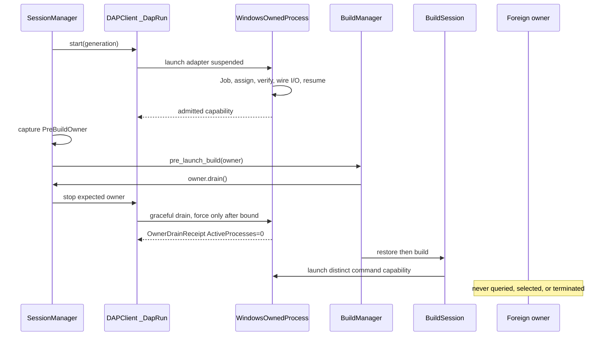
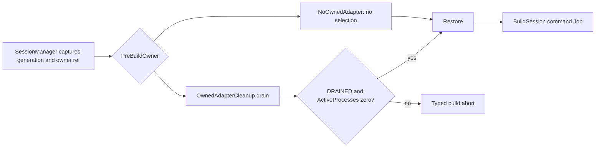

# Architecture: Owner-Scoped Pre-Build Cleanup

**Status:** Planned D2 architecture. This document describes a future private boundary and records no implementation or acceptance result.
**Source base:** `3ffaefee7d8dbd9680537804c83b96a8f836e8fe`
**Authority:** `agent://ArchitectWave2Ownership`
**Release intent:** `none`

## Design decision: W2-ADR-001

### Context

The current pre-build route uses image, PID, program-name, directory, and WMI selectors. `BuildSession` creates a Job only after an asyncio child already runs, then ignores assignment failure. `ProcessRegistry` persists only PIDs. None of these facts proves that the requesting session owns a process tree.

Wave 1 already gives `DAPClient._DapRun` a manager-issued generation and one guarded finalizer. The new process-owner contract must extend that lifecycle rather than replace it.

### Alternatives

| Shape | Decision | Reason |
|---|---|---|
| Stop the adapter directly in `SessionManager`, then pass a drain fact to `BuildManager`. | Rejected. | Direct `BuildManager` callers could bypass the cleanup precondition, and the capability would remain implicit. |
| Make `BuildManager` launch the adapter and lend its streams to `DAPClient`. | Rejected. | It reverses established DAP ownership, couples build orchestration to transport, and breaks the accepted Wave 1 finalizer boundary. |
| Turn `ProcessRegistry` into a global owner or lifecycle service. | Rejected. | The registry is PID-only, persistent, shared with unrelated observations, and cannot retain a Job or direct process handle across a crash. |
| Keep `asyncio.create_subprocess_exec` and assign a Job by PID after launch. | Rejected. | CPython closes the primary thread handle. Post-spawn assignment leaves an execution interval and cannot make an assignment failure fail closed. |
| Use one instance-only Windows capability per adapter run and build command. | Selected. | A retained Job and direct handles prove one owner's containment. The boundary is small, has no global state, and preserves the current caller hierarchy. |

### Decision

Add one private `WindowsOwnedProcess` boundary in `src/netcoredbg_mcp/windows_process_owner.py`. On Windows it must:

1. create an unnamed private Job and configure `JOB_OBJECT_LIMIT_KILL_ON_JOB_CLOSE`;
2. create the child suspended with `CreateProcessW(CREATE_SUSPENDED)`;
3. assign the retained root process handle to that Job;
4. verify membership and initial accounting;
5. attach parent I/O while only intended child standard handles are inheritable; and
6. call `ResumeThread` only after all preceding steps succeed.

Any failure before resume terminates the retained child or Job, waits within the selected bound, closes opened handles, and raises a typed failure. Resume failure terminates the admitted Job and records a non-successful drain. The boundary never discovers a process.

Each `DAPClient._DapRun` owns one capability for its manager-issued generation. Each `BuildSession` command owns another capability. `SessionManager` captures a one-shot `PreBuildOwner` value and passes it to `BuildManager`. `BuildManager` consumes that value before restore or build. The default route has no selector fallback.

## Caller-first contract

The caller sees capability results and streams. It does not see Win32 structures, handles, PID reopening, Job accounting calls, or pipe inheritance details.

```python
from __future__ import annotations

import asyncio
from collections.abc import Awaitable, Callable, Mapping, Sequence
from dataclasses import dataclass
from enum import Enum
from typing import Literal, Protocol


class AsyncByteWriter(Protocol):
    def write(self, data: bytes) -> None: ...
    async def drain(self) -> None: ...
    def close(self) -> None: ...


@dataclass(frozen=True, slots=True)
class OwnedProcessRef:
    owner_id: str
    generation: object
    root_pid: int


class AdmissionStage(str, Enum):
    CREATE_JOB = "create_job"
    SET_LIMITS = "set_limits"
    CREATE_PROCESS = "create_process"
    ASSIGN = "assign"
    VERIFY = "verify"
    WIRE_IO = "wire_io"
    RESUME = "resume"


class DrainStatus(str, Enum):
    DRAINED = "drained"
    TIMED_OUT = "timed_out"
    FAILED = "failed"
    STALE = "stale"


@dataclass(frozen=True, slots=True)
class OwnerDrainReceipt:
    owner: OwnedProcessRef
    status: DrainStatus
    forced: bool
    root_returncode: int | None
    active_processes: int | None
    failure_stage: AdmissionStage | None = None
    winerror: int | None = None


class ProcessAdmissionError(RuntimeError):
    stage: AdmissionStage
    owner_id: str
    winerror: int | None


class WindowsOwnedProcess:
    owner: OwnedProcessRef
    stdin: AsyncByteWriter | None
    stdout: asyncio.StreamReader
    stderr: asyncio.StreamReader

    @classmethod
    async def launch(
        cls,
        *,
        generation: object,
        argv: Sequence[str],
        cwd: str | None,
        env: Mapping[str, str] | None,
        stdin_mode: Literal["pipe", "devnull"],
    ) -> "WindowsOwnedProcess": ...

    async def wait_root(self) -> int: ...
    async def drain_after_grace(
        self,
        *,
        grace_timeout: float,
        force_timeout: float,
    ) -> OwnerDrainReceipt: ...
    async def force_and_drain(self, *, timeout: float) -> OwnerDrainReceipt: ...
    async def aclose(self) -> None: ...


@dataclass(frozen=True, slots=True)
class NoOwnedAdapter:
    pass


@dataclass(frozen=True, slots=True)
class OwnedAdapterCleanup:
    owner: OwnedProcessRef
    _drain: Callable[[OwnedProcessRef], Awaitable[OwnerDrainReceipt]]

    async def drain(self) -> OwnerDrainReceipt:
        return await self._drain(self.owner)


PreBuildOwner = NoOwnedAdapter | OwnedAdapterCleanup


@property
def DAPClient.adapter_owner(self) -> OwnedProcessRef | None: ...


async def DAPClient.start(self, *, generation: object | None = None) -> object: ...
async def DAPClient.stop(
    self,
    *,
    expected_owner: OwnedProcessRef | None = None,
) -> OwnerDrainReceipt | None: ...


def SessionManager.capture_prebuild_owner(self) -> PreBuildOwner: ...
async def SessionManager._stop_owned_adapter(
    self,
    expected: OwnedProcessRef,
) -> OwnerDrainReceipt: ...


async def BuildManager.pre_launch_build(
    self,
    workspace_root: str,
    project_path: str,
    *,
    owner: PreBuildOwner,
    configuration: str = "Debug",
    restore_first: bool = True,
    timeout: float = 300.0,
    output_callback: Callable[[str, str], Awaitable[None]] | None = None,
) -> BuildResult: ...
```

These are private implementation contracts. `owner_id`, generation, and `root_pid` help logging and stale-call fencing. The retained `WindowsOwnedProcess` handles, not those values, authorize cleanup.

## Component ownership

| Component | Owns | Must not own |
|---|---|---|
| `windows_process_owner.py` | Win32 declarations, Job/process/thread handles, exact admission order, inherited-handle list, accounting, bounded drain, and handle closure. | DAP policy, build retry policy, global registry, PID discovery, or public route selection. |
| `DAPClient._DapRun` | One generation-bound adapter capability, DAP streams, Wave 1 observers, pending requests, the single finalizer, and terminal callback sequencing. | `SessionManager` public state, a global owner map, or another adapter's capability. |
| `SessionManager` | Generation issuance, current/stopping checks, graceful DAP policy, immutable owner capture, pre-build delegation, and public reset behavior. | Raw Win32 handles, Job accounting, build-command ownership, or selector cleanup. |
| `BuildManager` | Required `PreBuildOwner` input, owner-drain precondition, restore/build ordering, and a typed abort when drain is non-successful. | `DAPClient`, `ProcessRegistry`, or Win32 details. |
| `BuildSession` | A fresh command capability, command output, normal completion, timeout, session cancellation, outer cancellation, and the command drain. | Adapter capability or pre-build session policy. |
| `build/cleanup.py` | The explicit `PreBuildOwner` data types and owner-result validation until selector code is removed. | Images, PIDs, paths, WMI, directories, `taskkill`, `lsof`, `/proc`, `pkill`, or process enumeration. |
| `ProcessRegistry` | Existing status and explicit legacy compatibility behavior. | Pre-build authority, Job membership, retained handles, or generation fencing. |

## Data and control flow





## Owner lifecycle and failure semantics

| State | Entry condition | Allowed next state | Required result |
|---|---|---|---|
| `allocating` | Begin launch. | `suspended_unadmitted`, `failed`. | Create the private Job and exact I/O handles. |
| `suspended_unadmitted` | `CreateProcessW` returned retained process and primary-thread handles. | `admitted`, `rejected_unrun`. | The child code has not run. |
| `admitted` | Assign succeeded and membership/accounting verification passed. | `io_ready`, `rejected_admitted`. | The Job and root handle remain private. |
| `io_ready` | Parent stream adapters are attached and only expected child handles are inheritable. | `running`, `rejected_unrun`. | Resume remains the only next action that may execute the child. |
| `running` | `ResumeThread` succeeded. | `grace_period`, `forcing`, `drained`, `failed`. | Process and Job handles remain retained. |
| `grace_period` | Adapter finalizer or normal command completion requested graceful cleanup. | `drained`, `forcing`, `failed`, `timed_out`. | Wait only for the selected bounded interval. |
| `forcing` | Grace bound expired or command cancellation requires force. | `drained`, `failed`, `timed_out`. | Call `TerminateJobObject` for this Job only. |
| `drained` | Accounting reports `ActiveProcesses == 0`. | `closed`. | Capture receipt before closing handles. |
| `closed` | Handles and stream adapters are closed after a receipt. | terminal. | No later PID-based action may revive authority. |

| Failure | Required behavior |
|---|---|
| Job creation or limit configuration fails | Do not create a child. Close partial resources and raise `ProcessAdmissionError`. |
| `CreateProcessW` fails | Close Job, attribute-list, and pipe handles. Do not use asyncio as a Windows fallback. |
| Assignment, membership, accounting, or I/O wiring fails before resume | Do not resume. Terminate the retained suspended root, terminate the Job if admission may have happened, wait within the bound, close handles, and raise. |
| `ResumeThread` fails | Force and drain the admitted Job. Report `failed`, not `drained`. |
| Adapter graceful stop expires | The existing one `_DapRun` finalizer calls the owner force path once, then waits for accounting to reach zero. |
| Build timeout, `BuildSession.cancel()`, or outer cancellation | Shield owner cleanup long enough to record the drain result, then preserve the original timeout or cancellation. |
| Stale cleanup capture | Return `stale` before disconnect or termination. Do not affect the newer generation. |
| Accounting query fails or the deadline expires | Return `failed` or `timed_out`; do not start restore or build after an owned pre-build drain failure. |

## Windows security boundary

- Use `ctypes.WinDLL("kernel32", use_last_error=True)` with explicit `argtypes` and `restype` declarations.
- Create an unnamed Job. Do not create a named shared Job or a global owner registry.
- Keep Job, root process, and primary-thread handles non-inheritable. Use `PROC_THREAD_ATTRIBUTE_HANDLE_LIST` so the child inherits only the intended standard handles.
- Use a resolved executable as `lpApplicationName`, a quoted mutable command line, and `CREATE_UNICODE_ENVIRONMENT` for an explicit environment block.
- Do not set `BREAKAWAY_OK` or `SILENT_BREAKAWAY_OK`. An incompatible parent Job is an admission failure, not permission to run uncontained.
- Do not log raw handle values, full command environments, or stream contents beyond existing bounded diagnostics.
- `KILL_ON_JOB_CLOSE` protects against a leaked owner process. It is not evidence that a normal drain completed.

## Migration and clean cutover

1. Add the private Windows owner boundary and bind it to the existing Wave 1 `_DapRun` lifecycle. Preserve `DAPClient.start(generation=...)`, the single finalizer, and terminal callback semantics.
2. Move each Windows `BuildSession` command to the same primitive with a separate capability. Remove `_job_handle`, `_create_job_object`, `_assign_to_job`, `_close_job_object`, and PID reopening.
3. Add the required `PreBuildOwner` parameter to `BuildManager.pre_launch_build()` and migrate every internal caller through `SessionManager`.
4. Remove normal/pre-build `ProcessRegistry.cleanup_all()` use after the owner path handles current adapter cleanup.
5. Delete `cleanup_for_build`, `kill_debugger_processes`, directory helpers, selector flags, exports, selector tests, and selector documentation. Do not retain a no-op wrapper or a fallback selector.

There is no persisted schema or data migration. A bounded rollback reverts the complete Wave 2 implementation candidate to the accepted Wave 1 base. It does not selectively restore selectors beside the capability contract.

## D2 challenger result

`agent://ArchitectWave2Ownership` records a FULL D2 challenge verdict of **GO** for this shape.

| Finding | Tag | Disposition |
|---|---|---|
| A post-spawn Job or selector does not prove ownership. | contract-gap | Resolved by pre-resume retained capability. |
| Wave 1 `_DapRun`, manager generations, per-manager `BuildManager`, and current `ctypes` practice already provide the narrow integration points. | actionable | Reused. |
| A ProcessRegistry capability migration would enlarge the child without being required for safe pre-build cleanup. | noise | Excluded. |
| A required `BuildManager` owner parameter changes an internal signature. | trade-off | Accepted as a same-wave clean caller migration. |

The authority also checked staleness, false dependencies, complexity, value, scope, assumptions, cognitive bias, security assumptions, and primary-source cross references. The final implementation review must repeat those checks against the exact candidate, not treat this planning verdict as acceptance.

## Non-architecture

This design does not create a public API, a new DAP state machine, a generic process framework, a ProcessRegistry redesign, a pywin32 dependency, a new route, Sonar work, coverage work, release work, or a claim about the historical EOF producer. It does not create an acceptance receipt during packet authoring.
