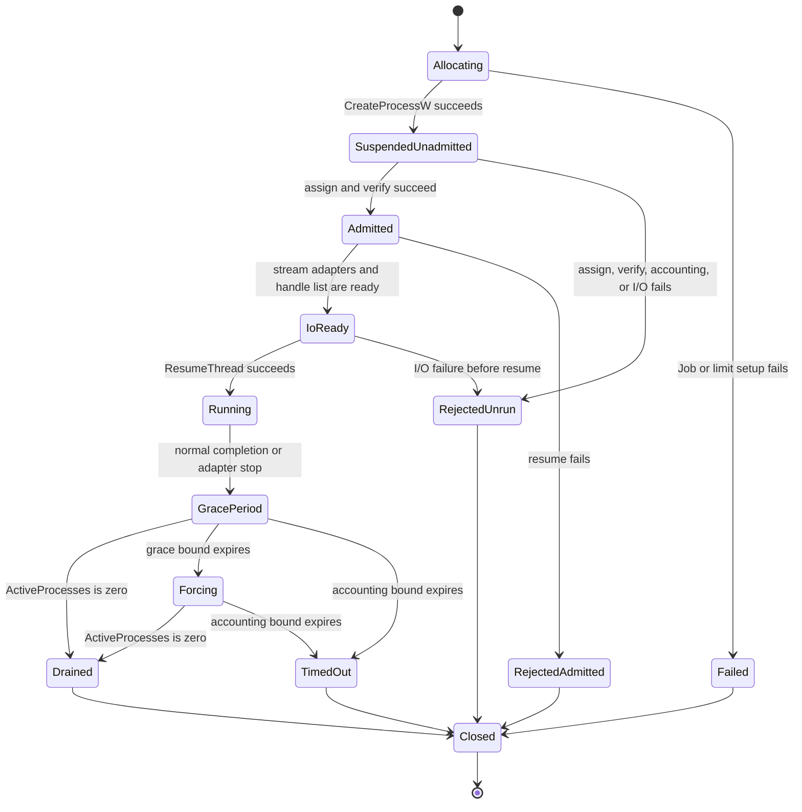
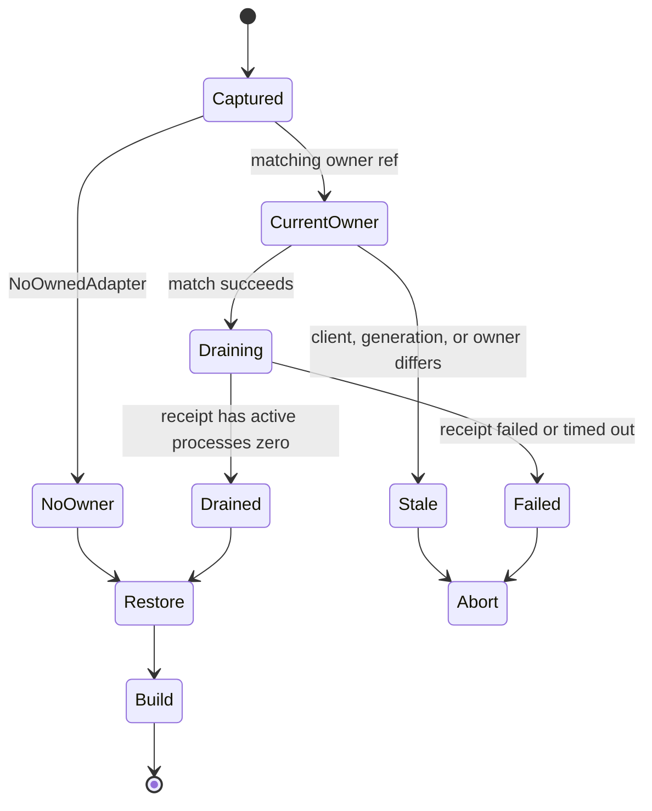

# Data Model: Owner-Scoped Pre-Build Cleanup

**Status:** Planned semantic contract. It introduces no persistence service, database schema, registry extension, or accepted runtime result.
**Source base:** `1b8b2d548a45b17dde690b4cb8e4fc7153d326bc`
**Release intent:** `none`

The model names ownership facts and illegal combinations. Private Python field spellings, ctypes layout names, handle values, timeout values, and log formatting remain implementation details if they preserve this model.

## Entities

| Entity | Semantic content | Lifecycle rule |
|---|---|---|
| `OwnedProcessRef` | Opaque owner ID, existing adapter or command generation, root PID for observation. | It fences stale calls and supports bounded diagnostics. It cannot authorize termination by itself. |
| `WindowsOwnedProcess` | One private Job, retained root process handle, retained primary-thread handle until admission completes, parent I/O adapters, and bounded drain methods. | It is the sole cleanup authority for one owner tree. |
| `AdmissionStage` | `create_job`, `set_limits`, `create_process`, `assign`, `verify`, `wire_io`, or `resume`. | A failure records the stage that blocked admission. |
| `ProcessAdmissionError` | A typed failure with `AdmissionStage`, opaque owner ID, and optional `winerror`. | It means no successful owner capability exists. |
| `OwnerDrainReceipt` | Owner ref, `drained | timed_out | failed | stale`, forced marker, root result if known, current active-process count if known, and failure metadata. | Only `drained` with zero active processes is a successful Windows tree drain. |
| `NoOwnedAdapter` | The caller has no current admitted adapter capability. | It is a legal pre-build value. It never authorizes selection or discovery. |
| `OwnedAdapterCleanup` | An immutable captured owner ref plus a generation-validating drain callback. | It may drain only its matching current owner or return `stale` without effect. |
| `PreBuildOwner` | `NoOwnedAdapter | OwnedAdapterCleanup`. | Every `BuildManager.pre_launch_build()` call supplies exactly one variant. |
| Adapter capability binding | One `WindowsOwnedProcess` inside one Wave 1 `_DapRun`. | It has the same generation as the run. The Wave 1 finalizer owns drain invocation. |
| Command capability binding | One `WindowsOwnedProcess` inside one `BuildSession` command execution. | It is never shared with an adapter or a second command. |
| Registry observation | Existing PID, role, program, session ID, and timestamp facts. | It may be shown or reaped as observation. It is not an owner capability. |

## Semantic shapes

```text
OwnedProcessRef
├── owner_id: opaque process-local observation
├── generation: adapter-run or command generation
└── root_pid: diagnostic observation

WindowsOwnedProcess
├── owner: OwnedProcessRef
├── private_job_handle
├── retained_root_process_handle
├── retained_primary_thread_handle until ResumeThread outcome
├── intended_child_stdio_handles only
├── parent stdin/stdout/stderr adapters
├── admission_stage
└── one joined drain operation

OwnerDrainReceipt
├── owner: OwnedProcessRef
├── status: drained | timed_out | failed | stale
├── forced: boolean
├── root_returncode: known | unknown
├── active_processes: zero | positive | unknown
├── failure_stage: AdmissionStage | none
└── winerror: known | unknown

PreBuildOwner
├── NoOwnedAdapter
└── OwnedAdapterCleanup
    ├── captured owner ref
    └── generation-validating drain operation
```

`WindowsOwnedProcess` is an in-memory capability. It must not be serialized into `ProcessRegistry`, a PID file, a session record, a public tool response, or an acceptance receipt. A receipt may record only bounded observed outcomes and an exact candidate identity.

## Admission state model



## Legal outcome combinations

| Situation | Resume happened | Forced | `active_processes` | Receipt status | Build may start |
|---|---:|---:|---|---|---:|
| No current adapter | No | No | unknown | not applicable because the variant is `NoOwnedAdapter` | Yes |
| Successful graceful adapter drain | Yes | No | 0 | `drained` | Yes |
| Successful forced adapter drain | Yes | Yes | 0 | `drained` | Yes |
| Admission failed before resume | No | possibly retained-child termination | 0 or unknown while failure is reported | `failed` through `ProcessAdmissionError` | No |
| Resume failed after admission | No successful resume | Yes | 0 required for cleanup completion | `failed` | No |
| Stale capture | not touched | No | not queried | `stale` | No |
| Accounting query fails | possibly | possibly | unknown | `failed` | No |
| Drain bound expires | possibly | possibly | positive or unknown | `timed_out` | No |
| Build-command outer cancellation | command may have resumed | usually force | 0 required before cancellation returns | `drained` or non-successful result | No later command begins |

The `NoOwnedAdapter` row is the only case where pre-build can proceed without an adapter drain. It must not run a selector first.

## Cardinality and authority rules

1. One adapter `_DapRun` generation has zero or one current adapter capability. If present, its `OwnedProcessRef.generation` is that run's generation.
2. One `BuildSession` command has zero or one current command capability. A new command never reuses the previous command's Job or direct handles.
3. One `WindowsOwnedProcess` has one Job and one root process object. The capability may have multiple descendants, but it never represents a foreign Job.
4. One owner cleanup sequence is joined by repeated callers. A second request observes the same pending or completed drain result rather than creating another cleanup branch.
5. `OwnedAdapterCleanup` contains one captured source client, one generation, and one owner ref. All three match immediately before it requests stop or drain.
6. A `ProcessRegistry` entry has no legal conversion to `WindowsOwnedProcess`, `OwnedAdapterCleanup`, or `PreBuildOwner`.
7. A successful Windows `OwnerDrainReceipt` has `status == drained` and `active_processes == 0`. A root return code, root exit, or Job-handle close alone cannot satisfy the condition.
8. `forced == true` is legal only after the selected grace policy expires or a build command cancellation requires immediate force. It always targets the retained Job.

## Invalid states made unrepresentable or rejected

The implementation must prevent or reject:

- a process that reports `running` before assignment, membership verification, accounting verification, I/O setup, and successful resume;
- `drained` with a nonzero or unknown `active_processes` value on Windows;
- `OwnedAdapterCleanup` created from only a PID, registry row, path, image name, session ID, or stale generation;
- a command capability used to terminate an adapter tree, or an adapter capability used to terminate a build command;
- a fallback from `stale`, `failed`, or `timed_out` to WMI, `taskkill`, directory, image, PID, basename, `psutil`, `lsof`, `/proc`, or `pkill` selection;
- a child inheriting a Job, root-process, or primary-thread handle;
- an admission failure that resumes the child deliberately;
- a second adapter finalizer or manager terminal outcome introduced by owner drain;
- a normal/pre-build `ProcessRegistry.cleanup_all()` call after the owner drain becomes the current cleanup path; and
- a public response or persisted record containing a raw handle, complete environment block, or owner capability.

## Pre-build transition model



`Captured`, `CurrentOwner`, and `Stale` are internal pre-build states. They do not add a public DAP state or a public MCP response mode.

## Storage boundary

There is no new persistent owner store. `WindowsOwnedProcess`, its handles, and its pending drain task exist only for one adapter run or build command. `ProcessRegistry` remains a separate PID/status store and is not upgraded into ownership proof. The only durable document created after a completed wave is a later exact-head acceptance receipt. That future receipt records evidence and cannot recreate a capability for a new process.