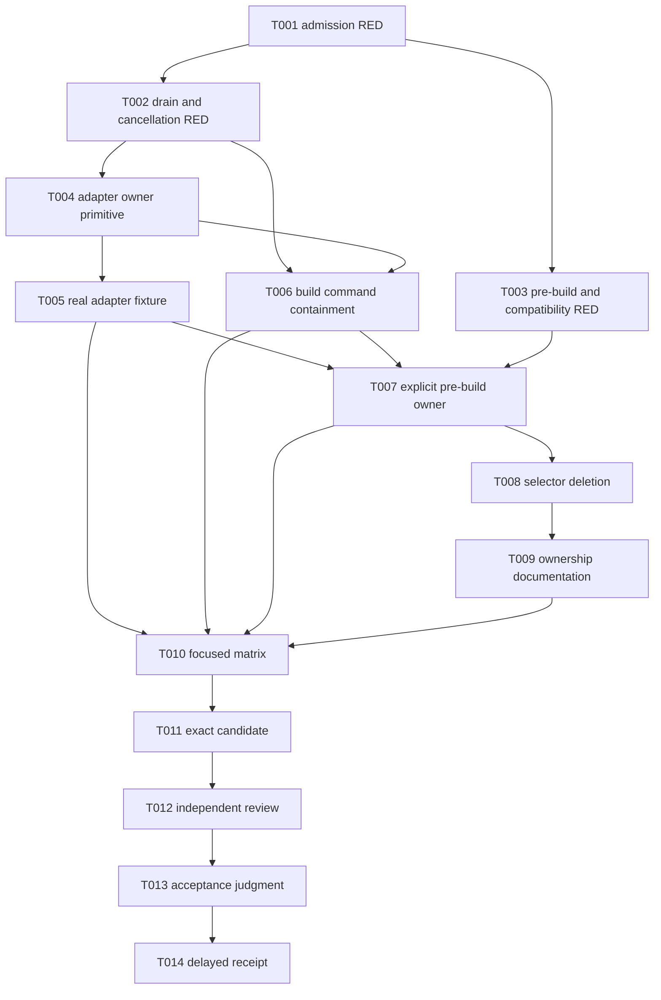

# Tasks: Owner-Scoped Pre-Build Cleanup

**Input:** `specs/013-owner-scoped-prebuild-cleanup/{spec.md,architecture.md,research.md,data-model.md,plan.md,quickstart.md,contracts/windows-owned-process.md,checklists/requirements.md}`.
**Parent:** `specs/011-issue450-sonar-release-program/`, Wave 2 only.
**Source base:** `1b8b2d548a45b17dde690b4cb8e4fc7153d326bc`.
**Release intent:** `none`.

## Scope and execution rules

- This is a D2 child for one private Windows owner boundary. It does not repair or assign a cause for historical issue #450 EOF incidents.
- The first product-facing task is behavior-first RED. Tests must fail against the stated source base because current behavior selects globally, admits after process start, lacks a capability handoff, or lacks an owner drain. A missing planned helper is not a valid RED observation.
- `WindowsOwnedProcess` is private. A retained Job plus direct handles is the only cleanup authority. PID, path, image, WMI, directory, `psutil`, generation, session ID, and ProcessRegistry entry are not authority.
- Preserve Wave 1 `DAPClient._DapRun`, manager-issued generation, guarded finalizer, terminal callback, and public state semantics. Add owner drain inside the existing finalizer, not beside it.
- Preserve public Python/default and stateless-preview route selection, package dependencies, Sonar and coverage policy, release files, and public tool envelopes.
- Do not add a global lifecycle service, singleton owner map, ProcessRegistry capability store, pywin32 dependency, compatibility wrapper, or selector fallback.
- Do not create `acceptance-receipt.md` before T014. The file is intentionally absent from this planning packet.
- Each task has one execution type and one acceptance checkpoint. A later task may not convert an earlier RED row into a pass without retaining the recorded baseline observation.

## Format

`[ID] [Type] [Requirement(s)] Description`

Execution types are `Test`, `Code`, `Review`, and `Input`. `[P]` means that work may run in parallel only after listed prerequisites and only when file ownership does not overlap.

## Phase 1: Behavior-first RED contract

**Purpose:** Establish the 15-row owner-safety and compatibility denominator before product code changes. The RED matrix makes current unsafe behavior observable without treating a planned type name as the failure.

- [x] **T001 [Test] [WOC-001, WOC-002, WOC-006, WOC-008]** Add deterministic RED cases in `tests/test_client.py`, `tests/test_build_session.py`, and a focused fake Win32 seam. Cover O1 through O4: ordered successful admission; assignment failure; membership/accounting failure; and resume failure. **Acceptance:** current source demonstrates post-start process execution or lacks the required assertion path; each injected failure records zero `ResumeThread` calls and bounded retained-resource cleanup as the desired behavior. **RED evidence:** the current adapter/build paths executed the child before assignment, ignored assignment refusal, had no membership/accounting barrier, and had no retained primary-thread resume boundary. O1-O4 failed on the intended ownership assertions; no failure came from a missing planned module or import.
- [x] **T002 [Test] [WOC-001, WOC-003, WOC-004, WOC-007, WOC-008]** Add deterministic RED cases in `tests/test_client.py` and `tests/test_build_session.py` for O5 through O8: adapter graceful drain, grace-deadline force, command timeout/session cancellation/outer cancellation, and accounting loss. **Depends on:** T001. **Acceptance:** current root-process cleanup lacks a Job accounting receipt and cancellation can leave a command descendant unproven; each desired behavior row has a nonzero failing observation. **RED evidence:** O5 and O6 published terminal adapter state with one modeled descendant still active; O7 failed for timeout, session cancellation, and controlled real outer cancellation; O8 reported completion without zero Job accounting. The real descendant fixture performed bounded cleanup in `finally`.
- [x] **T003 [Test] [WOC-001, WOC-005, WOC-006, WOC-009, WOC-011]** Add RED cases in `tests/test_build_manager.py`, `tests/test_session.py`, `tests/test_build_cleanup.py`, `tests/test_process_registry.py`, and existing public-route controls for O9 through O11 and C1 through C4. **Depends on:** T001. **Acceptance:** current pre-build has no explicit owner variant, current selector tests prove `/IM`/WMI/PID/path behavior, ProcessRegistry cannot supply an owner, and the planned preservation controls name their existing public route. No code changes occur in this task. **RED evidence:** O9 authorized termination from a PID-only registry row; O10 killed the modeled foreign owner and sentinel; O11 reached global selectors on default and retry paths; C1-C4 preserved the current public routes while exposing missing private owner admission/capture. The exact combined command produced `20 failed` covering all `15/15` matrix rows, with additional O1/O7/O11 subcases and no infrastructure-only failure.

**Checkpoint:** O1 through O11 and C1 through C4 each have a retained, behavior-based RED observation. The denominator is 15, not a source scan count.

## Phase 2: Adapter owner walking skeleton

**Purpose:** Create the private Windows owner primitive and attach it to the existing Wave 1 adapter run without changing manager public behavior.

- [x] **T004 [Code] [WOC-002, WOC-003, WOC-007, WOC-008, WOC-010]** Add `src/netcoredbg_mcp/windows_process_owner.py` and move Windows adapter launch in `src/netcoredbg_mcp/dap/client.py` onto `WindowsOwnedProcess`. Implement the contract in `contracts/windows-owned-process.md`: unnamed Job, kill-on-close limit, suspended creation, assign, membership/accounting verification, explicit I/O inheritance, resume last, typed admission failure, graceful and forced accounting drain. Bind exactly one capability to the existing `_DapRun` generation and make the existing finalizer own its drain. **Depends on:** T001 and T002. **Acceptance:** O1 through O6 turn GREEN. The DAP client retains its generation, one-finalizer, callback, and public state semantics. An adapter admission failure does not deliberately resume a child or trigger a selector. **Evidence:** fake Win32 admission/assignment/membership/accounting/resume cases pass `5/5`; the adapter owner matrix and existing transport-death group pass `18/18`; full `tests/test_client.py` passes `53/53`; scoped Ruff, mypy, compile, and diff checks are clean. BuildSession O1-O4 intentionally remain RED for T006.
- [x] **T005 [Test] [WOC-002, WOC-003, WOC-007, WOC-010]** Add the controlled real Windows adapter owner fixture at the exact focused path selected during T004. It must use the production DAP launch path, a gated descendant, and bounded markers. **Depends on:** T004. **Acceptance:** the fixture proves adapter I/O, normal Job inheritance for the controlled descendant, `ActiveProcesses == 0` after A cleanup, and no claim for breakaway or `Win32_Process.Create` behavior. A contrary result re-enters architecture before further migration. **Evidence:** `tests/fixtures/OwnerScopeAdapter/` is built by the focused test; `DAPClient.start()` receives its real executable, consumes a framed DAP output event and stderr, the controlled child is observed inside the retained Job before cleanup, the finalizer records `DRAINED` with `active_processes == 0`, and the descendant disappears. Result: `1 passed`.

**Checkpoint:** One existing `_DapRun` owns one admitted Windows capability. The Wave 1 finalizer remains the only adapter cleanup and terminal-publication path.

## Phase 3: Build-command containment

**Purpose:** Give each Windows build command its own capability and make cleanup robust under every command outcome.

- [x] **T006 [Code] [WOC-004, WOC-007, WOC-008, WOC-010]** Move `BuildSession._run_command()`, timeout handling, `_run_build_with_retry()`, and `cancel()` in `src/netcoredbg_mcp/build/session.py` to a fresh `WindowsOwnedProcess` per command. Remove `_job_handle`, `_create_job_object`, `_assign_to_job`, `_close_job_object`, and PID reopening in the same cutover. Preserve command serialization, output limits, callbacks, restore/build ordering, and original timeout/cancellation outcome. **Depends on:** T004 and T002. **Acceptance:** O7 and O8 turn GREEN. Every normal, timeout, session-cancel, and outer-cancel command records an owner receipt; no command uses a prior command's capability. **Evidence:** BuildSession O1 plus parameterized O2-O4 and O7 timeout/session-cancel/real outer-cancel plus O8 pass `8/8`; the full focused BuildSession file passes `27 passed, 1 deselected`; adapter-owner sanity passes `9/9`; scoped Ruff, mypy, compile, and diff checks are clean. Windows commands use one session-local generation and fresh owner; normal completion requires `DRAINED` with zero accounting; timeout/cancellation drain before preserving the original outcome. O11 retry selector intentionally remains RED for T008.

**Checkpoint:** Windows build commands no longer rely on post-spawn PID assignment or root-only cancellation.

## Phase 4: Call-scoped pre-build and authority contraction

**Purpose:** Thread explicit ownership through the caller chain, then remove all global selectors and normal registry authority.

- [x] **T007 [Code] [WOC-005, WOC-007, WOC-008, WOC-009]** Define `NoOwnedAdapter`, `OwnedAdapterCleanup`, and `PreBuildOwner` in the migration location selected by the architecture. Update `SessionManager` to capture source client, active generation, and owner ref atomically; update `BuildManager.pre_launch_build()` to require `owner`; and migrate all repository callers. The manager validates a capture immediately before cleanup, joins the matching Wave 1 finalizer, and aborts before restore/build on `stale`, `failed`, or `timed_out`. **Depends on:** T004 and T006. **Acceptance:** O10 and C2 turn GREEN: A drains only its own tree, B/sentinel survive, stale capture makes no process call, and non-drained results start zero restore/build commands. **Evidence:** immutable owner variants and fail-closed outcome types live in `build/cleanup.py`; `SessionManager.capture_prebuild_owner()` captures client/generation/owner synchronously and revalidates all three before joining `DAPClient.stop(expected_owner=...)`; `BuildManager.pre_launch_build()` has a required keyword-only owner and consumes it before session/restore/build creation. O10, stale/no-owner/non-drained, and C2 start/restart cases pass in the `183 passed` focused matrix; all repository callsites pass an explicit variant.
- [x] **T008 [Code] [WOC-006, WOC-009, WOC-011]** Delete the selector authority from `src/netcoredbg_mcp/build/cleanup.py` and its exports from `src/netcoredbg_mcp/build/__init__.py`. Delete `cleanup_for_build`, `kill_debugger_processes`, directory and platform selectors, flags, retry calls, selector tests, and selector comments. Remove normal/pre-build `ProcessRegistry.cleanup_all()` use from `SessionManager.stop()` after current-owner drain is in place. Preserve status and explicitly scoped legacy compatibility without calling them owner proof. **Depends on:** T007. **Acceptance:** O9 through O11 turn GREEN. Default and retry pre-build cannot reach `taskkill`, WMI, PID, image, path, directory, `lsof`, `/proc`, `pkill`, or `psutil` selection. No zero-return compatibility shim remains. **Evidence:** `build/cleanup.py` now contains only capability values and owner-result validation; selector APIs/exports/helpers/flags/tests are deleted; lock retry starts a fresh command capability without cleanup discovery; normal stop unregisters exact observed rows only after the retained finalizer. O9-O11 pass within `183 passed`; direct host controls pass `2/2`; the installed-wheel strict public consumer passed on the single recognized retry (`1 passed in 117.76s`) after one foreground-sensitive WPF window-discovery failure unrelated to pre-build (`pre_build=False`). A scoped source search found no selector or normal registry-cleanup escape path.

**Checkpoint:** One pre-build operation has an explicit legal variant. It either drains the current owner, proceeds with no owner, or fails closed. It never discovers a candidate process.

## Phase 5: Focused proof and maintainability

**Purpose:** Prove the full behavior matrix, retain the security rationale in code, and confirm public compatibility without broadening the task.

- [ ] **T009 [Code] [WOC-010, WOC-012]** Add concise source docstrings and comments at the private owner boundary, DAP binding, BuildSession cancellation boundary, and `SessionManager` owner capture. Explain why handles are authority, why admission precedes resume, why `ActiveProcesses == 0` is required, why the generation fence is checked, and why ProcessRegistry and selectors are excluded. **Depends on:** T008. **Acceptance:** a reviewer can find the one owner path and each fail-closed branch without reconstructing the decision from tests alone.
- [ ] **T010 [Test] [WOC-001 through WOC-012]** Run the focused nonzero-denominator proof in [quickstart.md](quickstart.md). Record an exact row-by-row result for O1 through O11 and C1 through C4, plus the real Windows two-owner fixture and supporting selector scan. **Depends on:** T005, T006, T007, T008, T009. **Acceptance:** every behavior row passes on the same candidate, every required denominator is nonzero, `ActiveProcesses == 0` closes each selected tree, the foreign owner/sentinel remains alive, and compatibility controls pass. A static scan cannot replace any row.
- [ ] **T011 [Code] [WOC-011, WOC-012]** Inspect the exact scoped candidate diff and create one complete Wave 2 candidate commit. **Depends on:** T010. **Acceptance:** the candidate contains only the private owner boundary, required DAP/session/build/registry migration, focused tests/fixture, and this packet's allowed documentation. It contains no public route, preview, dependency, Sonar, coverage, workflow, package, tag, or release change.

## Phase 6: Independent review and delayed acceptance

**Purpose:** Bind proof to the exact candidate without treating planning or a green test result as closure.

- [ ] **T012 [Review] [WOC-002 through WOC-012]** Obtain an independent exact-candidate review. The reviewer must read current `dap/client.py`, `session/manager.py`, `build/session.py`, `build/manager.py`, `build/cleanup.py`, `process_registry.py`, the focused tests, and this packet. **Depends on:** T011. **Acceptance:** the review re-derives the retained-handle authority, pre-resume order, unique adapter/command capability, stale capture behavior, selector deletion, registry boundary, security constraints, and public-route preservation. It reports no unresolved blocking finding for the exact SHA.
- [ ] **T013 [Review] [WOC-013]** Obtain an independent acceptance judgment against the exact post-review candidate and its row-by-row proof. **Depends on:** T012. **Acceptance:** the judgment either rejects a named unmet criterion or authorizes internal Wave 2 closure. It does not authorize a release, tag, package, Wave 3 implementation, or publication.
- [ ] **T014 [Input] [WOC-013]** Create `specs/013-owner-scoped-prebuild-cleanup/acceptance-receipt.md` and commit it only after T010 through T013 pass. **Depends on:** T010, T011, T012, T013. **Acceptance:** the receipt names the exact candidate SHA; O1-O11 and C1-C4 evidence; the real Windows fixture; selector-removal support; scoped route/dependency comparison; reviewer and judgment identities; and `release_intent: none`. If any fact is unavailable, the receipt remains absent and Wave 2 remains open.

## Requirement coverage

| Requirement | Tasks | Exact source or evidence route |
|---|---|---|
| WOC-001 | T001, T002, T003, T010, T014 | Fifteen behavioral rows and later exact receipt. |
| WOC-002 | T001, T004, T005, T012 | `windows_process_owner.py`, `dap/client.py`, fake and real Win32 proof. |
| WOC-003 | T002, T004, T005, T010, T012 | `dap/client.py`, `session/manager.py`, existing Wave 1 tests. |
| WOC-004 | T002, T006, T010, T012 | `build/session.py`, `tests/test_build_session.py`. |
| WOC-005 | T003, T007, T010, T012 | `build/manager.py`, `session/manager.py`, manager/session tests. |
| WOC-006 | T003, T008, T010, T012 | `build/cleanup.py`, `build/__init__.py`, cleanup tests and supporting scan. |
| WOC-007 | T002, T004, T005, T006, T007, T010 | owner receipts, accounting proof, two-owner fixture. |
| WOC-008 | T001, T002, T004, T006, T007, T010 | failure and cancellation tests. |
| WOC-009 | T003, T007, T008, T010, T012 | `process_registry.py` comparison and normal-stop migration tests. |
| WOC-010 | T001, T004, T005, T009, T012 | private boundary source, fake seam, real Windows proof. |
| WOC-011 | T003, T008, T010, T011, T012 | route/dependency comparison and focused public controls. |
| WOC-012 | T009, T011, T012 | source comments, packet, exact candidate review. |
| WOC-013 | T010, T011, T012, T013, T014 | exact evidence chain and later receipt. |

This table is the inverse mapping for [spec.md](spec.md#functional-requirements). Each requirement has a task path, and each task names one or more requirement IDs.

## Dependency graph

## Parallel and ownership rules

T003 may begin after T001 while T002 runs because it owns different test files. No other source task overlaps a currently owned source file. S1 through S4 remain ordered because the later slice consumes the previous capability contract. T010 through T014 are strictly ordered. No task polls a pending review; other ready work continues while the review lane is local.

## Final checkpoint

Wave 2 is complete only after T014 creates an exact internal acceptance receipt. Until that later evidence exists, this packet is a planned D2 contract. It authorizes no release, tag, package, prerelease, publication, or transition to Wave 3.