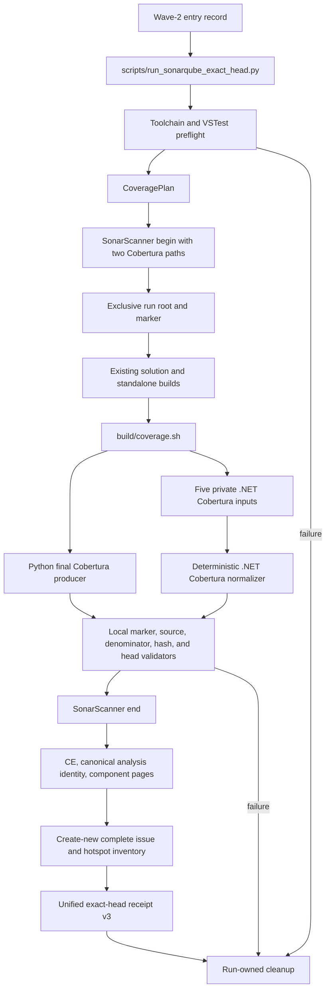
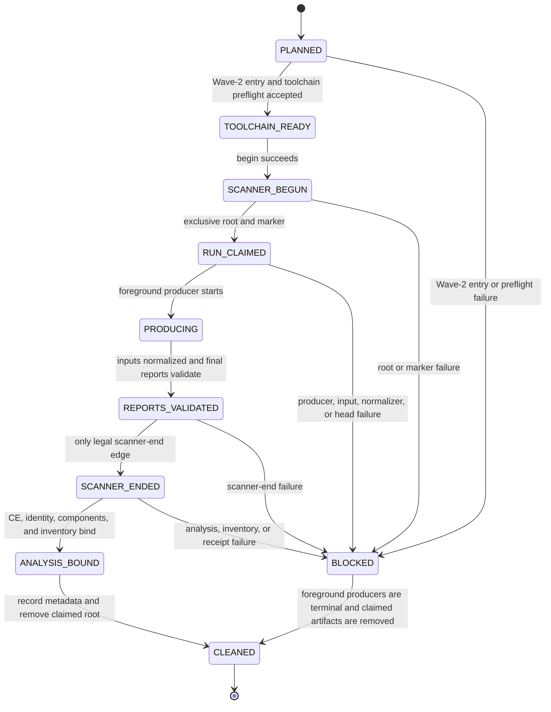

# Architecture: runner-owned exact-head coverage transaction

**Status**: Selected D2 architecture for a future implementation. It reports no completed coverage run or release result.
**Parent binding**: Wave 3 must produce exactly one deterministic project-root-relative Python Cobertura report and one deterministic project-root-relative .NET Cobertura report in one scanner transaction.
**Release intent**: `none`

## ADR-014 decision

Keep `scripts/run_sonarqube_exact_head.py` as the sole scanner, analysis-binding, normalization, and receipt authority. The runner verifies exact Wave-2 closure evidence and the producer toolchain before scanner begin. It derives an exact `CoveragePlan`, passes the two final report paths to scanner begin, claims a fresh run root after begin, invokes a thin producer, validates Python evidence plus five private .NET input reports, normalizes those inputs into one final .NET Cobertura report, and only then calls scanner end.

`build/coverage.sh` receives a fully enumerated plan. It executes no scanner, API, report discovery, normalization, validation, or receipt decision. Python coverage runs through an external isolated locked `uv` environment. The five fixed .NET projects carry direct private `coverlet.msbuild` `10.0.1` references and use VSTest with `Microsoft.NET.Test.Sdk` `17.12.0`. MTP is rejected before scanner begin. `SonarQube.Analysis.xml` and `docs/RELEASE-PROTOCOL.md` remain unchanged.

## Authority map

| Fact | Owner | Must not be owned by |
| --- | --- | --- |
| Exact Wave-2 closure and accepted-main identity | `Wave2ClosureEntryV1` validator | A PR head or feature branch |
| Captured head, run ID, paths, and input order | `CoveragePlan` in the runner | A report glob or shell discovery |
| Tool availability and VSTest/MTP compatibility | `preflight_coverage_toolchain` in the runner | Scanner begin or the producer |
| Python policy | `.coveragerc` | An untracked user configuration |
| .NET input production | Fixed five VSTest projects and `build/coverage.sh` | Broad build inventory |
| Final .NET report | Runner-owned `normalize_dotnet_cobertura` | A generic merger or Sonar |
| Scanner import paths | Runtime begin arguments from `CoveragePlan` | `SonarQube.Analysis.xml` |
| Analysis and inventory identity | Runner API reads and immutable inventory writer | A latest-project dashboard result |
| Receipt role/outcome enforcement | Unified v3 receipt validator | An optional v2 branch |
| Cleanup and secret scrubbing | Runner `finally` path | The shell producer |

## Component map



Only `Validate` leads to `End`. The normalizer is a required validation predecessor. A failed entry, preflight, producer, input, normalizer, or validation step can produce a typed blocked result but cannot end the scanner.

## Lifecycle state machine



### State invariants

1. `CoveragePlan` is pure. It does not create a root, marker, report, or temporary directory.
2. A missing or invalid `Wave2ClosureEntryV1` and every failed toolchain check stop in `PLANNED`. They make scanner begin and run-root claim unreachable.
3. `RUN_CLAIMED` occurs only after scanner begin succeeds and only for a previously absent UUID root.
4. `REPORTS_VALIDATED` requires the marker, two final reports, all five private .NET inputs, normalizer evidence, positive final denominators, valid source sets, a matching post-producer head, and Stateless restoration.
5. `SCANNER_ENDED` has no legal predecessor other than `REPORTS_VALIDATED`.
6. A completed diagnostic creates its full inventory artifact before receipt sealing. Counts alone are not inventory evidence.
7. Cleanup starts only after foreground producers return and preserves the first failure.

## Run layout

The runner owns this exact tree. `<run-id>` is one UUID. Producers use absolute paths under the root. Scanner arguments use slash-normalized paths relative to the scanner worktree.

```text
.tmp/sonarqube-coverage/<run-id>/
├── coverage-run.json
├── python/
│   ├── .coverage
│   └── coverage.xml
└── dotnet/
    ├── coverage.xml
    └── inputs/
        ├── codesearch-core/coverage.cobertura.xml
        ├── host/coverage.cobertura.xml
        ├── stateless-preview/coverage.cobertura.xml
        ├── stateless/coverage.cobertura.xml
        └── host-prompts/coverage.cobertura.xml
```

`python/coverage.xml` and `dotnet/coverage.xml` are the only report identities sent to Sonar. The five paths below `dotnet/inputs/` are private producer inputs. The runner accepts no alternate path, report glob, parent traversal, absolute scanner path, symbolic link, reparse point, URI, duplicate normalized path, or report outside this tree.

## Fixed .NET producer inventory

| Order | ID | Test project | Private Cobertura input | Extra producer argument |
| --- | --- | --- | --- | --- |
| 1 | `codesearch-core` | `host/NetCoreDbg.Mcp.CodeSearch.Core.Tests/NetCoreDbg.Mcp.CodeSearch.Core.Tests.csproj` | `dotnet/inputs/codesearch-core/coverage.cobertura.xml` | None |
| 2 | `host` | `host/NetCoreDbg.Mcp.Host.Tests/NetCoreDbg.Mcp.Host.Tests.csproj` | `dotnet/inputs/host/coverage.cobertura.xml` | None |
| 3 | `stateless-preview` | `host/NetCoreDbg.Mcp.Stateless.Preview.Tests/NetCoreDbg.Mcp.Stateless.Preview.Tests.csproj` | `dotnet/inputs/stateless-preview/coverage.cobertura.xml` | None |
| 4 | `stateless` | `host/NetCoreDbg.Mcp.Stateless.Tests/NetCoreDbg.Mcp.Stateless.Tests.csproj` | `dotnet/inputs/stateless/coverage.cobertura.xml` | `/p:IncludeDirectory=<absolute-repo>/host/NetCoreDbg.Mcp.Stateless/bin/Debug/net8.0` |
| 5 | `host-prompts` | `tests/dotnet/NetCoreDbg.Mcp.Host.PromptTests/NetCoreDbg.Mcp.Host.PromptTests.csproj` | `dotnet/inputs/host-prompts/coverage.cobertura.xml` | None |

The runner must not substitute its broader build `project_inventory()` for this list. Fixture projects and production projects are not coverage test producers.

## Caller-first contract

```text
Wave2ClosureEntryV1 {
  schema_version: 1
  wave: 2
  closure_status: EXACT_CLOSED
  accepted_main_sha: Sha40
  closure_receipt: { relative_path, sha256 }
  integration: { kind: merged_pull_request, pull_request: 289, accepted_ref: origin/main }
}

CoverageProjectSpec {
  id: ProjectId
  project: Path
  raw_cobertura_input: CoveragePath
  include_directory: Path | null
}

CoveragePlan {
  run_id: UUID
  head: Sha40
  root: Path
  marker: CoveragePath
  python_data: Path
  python_report: CoveragePath
  dotnet_report: CoveragePath
  dotnet_inputs: tuple[CoverageProjectSpec, CoverageProjectSpec, CoverageProjectSpec, CoverageProjectSpec, CoverageProjectSpec]
}

ToolchainPreflight {
  uv: available
  bash: available
  dotnet: available
  coverlet_msbuild: 10.0.1
  test_sdk: 17.12.0
  mtp_active: false
}

DotnetNormalizationEvidence {
  algorithm: cobertura-merge-normalize-v1
  ordered_input_set_sha256: Sha256
  output_report_id: dotnet
  source_union_complete: true
}
```

```text
verify_wave2_entry(entry: Wave2ClosureEntryV1, main: GitRef, receipt: Artifact) -> None
preflight_coverage_toolchain(plan: CoveragePlan) -> ToolchainPreflight
derive_coverage_plan(context: GitContext, run_id: UUID) -> CoveragePlan
coverage_scanner_properties(plan: CoveragePlan) -> tuple[str, str]
claim_coverage_run(context: GitContext, plan: CoveragePlan) -> CoverageRunClaim
run_coverage_producer(plan: CoveragePlan, env: Mapping[str, str]) -> None
normalize_dotnet_cobertura(plan: CoveragePlan) -> DotnetNormalizationEvidence
validate_coverage_reports(context: GitContext, claim: CoverageRunClaim) -> CoverageEvidence
write_diagnostic_inventory(identity: ReceiptIdentity) -> InventoryReference
validate_exact_head_receipt_v3(receipt: Mapping[str, Any]) -> None
```

The existing `candidate`, `post-merge`, and new `diagnostic` roles use the unified receipt schema. The coverage transaction requires a supplied Wave-2 entry record for every role. There is no default, branch-derived, or v2 compatibility path.

## Producer commands

The runner invokes Bash through the isolated locked external environment after its preflight succeeds:

```text
uv run --project <repo> --isolated --locked --extra dev --with coverage==7.15.4 -- \
  bash <repo>/build/coverage.sh \
  --repo-root <repo> \
  --python-data <absolute-run-root>/python/.coverage \
  --python-report <absolute-run-root>/python/coverage.xml \
  --dotnet-project <id> <absolute-csproj> <absolute-input-prefix> <absolute-include-or-dash>
```

The final `--dotnet-project` group occurs exactly five times in fixed order. The shell uses foreground commands, `set -euo pipefail`, quoted paths, and no report discovery. Each .NET command restores and then runs:

```text
dotnet test <exact-test-csproj> --configuration Debug --no-restore -nr:false \
  -p:CollectCoverage=true \
  -p:CoverletOutputFormat=cobertura \
  -p:CoverletOutput=<absolute-input-prefix>
```

The expected private file is `<absolute-input-prefix>.cobertura.xml`. No command may use `--no-build`, `--filter`, `Include`, `Exclude`, `ExcludeByFile`, threshold switches, or a merge switch.

## Pre-begin toolchain gate

The runner checks all of the following before scanner begin:

1. `uv`, `bash`, and `dotnet` resolve to executable commands and return a version response without creating the run root.
2. Each fixed project evaluates as `net8.0` VSTest with direct `coverlet.msbuild` `10.0.1`, direct `Microsoft.NET.Test.Sdk` `17.12.0`, and `PrivateAssets=all` for Coverlet.
3. No evaluated project activates `TestingPlatformDotnetTestSupport`, references Microsoft Testing Platform, or otherwise selects MTP. The runner does not inject a property to change the platform.

A missing executable is `COVERAGE_TOOL_UNAVAILABLE`. An invalid tuple is `COVERAGE_VSTEST_INCOMPATIBLE`. Active MTP is `COVERAGE_MTP_INCOMPATIBLE`. All three fail at `PLANNED` and make `begin` and `claim` unreachable.

## Scanner import arguments

`CoveragePlan` produces exactly these begin arguments:

```text
/d:sonar.python.coverage.reportPaths=.tmp/sonarqube-coverage/<run-id>/python/coverage.xml
/d:sonar.cs.cobertura.reportsPaths=.tmp/sonarqube-coverage/<run-id>/dotnet/coverage.xml
```

The runner rejects every coverage path property in `SonarQube.Analysis.xml`. XML remains a project identity and scope file.

## .NET merge and validation rules

The runner validates each private .NET Cobertura input before normalization. Each input must be a nonempty regular file under the claimed root, have a `coverage` root, positive line denominator, valid source mappings, and no unsafe path. The aggregate private inputs must have a positive branch denominator.

`normalize_dotnet_cobertura` reads the fixed input order. It canonicalizes each mapped source path to a tracked production `.cs` path, rejects duplicate-normalized, escaped, test-only, fixture, `bin`, `obj`, URI, symlink, and reparse paths, and unions coverage facts by canonical source path, line number, and branch-condition ordinal. A covered fact remains covered if any input covers it. The normalizer emits the final report with deterministic lexical source and point ordering.

The runner reparses the final `.NET` report and requires a positive line denominator, a positive branch denominator, and a source set equal to the validated union. Dropped source paths, added source paths, invalid structure, or non-deterministic order are `COVERAGE_DOTNET_NORMALIZATION_FAILED`. The final report is the only .NET artifact that scanner begin can name.

## Analysis, inventory, and receipt rules

The runner records one canonical identity: captured head, project key, and analysis ID. Submitted analysis and all current-analysis observations must match that identity. Complete component paging must prove a positive mapped contribution for both final language source sets.

Before sealing `DIAGNOSTIC_COMPLETE`, the runner writes a create-new inventory artifact validated by [diagnostic-inventory-v1.schema.json](contracts/diagnostic-inventory-v1.schema.json). The artifact retains every issue and hotspot key, component, path, rule, status, resolution when present, type, severity when present, pagination facts, and key digests. The receipt stores an immutable path, byte count, SHA-256, and complete summaries. The runner verifies the artifact hash and identity before receipt validation.

[exact-head-receipt-v3.schema.json](contracts/exact-head-receipt-v3.schema.json) discriminates these legal combinations:

| Role | Outcome | Release intent | Required evidence |
| --- | --- | --- | --- |
| `diagnostic` | `DIAGNOSTIC_COMPLETE` or `BLOCKED` | `none` | Complete diagnostics require coverage, analysis, full inventory, successful cleanup, and no failure. |
| `candidate` | `PASS` or `BLOCKED` | `v0.23.11` | PASS requires the same coverage, analysis, full inventory, successful cleanup, and zero-blocking release gate. |
| `post-merge` | `PASS` or `BLOCKED` | `v0.23.11` | PASS has the same required shape as candidate. |

## Deliberate exclusions

This design has no parent amendment, second scanner, static coverage property, report wildcard, generic report discovery, alternate report format, automatic MTP fallback, filter, source exclusion, threshold calculation, external coverage artifact, taskkill fallback, public route change, or release action. The fixed normalizer is required because the parent contract admits one .NET Cobertura identity; it is not a generic merge facility.
