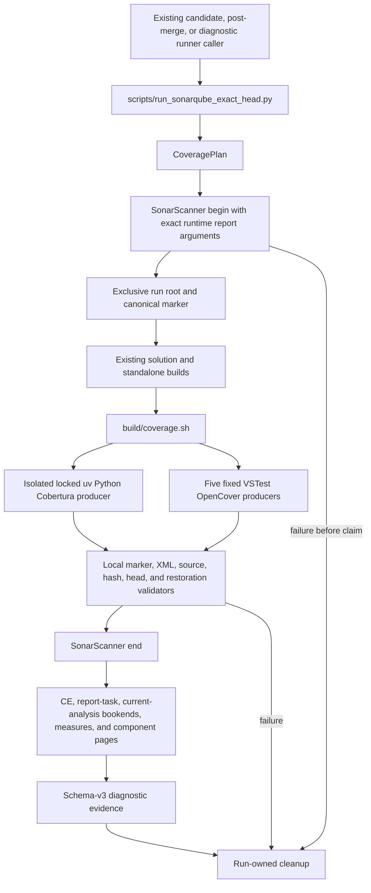
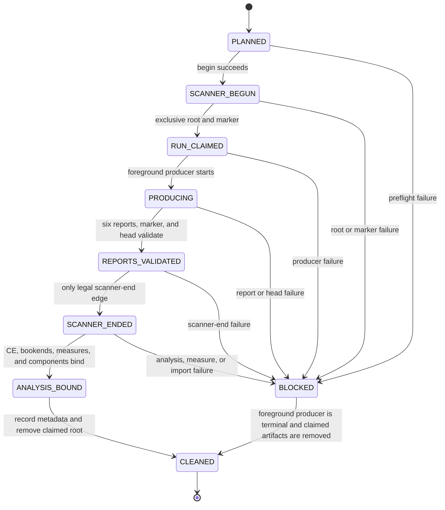

# Architecture: runner-owned exact-head coverage transaction

**Status**: Selected D2 architecture. It describes a future implementation. It does not report a completed coverage run or a release result.
**Authority**: `agent://ArchitectWave3Coverage`
**Source base for this packet**: `1b8b2d548a45b17dde690b4cb8e4fc7153d326bc`
**Release intent**: `none`

## ADR-014 decision

Keep `scripts/run_sonarqube_exact_head.py` as the sole scanner, analysis-binding, and receipt authority. The runner derives an exact `CoveragePlan`, passes run-specific report properties to scanner begin, claims a fresh run root after begin, invokes a thin producer, validates all six reports, and only then calls scanner end. It validates analysis and per-language component evidence after the Compute Engine task completes. It removes only the claimed generated root after foreground producers terminate.

The producer is `build/coverage.sh`. It receives a fully enumerated plan and executes no scanner, API, report discovery, validation, or receipt decision. Python coverage runs through an external isolated locked `uv` environment. The five fixed test projects carry direct private `coverlet.msbuild` `10.0.1` references. `SonarQube.Analysis.xml` and `docs/RELEASE-PROTOCOL.md` remain unchanged.

## Alternatives

| Shape | Decision | Reason |
| --- | --- | --- |
| Runner-native producer with no `build/coverage.sh` | Rejected | It violates the parent-selected producer surface and leaves no independently executable producer contract. |
| Static XML report paths or wildcard paths | Rejected | A UUID run root needs runtime paths. A wildcard admits stale or extra reports and creates two configuration authorities. |
| Temporary MSBuild target or props injection | Rejected | It complicates restore and evaluation order and does not remove the observed zero-exit/no-report hole. |
| Coverlet collector or global tool | Deferred | It changes the proven VSTest route and does not yet prove Stateless child-host mapping. |

## Authority map

| Fact | Owner | Must not be owned by |
| --- | --- | --- |
| Captured head and clean detached worktree | `GitContext` in the runner | The shell producer |
| Run ID, absolute paths, scanner-relative paths, and .NET order | `CoveragePlan` in the runner | A report glob or static XML |
| Python branch and relative-file policy | `.coveragerc` | `pyproject.toml` or an untracked user config |
| Python Coverage.py version | The runner's `uv run --with coverage==7.15.4` argument | `pyproject.toml`, `uv.lock`, or `.venv` |
| .NET coverage integration/version | Direct private `coverlet.msbuild` references in five test projects | A temporary MSBuild injection |
| Producer execution | `build/coverage.sh` | The release protocol or a manual alternate command |
| Marker, report, path, denominator, mapping, hash, and head acceptance | Runner validators | The producer |
| Scanner report import path properties | Runtime scanner-begin arguments from `CoveragePlan` | `SonarQube.Analysis.xml` |
| Submitted analysis and current-analysis identity | `report-task`, Compute Engine, and current-analysis APIs | A latest-project dashboard result |
| Metric meaning and threshold | Sonar analysis measures and the unchanged Quality Gate response | Local test count or receipt fields |
| Release authorization | Existing candidate and post-merge pass validator | A diagnostic receipt |
| Artifact cleanup and secret scrubbing | Runner `finally` path | The shell producer |

## Component map



The only edge to `End` originates at `Validate`. A local producer or validation failure can produce a typed blocked result and cleanup evidence, but it cannot end the scanner.

## Lifecycle state machine



### State invariants

1. `CoveragePlan` is pure. It does not create the root, marker, report, or temporary directory.
2. `RUN_CLAIMED` can occur only after scanner begin succeeds and only for a previously absent UUID root.
3. `REPORTS_VALIDATED` requires the canonical marker, all six canonical report paths, hashes, positive denominators, valid source sets, a matching post-producer head, and the Stateless restoration proof.
4. `SCANNER_ENDED` has no legal predecessor other than `REPORTS_VALIDATED`.
5. A failure after scanner end records the submitted analysis identity but never becomes PASS.
6. Cleanup starts only after foreground producer commands return. It preserves the first failure and records cleanup failure separately.

## Run layout

The runner owns this exact tree. `<run-id>` is one UUID. All report paths passed to producers are absolute. All paths passed to Sonar are slash-normalized paths relative to the scanner worktree.

```text
.tmp/sonarqube-coverage/<run-id>/
├── coverage-run.json
├── python/
│   ├── .coverage
│   └── coverage.xml
└── dotnet/
    ├── codesearch-core/coverage.opencover.xml
    ├── host/coverage.opencover.xml
    ├── stateless-preview/coverage.opencover.xml
    ├── stateless/coverage.opencover.xml
    └── host-prompts/coverage.opencover.xml
```

The runner accepts no discovered alternate path, report glob, parent-directory traversal, absolute scanner path, symbolic link, reparse point, URI, duplicate normalized path, or report outside this tree.

## Fixed .NET producer inventory

| Order | ID | Test project | Report | Extra producer argument |
| --- | --- | --- | --- | --- |
| 1 | `codesearch-core` | `host/NetCoreDbg.Mcp.CodeSearch.Core.Tests/NetCoreDbg.Mcp.CodeSearch.Core.Tests.csproj` | `dotnet/codesearch-core/coverage.opencover.xml` | None |
| 2 | `host` | `host/NetCoreDbg.Mcp.Host.Tests/NetCoreDbg.Mcp.Host.Tests.csproj` | `dotnet/host/coverage.opencover.xml` | None |
| 3 | `stateless-preview` | `host/NetCoreDbg.Mcp.Stateless.Preview.Tests/NetCoreDbg.Mcp.Stateless.Preview.Tests.csproj` | `dotnet/stateless-preview/coverage.opencover.xml` | None |
| 4 | `stateless` | `host/NetCoreDbg.Mcp.Stateless.Tests/NetCoreDbg.Mcp.Stateless.Tests.csproj` | `dotnet/stateless/coverage.opencover.xml` | `/p:IncludeDirectory=<absolute-repo>/host/NetCoreDbg.Mcp.Stateless/bin/Debug/net8.0` |
| 5 | `host-prompts` | `tests/dotnet/NetCoreDbg.Mcp.Host.PromptTests/NetCoreDbg.Mcp.Host.PromptTests.csproj` | `dotnet/host-prompts/coverage.opencover.xml` | None |

The runner must not substitute its broader build `project_inventory()` for this list. Fixture projects and production projects are not coverage test producers.

## Caller-first contract

### Existing caller contract

```text
python scripts/run_sonarqube_exact_head.py --role candidate
python scripts/run_sonarqube_exact_head.py --role post-merge
python scripts/run_sonarqube_exact_head.py --role diagnostic
```

The first two are existing release-role interfaces. `diagnostic` is an internal role introduced by this feature. It writes only non-release evidence and cannot authorize a tag or publication. The release protocol does not gain a manual coverage command.

### Types and signatures

```text
enum CoverageStage {
  PLANNED, SCANNER_BEGUN, RUN_CLAIMED, PRODUCING,
  REPORTS_VALIDATED, SCANNER_ENDED, ANALYSIS_BOUND,
  CLEANED, BLOCKED
}

CoveragePath {
  absolute: Path
  scanner_relative: str
}

CoverageProjectSpec {
  id: str
  project: Path
  report: CoveragePath
  include_directory: Path | None
  restore_check_files: tuple[Path, ...]
}

CoveragePlan {
  run_id: UUID
  head: Sha40
  root: Path
  marker: CoveragePath
  python_data: Path
  python_report: CoveragePath
  dotnet: tuple[CoverageProjectSpec, ...]
}

CoverageRunClaim {
  plan: CoveragePlan
  marker_sha256: Sha256
  marker_bytes: int
}

ReportEvidence {
  id: str
  language: python | dotnet
  format: cobertura | opencover
  path: str
  sha256: Sha256
  bytes: int
  line_or_sequence_denominator: int
  branch_denominator: int
  covered_line_or_sequence_count: int
  source_paths: tuple[str, ...]
  source_set_sha256: Sha256
}

CoverageFailure {
  code: str
  stage: CoverageStage
  language: str | null
  project_id: str | null
  safe_message: str
}
```

```text
derive_coverage_plan(context: GitContext, run_id: UUID) -> CoveragePlan
coverage_scanner_properties(plan: CoveragePlan) -> tuple[str, str]
claim_coverage_run(context: GitContext, plan: CoveragePlan) -> CoverageRunClaim
coverage_environment(base: Mapping[str, str], plan: CoveragePlan) -> dict[str, str]
run_coverage_producer(plan: CoveragePlan, env: Mapping[str, str], secrets: Collection[str]) -> None
validate_coverage_reports(context: GitContext, claim: CoverageRunClaim) -> CoverageEvidence
read_coverage_measures(host: str, expected_analysis_id: str, expected_head: Sha40, token: str, mapped_sources: CoverageEvidence) -> CoverageMeasureSnapshot
cleanup_coverage_run(context: GitContext, claim: CoverageRunClaim) -> CleanupEvidence
validate_diagnostic_receipt(receipt: Mapping[str, Any]) -> None
validate_pass_receipt(receipt: Mapping[str, Any]) -> None
```

## Producer commands

The runner must invoke the shell through an isolated, locked external environment. The command is an implementation contract, not an alternate release command.

```text
uv run --project <repo> --isolated --locked --extra dev --with coverage==7.15.4 -- \
  bash <repo>/build/coverage.sh \
  --repo-root <repo> \
  --python-data <absolute-run-root>/python/.coverage \
  --python-report <absolute-run-root>/python/coverage.xml \
  --dotnet-project <id> <absolute-csproj> <absolute-report> <absolute-include-or-dash>
```

The final `--dotnet-project` group occurs exactly five times in fixed inventory order. The shell uses foreground commands, `set -euo pipefail`, quoted paths, and no report discovery. It rejects a duplicate project ID, a wrong project count, a missing output path, or a `SONAR_*` environment variable.

Python commands inside the shell:

```bash
export PYTHONDONTWRITEBYTECODE=1
export COVERAGE_FILE=<absolute-python-data-path>
export NETCOREDBG_MCP_PYTHON_EXECUTABLE="$(python -c 'import sys; print(sys.executable)')"
export NETCOREDBG_MCP_TEST_PYTHON_EXECUTABLE="$NETCOREDBG_MCP_PYTHON_EXECUTABLE"
python -m coverage run --rcfile <repo>/.coveragerc -m pytest -p no:cacheprovider -q
python -m coverage xml --rcfile <repo>/.coveragerc --data-file <absolute-python-data-path> -o <absolute-python-report-path>
```

.NET commands inside the shell, once per fixed project:

```bash
dotnet restore <exact-test-csproj> -nr:false
dotnet test <exact-test-csproj> --configuration Debug --no-restore -nr:false \
  -p:CollectCoverage=true \
  -p:CoverletOutputFormat=opencover \
  -p:CoverletOutput=<absolute-report-path>
```

The Stateless project appends only its exact `IncludeDirectory` property. No .NET command may contain `--no-build`, `--filter`, `Include`, `Exclude`, `ExcludeByFile`, `UseSourceLink`, a report-merge argument, or a threshold argument.

## Scanner import arguments

`CoveragePlan` produces these discrete scanner-begin arguments:

```text
/d:sonar.python.coverage.reportPaths=.tmp/sonarqube-coverage/<run-id>/python/coverage.xml
/d:sonar.cs.opencover.reportsPaths=.tmp/sonarqube-coverage/<run-id>/dotnet/codesearch-core/coverage.opencover.xml,.tmp/sonarqube-coverage/<run-id>/dotnet/host/coverage.opencover.xml,.tmp/sonarqube-coverage/<run-id>/dotnet/stateless-preview/coverage.opencover.xml,.tmp/sonarqube-coverage/<run-id>/dotnet/stateless/coverage.opencover.xml,.tmp/sonarqube-coverage/<run-id>/dotnet/host-prompts/coverage.opencover.xml
```

The runner preflights `SonarQube.Analysis.xml` and rejects `sonar.python.coverage.reportPaths`, `sonar.cs.opencover.reportsPaths`, and generic coverage path properties there. The XML remains a project identity and scope file, not a run-specific report configuration file.

## Validation invariants

### Common report rules

- The report path equals the planned absolute path and has the planned scanner-relative path.
- The path is a nonempty regular file below the claimed root. Its entire path chain has no symbolic link or reparse point.
- XML parsing disables DTD, external entity, and network resolution.
- The runner computes SHA-256 and byte count from the exact report bytes before scanner end.
- Marker bytes, marker digest, head, project key, expected report list, producer hash, and `.coveragerc` hash match the in-memory plan.

### Python rules

- The root local name is `coverage`.
- `lines-valid` and `lines-covered` are decimal integers where `0 <= covered <= valid` and `valid > 0`.
- `branches-valid` and `branches-covered` are decimal integers where `0 <= covered <= valid` and `valid > 0`.
- Every class filename resolves exactly once to a tracked regular `.py` file below `src/netcoredbg_mcp`.
- The source set is sorted and unique. URI, absolute, `..`, duplicate-normalized, missing, test-only, outside-root, and reparse mappings fail.

### .NET rules

- The root local name is `CoverageSession` and exactly one direct `Summary` provides the denominator.
- Each report has `numSequencePoints > 0` with `0 <= visitedSequencePoints <= numSequencePoints`.
- Each branch count is nonnegative and ordered. The aggregate `numBranchPoints` across all five reports is greater than zero.
- Each report resolves at least one sequence-point source to a tracked non-test, non-fixture `.cs` file inside the scanner worktree.
- SourceLink URIs, outside-root paths, duplicate normalized paths, `bin`, `obj`, `tests/fixtures`, and `host/NetCoreDbg.Mcp.Stateless.Tests/Fixtures` do not count as coverage evidence.
- The Stateless report maps at least one source below `host/NetCoreDbg.Mcp.Stateless`. The selected production DLL and PDB hashes match their pre-producer values.

## Analysis binding

After scanner end, the runner must:

1. Read `report-task` and wait for the submitted Compute Engine task.
2. Read the current analysis and require its ID and revision to match the submitted analysis and captured head.
3. Read `coverage`, `lines_to_cover`, `uncovered_lines`, `line_coverage`, `branch_coverage`, `new_coverage`, `new_lines_to_cover`, `new_uncovered_lines`, `new_line_coverage`, and `new_branch_coverage`.
4. Read a second current analysis before and after the measure fetch. Both bookends must equal the submitted ID and captured head.
5. Require finite positive `coverage`, `lines_to_cover`, and `new_lines_to_cover`. Require the analysis-bound `new_coverage` Quality Gate condition to have status `OK`, threshold `80`, and an actual value equal to normalized `new_coverage`.
6. Page file components completely. Intersect the normalized server paths with the validated Python and .NET source sets. For each language, require at least one mapped file, positive summed `lines_to_cover`, positive summed covered lines, and at least one mapped branch measure.

The overall Quality Gate may remain red during the diagnostic role because unrelated findings remain red. The diagnostic role never converts a red global finding condition into a waiver or a pass.

## Security and cleanup

| Boundary | Rule | Rejection condition |
| --- | --- | --- |
| Scanner credentials | Only scanner begin/end receive `SONAR_TOKEN`. API reads receive `SONAR_READ_TOKEN`. | A producer child sees a `SONAR_*` name or secret. |
| Paths | Producers write only canonical absolute paths below the claimed root. Scanner gets only normalized relative paths. | A path escapes, is absolute in scanner args, is a URI, is a reparse point, or differs from the plan. |
| XML | The runner parses local report bytes with external resolution disabled. | Malformed XML, wrong root, entity input, or unknown structure. |
| Evidence | Receipts contain IDs, relative paths, counts, hashes, safe errors, and page summaries only. | Raw reports, environment dumps, credentials, or raw secret-bearing command lines appear. |
| Cleanup | The runner removes only its claimed UUID root after producers are terminal. | An arbitrary `.tmp` path, parent path, or foreign content would be removed. |
| Failure precedence | The first cause remains the primary result. | Cleanup masks a producer, report, scanner, or analysis failure. |

## Deliberate exclusions

This design has no second scanner, static coverage property, report wildcard, generic report merge, filter, source exclusion, threshold calculation, external coverage artifact, taskkill fallback, public route change, or release action. The feature adds a diagnostic role and receipt schema without adding release authority.
