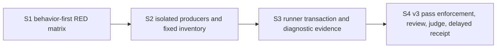

# Implementation plan: exact-head SonarQube coverage producer

**Branch**: `work/issue450-sonar-coverage-producer`
**Date**: 2026-08-31
**Spec**: [spec.md](spec.md)
**Design depth**: D2
**Parent**: `specs/011-issue450-sonar-release-program/`, Wave 3
**Source base**: `1b8b2d548a45b17dde690b4cb8e4fc7153d326bc`
**Release intent**: `none`
**Status**: Planning only. The final implementation task is the first task that may create a real diagnostic or acceptance receipt.

## Summary

Extend the existing exact-head runner into one coverage transaction. It derives a plan before scanner begin, supplies exact runtime report arguments, claims a fresh root after begin, runs isolated Python and fixed-five .NET producers, validates local evidence, ends the scanner only after validation, binds analysis and component measures to the captured head, records a non-release diagnostic, and removes only the claimed root.

The implementation changes the runner, focused runner tests, `.coveragerc`, `build/coverage.sh`, and five test project files. It does not change `pyproject.toml`, `uv.lock`, `SonarQube.Analysis.xml`, `docs/RELEASE-PROTOCOL.md`, product runtime code, gate policy, release metadata, or public routes.

## Technical context

| Concern | Constraint |
| --- | --- |
| Runner authority | `scripts/run_sonarqube_exact_head.py` remains the only scanner, analysis, and receipt authority. |
| Python producer | Isolated locked `uv run --extra dev --with coverage==7.15.4`; `.coveragerc` sets branch, relative files, and `src/netcoredbg_mcp`. |
| .NET producer | Exactly five VSTest projects use direct private `coverlet.msbuild` `10.0.1` references and OpenCover XML. |
| Report layout | One UUID root below `.tmp/sonarqube-coverage/` contains one marker, one Cobertura report, and five ordered OpenCover reports. |
| Scanner handoff | Runtime begin arguments name exact slash-normalized relative report paths. No static XML property or wildcard is accepted. |
| Local admission | Marker, files, XML roots, denominators, mappings, hashes, source sets, Stateless restoration, and post-producer head must validate before end. |
| Server admission | Submitted analysis and two current-analysis bookends bind to the captured head. Both language source sets must have positive mapped component evidence. |
| Diagnostic role | Schema-v3, `release_intent: none`, and never release authority. Unrelated global finding blockers remain explicit. |
| Cleanup/security | Producers receive no `SONAR_*` value. The runner removes only its claimed root after foreground producers return. |

## Scope and rollback

### Planned mutation surfaces

| Surface | Change |
| --- | --- |
| `build/coverage.sh` | Add a thin plan-driven producer with exact argument parsing, `set -euo pipefail`, Python coverage, per-project restore/test commands, and no scanner behavior. |
| `.coveragerc` | Add branch, relative-file, and `src/netcoredbg_mcp` configuration. |
| Five fixed test `.csproj` files | Add exact private `coverlet.msbuild` `10.0.1` references. |
| `scripts/run_sonarqube_exact_head.py` | Add plan, runtime arguments, root/marker claim, producer invocation, local validation, analysis measures, diagnostic evidence, pass enforcement, and cleanup. |
| `tests/test_sonarqube_exact_head_runner.py` | Add 15 behavior-first rows and local marker/XML/API fixtures. |

### Immutable comparison surfaces

| Surface | Rule |
| --- | --- |
| `pyproject.toml`, `uv.lock` | No Coverage.py dependency, lock update, or temporary environment mutation. |
| `SonarQube.Analysis.xml` | No coverage path, source root, exclusion, project-key, threshold, or policy change. |
| `docs/RELEASE-PROTOCOL.md` | No manual coverage command or release policy change. |
| Public Python/default route and stateless-preview boundary | No runtime behavior or route migration. |
| Gate/finding authority | No suppression, accepted risk, WONTFIX, false positive, baseline reset, New Code, or server change. |

### Rollback

Before v3 pass enforcement, revert the producer/config/test-only dependency/runner changes as one atomic Wave-3 change. After enforcement, revert the runner, schema, five references, producer, config, and their tests together. Never roll back by accepting an external report, lowering the threshold, retaining an optional v2 path, or changing a tag.

## Selected architecture

The full decision is [architecture.md](architecture.md). Its key cut is one runner-owned transaction and one thin executor. The runner owns acceptance. The shell produces only the planned files. The scanner receives exact runtime paths. The server component inventory confirms both language sets after scanner end.

## Tracer-bullet slices

| Slice | Outcome | Exact work | Blocked by | Acceptance checkpoint |
| --- | --- | --- | --- | --- |
| **S1** | Current runner behavior cannot silently satisfy the new contract. | Add 15 focused RED rows and local marker/XML/API fixtures in `tests/test_sonarqube_exact_head_runner.py`. | None | One focused command produces caller-level RED failures for every row. |
| **S2** | Maintainers can produce six local reports without changing permanent Python dependencies or relying on `--no-build`. | Add `.coveragerc`, `build/coverage.sh`, exact package references, and local producer proof. | S1 | Real standalone producer proof creates the six planned reports; no permanent Python dependency surface changes. |
| **S3** | The exact-head runner cannot end the scanner without same-run validated coverage and cannot mistake aggregate-only data for both-language import. | Add plan/claim, runtime arguments, validation, analysis/component binding, diagnostic schema use, and cleanup. | S2 | Focused suite is green. A real diagnostic run can reach only `DIAGNOSTIC_COMPLETE` or `BLOCKED`. |
| **S4** | A candidate or post-merge pass cannot omit or forge coverage evidence. The Wave-3 receipt is delayed until exact review/judgment pass. | Enforce schema-v3 for release roles, remove v2 compatibility, run independent review and judge, then run the final diagnostic and create the receipt. | S3 | Exact head passes review and judgment. T028 is the only receipt-producing task. |

### Granularity check

| Slice | Independently useful? | Verifiable before later slices? |
| --- | --- | --- |
| S1 | Yes. It makes missing coverage acceptance behavior observable. | Yes. Current runner fails the focused tests. |
| S2 | Yes. It creates an executable local producer and fixed inventory. | Yes. It produces and locally validates reports without Sonar. |
| S3 | Yes. It creates same-transaction report admission and diagnostic analysis evidence. | Yes. Fake APIs and a future diagnostic run exercise it. |
| S4 | Yes. It makes coverage mandatory for release roles and seals exact review/judgment evidence. | Yes. V2 and forged receipts fail before the delayed diagnostic run. |

## Requirements-to-files map

| Requirements | Tasks | Planned files | Future proof |
| --- | --- | --- | --- |
| COV-001 to COV-004 | T012 to T016 | `scripts/run_sonarqube_exact_head.py`, `tests/test_sonarqube_exact_head_runner.py` | V01, V02, V11 |
| COV-005 to COV-007 | T006 to T009 | `.coveragerc`, `build/coverage.sh`, `tests/test_sonarqube_exact_head_runner.py` | V03 to V05, V12 |
| COV-008 to COV-011 | T010 to T011 | Five fixed test `.csproj` files, `build/coverage.sh`, focused tests | V06 to V10 |
| COV-012 to COV-014 | T001 to T005, T015 to T018 | Runner and focused tests | V04, V05, V08 to V11 |
| COV-015 to COV-017 | T019 to T020 | Runner and focused tests | V13, V14 |
| COV-018 to COV-020 | T019 to T023 | Runner, focused tests, schemas | V15 |
| COV-021 to COV-023 | T024 to T028 | All owned implementation files; no change to comparison surfaces | Exact review, judgment, and delayed receipt |

## Milestones

| Milestone | Slices | Internal value | Release intent |
| --- | --- | --- | --- |
| M1: trusted diagnostic coverage transaction | S1, S2, S3 | Wave 4 can consume a fresh same-head coverage/finding denominator. | `none` |
| M2: release-role coverage enforcement | S4 | Future candidate/post-merge PASS requires v3 coverage evidence. | `none` |

No milestone creates a tag, release, publication, or claim that the overall Quality Gate is green.

## Verification plan

| Layer | Command or proof | What it proves |
| --- | --- | --- |
| RED/GREEN contract | `uv run --locked --extra dev pytest tests/test_sonarqube_exact_head_runner.py -q` | The 15 behavior-first rows reach the runner boundary and have deterministic oracles. |
| Local producer | Runner-owned command shape from [architecture.md](architecture.md#producer-commands) | The fixed inventory produces exactly six planned reports with local validation. |
| Diagnostic transaction | `python scripts/run_sonarqube_exact_head.py --role diagnostic` from the prescribed clean detached scanner worktree | Same-head local evidence, scanner import, analysis binding, both-language component evidence, and unchanged coverage condition. |
| Release roles | Candidate and post-merge receipt validators | Schema-v2, missing, forged, diagnostic, stale, or incomplete coverage evidence cannot PASS. |
| Independent review | Exact implementation SHA and changed owned surfaces | No scanner replacement, gate weakening, secret exposure, source-route change, or optional pass path. |
| Independent acceptance judgment | Exact implementation SHA, COV requirements, V01 to V15, and diagnostic result | The completed implementation meets the packet without treating global blockers as waived. |

The authoring task does not run a formatter, linter, build, test suite, scanner, or release operation. The commands above are future implementation proofs.

## Delayed receipt rule

`contracts/` contains only schemas and contracts. This packet contains no `acceptance-receipt.md` and no `.agent/e` receipt. T028 runs after T024 to T027 bind review, judgment, and the final implementation SHA. T028 is the first task allowed to invoke the diagnostic role and write either the diagnostic receipt plus Wave-3 acceptance receipt, or no receipt if the run blocks.
