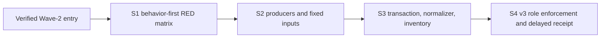

# Implementation plan: exact-head SonarQube coverage producer

**Branch**: `work/issue450-sonar-coverage-producer`
**Date**: 2026-08-31
**Spec**: [spec.md](spec.md)
**Design depth**: D2
**Parent**: `specs/011-issue450-sonar-release-program/`, Wave 3
**Source base**: `5d482b418118a9f17bf40fa0ab40b3c594df34d1`
**Release intent**: `none`
**Execution status**: T000 through T023 are implemented. Producer evidence recorded by T010 shows the exact head `73247bf` generated both final reports from Python and all five private .NET inputs; T024 through T028 remain pending. No diagnostic record, inventory artifact, acceptance receipt, tag, publication, or release claim exists.

## Summary

Extend the retained exact-head runner into one parent-compatible coverage transaction. It verifies Wave-2 entry evidence and the producer toolchain before scanner begin, derives two final Cobertura paths, claims a root after begin, produces Python coverage and five private .NET Cobertura inputs, normalizes the .NET inputs into one final .NET Cobertura report, validates evidence, then ends the scanner. It binds analysis and complete issue/hotspot inventories to the captured head and emits a non-release diagnostic record.

The implementation changes the runner, focused runner tests, `.coveragerc`, `build/coverage.sh`, five test project files, and `scripts/stateless_preview_artifact.py` with its focused tests. It adds no static scanner configuration, policy change, product behavior change, or release action.

## Technical context

| Concern | Constraint |
| --- | --- |
| Parent report contract | Exactly two deterministic project-root-relative Cobertura reports: Python and one merged .NET report. |
| Wave-2 entry source | External tracked `pull_request_head` artifact `specs/013-owner-scoped-prebuild-cleanup/wave-closure-v1.json`, produced by Wave-2 T014 on PR #289 and now available in merged clones. It carries the reviewed source head, which equals the accepted candidate, but not the final PR head or a future main SHA. |
| Entry validation | Before preflight, the source schema, `release_intent: none`, and canonical Git-blob source and receipt hashes validate. First-party PR evidence binds the actual PR head to the merge commit. The candidate must be ancestor-or-equal to the PR head, their integration trees must match, and the path-history artifact commit and merge commit must relate to observed main. A resolved copy under the claimed root records the source hash, candidate, PR head, artifact commit, merge commit, one integrated tree SHA, and observed main. |
| .NET producer inventory | Five closed `net8.0` VSTest projects are private inputs in fixed order. They are not Sonar report identities. |
| Pre-begin gate | `uv`, `bash`, `dotnet`, Coverlet `10.0.1`, Test SDK `17.12.0`, and VSTest must validate before begin and claim. MTP is refused. |
| Scanner handoff | Runtime begin arguments name the two final Cobertura paths. `SonarQube.Analysis.xml` remains unchanged. |
| Normalization | The runner owns `cobertura-merge-normalize-v1`; it validates all inputs and emits only the final `.NET` report. |
| Diagnostic authority | `DIAGNOSTIC_COMPLETE` binds a create-new hash-checked inventory artifact with complete issue/hotspot records. |
| Release roles | Unified v3 schema supports diagnostic, candidate, and post-merge roles with discriminated legal outcomes. |

## External entry prerequisite

Wave 2, not this packet, placed the tracked `pull_request_head` `wave-closure-v1.json` beside its closure receipt on PR #289 before the squash merge. The file is the only Wave-3 entry source, but it is not merge authority and its `integration.head_sha` is the reviewed candidate rather than the final PR head. T000 uses first-party PR evidence and Git object identity to validate the later merge. Wave-3 never provisions or reads an ambient `.agent` entry file. A clean clone or hosted checkout must contain this tracked file before Wave-3 can begin.

## Scope and rollback

### Planned mutation surfaces

| Surface | Change |
| --- | --- |
| `scripts/run_sonarqube_exact_head.py` | Add canonical Wave-2 entry resolution and validation, preflight, plan/marker, runtime properties, producer call, normalizer, validators, inventory writer, unified v3 validation, and cleanup. |
| `tests/test_sonarqube_exact_head_runner.py` | Add the 15 behavior-first rows and fixture builders. |
| `.coveragerc` | Add Python branch, relative-path, and source configuration. |
| `build/coverage.sh` and `build/prepare_preview_fixture.py` | Add strict enumerated producer commands for a deterministic non-live Python coverage workload and five private .NET inputs, plus one deterministic run-local Preview archive/manifest required by the fixed Preview consumer test. |
| Five fixed test `.csproj` files | Add direct private `coverlet.msbuild` `10.0.1` references. |
| `host/NetCoreDbg.Mcp.Stateless.Preview.Tests/PreviewArtifactConsumerTests.cs` | Accept only an explicit coverage-owned artifact root override; unchanged default behavior still requires the repository artifact location. |
| `scripts/stateless_preview_artifact.py` and focused tests | Replace receipt schema v2 admission with unified v3 post-merge receipt validation while preserving artifact sealing behavior. |
| `.github/workflows/stateless-preview.yml` | Add a hosted-checkout entry verification step before post-merge scan and artifact sealing. It verifies the tracked Wave-2 artifact and provisions no `.agent` state. |

### Immutable comparison surfaces

`pyproject.toml`, `uv.lock`, `SonarQube.Analysis.xml`, `docs/RELEASE-PROTOCOL.md`, runtime product code, public routes, project key, thresholds, New Code, exclusions, credentials, finding dispositions, package version, tag, and publication remain unchanged. `scripts/stateless_preview_artifact.py` and `.github/workflows/stateless-preview.yml` are explicit receipt/entry migration exceptions; neither may change public artifact behavior.

Rollback removes the coverage transaction as one cohesive Wave-3 change. It never falls back to a branch-derived Wave-2 entry, an external report, an optional v2 validator, a policy reduction, or static report discovery.

## Slices and dependencies

| Slice | Outcome | Exact work | Blocked by | Acceptance checkpoint |
| --- | --- | --- | --- | --- |
| **S1** | Current behavior cannot silently satisfy the entry, preflight, report, identity, inventory, or role contract. | Add 15 focused RED rows. | Verified Wave-2 entry | Each row has a caller-level RED result. |
| **S2** | The producer can create Python evidence and five private .NET inputs without permanent Python dependency changes. | Add `.coveragerc`, shell, five references, and producer proof. | S1 | Inputs have fixed paths and no scanner authority. |
| **S3** | The runner produces exactly two final reports, refuses unsafe pre-begin/input/normalization paths, and creates a complete diagnostic inventory. | Add entry/preflight, plan, marker, scanner args, normalizer, validation, analysis, inventory, and cleanup. | S2 | Focused proof is green and synthetic complete/blocked evidence validates correctly. |
| **S4** | Candidate and post-merge PASS cannot bypass unified v3 evidence. A real diagnostic remains delayed. | Remove v2 compatibility, review, judge, freeze, and final diagnostic. | S3 | The exact head binds all evidence. T028 is the first receipt-producing task. |

## Requirements-to-files map

| Requirements | Tasks | Planned files | Future proof |
| --- | --- | --- | --- |
| COV-001 to COV-006 | T000 to T014 | Runner, focused tests, entry/marker schemas | V01, V02, V06, V07, V13 |
| COV-007 to COV-012 | T003, T006 to T016 | Shell, config, five projects, runner, tests | V03, V08 to V12 |
| COV-013 to COV-017 | T001, T004, T013 to T019 | Runner and focused tests | V04, V05, V11 to V14 |
| COV-018 to COV-020 | T005, T018, T021 to T022 | Unified receipt and inventory schemas, runner, tests | V15 |
| COV-021 to COV-026 | T020 to T028 | Owned implementation files, hosted workflow, artifact consumer, and evidence | Focused proof, review, judgment, consumer cutover, clean-clone entry verification, delayed receipt |

## Verification plan

| Layer | Command or proof | What it proves |
| --- | --- | --- |
| Entry and preflight | Focused command/event spy plus hosted-workflow fixture | Missing tracked artifact; invalid schema, intent, or canonical Git-blob hash; wrong reviewed source head, PR head, or merge OID; absent first-party binding; unequal integration trees; invalid candidate lineage or artifact blob binding; invalid path history; merge absent from observed main; missing tools; invalid tuple; and MTP leave preflight, begin, and claim unreachable. A clean squash-merge fixture admits preflight only after every entry predicate passes. |
| RED/GREEN contract | `uv run --locked --extra dev pytest tests/test_sonarqube_exact_head_runner.py -q` | All 15 rows exercise the runner boundary. |
| Local producer | Runner-owned producer invocation | Five private inputs normalize into one final .NET Cobertura report and one Python report. |
| Diagnostic transaction | `python scripts/run_sonarqube_exact_head.py --role diagnostic` | Tracked Wave-2 entry discovery, run-root resolved-copy provenance, two-report import, canonical identity, complete inventory, and unchanged coverage condition. |
| Release roles and consumer | Unified v3 receipt validators plus `stateless_preview_artifact.py` focused proof | Schema v2, diagnostic-as-PASS, missing linkage, incomplete inventory, stale identity, or a v2 consumer cannot seal a post-merge artifact. |
| Hosted post-merge workflow | `.github/workflows/stateless-preview.yml` verification step | A fresh checkout uses tracked Wave-2 evidence and requires no `.agent` provisioning. |
| Independent review and judgment | Exact implementation SHA | No policy or comparison-surface mutation; receipt remains non-release evidence. |

No authoring command runs a formatter, linter, build, test suite, scanner, or release operation.

## Delayed receipt rule
`contracts/` contains schemas and contracts only. This packet contains no `acceptance-receipt.md` and no diagnostic inventory artifact. T028 may create a diagnostic record, its inventory artifact, and the Wave-3 acceptance receipt only after T000 through T027 succeed. A blocked result creates none of them.
