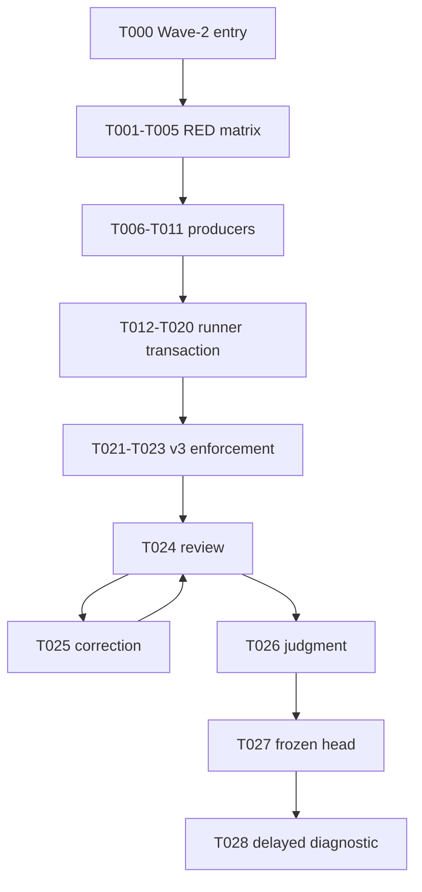

# Tasks: exact-head SonarQube coverage producer

**Input**: [spec.md](spec.md), [architecture.md](architecture.md), [research.md](research.md), [data-model.md](data-model.md), [plan.md](plan.md), [quickstart.md](quickstart.md), and `contracts/`.
**Parent**: `specs/011-issue450-sonar-release-program/`, Wave 3.
**Release intent**: `none`.
**Execution gate**: T000 passed against merged Wave-2 evidence. T001 through T028 may proceed in dependency order; no scanner, diagnostic, receipt, or release action is authorized before its owning task.
**Receipt state**: No actual diagnostic record, inventory artifact, or acceptance receipt may exist before T028.

## Binding RED/GREEN matrix

The matrix has exactly 15 rows. Current RED reaches the existing runner boundary. GREEN has a nonzero observable result and names its implementation owner.

| ID | RED scenario and current oracle | GREEN oracle | Owner task |
| --- | --- | --- | --- |
| **R01 / V01** | In a clean-clone or hosted-workspace fixture, omit or untrack the Wave-2 artifact; alter source kind, release intent, canonical source or closure-receipt blob hash, source `head_sha`, actual PR-head OID, merge OID, first-party PR binding, PR-head/merge tree equality, candidate-to-PR-head lineage, tracked-artifact-to-PR-head blob binding, artifact path-history commit, or merge ancestry to observed main. Include a clean squash-merge fixture in which the reviewed head differs from the actual PR head. Current runner has no Wave-2 gate. | Each invalid fixture returns `WAVE2_CLOSURE_UNVERIFIED` before preflight, begin, and claim. The clean squash fixture admits preflight only after every entry predicate passes. Only after claim does the runner write a hash-bound resolved copy with `source_sha256`, candidate, actual PR head, artifact commit, merge commit, `integrated_tree_sha`, and observed main inside its own run root. | T000, T001, T012, T013, T023 |
| **R02 / V02** | Hide `uv`, `bash`, or `dotnet`; alter the Coverlet/Test SDK tuple; or activate MTP. Current runner begins without producer preflight. | Typed planned-stage failure has zero begin and claim calls. | T001, T012 |
| **R03 / V03** | Spy on Python producer command and environment. Current runner invokes no isolated coverage workload. | Exact isolated locked `uv` command, no `SONAR_*`, and cache-safe pytest arguments are observed. | T002, T006 to T008, T015 |
| **R04 / V04** | Feed a missing, line-only, malformed, or zero-denominator Python Cobertura report. | Python final report has `coverage` root and positive line and branch denominators. | T002, T006, T016 |
| **R05 / V05** | Feed absolute, URI, escape, duplicate, reparse, missing, or test-only Python mappings. | Every mapping resolves once to tracked `.py` below `src/netcoredbg_mcp`. | T002, T006, T016 |
| **R06 / V06** | Inspect plan derivation before begin or alter marker final-report/input order. | Plan writes nothing; marker binds two final reports, five input records, tool tuple, and normalizer order. | T002, T013, T016 |
| **R07 / V07** | Capture scanner begin. Current argv has no runtime coverage properties. | Begin has exactly Python and final .NET Cobertura properties with slash-relative paths. | T002, T014 |
| **R08 / V08** | Substitute, duplicate, reorder, or broaden the five .NET producer projects. | Exactly five private project inputs occur in the fixed order. | T003, T009, T015 |
| **R09 / V09** | Simulate a zero-exit producer without a private input or with `--no-build`. | Each project restores/tests without prohibited switches and missing input blocks before end. | T003, T010, T015, T016 |
| **R10 / V10** | Remove Stateless `IncludeDirectory`, mutate its binary, or omit its production mapping. | Only Stateless receives the directory; hashes restore and production mapping validates. | T003, T011, T016 |
| **R11 / V11** | Feed invalid private .NET Cobertura XML, zero line denominator, unsafe source, or no aggregate branch denominator. | Every private input validates before normalization. | T003, T016 |
| **R12 / V12** | Feed an input set that causes a dropped, added, unsafe, non-deterministic, or zero-denominator final .NET report. | Normalizer emits one canonical final .NET Cobertura report whose source union and denominators validate. | T003, T016 |
| **R13 / V13** | Event spy observes current begin/build/end ordering with no entry, preflight, or normalization barrier. | Events are `entry -> preflight -> begin -> claim -> build -> produce -> normalize -> validate -> head-check -> end`; every earlier injected failure has zero end calls. | T004, T017 |
| **R14 / V14** | Fake mismatched analysis identity, incomplete component pages, or one-language component evidence. | Canonical identity and positive mapped component evidence validate for both languages. | T004, T019 |
| **R15 / V15** | Provide v2, diagnostic-as-PASS, missing coverage linkage, incomplete/count-only inventory, forged artifact hash, stale identity, cleanup failure, nonzero PASS release gate, or a v2-only artifact consumer. | Unified v3 schema accepts only legal role/outcome combinations and `stateless_preview_artifact.py` accepts only a valid v3 post-merge receipt. | T005, T018, T021 to T022 |

## Requirement coverage

| Requirement | Tasks | Evidence |
| --- | --- | --- |
| COV-001 | T012 to T018, T024 | Sole runner authority. |
| COV-002 | T000 to T001, T012 to T013, T028 | Typed Wave-2 reviewed source plus runtime PR, merge, tree, Git-blob, and observed-main evidence. |
| COV-003 | T002, T013, T016 | Pure plan and marker proof. |
| COV-004 | T001, T012, T022 | Event-spy preflight proof. |
| COV-005 | T002, T013, T017 | Exclusive root and marker. |
| COV-006 | T002, T014 | Exact two-property scanner argv. |
| COV-007 | T002, T006 to T008, T015 | Scrubbed producer environment. |
| COV-008 | T002, T006 to T008, T016 | Python Cobertura evidence. |
| COV-009 | T003, T009, T012 | Fixed VSTest compatibility tuple. |
| COV-010 | T003, T010, T015 to T016 | Private input production. |
| COV-011 | T003, T016 | Canonical normalizer and final .NET output. |
| COV-012 | T003, T011, T016 | Stateless input and restoration. |
| COV-013 | T002, T016 | Python report/source validation. |
| COV-014 | T003, T016 | Private input and final .NET validation. |
| COV-015 | T004, T017 | Ordered end barrier. |
| COV-016 | T004, T019 | Canonical analysis identity. |
| COV-017 | T004, T019 | Complete two-language component proof. |
| COV-018 | T005, T018, T021 | Diagnostic v3 contract. |
| COV-019 | T005, T021 to T022 | Candidate/post-merge v3-only PASS contract. |
| COV-020 | T005, T018, T022, T028 | Immutable complete diagnostic inventory. |
| COV-021 | T020, T022 | Cleanup precedence. |
| COV-022 | T023 to T028 | Immutable comparison surfaces. |
| COV-023 | T001 to T005, T022 | All 15 RED/GREEN rows. |
| COV-024 | T024 to T028 | Review, judgment, frozen head, delayed receipt. |
| COV-025 | T005, T021 to T023 | Existing v3 receipt-consumer cutover. |
| COV-026 | T001, T012, T023 | Tracked clean-clone hosted-workflow entry proof. |

## Entry task

- [x] **T000 [ENTRY]** Treat `specs/013-owner-scoped-prebuild-cleanup/wave-closure-v1.json` as an external Wave-2 PR-head prerequisite. Validate source `integration.kind: pull_request_head`, `release_intent: none`, canonical Git-blob source and closure-receipt hashes, and `integration.head_sha == accepted_candidate_sha`; the source head is the reviewed implementation head, not the final PR head. Fail closed unless first-party PR evidence binds actual PR head to `merge_commit_sha`, the accepted candidate is ancestor-or-equal to that PR head, and their trees are equal. Derive `artifact_commit_sha` from current path history, require it to equal the merge commit or be ancestor-or-equal to observed main, require the merge commit to be ancestor-or-equal to observed main, and require the tracked artifact blob to equal the PR-head blob. **Requirements**: COV-002. **Acceptance**: only the merged tracked source plus the complete squash-aware identity, tree, canonical-blob, path-history, and observed-main chain admits Wave 3. **Evidence**: source schema valid; reviewed head `d6460b3742d499eb1bd5064573606dc5e44b4952`; actual PR head `8a4724974348090890d7d9b96bcb83f8648b32d3`; merge and observed main `5d482b418118a9f17bf40fa0ab40b3c594df34d1`; shared tree `92db8043d497602d6a6e013678b54cf2fed49f92`; artifact blob `4334418a7a135dd7ae02adfc06f8b0cb95f04cad`; source blob SHA-256 `4f75880963c209ef958aad7392c7bced356a19b6d82e3abbce3128826cf1e374`; canonical receipt SHA-256 `fb099a8133fb43caba233ddc6cc59be5462f4446bb9ef05a585a85e618808c72`; `gh pr view 289` returned `MERGED` with the exact PR-head and merge OIDs; candidate lineage, tree equality, artifact-path commit, and merge-to-main ancestry all passed.

## Slice S1: behavior-first RED matrix

- [x] **T001 [S1]** Add R01 and R02 entry/preflight event-spy tests, including a clean-clone or hosted-workspace fixture with no `.agent` entry state and the clean squash-merge success fixture. **Requirements**: COV-002, COV-004, COV-023, COV-026. **Acceptance**: every invalid entry and toolchain input leaves preflight, begin, and claim at zero; the clean squash fixture reaches preflight only after entry validation succeeds. **Evidence**: `TestWave3CoverageProducerRedContracts` collects R01/R02; focused execution reaches the planned missing `verify_wave2_entry` and `preflight_coverage_toolchain` boundaries with nonzero RED subcases before any begin/claim behavior exists.
- [x] **T002 [S1]** Add R03 to R07 Python, plan, marker, and scanner-argument tests. **Requirements**: COV-003, COV-005 to COV-008, COV-013, COV-023. **Acceptance**: current runner fails through the planned caller boundary. **Evidence**: R03-R07 collect and fail at missing plan, Python Cobertura validation, marker, producer, and two-property scanner interfaces.
- [x] **T003 [S1]** Add R08 to R12 private-input, Stateless, and normalizer fixtures. **Requirements**: COV-009 to COV-012, COV-014, COV-023. **Acceptance**: current runner cannot accept the fixed input or final-output contract. **Evidence**: R08-R12 collect and fail at missing fixed inventory, producer, private-input validation, Stateless restoration, and deterministic normalizer interfaces.
- [x] **T004 [S1]** Add R13 and R14 event/API fixtures. **Requirements**: COV-015 to COV-017, COV-023. **Acceptance**: current order lacks required barriers and analysis proof. **Evidence**: R13/R14 collect and fail at missing ordered transaction seams and canonical two-language analysis-evidence validation. The focused runner selection recorded `42 failed, 2 passed, 59 deselected`; failures are at the planned future-callable boundaries.
- [x] **T005 [S1]** Add R15 receipt, inventory, cleanup, and existing-consumer fixtures and run the focused module to record the RED denominator. **Requirements**: COV-018 to COV-021, COV-023, COV-025. **Acceptance**: each row has one named test and one future GREEN owner. **Evidence**: eight named tests with 22 parameterized cases cover legal/illegal v3 roles, incomplete linkage/inventory/cleanup, blocking findings/hotspots, raw post-merge consumption, and downloaded receipt consumption. Focused execution recorded `22 failed, 65 deselected`: the v3 validator is absent, valid v3 is rejected, and legacy v2/optional-coverage receipts are still admitted.

## Slice S2: isolated producers and fixed inputs

- [ ] **T006 [S2]** Add `.coveragerc` and its branch, relative-file, source, and Python validator checks. **Requirements**: COV-008, COV-013. **Acceptance**: malformed and unsafe Python evidence fails.
- [ ] **T007 [S2]** Add the external isolated locked `uv` invocation contract without changing `pyproject.toml`, `uv.lock`, or `.venv`. **Requirements**: COV-007, COV-008. **Acceptance**: command capture contains the exact tool flags and no Sonar input.
- [ ] **T008 [S2]** Add strict `build/coverage.sh` argument parsing and Python producer commands. **Requirements**: COV-001, COV-007, COV-008. **Acceptance**: the shell has no scanner or receipt authority.
- [ ] **T009 [S2]** Add direct private `coverlet.msbuild` `10.0.1` references to the five fixed projects and preserve VSTest `Microsoft.NET.Test.Sdk` `17.12.0`. **Requirements**: COV-009. **Acceptance**: exact tuple evaluation accepts only fixed producers and refuses MTP.
- [ ] **T010 [S2]** Add per-project restore/test Cobertura-input commands without prohibited switches. **Requirements**: COV-010. **Acceptance**: each producer writes its planned private input or fails before end.
- [ ] **T011 [S2]** Add the Stateless-only `IncludeDirectory` branch and binary restoration contract. **Requirements**: COV-012. **Acceptance**: only Stateless receives the directory and byte changes block.

## Slice S3: transaction, normalizer, and diagnostic evidence

- [ ] **T012 [S3]** Implement tracked Wave-2 entry resolution; source schema, reviewed-head, canonical Git-blob, PR-head, merge, tree, artifact-path-history, and observed-main validation; and `preflight_coverage_toolchain` before scanner begin. **Requirements**: COV-001, COV-002, COV-004, COV-009, COV-026. **Acceptance**: R01 and R02 turn green with zero begin and claim calls on failure while existing role CLI shapes remain unchanged.
- [ ] **T013 [S3]** Implement `CoveragePlan`, two-final-report marker derivation, tracked source binding, runtime `source_sha256`, actual `pull_request_head_sha`, `artifact_commit_sha`, `merge_commit_sha`, `integrated_tree_sha`, and `observed_main_sha`, a run-root resolved entry copy after claim, five private input paths, and exclusive claim. **Requirements**: COV-002, COV-003, COV-005. **Acceptance**: plan is pure; no run-local entry exists before claim; marker schema v1 validates.
- [ ] **T014 [S3]** Add exactly two runtime Cobertura scanner properties and static XML coverage-property rejection. **Requirements**: COV-006, COV-022. **Acceptance**: R07 turns green and XML stays unchanged.
- [ ] **T015 [S3]** Invoke the scrubbed producer with the complete fixed input plan. **Requirements**: COV-007, COV-009, COV-010. **Acceptance**: no producer discovers paths or receives Sonar values.
- [ ] **T016 [S3]** Implement private-input validation, `normalize_dotnet_cobertura`, final report validation, and Stateless restoration checks. **Requirements**: COV-008, COV-010 to COV-014. **Acceptance**: R04 to R06 and R09 to R12 turn green.
- [ ] **T017 [S3]** Insert the transaction barrier and cleanup precedence. **Requirements**: COV-005, COV-015, COV-021. **Acceptance**: R13 proves zero end calls after every prior failure.
- [ ] **T018 [S3]** Add unified v3 diagnostic receipt assembly and create-new complete inventory writer. **Requirements**: COV-018, COV-020. **Acceptance**: diagnostic completion requires complete artifact linkage and no release authority.
- [ ] **T019 [S3]** Add canonical analysis identity, measures, and complete per-language component evidence. **Requirements**: COV-016, COV-017. **Acceptance**: R14 rejects mismatch, partial pages, and one-language import.
- [ ] **T020 [S3]** Finalize typed failures and cleanup recording. **Requirements**: COV-021. **Acceptance**: primary failure remains primary and claimed-root cleanup is bounded.

## Slice S4: role enforcement and delayed receipt

- [ ] **T021 [S4]** Make candidate and post-merge PASS validation require [exact-head-receipt-v3.schema.json](contracts/exact-head-receipt-v3.schema.json). Migrate `scripts/stateless_preview_artifact.py` and its focused tests from schema v2 to the v3 post-merge consumer contract. Remove v2 and optional-coverage paths in the same change. **Requirements**: COV-018, COV-019, COV-025. **Acceptance**: a PASS and artifact sealing require final coverage linkage, canonical identity, complete inventory, successful cleanup, and zero-blocking release gate.
- [ ] **T022 [S4]** Run R15 forgery/head/inventory/cleanup/consumer tests and the complete focused runner suite. **Requirements**: COV-004, COV-019, COV-020, COV-022, COV-023, COV-025. **Acceptance**: all 15 rows are green with nonzero denominators and no immutable-surface change.
- [ ] **T023 [S4]** Add hosted post-merge verification that obtains first-party PR-head and merge evidence, checks the reviewed-head lineage, equal integration trees, canonical Git-blob hashes, artifact-path history, and observed-main ancestry before scanning and artifact sealing. Inspect the implementation diff against immutable comparison surfaces. **Requirements**: COV-022, COV-025, COV-026. **Acceptance**: a fresh hosted checkout needs no `.agent` provisioning or precomputed main SHA; no policy, XML, lockfile, runtime route, threshold, exclusion, or release change appears; only declared workflow and consumer migration behavior changes.
- [ ] **T024 [S4]** Freeze the exact implementation head and obtain independent source review, including the tracked Wave-2 prerequisite boundary and hosted post-merge workflow change. **Requirements**: COV-001, COV-015, COV-018 to COV-026. **Acceptance**: the reviewer receives the exact SHA, COV requirements, V01 to V15, and the external Wave-2 artifact contract.
- [ ] **T025 [S4]** Apply review-causal corrections and rerun focused evidence. **Requirements**: COV-023 to COV-026. **Acceptance**: a changed head gets targeted proof and a new independent review.
- [ ] **T026 [S4]** Obtain independent acceptance judgment on the frozen reviewed head. **Requirements**: COV-016 to COV-026. **Acceptance**: the judge checks two-report contract, input/normalizer safety, tracked entry, inventory, v3 roles, consumer cutover, hosted-workflow proof, and non-release authority.
- [ ] **T027 [S4]** Bind review and judgment to the exact diagnostic scanner head. **Requirements**: COV-002, COV-022, COV-024 to COV-026. **Acceptance**: tracked source, runtime PR/merge/tree/blob/observed-main proof, frozen SHA, reviewer, judge, and scanner worktree agree.
- [ ] **T028 [S4]** Run the diagnostic only from the prescribed fresh scanner worktree after tracked Wave-2 entry validation. Create the v3 diagnostic record, immutable inventory artifact, and `acceptance-receipt.md` only after every predicate succeeds. **Requirements**: COV-002, COV-016 to COV-026. **Acceptance**: diagnostic completion has `release_intent: none`, complete inventory linkage, and no release authority. A block creates none of the three artifacts.

## Dependencies and execution order

T001 through T028 are unavailable until T000 succeeds. T012 through T020 are serial in the runner and focused test module. T028 is terminal and never opens release execution.
