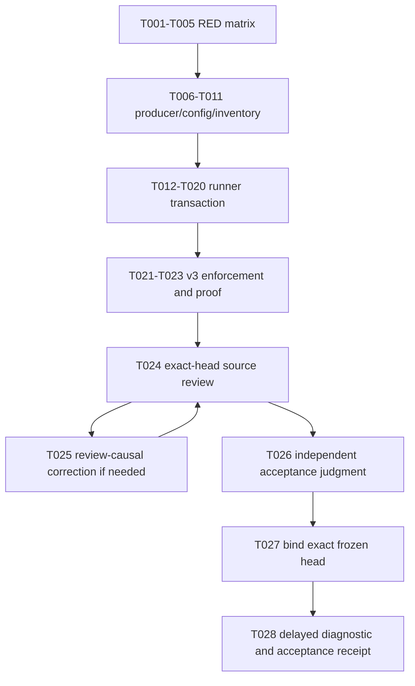

# Tasks: exact-head SonarQube coverage producer

**Input**: [spec.md](spec.md), [architecture.md](architecture.md), [research.md](research.md), [data-model.md](data-model.md), [plan.md](plan.md), [quickstart.md](quickstart.md), and `contracts/`.
**Parent**: `specs/011-issue450-sonar-release-program/`, Wave 3.
**Release intent**: `none`.
**Receipt state**: No actual diagnostic or acceptance receipt may exist before T028.
**Format**: `[T###] [S#] [P?] Description. Requirements: ... Acceptance: ...`

`[P]` permits parallel work only after the stated prerequisites and only when paths do not overlap. Every task that edits the runner or focused runner test module is serial. A task that discovers an incompatible source boundary returns to the owning slice; it does not broaden the change.

## Binding RED/GREEN matrix

The 15 rows are the implementation's behavior-first contract. Current RED means the current caller lacks the asserted behavior. A test must reach existing runner behavior, not fail because a missing import prevents collection.

| ID | RED scenario and current oracle | GREEN oracle | Owner task |
| --- | --- | --- | --- |
| **R01 / V04** | Read coverage configuration and require branch mode, relative paths, and only `src/netcoredbg_mcp`. Current source has no `.coveragerc`. | `.coveragerc` produces a Cobertura report with positive line and branch denominators. | T006, T015 |
| **R02 / V03, V12** | Spy on producer command/environment. Current runner invokes no external `uv` coverage workload and has no coverage-child scrubbing proof. | Command uses `uv run --isolated --locked --extra dev --with coverage==7.15.4`; child has no `SONAR_*`; pytest uses `-p no:cacheprovider`. | T006, T008, T014 |
| **R03 / V04** | Feed a missing, line-only, or zero-denominator Cobertura report. Current runner accepts no report contract. | Root is `coverage`; positive lines and branches are required before end. | T001, T015 |
| **R04 / V05** | Feed absolute, URI, `..`, duplicate, symlink, missing, outside-root, or test-only Python mappings. Current runner has no mapping validator. | Every mapping resolves once to tracked `.py` below `src/netcoredbg_mcp`. | T001, T015 |
| **R05 / V01** | Pre-seed the planned root or inspect plan derivation before begin. Current runner has no claimed coverage root. | Plan writes nothing before begin; exclusive claim rejects a pre-seeded root and leaves end untouched. | T001, T012, T016 |
| **R06 / V01** | Alter marker byte order, head, report order, report path, or digest. Current receipt has no marker binding. | Canonical marker binds UUID, head, project key, tool versions, six ordered reports, and config/producer hashes. | T001, T012, T015 |
| **R07 / V02** | Capture scanner begin. Current argv lacks coverage properties. | One Python path and one ordered comma-delimited five-report OpenCover path are separate slash-relative arguments; XML has none. | T002, T013 |
| **R08 / V06** | Capture producer inventory. Current broad build inventory is not a coverage inventory. | Exactly five fixed IDs/projects/reports occur in order. Fixtures, broad inventory, and substitutions fail. | T002, T010, T014 |
| **R09 / V07** | Simulate zero-exit `--no-build` with no report. Current runner lacks report existence checks. | Every project restores then tests without `--no-build`; absent report is `COVERAGE_REPORT_MISSING` and end is untouched. | T002, T010, T015, T016 |
| **R10 / V10** | Capture IncludeDirectory and mutate pre/post host hashes. Current runner has no Coverlet contract. | Only `stateless` gets absolute IncludeDirectory; its report maps production Stateless source and DLL/PDB hashes match. | T003, T011, T015 |
| **R11 / V08** | Feed empty, malformed, wrong-root, or zero-sequence-point OpenCover XML. Current runner never parses it. | All five reports have `CoverageSession`, one direct Summary, positive sequence points, and positive aggregate branches. | T003, T015 |
| **R12 / V09** | Feed .NET maps that escape, duplicate, use a URI, resolve only to test/fixture files, or use reparse points. | Each report maps a tracked non-test, non-fixture production `.cs` file; Stateless maps `host/NetCoreDbg.Mcp.Stateless`. | T003, T015 |
| **R13 / V11** | Event spy observes current begin, build, end ordering with no coverage barrier. | Events are `begin -> claim -> build -> produce -> validate -> head check -> end`; every prior failure has zero end calls. | T004, T016 |
| **R14 / V13, V14** | Fake a matching aggregate value with mismatched analysis/head or only one language component set. Current runner does not query coverage measures/components. | Two current-analysis bookends match the submitted analysis/head; aggregate and both-language mapped contributions are positive; `new_coverage` condition is OK at 80. | T004, T019, T020 |
| **R15 / V15** | Provide v2, missing, forged, diagnostic-as-pass, raw-body, cleanup-failure, or stale-head receipt data. | Schema v3 retains secret-free report and cleanup metadata, preserves primary failure, and never allows diagnostic evidence to PASS. | T005, T021, T022 |

## Requirement coverage

| Requirement | Tasks | Evidence |
| --- | --- | --- |
| COV-001 | T012 to T014, T024 | Sole runner authority and independent review. |
| COV-002 | T012, T016 | Pure plan and event spy. |
| COV-003 | T012, T015, T016 | Exclusive root, canonical marker, no-end failure. |
| COV-004 | T013 | Exact runtime scanner arguments and XML guard. |
| COV-005 | T008, T014 | Captured child environment. |
| COV-006 | T006, T015 | `.coveragerc` and Cobertura behavior. |
| COV-007 | T007 to T009, T014 | External `uv`, unchanged permanent dependency surfaces. |
| COV-008 | T010 | Exact five direct private references. |
| COV-009 | T010, T014 | Fixed ordered inventory. |
| COV-010 | T010, T015, T016 | Restore/test command and absent-report failure. |
| COV-011 | T011, T015 | Stateless mapping and byte restoration. |
| COV-012 | T001, T015 | Python report/path/source validation. |
| COV-013 | T003, T015 | .NET report/path/source validation. |
| COV-014 | T016 | Ordered end barrier. |
| COV-015 | T019 | Submitted/current analysis equality. |
| COV-016 | T019 | Finite positive measures and unchanged condition. |
| COV-017 | T020 | Complete two-language component proof. |
| COV-018 | T019, T021 | Diagnostic schema v3 and redaction. |
| COV-019 | T021, T022 | v3-only candidate/post-merge pass enforcement. |
| COV-020 | T018, T022 | Claimed-root cleanup and primary failure precedence. |
| COV-021 | T023 to T028 | Unchanged comparison surfaces and blocked finding treatment. |
| COV-022 | T001 to T005, T015 to T022 | All 15 rows reach RED then GREEN. |
| COV-023 | T024 to T028 | Exact review, judge, frozen head, and delayed receipt. |

## Slice S1: behavior-first RED matrix

**Goal**: Make every missing coverage behavior observable in the existing runner test seam before implementation changes behavior.

- [ ] **T001 [S1]** Add local marker and Cobertura fixture builders plus R03 to R06 tests in `tests/test_sonarqube_exact_head_runner.py`. **Requirements**: COV-002, COV-003, COV-006, COV-012, COV-022. **Acceptance**: current runner fails through the planned validator/caller boundary for branch, source, root, and marker cases.
- [ ] **T002 [S1]** Add command-capture tests for R07 to R09. **Requirements**: COV-004, COV-009, COV-010, COV-022. **Acceptance**: current scanner argv and build behavior cannot satisfy exact runtime paths, fixed coverage inventory, or the no-build/report rule.
- [ ] **T003 [S1]** Add OpenCover, Stateless restoration, and .NET mapping fixtures for R10 to R12. **Requirements**: COV-008 to COV-013, COV-022. **Acceptance**: current runner fails through report/source validation behavior rather than fixture collection.
- [ ] **T004 [S1]** Add event/API fixtures for R13 and R14. **Requirements**: COV-014 to COV-017, COV-022. **Acceptance**: current order lacks a pre-end barrier and current API behavior cannot prove exact analysis or both language sets.
- [ ] **T005 [S1]** Add R15 receipt/cleanup fixtures and run the focused module to record the nonzero RED denominator. **Requirements**: COV-018, COV-020, COV-022. **Acceptance**: each R01 to R15 has one named test, current RED reason, future GREEN owner, and focused command output.

## Slice S2: isolated producers and fixed inventory

**Goal**: Create the deterministic six-report producer without permanent Python dependency changes or unsafe Coverlet shortcuts.

- [ ] **T006 [S2]** Add `.coveragerc` with branch mode, relative files, and the sole source root `src/netcoredbg_mcp`; add its RED/GREEN contract checks. **Requirements**: COV-006, COV-012. **Acceptance**: line-only, no-branch, outside-root, and duplicate mapping inputs fail.
- [ ] **T007 [S2]** Add the external isolated locked `uv` invocation contract to the runner-to-producer seam without changing `pyproject.toml`, `uv.lock`, or `.venv`. **Requirements**: COV-005, COV-007. **Acceptance**: command capture contains `--isolated --locked --extra dev --with coverage==7.15.4`, `PYTHONDONTWRITEBYTECODE=1`, `COVERAGE_FILE`, and no `SONAR_*` input.
- [ ] **T008 [S2]** Add `build/coverage.sh` as a strict plan-driven foreground executor. **Requirements**: COV-001, COV-005, COV-007, COV-009, COV-010. **Acceptance**: it validates exact five project groups, quotes paths, rejects duplicates/wrong count/`SONAR_*`, and owns no scanner/API/receipt work.
- [ ] **T009 [S2]** Add the full Python workload commands in the shell: `coverage run --rcfile ... -m pytest -p no:cacheprovider -q`, then `coverage xml`. **Requirements**: COV-005 to COV-007. **Acceptance**: a standalone local producer invocation places Python data/XML only below the supplied root.
- [ ] **T010 [S2]** Add exact `coverlet.msbuild` `10.0.1` `PrivateAssets=all` references to the five fixed test projects and the per-project restore/test OpenCover command. **Requirements**: COV-008 to COV-010. **Acceptance**: the closed inventory is exact, no command contains `--no-build` or prohibited filtering/merge/threshold switches, and no fixture project appears.
- [ ] **T011 [S2]** Add the Stateless-only `IncludeDirectory` command branch and pre/post DLL/PDB hashing contract. **Requirements**: COV-011. **Acceptance**: only `stateless` receives IncludeDirectory; changed production bytes fail before scanner end.

## Slice S3: runner transaction and diagnostic evidence

**Goal**: Make local valid coverage a mandatory scanner-end prerequisite and make both-language server import observable.

- [ ] **T012 [S3]** Implement `CoveragePlan`, fixed inventory derivation, scanner-relative normalization, and exclusive `CoverageRunClaim` marker creation in `scripts/run_sonarqube_exact_head.py`. **Requirements**: COV-001 to COV-003. **Acceptance**: plan derivation is pure, marker bytes match schema v1, and pre-seeded root/marker cases block.
- [ ] **T013 [S3]** Extend scanner-begin construction with exactly the Python Cobertura and ordered OpenCover properties; add XML coverage-property preflight. **Requirements**: COV-004, COV-021. **Acceptance**: runtime argv contains exactly two properties and XML remains unchanged.
- [ ] **T014 [S3]** Integrate the scrubbed producer environment and invoke `build/coverage.sh` only with a fully enumerated plan. **Requirements**: COV-001, COV-005, COV-007, COV-009. **Acceptance**: captured children cannot see Sonar variables and no producer discovers paths independently.
- [ ] **T015 [S3]** Implement common, Cobertura, OpenCover, source, denominator, and Stateless restoration validators. **Requirements**: COV-006, COV-010 to COV-013. **Acceptance**: R01, R03, R04, R06, R09 to R12 turn green with typed failures for every malformed input.
- [ ] **T016 [S3]** Insert the transaction barrier: `begin -> claim -> build -> produce -> validate -> post-producer head -> end`. **Requirements**: COV-003, COV-010, COV-014. **Acceptance**: R05, R09, and R13 show zero end calls after every prior injected failure.
- [ ] **T017 [S3]** Add typed coverage failure and cleanup behavior. **Requirements**: COV-018, COV-020. **Acceptance**: cleanup touches only the claimed root after producer termination and preserves the first failure.
- [ ] **T018 [S3]** Add diagnostic receipt assembly through schema v3 without release authority. **Requirements**: COV-018, COV-021. **Acceptance**: a diagnostic result has only `DIAGNOSTIC_COMPLETE` or `BLOCKED`, relative metadata, and no secrets/report bodies.
- [ ] **T019 [S3]** Add post-end report-task, CE, submitted/current-analysis bookends, and aggregate coverage measure binding. **Requirements**: COV-015, COV-016. **Acceptance**: mismatched ID/revision, nonfinite values, zero denominators, and a non-OK new-coverage condition block.
- [ ] **T020 [S3]** Add complete component-tree paging and per-language source-set intersections. **Requirements**: COV-017. **Acceptance**: aggregate-only and one-language fixtures fail; both language sets require positive mapped lines/covered lines and a branch measure.

## Slice S4: release-role enforcement and delayed receipt

**Goal**: Make v3 coverage mandatory for release roles, independently examine the exact implementation head, and create a real receipt only after all evidence exists.

- [ ] **T021 [S4]** Make candidate and post-merge PASS validation require v3 coverage evidence. Remove schema-v2 and optional-coverage compatibility paths in the same change. **Requirements**: COV-018, COV-019. **Acceptance**: v2, missing, forged, stale, diagnostic, or incomplete coverage evidence cannot pass a release role.
- [ ] **T022 [S4]** Run R15 forgery/head/cleanup tests and the complete focused runner suite. **Requirements**: COV-018 to COV-020, COV-022. **Acceptance**: all fifteen rows are green with nonzero denominators and no out-of-scope source change.
- [ ] **T023 [S4]** Inspect the implementation diff against the immutable comparison surfaces. **Requirements**: COV-021. **Acceptance**: `SonarQube.Analysis.xml`, `docs/RELEASE-PROTOCOL.md`, `pyproject.toml`, `uv.lock`, runtime routes, thresholds, exclusions, and gate policy remain unchanged.
- [ ] **T024 [S4]** Freeze the exact implementation head and obtain an independent source review of the runner, producer, configuration, five references, and focused tests. **Requirements**: COV-001, COV-014, COV-018 to COV-021, COV-023. **Acceptance**: the reviewer receives the exact SHA, COV requirements, V01 to V15, and explicit prohibitions; every blocking finding returns to its owning task before any receipt exists.
- [ ] **T025 [S4]** Apply only review-causal corrections, rerun focused evidence for each correction, and freeze a new exact head if source bytes change. **Requirements**: COV-022, COV-023. **Acceptance**: a corrected head has targeted proof and a fresh independent review. No receipt exists during correction.
- [ ] **T026 [S4]** Obtain an independent acceptance judgment on the frozen reviewed head. **Requirements**: COV-015 to COV-023. **Acceptance**: the judge checks requirement/task bidirectionality, all 15 matrix results, two-language import logic, unchanged policy, and non-release authority. A rejection returns to the owning task.
- [ ] **T027 [S4]** Bind review and judge verdicts to the exact source head that will enter the diagnostic scanner worktree. **Requirements**: COV-021, COV-023. **Acceptance**: the frozen SHA, review scope, judge scope, and candidate scanner worktree head are equal. No source mutation is allowed after this check.
- [ ] **T028 [S4]** Run `python scripts/run_sonarqube_exact_head.py --role diagnostic` only from the prescribed fresh clean detached scanner worktree at the T027 SHA. Create `.agent/e/sonarqube/thebtf_netcoredbg_mcp/<sha>/diagnostic/<run-id>.json` and `acceptance-receipt.md` only if the diagnostic result is `DIAGNOSTIC_COMPLETE`, both-language import is proven, the unchanged new-coverage condition is `OK` at `80`, and review/judgment bind to the same SHA. **Requirements**: COV-015 to COV-023. **Acceptance**: the receipt names remaining global blockers, has `release_intent: none`, and cannot authorize release. If any condition blocks, neither receipt exists and Wave 3 remains open.

## Dependencies and execution order

1. T001 through T005 must establish caller-level RED evidence before a producer, runner, schema, or project-reference change claims the new behavior.
2. T006 through T011 may use separate files where marked, but no `build/coverage.sh` or `.csproj` task may race a task that reads its command contract.
3. T012 through T020 are serial inside the runner and focused test module.
4. T021 and T022 follow T020. T023 follows the complete focused proof.
5. T024, T026, and T027 require an exact frozen head. T025 returns to the causal source task if review finds a defect.
6. T028 is terminal. It is the first receipt-producing task and never opens release execution.

## Parallel opportunities

- T006 and T010 may proceed after T001 to T005 because they own `.coveragerc` versus five distinct `.csproj` files. T008 reads the fixed inventory after T010 declares it.
- T019 and T020 share the runner and focused test module. They are not parallel.
- Independent review and acceptance judgment are separate passes. The judgment begins only after the review binds a clean exact head.
